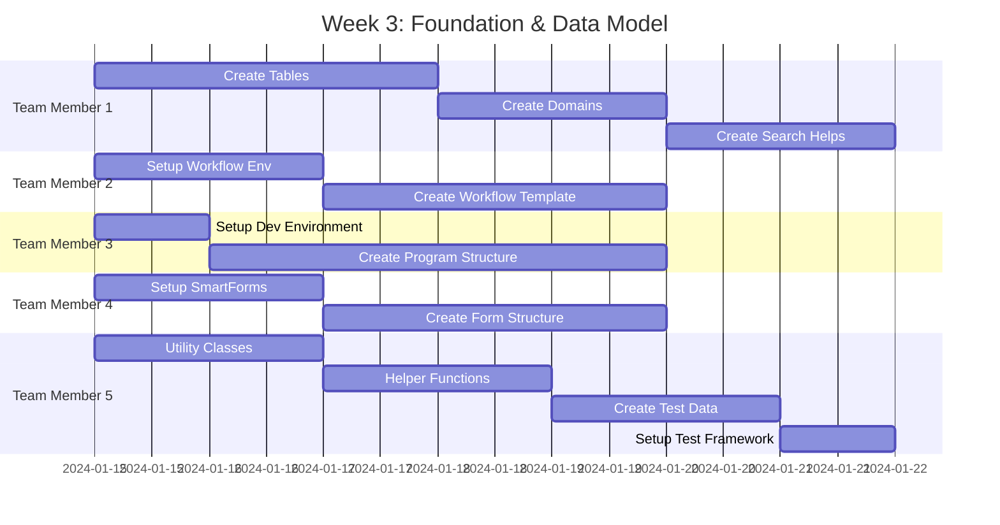
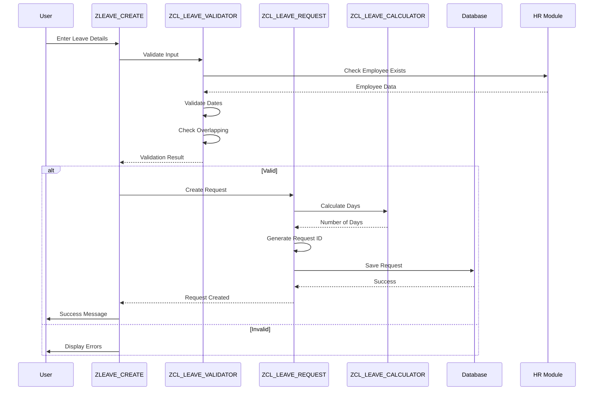
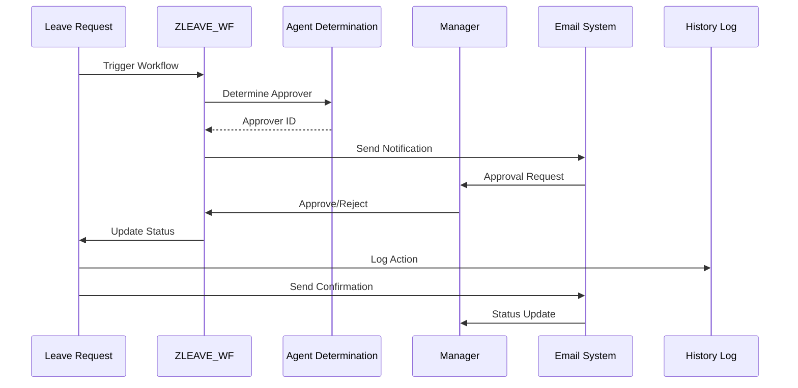
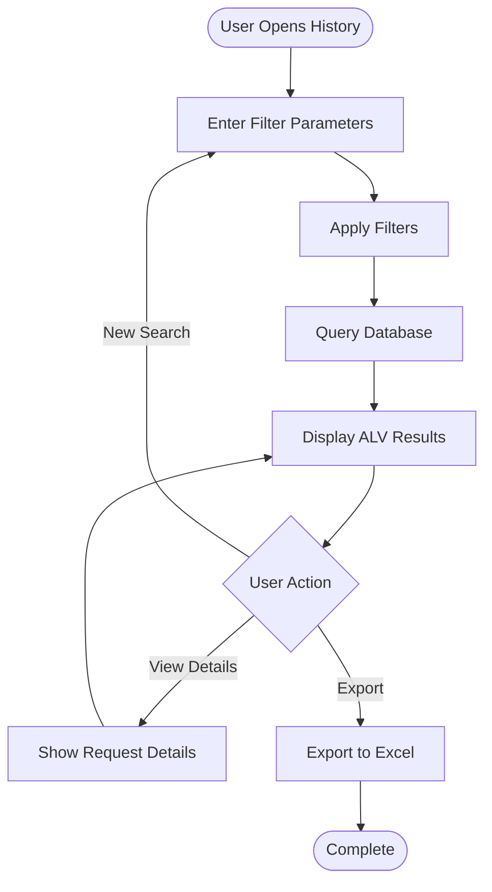
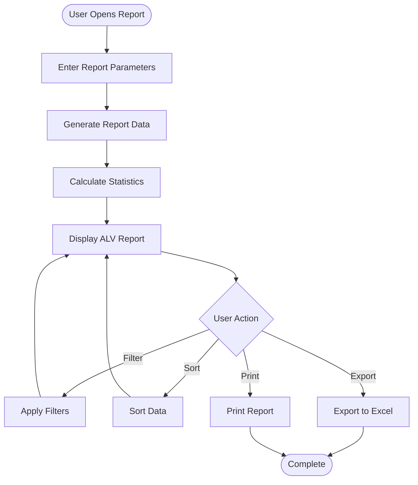
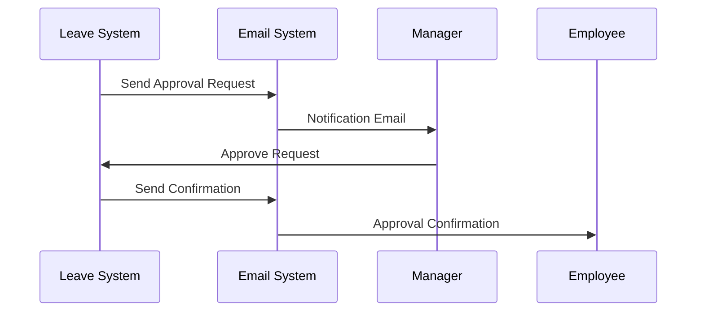

# Phase 2: Development

**Duration**: Weeks 3-8  
**← [Back to README](README.md)** | **Previous: [Phase 1: Requirements & Design](Phase1_Requirements_Design.md)** | **Next: [Phase 3: Testing & QA](Phase3_Testing_QA.md)**

---

## Table of Contents

1. [Week 3: Foundation & Data Model](#week-3-foundation--data-model)
2. [Week 4: Core Leave Request Functionality](#week-4-core-leave-request-functionality)
3. [Week 5: Approval Workflow Implementation](#week-5-approval-workflow-implementation)
4. [Week 6: History Lookup & Filtering](#week-6-history-lookup--filtering)
5. [Week 7: Reporting & Statistics](#week-7-reporting--statistics)
6. [Week 8: Forms, Email & Integration](#week-8-forms-email--integration)
7. [Code Examples](#code-examples)
8. [Integration Diagrams](#integration-diagrams)
9. [Testing Checkpoints](#testing-checkpoints)
10. [References](#references)

---

## Week 3: Foundation & Data Model

### Development Timeline



### Team Member 1: Lead Developer / Data Model Specialist

#### Tasks

- [ ] **Create ZLEAVE_REQ_HDR Table (SE11)**

  **Transaction**: SE11  
  **Table Name**: ZLEAVE_REQ_HDR

  **Steps**:
  1. Open SE11, enter table name: ZLEAVE_REQ_HDR
  2. Click "Create"
  3. Enter short description: "Leave Request Header"
  4. Go to "Delivery and Maintenance" tab:
     - Delivery Class: A (Application table)
     - Data Browser/Table View: Display/Maintenance Allowed
  5. Go to "Fields" tab and add fields:

  | Field Name | Data Element | Data Type | Length | Key | Description |
  |------------|--------------|-----------|--------|-----|-------------|
  | MANDT | MANDT | CLNT | 3 | X | Client |
  | REQ_ID | ZLEAVE_REQ_ID | CHAR | 10 | X | Request ID |
  | EMPLOYEE_ID | PERNR_D | NUMC | 8 | | Employee Number |
  | LEAVE_TYPE | ZLEAVE_TYPE | CHAR | 4 | | Leave Type |
  | START_DATE | DATUM | DATS | 8 | | Start Date |
  | END_DATE | DATUM | DATS | 8 | | End Date |
  | DAYS | ZLEAVE_DAYS | DEC | 5,2 | | Number of Days |
  | STATUS | ZLEAVE_STATUS | CHAR | 1 | | Status |
  | CREATED_BY | SYUNAME | CHAR | 12 | | Created By |
  | CREATED_DATE | TIMESTAMP | TIMESTAMP | 15 | | Creation Date |
  | APPROVED_BY | SYUNAME | CHAR | 12 | | Approved By |
  | APPROVED_DATE | TIMESTAMP | TIMESTAMP | 15 | | Approval Date |
  | COMMENTS | ZLEAVE_COMMENTS | CHAR | 255 | | Comments |

  6. Go to "Entry help/check" tab:
     - Create search help for LEAVE_TYPE
     - Create search help for EMPLOYEE_ID
  7. Activate table

  **Code Example - Table Definition**:
  ```abap
  " Table: ZLEAVE_REQ_HDR
  " Description: Leave Request Header Table
  
  " Key Fields
  MANDT      TYPE MANDT,      " Client
  REQ_ID     TYPE ZLEAVE_REQ_ID,  " Request ID (Primary Key)
  
  " Data Fields
  EMPLOYEE_ID TYPE PERNR_D,   " Employee Number
  LEAVE_TYPE  TYPE ZLEAVE_TYPE,  " Leave Type
  START_DATE  TYPE DATUM,     " Start Date
  END_DATE    TYPE DATUM,     " End Date
  DAYS        TYPE ZLEAVE_DAYS,  " Number of Days
  STATUS      TYPE ZLEAVE_STATUS,  " Status
  CREATED_BY  TYPE SYUNAME,    " Created By
  CREATED_DATE TYPE TIMESTAMP,  " Creation Date
  APPROVED_BY TYPE SYUNAME,    " Approved By
  APPROVED_DATE TYPE TIMESTAMP,  " Approval Date
  COMMENTS    TYPE ZLEAVE_COMMENTS  " Comments
  ```

- [ ] **Create ZLEAVE_REQ_ITEM Table**

  Similar process as above. Key fields:
  - REQ_ID (Primary Key, Foreign Key to ZLEAVE_REQ_HDR)
  - ITEM_NO (Primary Key)
  - DATE, DAY_TYPE, REMARKS

- [ ] **Create ZLEAVE_HISTORY Table**

  Key fields:
  - REQ_ID (Primary Key, Foreign Key)
  - SEQUENCE_NO (Primary Key)
  - ACTION, ACTION_DATE, ACTION_BY, OLD_STATUS, NEW_STATUS, COMMENTS

- [ ] **Create ZLEAVE_CONFIG Table**

  Key fields:
  - LEAVE_TYPE (Primary Key)
  - MIN_DAYS, MAX_DAYS, APPROVAL_LEVEL, DESCRIPTION

- [ ] **Create Domains and Data Elements**

  **Domain: ZLEAVE_REQ_ID**
  - Data Type: CHAR
  - Length: 10
  - Description: "Leave Request ID"

  **Domain: ZLEAVE_STATUS**
  - Data Type: CHAR
  - Length: 1
  - Fixed Values:
    - 'P' = Pending
    - 'A' = Approved
    - 'R' = Rejected
    - 'C' = Cancelled

- [ ] **Create Search Helps**

  **Search Help: ZLEAVE_EMPLOYEE**
  - Table: PA0001
  - Fields: PERNR, ENAME
  - Description: "Employee Search Help"

- [ ] **Activate All Tables**

- [ ] **Create Maintenance Views (SM30)**

  Create maintenance views for configuration tables to allow easy maintenance.

**Deliverables**:
- 4 database tables created and activated
- Domains and data elements created
- Search helps created
- Maintenance views created

**References**:
- [Data Dictionary Guide](../../ABAP-Guides/02_SAP_ABAP_DATA_DICTIONARY_GUIDE.md) - Table creation
- [ABAP Basics Guide](../../ABAP-Guides/01_SAP_ABAP_BASICS_GUIDE.md#data-types-and-variables) - Data types

---

### Team Member 2: Workflow & Approval Specialist

#### Tasks

- [ ] **Set Up Workflow Development Environment**

  **Transaction**: SWDD (Workflow Builder)

  **Steps**:
  1. Open SWDD
  2. Create workflow template: ZLEAVE_WF
  3. Set workflow properties
  4. Define workflow container

- [ ] **Create Workflow Template ZLEAVE_WF**

  **Workflow Structure**:
  ```
  ZLEAVE_WF
  ├── Start Event: Leave Request Created
  ├── Task: ZLEAVE_APPROVE_TASK
  ├── Agent Determination
  └── End Event: Request Approved/Rejected
  ```

- [ ] **Define Workflow Container**

  **Container Elements**:
  - REQ_ID (Type: ZLEAVE_REQ_ID)
  - EMPLOYEE_ID (Type: PERNR_D)
  - LEAVE_DAYS (Type: ZLEAVE_DAYS)
  - APPROVAL_LEVEL (Type: INT1)
  - STATUS (Type: ZLEAVE_STATUS)

- [ ] **Create Basic Workflow Tasks**

  **Task: ZLEAVE_APPROVE_TASK**
  - Task Type: Standard Task
  - Method: ZLEAVE_APPROVE_METHOD
  - Agent: To be determined

- [ ] **Test Workflow Basic Structure**

  Test workflow can be triggered and basic flow works.

**Deliverables**:
- Workflow template created
- Workflow container defined
- Basic workflow tasks created

**References**:
- [SAP Workflow Guide](../../SAP_WORKFLOW_GUIDE.md) - Workflow creation

---

### Team Member 3: UI & Reporting Specialist

#### Tasks

- [ ] **Set Up Development Environment**

  - Access to SAP GUI
  - Access to development system
  - Required authorizations

- [ ] **Review ALV Programming Guide**

  Study ALV concepts and best practices.

- [ ] **Create Basic Program Structure ZLEAVE_CREATE**

  **Transaction**: SE38  
  **Program**: ZLEAVE_CREATE

  **Code Structure**:
  ```abap
  REPORT zleave_create.

  "**********************************************************************
  "* Program: Create Leave Request
  "* Purpose: Allow employees to create leave requests
  "* Author: Team Member 3
  "* Date: 2024
  "**********************************************************************

  " Selection screen
  PARAMETERS: p_empno TYPE pernr_d DEFAULT sy-uname.

  " Data declarations
  DATA: go_request TYPE REF TO zcl_leave_request.

  " Initialization
  INITIALIZATION.
    " Set default values

  " Main processing
  START-OF-SELECTION.
    " Create leave request logic
  ```

- [ ] **Design Selection Screen Layout**

  Create selection screen with required input fields.

**Deliverables**:
- Development environment set up
- Basic program structure created
- Selection screen layout designed

**References**:
- [ALV Programming Guide](../../ABAP-Guides/07_SAP_ABAP_ALV_PROGRAMMING_GUIDE.md) - ALV concepts
- [Screen Programming Guide](../../ABAP-Guides/06_SAP_ABAP_SCREEN_PROGRAMMING_GUIDE.md) - Screen design

---

### Team Member 4: Forms & Integration Specialist

#### Tasks

- [ ] **Set Up SmartForms Environment**

  **Transaction**: SMARTFORMS

- [ ] **Create Basic SmartForm Structure ZLEAVE_FORM**

  **Steps**:
  1. Open SMARTFORMS
  2. Create form: ZLEAVE_FORM
  3. Define form interface
  4. Create basic layout structure

- [ ] **Define Form Interface**

  **Import Parameters**:
  - IV_REQ_ID (Type: ZLEAVE_REQ_ID)
  - IV_EMPLOYEE_ID (Type: PERNR_D)
  - IV_LEAVE_TYPE (Type: ZLEAVE_TYPE)
  - IV_START_DATE (Type: DATUM)
  - IV_END_DATE (Type: DATUM)
  - IV_DAYS (Type: ZLEAVE_DAYS)

- [ ] **Create Basic Layout**

  Create header, body, and footer sections.

**Deliverables**:
- SmartForm structure created
- Form interface defined
- Basic layout created

**References**:
- [SAP Forms Guide](../../SAP_FORMS_GUIDE.md) - SmartForms

---

### Team Member 5: Development & Quality Specialist

#### Tasks

- [ ] **Develop Utility Classes**

  **Develop ZCL_LEAVE_UTILITIES Class**:
  - Method: FORMAT_DATE (Format date for display)
  - Method: GET_EMPLOYEE_NAME (Get employee name from HR)
  - Method: VALIDATE_DATE_RANGE (Validate date ranges)
  - Method: GET_STATUS_TEXT (Get status description)
  - Method: LOG_MESSAGE (Centralized logging)

  **Class Definition**:
  ```abap
  CLASS zcl_leave_utilities DEFINITION
    PUBLIC
    FINAL
    CREATE PUBLIC.

    PUBLIC SECTION.
      CLASS-METHODS format_date
        IMPORTING iv_date TYPE datum
        RETURNING VALUE(rv_formatted_date) TYPE string.

      CLASS-METHODS get_employee_name
        IMPORTING iv_employee_id TYPE pernr_d
        RETURNING VALUE(rv_name) TYPE string.

      CLASS-METHODS validate_date_range
        IMPORTING iv_start_date TYPE datum
                  iv_end_date TYPE datum
        RETURNING VALUE(rv_valid) TYPE abap_bool.

      CLASS-METHODS get_status_text
        IMPORTING iv_status TYPE zleave_status
        RETURNING VALUE(rv_text) TYPE string.

      CLASS-METHODS log_message
        IMPORTING iv_message TYPE string
                  iv_type TYPE char1.

  ENDCLASS.
  ```

- [ ] **Develop Helper Functions**

  **Function Module: Z_LEAVE_GET_MANAGER**
  - Purpose: Get employee's manager from HR
  - Input: Employee ID
  - Output: Manager ID

  **Function Module: Z_LEAVE_CHECK_HOLIDAY**
  - Purpose: Check if date is a holiday
  - Input: Date
  - Output: Is Holiday flag

- [ ] **Create Test Data for Tables**

  Create test data scripts for:
  - Employee master data
  - Leave configuration data
  - Sample leave requests

- [ ] **Write Unit Test Framework Setup**

  Set up ABAP Unit testing framework for utility classes.

- [ ] **Create Test Data Scripts**

  ```abap
  " Test Data Script Example
  DATA: lt_test_data TYPE TABLE OF zleave_req_hdr.
  
  " Insert test data
  APPEND VALUE #(
    req_id = 'REQ0000001'
    employee_id = '00001234'
    leave_type = 'ANNU'
    start_date = '20240115'
    end_date = '20240120'
    days = 5
    status = 'P'
    created_by = sy-uname
    created_date = sy-datum
  ) TO lt_test_data.
  
  INSERT zleave_req_hdr FROM TABLE lt_test_data.
  ```

- [ ] **Document Test Environment Setup**

  Document test system configuration and setup steps.

**Deliverables**:
- Utility classes developed
- Helper functions created
- Test data created
- Unit test framework set up
- Test data scripts created
- Test environment documentation

**References**:
- [ABAP Objects Guide](../../ABAP-Guides/08_SAP_ABAP_OBJECTS_GUIDE.md) - Class development
- [Function Modules Guide](../../ABAP-Guides/05_SAP_ABAP_FUNCTION_MODULES_GUIDE.md) - Function module development
- [Unit Testing Guide](../../ABAP-Guides/14_SAP_ABAP_UNIT_TESTING_GUIDE.md) - Testing setup

---

## Week 4: Core Leave Request Functionality

### Development Flow



### Team Member 1: Lead Developer / Data Model Specialist

#### Tasks

- [ ] **Develop ZCL_LEAVE_REQUEST Class**

  **Transaction**: SE24  
  **Class**: ZCL_LEAVE_REQUEST

  **Class Definition**:
  ```abap
  CLASS zcl_leave_request DEFINITION
    PUBLIC
    FINAL
    CREATE PRIVATE.

    PUBLIC SECTION.
      " Factory method
      CLASS-METHODS get_instance
        RETURNING VALUE(ro_instance) TYPE REF TO zcl_leave_request.

      " Main methods
      METHODS create_request
        IMPORTING is_request_data TYPE zst_leave_request
        EXPORTING ev_request_id TYPE zleave_req_id
                  et_messages TYPE bapiret2_t.

      METHODS update_request
        IMPORTING iv_request_id TYPE zleave_req_id
                  is_request_data TYPE zst_leave_request
        EXPORTING et_messages TYPE bapiret2_t.

      METHODS get_request
        IMPORTING iv_request_id TYPE zleave_req_id
        EXPORTING es_request_data TYPE zst_leave_request
                  et_messages TYPE bapiret2_t.

    PRIVATE SECTION.
      CLASS-DATA: go_instance TYPE REF TO zcl_leave_request.

      METHODS generate_request_id
        RETURNING VALUE(rv_request_id) TYPE zleave_req_id.

      METHODS save_to_database
        IMPORTING is_request_data TYPE zst_leave_request
        EXPORTING et_messages TYPE bapiret2_t.

  ENDCLASS.
  ```

  **Method Implementation - CREATE_REQUEST**:
  ```abap
  METHOD create_request.
    DATA: lv_request_id TYPE zleave_req_id.

    " Generate request ID
    lv_request_id = generate_request_id( ).
    is_request_data-request_id = lv_request_id.

    " Save to database
    save_to_database(
      EXPORTING is_request_data = is_request_data
      IMPORTING et_messages = et_messages
    ).

    IF et_messages IS INITIAL.
      ev_request_id = lv_request_id.
      APPEND VALUE #( type = 'S' id = 'ZLEAVE' number = '001' 
                      message_v1 = lv_request_id 
                      message = 'Leave request created successfully' ) 
        TO et_messages.
    ENDIF.

  ENDMETHOD.
  ```

  **Method Implementation - GENERATE_REQUEST_ID**:
  ```abap
  METHOD generate_request_id.
    DATA: lv_number TYPE n LENGTH 8,
          lv_request_id TYPE zleave_req_id.

    " Get next number from number range
    CALL FUNCTION 'NUMBER_GET_NEXT'
      EXPORTING
        nr_range_nr = '01'
        object = 'ZLEAVE_REQ'
      IMPORTING
        number = lv_number
      EXCEPTIONS
        interval_not_found = 1
        number_range_not_intern = 2
        OTHERS = 3.

    IF sy-subrc = 0.
      CONCATENATE 'REQ' lv_number INTO rv_request_id.
    ELSE.
      " Fallback: Use timestamp
      DATA(lv_timestamp) = |{ sy-datum }{ sy-uzeit }|.
      rv_request_id = lv_timestamp(10).
    ENDIF.

  ENDMETHOD.
  ```

- [ ] **Develop ZCL_LEAVE_VALIDATOR Class**

  **Class Definition**:
  ```abap
  CLASS zcl_leave_validator DEFINITION
    PUBLIC
    FINAL
    CREATE PUBLIC.

    PUBLIC SECTION.
      METHODS validate_request
        IMPORTING is_request_data TYPE zst_leave_request
        EXPORTING ev_valid TYPE abap_bool
                  et_messages TYPE bapiret2_t.

    PRIVATE SECTION.
      METHODS validate_employee
        IMPORTING iv_employee_id TYPE pernr_d
        EXPORTING ev_valid TYPE abap_bool
                  et_messages TYPE bapiret2_t.

      METHODS validate_dates
        IMPORTING iv_start_date TYPE datum
                  iv_end_date TYPE datum
        EXPORTING ev_valid TYPE abap_bool
                  et_messages TYPE bapiret2_t.

      METHODS validate_leave_balance
        IMPORTING iv_employee_id TYPE pernr_d
                  iv_leave_type TYPE zleave_type
                  iv_days TYPE zleave_days
        EXPORTING ev_valid TYPE abap_bool
                  et_messages TYPE bapiret2_t.

      METHODS check_overlapping
        IMPORTING iv_employee_id TYPE pernr_d
                  iv_start_date TYPE datum
                  iv_end_date TYPE datum
        EXPORTING ev_valid TYPE abap_bool
                  et_messages TYPE bapiret2_t.

  ENDCLASS.
  ```

  **Method Implementation - VALIDATE_REQUEST**:
  ```abap
  METHOD validate_request.
    DATA: lv_valid TYPE abap_bool VALUE abap_true.

    " Validate employee
    validate_employee(
      EXPORTING iv_employee_id = is_request_data-employee_id
      IMPORTING ev_valid = DATA(lv_emp_valid)
                et_messages = DATA(lt_emp_msg)
    ).

    IF lv_emp_valid = abap_false.
      lv_valid = abap_false.
      APPEND LINES OF lt_emp_msg TO et_messages.
    ENDIF.

    " Validate dates
    validate_dates(
      EXPORTING iv_start_date = is_request_data-start_date
                iv_end_date = is_request_data-end_date
      IMPORTING ev_valid = DATA(lv_date_valid)
                et_messages = DATA(lt_date_msg)
    ).

    IF lv_date_valid = abap_false.
      lv_valid = abap_false.
      APPEND LINES OF lt_date_msg TO et_messages.
    ENDIF.

    " Check overlapping
    check_overlapping(
      EXPORTING iv_employee_id = is_request_data-employee_id
                iv_start_date = is_request_data-start_date
                iv_end_date = is_request_data-end_date
      IMPORTING ev_valid = DATA(lv_overlap_valid)
                et_messages = DATA(lt_overlap_msg)
    ).

    IF lv_overlap_valid = abap_false.
      lv_valid = abap_false.
      APPEND LINES OF lt_overlap_msg TO et_messages.
    ENDIF.

    ev_valid = lv_valid.

  ENDMETHOD.
  ```

- [ ] **Develop ZCL_LEAVE_CALCULATOR Class**

  **Method Implementation - CALCULATE_DAYS**:
  ```abap
  METHOD calculate_days.
    DATA: lv_days TYPE zleave_days VALUE 0,
          lv_current_date TYPE datum.

    lv_current_date = iv_start_date.

    WHILE lv_current_date <= iv_end_date.
      " Check if working day (exclude weekends)
      CALL FUNCTION 'DATE_GET_WEEK'
        EXPORTING
          date = lv_current_date
        IMPORTING
          weekday = DATA(lv_weekday).

      IF lv_weekday <> '6' AND lv_weekday <> '7'. " Not Saturday or Sunday
        lv_days = lv_days + 1.
      ENDIF.

      " Add one day
      lv_current_date = lv_current_date + 1.
    ENDWHILE.

    rv_days = lv_days.

  ENDMETHOD.
  ```

- [ ] **Integrate with HR Tables**

  **Integration Code**:
  ```abap
  " Check employee exists in HR
  SELECT SINGLE pernr ename orgeh
    FROM pa0001
    INTO @DATA(ls_employee)
    WHERE pernr = @iv_employee_id
      AND endda >= @sy-datum
      AND begda <= @sy-datum.

  IF sy-subrc <> 0.
    " Employee not found
    ev_valid = abap_false.
    APPEND VALUE #( type = 'E' id = 'ZLEAVE' number = '002'
                    message = 'Employee not found' ) TO et_messages.
    RETURN.
  ENDIF.
  ```

- [ ] **Implement Auto-ID Generation Logic**

  See GENERATE_REQUEST_ID method above.

- [ ] **Unit Test Core Classes**

  Create unit tests for each method.

**Deliverables**:
- ZCL_LEAVE_REQUEST class implemented
- ZCL_LEAVE_VALIDATOR class implemented
- ZCL_LEAVE_CALCULATOR class implemented
- HR integration working
- Auto-ID generation working
- Unit tests created

**References**:
- [ABAP Objects Guide](../../ABAP-Guides/08_SAP_ABAP_OBJECTS_GUIDE.md) - Class design
- [Unit Testing Guide](../../ABAP-Guides/14_SAP_ABAP_UNIT_TESTING_GUIDE.md) - Unit testing

---

### Team Member 3: UI & Reporting Specialist

#### Tasks

- [ ] **Develop ZLEAVE_CREATE Program**

  **Complete Program Structure**:
  ```abap
  REPORT zleave_create.

  "**********************************************************************
  "* Program: Create Leave Request
  "* Purpose: Allow employees to create leave requests
  "* Author: Team Member 3
  "* Date: 2024
  "**********************************************************************

  " Selection screen
  PARAMETERS: p_empno TYPE pernr_d DEFAULT sy-uname OBLIGATORY.

  " Data declarations
  DATA: go_request TYPE REF TO zcl_leave_request,
        go_validator TYPE REF TO zcl_leave_validator,
        go_calculator TYPE REF TO zcl_leave_calculator,
        gs_request_data TYPE zst_leave_request,
        gt_messages TYPE bapiret2_t.

  " Initialization
  INITIALIZATION.
    " Set default employee from user
    SELECT SINGLE pernr FROM pa0001
      INTO p_empno
      WHERE pernr = sy-uname
        AND endda >= sy-datum
        AND begda <= sy-datum.

  " Main processing
  START-OF-SELECTION.
    " Get instances
    go_request = zcl_leave_request=>get_instance( ).
    go_validator = zcl_leave_validator=>new( ).
    go_calculator = zcl_leave_calculator=>new( ).

    " Prepare request data
    gs_request_data-employee_id = p_empno.
    " ... other fields from screen

    " Validate
    go_validator->validate_request(
      EXPORTING is_request_data = gs_request_data
      IMPORTING ev_valid = DATA(lv_valid)
                et_messages = gt_messages
    ).

    IF lv_valid = abap_true.
      " Create request
      go_request->create_request(
        EXPORTING is_request_data = gs_request_data
        IMPORTING ev_request_id = DATA(lv_request_id)
                  et_messages = gt_messages
      ).

      IF lv_request_id IS NOT INITIAL.
        MESSAGE |Leave request { lv_request_id } created successfully| TYPE 'S'.
      ENDIF.
    ELSE.
      " Display errors
      LOOP AT gt_messages INTO DATA(ls_message).
        MESSAGE ID ls_message-id TYPE ls_message-type NUMBER ls_message-number
                WITH ls_message-message_v1 ls_message-message_v2
                     ls_message-message_v3 ls_message-message_v4.
      ENDLOOP.
    ENDIF.
  ```

- [ ] **Implement Screen Flow Logic**

  Create screens 0100 (Main), 0200 (Confirmation)

- [ ] **Add Field Validations**

  Implement field-level validations in PAI.

- [ ] **Implement PBO/PAI Logic**

  Program logic for screen flow.

- [ ] **Connect to Core Classes**

  Integrate screen program with business logic classes.

**Deliverables**:
- ZLEAVE_CREATE program functional
- Screen flow working
- Field validations implemented
- Integration with classes working

**References**:
- [Screen Programming Guide](../../ABAP-Guides/06_SAP_ABAP_SCREEN_PROGRAMMING_GUIDE.md) - Screen development

---

### Team Member 5: Development & Quality Specialist

#### Tasks

- [ ] **Enhance Utility Classes**
  - Add methods for request status management
  - Add methods for date formatting in screens
  - Add validation helper methods
  - Unit test utility methods

- [ ] **Develop Error Handling Framework**
  - Create centralized error handling class
  - Standardize error messages
  - Create error logging mechanism

- [ ] **Support Testing Activities**
  - Create test data for request creation scenarios
  - Write unit tests for utility classes
  - Support integration testing

**Deliverables**:
- Enhanced utility classes
- Error handling framework
- Test data and unit tests

---

## Week 5: Approval Workflow Implementation

### Workflow Implementation Flow



### Team Member 2: Workflow & Approval Specialist

#### Tasks

- [ ] **Complete Workflow Template**

  **Workflow Structure**:
  ```
  ZLEAVE_WF
  ├── Start Event: Leave Request Created
  ├── Decision: Check Approval Level
  │   ├── Level 1: Direct Manager
  │   ├── Level 2: Department Head
  │   └── Level 3: HR Director
  ├── Task: ZLEAVE_APPROVE_TASK
  ├── Decision: Approved/Rejected
  └── End Event: Process Complete
  ```

- [ ] **Implement Multi-level Approval Logic**

  **Approval Level Determination**:
  ```abap
  METHOD determine_approval_level.
    DATA: lv_approval_level TYPE int1.

    " Get leave days from request
    SELECT SINGLE days FROM zleave_req_hdr
      INTO @DATA(lv_days)
      WHERE req_id = @iv_request_id.

    " Determine approval level based on days
    IF lv_days < 5.
      lv_approval_level = 1. " Direct Manager
    ELSEIF lv_days >= 5 AND lv_days <= 10.
      lv_approval_level = 2. " Department Head
    ELSE.
      lv_approval_level = 3. " HR Director
    ENDIF.

    rv_approval_level = lv_approval_level.

  ENDMETHOD.
  ```

- [ ] **Implement Approval Agent Determination**

  **Agent Determination Method**:
  ```abap
  METHOD determine_approver.
    DATA: lv_manager_id TYPE pernr_d.

    " Get employee's manager from HR
    SELECT SINGLE vorges FROM pa0001
      INTO lv_manager_id
      WHERE pernr = iv_employee_id
        AND endda >= sy-datum
        AND begda <= sy-datum.

    IF sy-subrc = 0 AND lv_manager_id IS NOT INITIAL.
      rv_approver_id = lv_manager_id.
    ELSE.
      " Fallback to HR admin
      rv_approver_id = '00000001'. " HR Admin
    ENDIF.

  ENDMETHOD.
  ```

- [ ] **Create Workflow Binding**

  Bind workflow events to business logic.

- [ ] **Test Approval Workflow End-to-End**

  Test all approval paths.

**Deliverables**:
- Complete workflow implementation
- Multi-level approval working
- Agent determination working
- Workflow tested

**References**:
- [SAP Workflow Guide](../../SAP_WORKFLOW_GUIDE.md) - Workflow implementation

---

### Team Member 5: Development & Quality Specialist

#### Tasks

- [ ] **Develop Workflow Helper Functions**
  - Function: Z_LEAVE_GET_APPROVER (Get approver based on level)
  - Function: Z_LEAVE_CHECK_AUTHORITY (Check approval authority)
  - Function: Z_LEAVE_SEND_WORKFLOW_EMAIL (Send workflow notifications)

- [ ] **Support Workflow Testing**
  - Create test scenarios for all approval levels
  - Test workflow error handling
  - Document workflow test results

**Deliverables**:
- Workflow helper functions
- Workflow test scenarios
- Test documentation

---

## Week 6: History Lookup & Filtering

### History Lookup Flow



### Team Member 3: UI & Reporting Specialist

#### Tasks

- [ ] **Develop ZLEAVE_HISTORY Program**

  **Selection Screen**:
  ```abap
  SELECTION-SCREEN BEGIN OF BLOCK b1 WITH FRAME TITLE TEXT-001.
  SELECT-OPTIONS: s_date FOR sy-datum,
                   s_empno FOR pa0001-pernr,
                   s_status FOR zleave_req_hdr-status.
  PARAMETERS: p_leavety TYPE zleave_type.
  SELECTION-SCREEN END OF BLOCK b1.
  ```

- [ ] **Implement Filtering Logic**

  **Filter Implementation**:
  ```abap
  SELECT * FROM zleave_req_hdr
    INTO TABLE @DATA(lt_requests)
    WHERE created_date IN @s_date
      AND employee_id IN @s_empno
      AND status IN @s_status
      AND leave_type = @p_leavety.

  " Apply additional filters if needed
  ```

- [ ] **Add Sort Functionality**

  Implement ALV sort functionality.

- [ ] **Implement Search Functionality**

  Add search capabilities to ALV.

**Deliverables**:
- ZLEAVE_HISTORY program functional
- Filtering working
- Sorting working
- Search working

**References**:
- [ALV Programming Guide](../../ABAP-Guides/07_SAP_ABAP_ALV_PROGRAMMING_GUIDE.md) - ALV filtering

---

### Team Member 5: Development & Quality Specialist

#### Tasks

- [ ] **Develop History Helper Functions**
  - Function: Z_LEAVE_GET_HISTORY_SUMMARY (Get history summary)
  - Function: Z_LEAVE_FILTER_HISTORY (Filter history data)
  - Enhance utility classes with history-specific methods

- [ ] **Support History Testing**
  - Test history lookup with various filters
  - Test history performance with large datasets
  - Validate history data accuracy

**Deliverables**:
- History helper functions
- History test scenarios
- Performance test results

---

## Week 7: Reporting & Statistics

### Reporting Flow



### Team Member 3: UI & Reporting Specialist

#### Tasks

- [ ] **Develop ZLEAVE_REPORT Program**

  **ALV Report Implementation**:
  ```abap
  METHOD display_report.
    DATA: lo_alv TYPE REF TO cl_salv_table,
          lo_functions TYPE REF TO cl_salv_functions,
          lo_display TYPE REF TO cl_salv_display_settings.

    " Create ALV object
    cl_salv_table=>factory(
      IMPORTING r_salv_table = lo_alv
      CHANGING t_table = lt_report_data
    ).

    " Enable functions
    lo_functions = lo_alv->get_functions( ).
    lo_functions->set_all( abap_true ).

    " Set display settings
    lo_display = lo_alv->get_display_settings( ).
    lo_display->set_striped_pattern( abap_true ).
    lo_display->set_list_header( 'Leave Request Statistics Report' ).

    " Display
    lo_alv->display( ).

  ENDMETHOD.
  ```

- [ ] **Implement Excel Export**

  **Export Implementation**:
  ```abap
  METHOD export_to_excel.
    DATA: lo_excel TYPE REF TO cl_salv_excel,
          lv_file TYPE string.

    " Create Excel object
    lo_excel = cl_salv_excel=>factory( ).

    " Add data
    lo_excel->add_sheet( iv_name = 'Leave Report' ).
    lo_excel->add_data( it_data = lt_report_data ).

    " Save to file
    lv_file = |C:\Temp\LeaveReport_{ sy-datum }_{ sy-uzeit }.xlsx|.
    lo_excel->save( lv_file ).

    MESSAGE |Report exported to { lv_file }| TYPE 'S'.

  ENDMETHOD.
  ```

**Deliverables**:
- ZLEAVE_REPORT program functional
- Statistics calculations working
- Excel export working

**References**:
- [ALV Programming Guide](../../ABAP-Guides/07_SAP_ABAP_ALV_PROGRAMMING_GUIDE.md) - ALV reports

---

### Team Member 5: Development & Quality Specialist

#### Tasks

- [ ] **Develop Reporting Helper Functions**
  - Function: Z_LEAVE_AGGREGATE_DATA (Data aggregation for reports)
  - Function: Z_LEAVE_FORMAT_REPORT_DATA (Format data for display)
  - Enhance utility classes with report-specific methods

- [ ] **Support Reporting Testing**
  - Test report generation with various filters
  - Test report performance
  - Validate report calculations

**Deliverables**:
- Reporting helper functions
- Report test scenarios
- Performance test results

---

## Week 8: Forms, Email & Integration

### Email Notification Flow



### Team Member 4: Forms & Integration Specialist

#### Tasks

- [ ] **Complete SmartForm ZLEAVE_FORM**

  **Form Structure**:
  - Header: Company logo, form title
  - Employee Details: Name, ID, Department
  - Leave Details: Type, dates, days
  - Approval Section: Approver, date, signature
  - Footer: Print date, page number

- [ ] **Implement Email Notifications**

  **Email Sending Method**:
  ```abap
  METHOD send_notification.
    DATA: lt_message_body TYPE soli_tab,
          lv_subject TYPE so_obj_des.

    " Prepare email content
    lv_subject = |Leave Request { iv_request_id } - { iv_status }|.

    APPEND |Dear { iv_recipient_name },| TO lt_message_body.
    APPEND |Your leave request { iv_request_id } has been { iv_status }.| TO lt_message_body.
    APPEND |Leave Type: { iv_leave_type }| TO lt_message_body.
    APPEND |Dates: { iv_start_date } to { iv_end_date }| TO lt_message_body.
    APPEND |Days: { iv_days }| TO lt_message_body.

    " Send email
    CALL FUNCTION 'SO_DOCUMENT_SEND_API1'
      EXPORTING
        document_data = ls_doc_data
        document_type = 'RAW'
        put_in_outbox = abap_true
      TABLES
        object_content = lt_message_body
        receivers = lt_receivers
      EXCEPTIONS
        OTHERS = 1.

    IF sy-subrc = 0.
      COMMIT WORK.
    ENDIF.

  ENDMETHOD.
  ```

**Deliverables**:
- SmartForm complete
- Email notifications working
- Print functionality working

**References**:
- [SAP Forms Guide](../../SAP_FORMS_GUIDE.md) - SmartForms
- [Integration Guide](../../SAP_INTEGRATION_GUIDE.md) - Email integration

---

### Team Member 5: Development & Quality Specialist

#### Tasks

- [ ] **Develop Integration Helper Functions**
  - Function: Z_LEAVE_SEND_EMAIL (Centralized email sending)
  - Function: Z_LEAVE_GENERATE_FORM (Form generation helper)
  - Enhance utility classes for integration support

- [ ] **Support Integration Testing**
  - Test email integration end-to-end
  - Test form generation and printing
  - Test all integration points

**Deliverables**:
- Integration helper functions
- Integration test scenarios
- Integration test results

---

### All Team Members: Shared Testing & Documentation Tasks

#### Week 3-8: Continuous Testing

- [ ] **Unit Testing**
  - Each member writes unit tests for their components
  - Execute unit tests regularly
  - Fix failing tests immediately
  - Maintain 80%+ code coverage

- [ ] **Component Testing**
  - Test own components thoroughly
  - Test error handling
  - Test edge cases
  - Document test results

- [ ] **Integration Testing**
  - Test integration with other components
  - Participate in integration test sessions
  - Fix integration issues
  - Document integration test results

#### Week 3-8: Continuous Documentation

- [ ] **Code Documentation**
  - Add inline comments to code
  - Document complex logic
  - Document method parameters
  - Document return values

- [ ] **Component Documentation**
  - Document own components
  - Document component interfaces
  - Document usage examples
  - Update documentation as code changes

---

## Testing Checkpoints

### Week 3 Checkpoint
- [ ] All tables created and activated
- [ ] Basic workflow structure working
- [ ] Program structures created
- [ ] Test environment ready

### Week 4 Checkpoint
- [ ] Leave request creation working
- [ ] Validation logic working
- [ ] HR integration working
- [ ] Unit tests passing

### Week 5 Checkpoint
- [ ] Workflow triggering correctly
- [ ] Approval process working
- [ ] Email notifications sending
- [ ] All approval levels tested

### Week 6 Checkpoint
- [ ] History lookup working
- [ ] All filters working
- [ ] Performance acceptable

### Week 7 Checkpoint
- [ ] Reports generating correctly
- [ ] Statistics accurate
- [ ] Excel export working

### Week 8 Checkpoint
- [ ] SmartForm printing correctly
- [ ] All email notifications working
- [ ] Integration testing complete

---

## References

- **[ABAP Objects Guide](../../ABAP-Guides/08_SAP_ABAP_OBJECTS_GUIDE.md)** - Class development
- **[Screen Programming Guide](../../ABAP-Guides/06_SAP_ABAP_SCREEN_PROGRAMMING_GUIDE.md)** - Screen development
- **[ALV Programming Guide](../../ABAP-Guides/07_SAP_ABAP_ALV_PROGRAMMING_GUIDE.md)** - Report development
- **[SAP Workflow Guide](../../SAP_WORKFLOW_GUIDE.md)** - Workflow implementation
- **[SAP Forms Guide](../../SAP_FORMS_GUIDE.md)** - SmartForms
- **[Unit Testing Guide](../../ABAP-Guides/14_SAP_ABAP_UNIT_TESTING_GUIDE.md)** - Testing approach
- **[Capstone Guide](../../SAP_CAPSTONE_PROJECT_GUIDE.md#account-payable-automation)** - Similar project examples

---

**← [Back to README](README.md)** | **Previous: [Phase 1: Requirements & Design](Phase1_Requirements_Design.md)** | **Next: [Phase 3: Testing & QA](Phase3_Testing_QA.md)**

