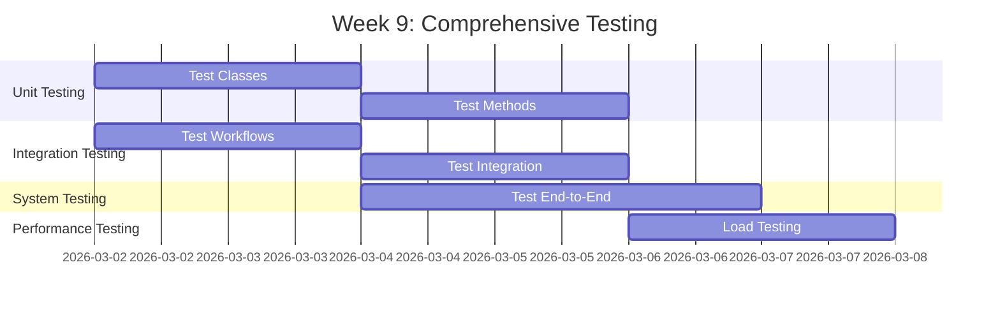
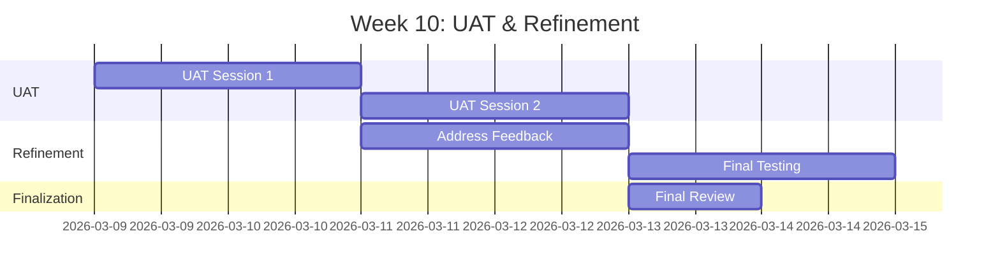
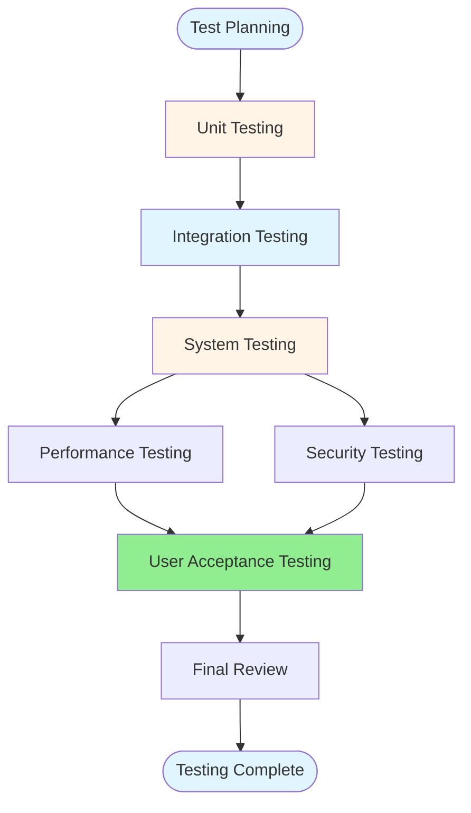
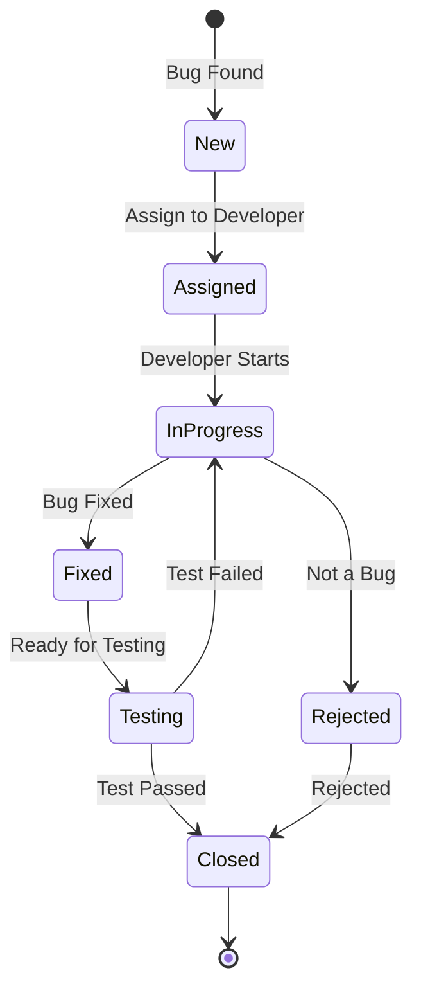

# Phase 3: Testing & Quality Assurance

**Duration**: Weeks 9-10  
**← [Back to README](SAP-Guides/Capstone/Employee-Leave-System/README.md)** | **Previous: [Phase 2: Development](Phase2_Development.md)** | **Next: [Phase 4: Documentation & Presentation](Phase4_Documentation_Presentation.md)**

---

## Table of Contents

1. [Week 9: Comprehensive Testing](#week-9-comprehensive-testing)
2. [Week 10: User Acceptance Testing & Refinement](#week-10-user-acceptance-testing--refinement)
3. [Test Plan Structure](#test-plan-structure)
4. [Test Case Templates](#test-case-templates)
5. [Testing Scenarios](#testing-scenarios)
6. [Bug Tracking Process](#bug-tracking-process)
7. [Performance Testing](#performance-testing)
8. [Security Testing](#security-testing)
9. [UAT Scenarios and Scripts](#uat-scenarios-and-scripts)
10. [References](#references)

---

## Week 9: Comprehensive Testing

### Testing Timeline

### All Team Members: Shared Testing Responsibilities

#### Common Testing Tasks

- [ ] **Unit Testing Completion**
  - Each member reviews and completes unit tests for their components
  - Ensure 80%+ code coverage for own components
  - Fix failing tests in own components
  - Document test results for own components

- [ ] **Component Testing**
  - Test own components thoroughly
  - Test error handling in own components
  - Test edge cases for own components
  - Document component test results

- [ ] **Integration Testing**
  - Participate in integration test sessions
  - Test integration of own components with others
  - Test workflow integration
  - Test email integration
  - Test HR integration
  - Document integration test results

- [ ] **System Testing**
  - Participate in end-to-end test scenarios
  - Test user workflows involving own components
  - Test error handling across components
  - Document system test results

- [ ] **Performance Testing**
  - Test performance of own components
  - Participate in load testing
  - Optimize own component queries
  - Document performance test results

- [ ] **Security Testing**
  - Test authorization for own components
  - Test data access controls
  - Test input validation
  - Document security test results

- [ ] **Code Review**
  - Participate in peer code reviews
  - Review code from other team members
  - Provide constructive feedback
  - Document code review findings

- [ ] **User Acceptance Testing Preparation**
  - Prepare UAT scenarios for own components
  - Create test scripts for own features
  - Prepare test data for own components
  - Support UAT coordination (Team Member 5 leads)

---

### Team Member 1: Lead Developer / Data Model Specialist

#### Tasks

- [ ] **Code Review All Modules**
  - Review all ABAP classes
  - Review database design
  - Check coding standards compliance
  - Review error handling

- [ ] **Performance Optimization**
  - Optimize database queries
  - Add indexes where needed
  - Optimize loops and iterations
  - Review memory usage

- [ ] **Fix Critical Bugs**
  - Prioritize critical bugs
  - Fix data integrity issues
  - Fix performance issues
  - Fix security vulnerabilities

- [ ] **Refactor Code if Needed**
  - Improve code readability
  - Remove duplicate code
  - Optimize class structure
  - Improve error messages

**Deliverables**:
- Code review report
- Performance optimization report
- Critical bugs fixed
- Refactored code

**References**:
- [ABAP Best Practices Guide](../../ABAP-Guides/12_SAP_ABAP_BEST_PRACTICES_GUIDE.md) - Code quality
- [Performance Guide](../../ABAP-Guides/10_SAP_ABAP_PERFORMANCE_GUIDE.md) - Performance optimization

---

### Team Member 2: Workflow & Approval Specialist

#### Tasks

- [ ] **Test All Workflow Scenarios**
  - Test Level 1 approval (< 5 days)
  - Test Level 2 approval (5-10 days)
  - Test Level 3 approval (> 10 days)
  - Test rejection scenarios
  - Test escalation scenarios

- [ ] **Test Edge Cases**
  - Multiple approvals in parallel
  - Approver unavailable
  - Workflow timeout
  - Agent determination failures

- [ ] **Validate Authorization**
  - Test authorization checks
  - Test role-based access
  - Test approval authority
  - Test data access controls

- [ ] **Fix Workflow Issues**
  - Fix workflow errors
  - Fix agent determination issues
  - Fix notification issues
  - Improve workflow performance

**Deliverables**:
- Workflow test results
- Edge case test results
- Authorization test results
- Workflow issues fixed

**References**:
- [SAP Workflow Guide](../../SAP_WORKFLOW_GUIDE.md) - Workflow testing
- [Security Guide](../../SAP_SECURITY_AUTHORIZATION_GUIDE.md) - Authorization testing

---

### Team Member 3: UI & Reporting Specialist

#### Tasks

- [ ] **Test All Screens**
  - Test leave request creation screen
  - Test approval screen
  - Test history lookup screen
  - Test report screen
  - Test screen navigation
  - Test field validations

- [ ] **Test All Reports**
  - Test report generation
  - Test report filtering
  - Test report sorting
  - Test report export
  - Test report performance

- [ ] **Test Excel Export**
  - Test export functionality
  - Test export format
  - Test large data export
  - Test export performance

- [ ] **UI/UX Improvements**
  - Improve user experience
  - Fix UI bugs
  - Improve error messages
  - Improve screen layouts

- [ ] **Fix UI Bugs**
  - Fix display issues
  - Fix navigation issues
  - Fix validation issues
  - Fix performance issues

**Deliverables**:
- Screen test results
- Report test results
- Excel export test results
- UI improvements implemented

**References**:
- [Screen Programming Guide](../../ABAP-Guides/06_SAP_ABAP_SCREEN_PROGRAMMING_GUIDE.md) - Screen testing
- [ALV Programming Guide](../../ABAP-Guides/07_SAP_ABAP_ALV_PROGRAMMING_GUIDE.md) - Report testing

---

### Team Member 4: Forms & Integration Specialist

#### Tasks

- [ ] **Test SmartForm in All Scenarios**
  - Test form generation
  - Test form layout
  - Test form printing
  - Test form with different data
  - Test form performance

- [ ] **Test Email Notifications**
  - Test approval request email
  - Test approval confirmation email
  - Test rejection email
  - Test status change notifications
  - Test email formatting
  - Test email delivery

- [ ] **Validate Print Output**
  - Validate form content
  - Validate form layout
  - Validate print quality
  - Validate print performance

- [ ] **Fix Form Issues**
  - Fix form layout issues
  - Fix form data issues
  - Fix print issues
  - Fix email issues

**Deliverables**:
- SmartForm test results
- Email notification test results
- Print output validation
- Form issues fixed

**References**:
- [SAP Forms Guide](../../SAP_FORMS_GUIDE.md) - Form testing
- [Integration Guide](../../SAP_INTEGRATION_GUIDE.md) - Email testing

---

### Team Member 5: Development & Quality Specialist

#### Tasks

- [ ] **Continue Development Support**
  - Support other team members with utility functions
  - Fix bugs in utility classes
  - Enhance helper functions as needed
  - Code review support

- [ ] **Coordinate Testing Activities**
  - Coordinate test execution across all members
  - Consolidate test results from all members
  - Track overall test progress
  - Report test status

- [ ] **Execute Test Cases for Own Components**
  - Execute unit test cases for utility classes
  - Execute integration test cases
  - Execute system test cases
  - Execute performance test cases
  - Execute security test cases

- [ ] **Document Test Results**
  - Consolidate test results from all members
  - Document overall test execution
  - Create test summary reports
  - Track test metrics

- [ ] **Manage Bug Tracking**
  - Set up bug tracking system
  - Document all bugs found (from all members)
  - Prioritize bugs
  - Assign bugs to team members
  - Track bug resolution

- [ ] **Prepare UAT Coordination**
  - Create overall UAT test scenarios
  - Create UAT test scripts
  - Prepare UAT test data
  - Schedule UAT sessions
  - Coordinate UAT activities

**Deliverables**:
- Development support completed
- Test coordination report
- Consolidated test results documentation
- Bug tracking system
- Bug reports
- UAT coordination materials

**References**:
- [Unit Testing Guide](../../ABAP-Guides/14_SAP_ABAP_UNIT_TESTING_GUIDE.md) - Test execution
- [Testing Guide](../../SAP_TESTING_GUIDE.md) - Test planning

---

## Week 10: User Acceptance Testing & Refinement

### UAT Timeline

### Team Member 5: Development & Quality Specialist

#### Tasks

- [ ] **Continue Development Support**
  - Support bug fixes with utility functions
  - Enhance helper functions as needed
  - Code review support

- [ ] **Coordinate UAT Sessions**
  - Schedule UAT sessions with users
  - Facilitate UAT sessions
  - Coordinate team member participation
  - Guide users through test scenarios
  - Answer user questions
  - Document UAT observations

- [ ] **Coordinate User Feedback Collection**
  - Coordinate feedback collection from all members
  - Consolidate feedback forms
  - Conduct feedback interviews
  - Document user suggestions
  - Prioritize feedback items

- [ ] **Consolidate UAT Results**
  - Consolidate test execution results from all members
  - Document overall user feedback
  - Document issues found across all components
  - Document acceptance status

- [ ] **Manage Change Requests**
  - Create change request tracking system
  - Create change request for each feedback item
  - Prioritize change requests
  - Assign change requests to team members
  - Track change request status

**Deliverables**:
- Development support completed
- UAT coordination report
- Consolidated user feedback report
- UAT results documentation
- Change request tracking

**References**:
- [Testing Guide](../../SAP_TESTING_GUIDE.md) - UAT approach
- [Capstone Guide](../../SAP_CAPSTONE_PROJECT_GUIDE.md#testing-approach) - UAT guidelines

---

### All Team Members: Shared Responsibilities

#### Tasks

- [ ] **Address UAT Feedback**
  - Review user feedback related to own components
  - Implement requested changes for own components
  - Test implemented changes
  - Document changes made

- [ ] **Implement Requested Changes**
  - Prioritize changes for own components
  - Implement high-priority changes
  - Test implemented changes
  - Get user approval for changes

- [ ] **Final Bug Fixes**
  - Fix remaining bugs in own components
  - Fix UAT-found bugs
  - Test bug fixes
  - Verify bug resolution

- [ ] **Final Testing**
  - Execute final test suite for own components
  - Verify all functionality of own components
  - Test all integration points
  - Validate performance

- [ ] **Component Documentation**
  - Finalize documentation for own components
  - Update user manual sections for own features
  - Update technical documentation
  - Ensure documentation completeness

- [ ] **Prepare for Deployment**
  - Prepare deployment package for own components
  - Prepare deployment documentation
  - Support deployment preparation (Team Member 5 coordinates)

**Deliverables**:
- UAT feedback addressed
- Changes implemented
- Final bugs fixed
- Final testing complete
- Deployment ready

---

## Test Plan Structure

### Test Plan Overview

### Test Levels

1. **Unit Testing**
   - Test individual classes
   - Test individual methods
   - Test data validation
   - Code coverage: 80%+

2. **Integration Testing**
   - Test class integration
   - Test workflow integration
   - Test email integration
   - Test HR integration

3. **System Testing**
   - Test end-to-end scenarios
   - Test user workflows
   - Test error handling
   - Test edge cases

4. **Performance Testing**
   - Response time testing
   - Load testing
   - Database performance
   - Report performance

5. **Security Testing**
   - Authorization testing
   - Data access testing
   - Input validation testing
   - SQL injection testing

6. **User Acceptance Testing**
   - Business scenario testing
   - User workflow testing
   - Usability testing
   - Acceptance validation

---

## Test Case Templates

### Unit Test Case Template

| Test Case ID | TC-UNIT-001 |
|--------------|-------------|
| **Test Case Name** | Test CREATE_REQUEST Method |
| **Component** | ZCL_LEAVE_REQUEST |
| **Method** | CREATE_REQUEST |
| **Prerequisites** | Test data available |
| **Test Steps** | 1. Create request data 2. Call CREATE_REQUEST 3. Verify request ID generated 4. Verify data saved |
| **Expected Result** | Request created with valid ID |
| **Actual Result** | [To be filled] |
| **Status** | [Pass/Fail] |
| **Comments** | [Any comments] |

### Integration Test Case Template

| Test Case ID | TC-INT-001 |
|--------------|------------|
| **Test Case Name** | Test Leave Request Creation Flow |
| **Components** | ZLEAVE_CREATE, ZCL_LEAVE_REQUEST, ZCL_LEAVE_VALIDATOR |
| **Prerequisites** | All components available |
| **Test Steps** | 1. User enters leave details 2. System validates input 3. System creates request 4. System triggers workflow |
| **Expected Result** | Request created and workflow triggered |
| **Actual Result** | [To be filled] |
| **Status** | [Pass/Fail] |
| **Comments** | [Any comments] |

### System Test Case Template

| Test Case ID | TC-SYS-001 |
|--------------|------------|
| **Test Case Name** | Test Complete Leave Request Process |
| **Scenario** | Employee creates leave request, manager approves |
| **Prerequisites** | System configured, users available |
| **Test Steps** | 1. Employee logs in 2. Employee creates leave request 3. Manager receives notification 4. Manager approves request 5. Employee receives confirmation |
| **Expected Result** | Complete process works end-to-end |
| **Actual Result** | [To be filled] |
| **Status** | [Pass/Fail] |
| **Comments** | [Any comments] |

---

## Testing Scenarios

### Scenario 1: Leave Request Creation

**Description**: Employee creates a leave request successfully

**Steps**:
1. Employee logs into system
2. Employee navigates to "Create Leave Request"
3. Employee enters leave details:
   - Leave Type: Annual
   - Start Date: 2026-03-23
   - End Date: 2026-03-27
   - Comments: "Family vacation"
4. Employee clicks "Submit"
5. System validates input
6. System creates request
7. System generates request ID
8. System displays success message

**Expected Result**: Request created with ID REQ0000001

**Test Data**:
- Employee ID: 00001234
- Leave Type: ANNU
- Dates: Valid date range

---

### Scenario 2: Approval Workflow - Level 1

**Description**: Leave request < 5 days requires Level 1 approval

**Steps**:
1. Employee creates request for 3 days
2. System determines approval level: Level 1
3. System triggers workflow
4. System sends notification to direct manager
5. Manager receives notification
6. Manager opens approval task
7. Manager approves request
8. System updates request status
9. System sends confirmation to employee

**Expected Result**: Request approved by Level 1 manager

**Test Data**:
- Leave Days: 3
- Approval Level: 1
- Manager: Direct manager of employee

---

### Scenario 3: Approval Workflow - Level 2

**Description**: Leave request 5-10 days requires Level 2 approval

**Steps**:
1. Employee creates request for 7 days
2. System determines approval level: Level 2
3. System triggers workflow
4. System sends notification to department head
5. Department head receives notification
6. Department head opens approval task
7. Department head approves request
8. System updates request status
9. System sends confirmation to employee

**Expected Result**: Request approved by Level 2 department head

**Test Data**:
- Leave Days: 7
- Approval Level: 2
- Approver: Department head

---

### Scenario 4: Rejection Scenario

**Description**: Manager rejects leave request

**Steps**:
1. Employee creates request
2. Manager receives approval task
3. Manager opens approval task
4. Manager enters rejection reason
5. Manager clicks "Reject"
6. System updates request status to "Rejected"
7. System logs rejection in history
8. System sends rejection notification to employee
9. Employee receives rejection email

**Expected Result**: Request rejected with reason logged

**Test Data**:
- Rejection Reason: "Insufficient leave balance"

---

### Scenario 5: History Lookup with Filters

**Description**: User looks up leave history with filters

**Steps**:
1. User navigates to "Leave History"
2. User enters filters:
   - Date Range: 2026-01-05 to 2026-03-13
   - Status: Approved
   - Leave Type: Annual
3. User clicks "Search"
4. System queries database
5. System displays filtered results
6. User views request details
7. User exports results to Excel

**Expected Result**: Filtered results displayed correctly

**Test Data**:
- Date Range: Valid range
- Status: Multiple statuses
- Leave Type: Multiple types

---

### Scenario 6: Report Generation

**Description**: User generates leave statistics report

**Steps**:
1. User navigates to "Reports"
2. User enters report parameters:
   - Date Range: 2026-01-05 to 2026-12-31
   - Department: All
3. User clicks "Generate Report"
4. System calculates statistics:
   - Total requests
   - Approved/Rejected/Pending
   - Leave by type
   - Leave by department
5. System displays ALV report
6. User exports to Excel

**Expected Result**: Report generated with accurate statistics

**Test Data**:
- Date Range: Full year
- Multiple departments
- Multiple leave types

---

## Bug Tracking Process

### Bug Lifecycle

### Bug Severity Levels

| Severity | Description | Response Time |
|----------|-------------|---------------|
| **Critical** | System crash, data loss | 4 hours |
| **High** | Major functionality broken | 1 day |
| **Medium** | Minor functionality issue | 3 days |
| **Low** | Cosmetic issue, enhancement | 1 week |

### Bug Report Template

| Field | Description |
|-------|-------------|
| **Bug ID** | Unique identifier |
| **Title** | Brief description |
| **Severity** | Critical/High/Medium/Low |
| **Component** | Affected component |
| **Steps to Reproduce** | Detailed steps |
| **Expected Result** | What should happen |
| **Actual Result** | What actually happens |
| **Screenshots** | If applicable |
| **Environment** | Test/Production |
| **Assigned To** | Developer name |
| **Status** | New/Assigned/In Progress/Fixed/Closed |
| **Resolution** | How it was fixed |

---

## Performance Testing

### Performance Requirements

| Function | Response Time | Throughput |
|----------|---------------|------------|
| Create Request | < 2 seconds | 100 requests/hour |
| Approval Process | < 3 seconds | 50 approvals/hour |
| History Lookup | < 3 seconds | 200 queries/hour |
| Report Generation | < 5 seconds | 20 reports/hour |
| Excel Export | < 10 seconds | 10 exports/hour |

### Performance Test Scenarios

**Scenario 1: Load Testing**
- Simulate 50 concurrent users
- Create 1000 leave requests
- Measure response times
- Monitor system resources

**Scenario 2: Stress Testing**
- Simulate 100 concurrent users
- Create 5000 leave requests
- Identify breaking point
- Monitor system stability

**Scenario 3: Database Performance**
- Test with 10,000 records
- Test query performance
- Test index effectiveness
- Optimize slow queries

---

## Security Testing

### Security Test Checklist

- [ ] **Authorization Checks**
  - [ ] Users can only see their own requests
  - [ ] Managers can only approve their subordinates
  - [ ] HR can see all requests
  - [ ] Unauthorized access blocked

- [ ] **Data Access Controls**
  - [ ] Data access restricted by authorization
  - [ ] Sensitive data protected
  - [ ] Audit trail maintained

- [ ] **Input Validation**
  - [ ] SQL injection prevented
  - [ ] XSS attacks prevented
  - [ ] Input sanitization working
  - [ ] Field validations working

- [ ] **Session Management**
  - [ ] Session timeout working
  - [ ] Session hijacking prevented
  - [ ] Secure session handling

---

## UAT Scenarios and Scripts

### UAT Script Template

**UAT Session**: Session 1 - Leave Request Creation  
**Date**: [Date]  
**Participants**: [User names]  
**Facilitator**: Team Member 5

**Script**:

1. **Introduction** (5 minutes)
   - Welcome participants
   - Explain UAT purpose
   - Explain testing process

2. **Scenario 1: Create Leave Request** (15 minutes)
   - User creates annual leave request
   - User verifies request created
   - User checks request ID generated

3. **Scenario 2: Approve Leave Request** (15 minutes)
   - Manager receives notification
   - Manager approves request
   - Employee receives confirmation

4. **Feedback Collection** (10 minutes)
   - Collect user feedback
   - Document issues
   - Document suggestions

5. **Wrap-up** (5 minutes)
   - Thank participants
   - Explain next steps

**Expected Duration**: 50 minutes

---

## References

- **[Unit Testing Guide](../../ABAP-Guides/14_SAP_ABAP_UNIT_TESTING_GUIDE.md)** - Unit testing approach
- **[Testing Guide](../../SAP_TESTING_GUIDE.md)** - Test planning and execution
- **[Performance Guide](../../ABAP-Guides/10_SAP_ABAP_PERFORMANCE_GUIDE.md)** - Performance testing
- **[Security Guide](../../SAP_SECURITY_AUTHORIZATION_GUIDE.md)** - Security testing
- **[Capstone Guide](../../SAP_CAPSTONE_PROJECT_GUIDE.md#testing-approach)** - Testing methodology

---

**← [Back to README](SAP-Guides/Capstone/Employee-Leave-System/README.md)** | **Previous: [Phase 2: Development](Phase2_Development.md)** | **Next: [Phase 4: Documentation & Presentation](Phase4_Documentation_Presentation.md)**

