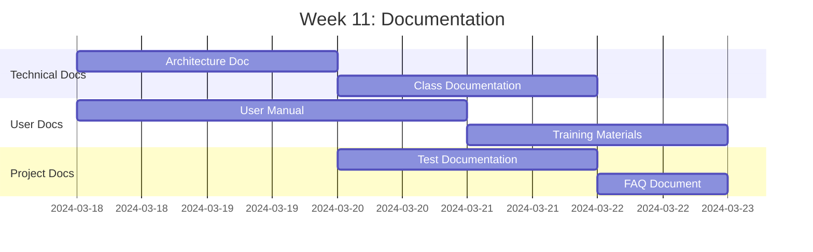
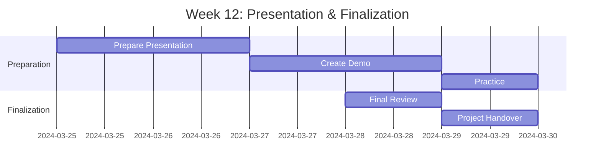

# Phase 4: Documentation & Presentation

**Duration**: Weeks 11-12  
**← [Back to README](README.md)** | **Previous: [Phase 3: Testing & QA](Phase3_Testing_QA.md)**

---

## Table of Contents

1. [Week 11: Documentation](#week-11-documentation)
2. [Week 12: Presentation & Finalization](#week-12-presentation--finalization)
3. [Documentation Templates](#documentation-templates)
4. [Documentation Structure](#documentation-structure)
5. [Presentation Structure](#presentation-structure)
6. [Demo Scenarios](#demo-scenarios)
7. [Q&A Preparation](#qa-preparation)
8. [References](#references)

---

## Week 11: Documentation

### Documentation Timeline



### All Team Members: Shared Documentation Responsibilities

#### Component Documentation (Each Member Documents Their Own Components)

**Team Member 1: Lead Developer / Data Model Specialist**

- [ ] **Technical Documentation**

  **System Architecture**
  - Document system architecture
  - Document component relationships
  - Document data flow
  - Document integration points

  **Data Model Documentation**
  - Document all database tables
  - Document table relationships
  - Document data elements
  - Document search helps

  **Class Documentation**
  - Document own ABAP classes (ZCL_LEAVE_REQUEST, ZCL_LEAVE_VALIDATOR, ZCL_LEAVE_CALCULATOR)
  - Document class methods
  - Document method parameters
  - Document return types
  - Document exceptions

  **API Documentation**
  - Document public methods of own classes
  - Document method signatures
  - Document usage examples
  - Document error handling

- [ ] **Code Documentation**
  - Add inline comments to own code
  - Document complex logic in own classes
  - Document business rules
  - Document algorithms

- [ ] **Integration Documentation**
  - Document HR integration
  - Document integration with other components

**Deliverables**:
- Technical design document
- Data model documentation
- Class documentation
- API documentation
- Integration documentation

**References**:
- [Capstone Guide](../../SAP_CAPSTONE_PROJECT_GUIDE.md#documentation-standards) - Documentation standards

---

**Team Member 2: Workflow & Approval Specialist**

- [ ] **Workflow Documentation**
  - Document workflow template
  - Document workflow tasks
  - Document workflow events
  - Document workflow container
  - Document agent determination

- [ ] **Approval Process Documentation**
  - Document approval levels
  - Document approval rules
  - Document approval routing
  - Document escalation rules

- [ ] **Configuration Guide**
  - Document workflow configuration
  - Document approval level configuration
  - Document agent determination configuration
  - Document workflow monitoring

- [ ] **Code Documentation**
  - Document workflow methods
  - Document approval logic
  - Add inline comments

**Deliverables**:
- Workflow documentation
- Approval process documentation
- Configuration guide

**References**:
- [SAP Workflow Guide](../../SAP_WORKFLOW_GUIDE.md) - Workflow documentation

---

**Team Member 3: UI & Reporting Specialist**

- [ ] **User Manual Sections**
  - Document user interface for own screens
  - Document screen navigation for own programs
  - Document field descriptions
  - Document user workflows for own features
  - Document error messages

- [ ] **Screen Navigation Guide**
  - Document screen flow for own programs
  - Document screen layouts
  - Document field validations
  - Document button functions

- [ ] **Report Usage Guide**
  - Document report parameters
  - Document report filters
  - Document report sorting
  - Document Excel export
  - Document report interpretation

- [ ] **Code Documentation**
  - Document screen programs
  - Document ALV report code
  - Add inline comments

**Deliverables**:
- User manual
- Screen navigation guide
- Report usage guide

**References**:
- [Capstone Guide](../../SAP_CAPSTONE_PROJECT_GUIDE.md#documentation-standards) - User documentation

---

**Team Member 4: Forms & Integration Specialist**

- [ ] **SmartForm Documentation**
  - Document form structure
  - Document form fields
  - Document form data sources
  - Document print procedure

- [ ] **Email Configuration Guide**
  - Document email setup
  - Document email templates
  - Document notification triggers
  - Document email troubleshooting

- [ ] **Print Procedure Guide**
  - Document print setup
  - Document print process
  - Document print troubleshooting
  - Document print customization

- [ ] **Code Documentation**
  - Document email integration code
  - Document form generation code
  - Add inline comments

**Deliverables**:
- SmartForm documentation
- Email configuration guide
- Print procedure guide

**References**:
- [SAP Forms Guide](../../SAP_FORMS_GUIDE.md) - Form documentation

---

**Team Member 5: Development & Quality Specialist**

- [ ] **Documentation Coordination**
  - Consolidate documentation from all members
  - Create documentation index
  - Ensure documentation completeness
  - Review documentation quality
  - Format and standardize documentation

- [ ] **Test Documentation**
  - Consolidate test documentation from all members
  - Document overall test plan
  - Summarize test results from all components
  - Document test coverage across all components
  - Document test environment

- [ ] **Test Results Summary**
  - Summarize unit test results from all members
  - Summarize integration test results
  - Summarize system test results
  - Summarize UAT results
  - Document overall test metrics

- [ ] **User Training Materials**
  - Create training slides (consolidate from all members)
  - Create training videos (if applicable)
  - Create quick reference guide
  - Create FAQ document

- [ ] **FAQ Document**
  - Common questions (gathered from all members)
  - Common issues (from all components)
  - Troubleshooting tips
  - Best practices

- [ ] **Code Documentation**
  - Document own utility classes
  - Document helper functions
  - Add inline comments

**Deliverables**:
- Test documentation
- Test results summary
- User training materials
- FAQ document

**References**:
- [Testing Guide](../../SAP_TESTING_GUIDE.md) - Test documentation
- [Capstone Guide](../../SAP_CAPSTONE_PROJECT_GUIDE.md#documentation-standards) - Documentation templates

---

## Week 12: Presentation & Finalization

### Presentation Timeline



### All Team Members

#### Tasks

- [ ] **Prepare Presentation**
  - Create presentation slides
  - Prepare presentation content
  - Prepare visual aids
  - Prepare handouts

- [ ] **Create Demo Scenarios**
  - Prepare demo data
  - Prepare demo scripts
  - Test demo scenarios
  - Prepare backup plans

- [ ] **Practice Presentation**
  - Practice individually
  - Practice as a team
  - Time the presentation
  - Refine presentation

- [ ] **Prepare Q&A**
  - Anticipate questions
  - Prepare answers
  - Prepare supporting materials
  - Practice Q&A responses

- [ ] **Final Code Review**
  - Review all code
  - Check coding standards
  - Verify documentation
  - Final cleanup

- [ ] **Final Documentation Review**
  - Review all documentation
  - Check completeness
  - Verify accuracy
  - Finalize documents

- [ ] **Project Handover**
  - Prepare handover package
  - Document handover process
  - Schedule handover meeting
  - Complete handover

**Deliverables**:
- Final presentation
- Demo ready
- All documentation complete
- Project handover complete

---

## Documentation Templates

### Technical Documentation Template

```markdown
# [Component Name] - Technical Documentation

## Overview
[Component description]

## Architecture
[Architecture details]

## Components
[Component list]

## Data Model
[Data model details]

## Methods
[Method documentation]

## Integration
[Integration details]

## Error Handling
[Error handling approach]

## Performance
[Performance considerations]

## References
[Related documents]
```

### User Manual Template

```markdown
# [Feature Name] - User Manual

## Overview
[Feature description]

## Prerequisites
[Prerequisites]

## Step-by-Step Instructions
[Detailed steps]

## Screenshots
[Screenshots with annotations]

## Common Issues
[Common issues and solutions]

## FAQs
[Frequently asked questions]
```

---

## Documentation Structure

### Complete Documentation Package

```
Documentation/
├── Technical/
│   ├── System_Architecture.md
│   ├── Data_Model.md
│   ├── Class_Documentation.md
│   ├── API_Documentation.md
│   └── Integration_Documentation.md
├── User/
│   ├── User_Manual.md
│   ├── Quick_Reference_Guide.md
│   ├── Training_Materials/
│   └── FAQ.md
├── Administration/
│   ├── Configuration_Guide.md
│   ├── Workflow_Configuration.md
│   └── Maintenance_Guide.md
└── Testing/
    ├── Test_Plan.md
    ├── Test_Cases.md
    └── Test_Results.md
```

---

## Presentation Structure

### Presentation Outline

**Duration**: 45-60 minutes

1. **Introduction** (5 minutes)
   - Project overview
   - Team introduction
   - Presentation agenda

2. **Requirements & Design** (10 minutes)
   - Business requirements
   - System design
   - Architecture overview
   - Key decisions

3. **Implementation** (15 minutes)
   - Development approach
   - Key components
   - Technical highlights
   - Challenges and solutions

4. **Testing & Quality** (5 minutes)
   - Testing approach
   - Test results
   - Quality metrics

5. **Demonstration** (15 minutes)
   - Live demo
   - Key features
   - User workflows

6. **Conclusion** (5 minutes)
   - Summary
   - Lessons learned
   - Future enhancements
   - Q&A

---

## Demo Scenarios

### Demo Script 1: Leave Request Creation

**Duration**: 5 minutes

**Steps**:
1. Log in as employee
2. Navigate to "Create Leave Request"
3. Enter leave details:
   - Leave Type: Annual
   - Start Date: 2024-04-01
   - End Date: 2024-04-05
   - Comments: "Family vacation"
4. Submit request
5. Show request ID generated
6. Show success message

**Key Points**:
- Auto-ID generation
- Field validation
- User-friendly interface

---

### Demo Script 2: Approval Workflow

**Duration**: 5 minutes

**Steps**:
1. Show manager inbox
2. Open approval task
3. Review request details
4. Approve request
5. Show status update
6. Show employee notification

**Key Points**:
- Workflow automation
- Multi-level approval
- Email notifications

---

### Demo Script 3: History & Reporting

**Duration**: 5 minutes

**Steps**:
1. Navigate to "Leave History"
2. Apply filters
3. View filtered results
4. Navigate to "Reports"
5. Generate statistics report
6. Export to Excel

**Key Points**:
- Advanced filtering
- Comprehensive reporting
- Excel export

---

## Q&A Preparation

### Anticipated Questions

**Technical Questions**:
1. **Q**: How does the approval workflow determine the approver?
   **A**: The system checks leave duration and determines approval level. Level 1 (< 5 days) goes to direct manager, Level 2 (5-10 days) to department head, Level 3 (> 10 days) to HR director.

2. **Q**: How is the request ID generated?
   **A**: We use SAP number range object ZLEAVE_REQ to generate sequential IDs in format REQ0000001.

3. **Q**: How does the system handle overlapping leave requests?
   **A**: The validator class checks for overlapping dates before allowing request creation and prevents conflicts.

**Business Questions**:
1. **Q**: Can the approval levels be customized?
   **A**: Yes, approval levels are configurable in ZLEAVE_CONFIG table.

2. **Q**: How are email notifications sent?
   **A**: We use SAP standard function SO_DOCUMENT_SEND_API1 to send emails via workflow events.

**Future Enhancement Questions**:
1. **Q**: Can this be extended to mobile?
   **A**: Yes, we can create Fiori apps or mobile interfaces using the same backend classes.

2. **Q**: Can this integrate with external calendar systems?
   **A**: Yes, we can add integration points using RFC or web services.

---

## Presentation Tips

### Best Practices

1. **Practice**: Practice presentation multiple times
2. **Timing**: Keep to allocated time
3. **Visuals**: Use clear diagrams and screenshots
4. **Demo**: Have backup plan for demo
5. **Engagement**: Engage audience with questions
6. **Confidence**: Speak clearly and confidently

### Common Pitfalls to Avoid

1. **Too Technical**: Avoid overly technical jargon
2. **Too Fast**: Don't rush through slides
3. **No Demo**: Always include live demo
4. **Unprepared**: Be ready for questions
5. **Reading Slides**: Don't read slides verbatim

---

## Project Handover Checklist

- [ ] All code delivered
- [ ] All documentation delivered
- [ ] All test cases delivered
- [ ] System deployed
- [ ] User training completed
- [ ] Support plan documented
- [ ] Knowledge transfer completed
- [ ] Handover meeting conducted
- [ ] Sign-off obtained

---

## References

- **[Capstone Guide](../../SAP_CAPSTONE_PROJECT_GUIDE.md#documentation-standards)** - Documentation standards
- **[Capstone Guide](../../SAP_CAPSTONE_PROJECT_GUIDE.md#presentation-guidelines)** - Presentation guidelines
- **[Best Practices Guide](../../ABAP-Guides/12_SAP_ABAP_BEST_PRACTICES_GUIDE.md)** - Code documentation

---

**← [Back to README](README.md)** | **Previous: [Phase 3: Testing & QA](Phase3_Testing_QA.md)**

