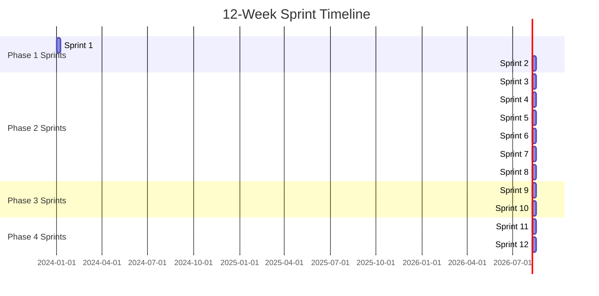
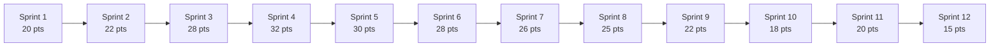
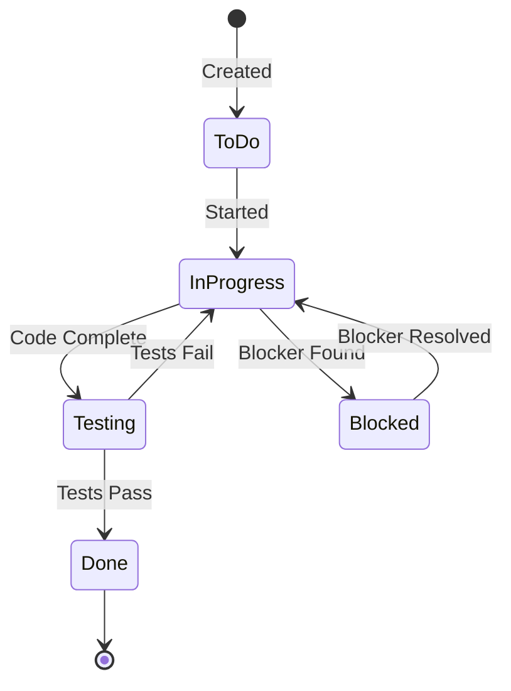

# Capstone Project Management Plan

## Project Management Overview

**Project**: Employee Leave Request and Approval System  
**Duration**: 12 weeks (12 sprints)  
**Sprint Duration**: 1 week  
**Team Size**: 5 members  
**Methodology**: Agile/Scrum (adapted for capstone)

---

## Sprint Structure

### 12-Week Sprint Breakdown



### Sprint Schedule

| Sprint | Week | Phase | Focus | Story Points Target |
|--------|------|-------|-------|-------------------|
| **Sprint 1** | Week 1 | Phase 1 | Requirements Gathering | 20-25 |
| **Sprint 2** | Week 2 | Phase 1 | Detailed Design | 20-25 |
| **Sprint 3** | Week 3 | Phase 2 | Foundation & Data Model | 25-30 |
| **Sprint 4** | Week 4 | Phase 2 | Core Functionality | 30-35 |
| **Sprint 5** | Week 5 | Phase 2 | Workflow Implementation | 30-35 |
| **Sprint 6** | Week 6 | Phase 2 | History & Filtering | 25-30 |
| **Sprint 7** | Week 7 | Phase 2 | Reporting & Statistics | 25-30 |
| **Sprint 8** | Week 8 | Phase 2 | Forms & Integration | 25-30 |
| **Sprint 9** | Week 9 | Phase 3 | Comprehensive Testing | 20-25 |
| **Sprint 10** | Week 10 | Phase 3 | UAT & Refinement | 15-20 |
| **Sprint 11** | Week 11 | Phase 4 | Documentation | 20-25 |
| **Sprint 12** | Week 12 | Phase 4 | Presentation | 15-20 |

**Total Story Points**: ~280-320 points

---

## Story Point Evaluation

### Fibonacci Scale

| Points | Description | Effort | Examples |
|--------|-------------|--------|----------|
| **1** | Trivial | < 2 hours | Simple bug fix, minor documentation |
| **2** | Very Easy | 2-4 hours | Small utility function, simple screen field |
| **3** | Easy | 4-8 hours | Single method implementation, basic validation |
| **5** | Medium | 1-2 days | Complete class method, screen with validation |
| **8** | Large | 2-3 days | Complete program, workflow task, complex class |
| **13** | Very Large | 3-5 days | Multi-component feature, complex integration |
| **21** | Epic | 1+ week | Complete module, major feature |

### Story Point Estimation Process

1. **Planning Poker Session** (Sprint Planning)
   - Each team member estimates independently
   - Discuss differences
   - Re-estimate until consensus
   - Use Fibonacci scale

2. **Estimation Factors**
   - **Complexity**: How complex is the task?
   - **Effort**: How much work is required?
   - **Uncertainty**: How well do we understand requirements?
   - **Dependencies**: Are there blocking dependencies?

3. **Reference Stories** (Baseline)
   - **1 Point**: Create a simple domain in SE11
   - **3 Points**: Implement a single validation method
   - **5 Points**: Create a complete screen with PBO/PAI
   - **8 Points**: Develop a complete ABAP program
   - **13 Points**: Implement complete workflow template

---

## Sprint Planning Process

### Pre-Sprint Planning (Day 0 - Friday before Sprint)

**Activities**:
- Review previous sprint results
- Update product backlog
- Prioritize backlog items
- Prepare sprint backlog

**Participants**: All team members  
**Duration**: 1-2 hours

### Sprint Planning Meeting (Day 1 - Monday)

**Agenda**:
1. **Sprint Goal Definition** (15 min)
   - Define what the sprint will achieve
   - Align with phase objectives

2. **Backlog Review** (30 min)
   - Review prioritized backlog items
   - Discuss requirements
   - Clarify questions

3. **Story Point Estimation** (45 min)
   - Estimate each user story
   - Use planning poker
   - Document estimates

4. **Sprint Backlog Creation** (30 min)
   - Select stories for sprint
   - Assign stories to team members
   - Break down stories into tasks

5. **Capacity Planning** (15 min)
   - Calculate team capacity
   - Verify sprint commitment
   - Identify risks

**Total Duration**: ~2 hours  
**Output**: Sprint backlog with estimated stories

### Sprint Backlog Template

| Story ID | User Story | Story Points | Assigned To | Status | Tasks |
|----------|------------|--------------|-------------|--------|-------|
| US-001 | As an employee, I want to create a leave request | 8 | Member 1, 3 | To Do | T-001, T-002, T-003 |
| US-002 | As a manager, I want to approve leave requests | 13 | Member 2 | In Progress | T-004, T-005 |

---

## Daily Standup Meetings

### Format

**Time**: 15 minutes  
**Frequency**: Daily (Monday-Friday)  
**Time**: 9:00 AM (or agreed time)

### Three Questions

1. **What did I complete yesterday?**
2. **What will I work on today?**
3. **Are there any blockers?**

### Standup Template

| Member | Yesterday | Today | Blockers |
|--------|-----------|-------|----------|
| Member 1 | Completed table creation | Working on validation class | None |
| Member 2 | Designed workflow | Creating workflow template | Need HR table access |
| Member 3 | Created program structure | Developing screen | Waiting for Member 1's class |
| Member 4 | Set up SmartForms | Creating form layout | None |
| Member 5 | Created utility class | Writing helper functions | None |

### Standup Rules

- Keep it brief (2-3 minutes per person)
- Focus on progress and blockers
- No detailed technical discussions (schedule separate meetings)
- Update sprint board after standup

---

## Sprint Review (End of Sprint)

### Sprint Review Meeting

**Time**: 1 hour  
**Frequency**: End of each sprint (Friday)  
**Participants**: All team members

### Agenda

1. **Sprint Summary** (10 min)
   - Sprint goal achievement
   - Completed stories
   - Story points completed

2. **Demo** (30 min)
   - Demo completed features
   - Show working functionality
   - Gather feedback

3. **Metrics Review** (10 min)
   - Velocity (story points completed)
   - Burndown chart
   - Quality metrics

4. **Next Sprint Preview** (10 min)
   - Preview next sprint goals
   - Discuss priorities

### Sprint Review Template

```
Sprint X Review - [Date]

Sprint Goal: [Goal]
Completed Stories: [Count]
Story Points Completed: [Points]
Velocity: [Points]

Demo Items:
- [Feature 1]
- [Feature 2]

Metrics:
- Planned: [Points]
- Completed: [Points]
- Velocity: [Points]

Next Sprint Preview:
- [Goal]
- [Key Stories]
```

---

## Sprint Retrospective

### Retrospective Meeting

**Time**: 45 minutes  
**Frequency**: End of each sprint (Friday, after review)  
**Participants**: All team members

### Format: Start-Stop-Continue

1. **What Should We Start Doing?** (15 min)
   - New practices to adopt
   - Improvements to try

2. **What Should We Stop Doing?** (15 min)
   - Practices that aren't working
   - Wasteful activities

3. **What Should We Continue Doing?** (15 min)
   - Practices that work well
   - Successful approaches

### Retrospective Template

```
Sprint X Retrospective - [Date]

Start:
- [Action item 1]
- [Action item 2]

Stop:
- [Action item 1]
- [Action item 2]

Continue:
- [Action item 1]
- [Action item 2]

Action Items:
- [ ] [Action] - Owner: [Name] - Due: [Date]
```

---

## Product Backlog Management

### Backlog Structure

**Epic Level**:
- Epic 1: Leave Request Management
- Epic 2: Approval Workflow
- Epic 3: History & Reporting
- Epic 4: Forms & Notifications

**User Story Level**:
- User stories under each epic
- Prioritized by business value
- Estimated with story points

**Task Level**:
- Technical tasks under each story
- Assigned to team members
- Tracked daily

### Backlog Prioritization

**Priority Levels**:
1. **P0 - Critical**: Must have for MVP
2. **P1 - High**: Important for MVP
3. **P2 - Medium**: Nice to have
4. **P3 - Low**: Future enhancement

**Prioritization Factors**:
- Business value
- Dependencies
- Risk
- Technical complexity

### User Story Template

```
Story ID: US-XXX
Title: [As a <user>, I want <action>, so that <benefit>]

Description:
[Detailed description]

Acceptance Criteria:
- [ ] Criterion 1
- [ ] Criterion 2
- [ ] Criterion 3

Story Points: [X]
Priority: [P0/P1/P2/P3]
Epic: [Epic Name]
Assigned To: [Team Member]
Status: [To Do / In Progress / Testing / Done]

Tasks:
- [ ] Task 1
- [ ] Task 2
```

---

## Story Point Breakdown by Epic

### Epic 1: Leave Request Management (80-90 points)

| User Story | Points | Sprint |
|------------|--------|--------|
| Create leave request with auto-ID | 8 | Sprint 4 |
| Validate leave request data | 5 | Sprint 4 |
| Calculate leave days | 5 | Sprint 4 |
| Check overlapping requests | 5 | Sprint 4 |
| Integrate with HR module | 8 | Sprint 4 |
| Create request screen | 8 | Sprint 4 |
| Save request to database | 5 | Sprint 4 |
| Error handling | 5 | Sprint 4 |
| Unit tests | 8 | Sprint 4 |
| Integration tests | 5 | Sprint 9 |

### Epic 2: Approval Workflow (70-80 points)

| User Story | Points | Sprint |
|------------|--------|--------|
| Design workflow template | 8 | Sprint 2 |
| Create workflow tasks | 8 | Sprint 5 |
| Implement agent determination | 13 | Sprint 5 |
| Multi-level approval logic | 13 | Sprint 5 |
| Approval UI | 8 | Sprint 5 |
| Workflow integration | 8 | Sprint 5 |
| Email notifications | 8 | Sprint 5 |
| Workflow testing | 8 | Sprint 9 |

### Epic 3: History & Reporting (60-70 points)

| User Story | Points | Sprint |
|------------|--------|--------|
| History lookup screen | 8 | Sprint 6 |
| Filtering functionality | 8 | Sprint 6 |
| History class development | 8 | Sprint 6 |
| Report generation | 13 | Sprint 7 |
| Statistics calculations | 8 | Sprint 7 |
| Excel export | 8 | Sprint 7 |
| Report testing | 5 | Sprint 9 |

### Epic 4: Forms & Notifications (50-60 points)

| User Story | Points | Sprint |
|------------|--------|--------|
| SmartForm development | 13 | Sprint 8 |
| Email templates | 8 | Sprint 8 |
| Print functionality | 5 | Sprint 8 |
| Email integration | 8 | Sprint 8 |
| Notification triggers | 5 | Sprint 8 |
| Forms testing | 5 | Sprint 9 |

### Epic 5: Foundation & Infrastructure (40-50 points)

| User Story | Points | Sprint |
|------------|--------|--------|
| Database tables | 13 | Sprint 3 |
| Utility classes | 13 | Sprint 3 |
| Helper functions | 8 | Sprint 3-8 |
| Test framework | 5 | Sprint 3 |
| Error handling framework | 8 | Sprint 4 |

---

## Velocity Tracking

### Velocity Calculation

**Velocity** = Story Points Completed per Sprint

### Velocity Chart



### Velocity Tracking Template

| Sprint | Planned Points | Completed Points | Velocity | Trend |
|--------|---------------|------------------|----------|-------|
| Sprint 1 | 20 | 20 | 20 | - |
| Sprint 2 | 22 | 22 | 22 | ↑ |
| Sprint 3 | 28 | 28 | 28 | ↑ |
| Sprint 4 | 32 | 32 | 32 | ↑ |
| ... | ... | ... | ... | ... |

**Average Velocity**: Calculate after Sprint 3

---

## Burndown Charts

### Sprint Burndown

**Purpose**: Track progress within a sprint

**X-axis**: Days of sprint (1-5)  
**Y-axis**: Remaining story points

**Ideal Burndown**: Straight line from total points to 0

### Release Burndown

**Purpose**: Track progress across all sprints

**X-axis**: Sprints (1-12)  
**Y-axis**: Remaining story points

**Target**: Complete all 280-320 points by Sprint 12

---

## Task Management

### Task Breakdown

**User Story → Tasks**:
- Break down each story into actionable tasks
- Each task should be 1-2 days of work
- Tasks should be specific and testable

### Task Template

```
Task ID: T-XXX
Title: [Task Title]

Description:
[Detailed description]

Story: US-XXX
Assigned To: [Team Member]
Estimated Hours: [X]
Status: [To Do / In Progress / Testing / Done]

Acceptance Criteria:
- [ ] Criterion 1
- [ ] Criterion 2

Dependencies:
- [Task ID] must be completed first

Notes:
[Any additional notes]
```

### Task Status Workflow



---

## Risk Management in Sprints

### Risk Identification

**Sprint Planning Risks**:
- Over-commitment
- Unclear requirements
- Dependencies
- Technical challenges

### Risk Mitigation

1. **Buffer Time**: Add 20% buffer to sprint capacity
2. **Early Risk Identification**: Identify risks in sprint planning
3. **Daily Risk Review**: Discuss risks in daily standup
4. **Contingency Plans**: Have backup plans ready

### Risk Register Template

| Risk ID | Description | Probability | Impact | Mitigation | Owner |
|---------|-------------|-------------|--------|------------|-------|
| R-001 | Workflow complexity | Medium | High | Early prototyping | Member 2 |
| R-002 | HR integration issues | Medium | High | Early integration testing | Member 1 |

---

## Tools and Templates

### Recommended Tools

1. **Project Management**:
   - Jira / Azure DevOps / Trello
   - GitHub Projects
   - Excel/Google Sheets

2. **Documentation**:
   - Markdown files (current structure)
   - Confluence / Notion
   - Google Docs

3. **Communication**:
   - Slack / Teams
   - Email
   - Daily standup meetings

### Templates Needed

1. **Sprint Planning Template**
2. **Daily Standup Template**
3. **Sprint Review Template**
4. **Retrospective Template**
5. **User Story Template**
6. **Task Template**
7. **Burndown Chart Template**
8. **Velocity Tracking Template**

---

## Sprint Ceremonies Schedule

### Weekly Schedule

| Day | Time | Ceremony | Duration | Participants |
|-----|------|----------|----------|--------------|
| **Monday** | 9:00 AM | Daily Standup | 15 min | All |
| **Monday** | 10:00 AM | Sprint Planning | 2 hours | All |
| **Tuesday-Friday** | 9:00 AM | Daily Standup | 15 min | All |
| **Friday** | 2:00 PM | Sprint Review | 1 hour | All |
| **Friday** | 3:00 PM | Retrospective | 45 min | All |

---

## Definition of Done

### Story Definition of Done

A user story is considered "Done" when:

- [ ] Code is written and reviewed
- [ ] Unit tests are written and passing
- [ ] Code follows coding standards
- [ ] Documentation is updated
- [ ] Integration tests pass
- [ ] No critical bugs
- [ ] Accepted by product owner/stakeholder

### Sprint Definition of Done

A sprint is considered "Done" when:

- [ ] All committed stories are completed
- [ ] Sprint review is conducted
- [ ] Retrospective is completed
- [ ] Next sprint is planned
- [ ] Documentation is updated
- [ ] Demo is prepared

---

## Capacity Planning

### Team Capacity Calculation

**Individual Capacity**:
- Hours per day: 6-8 hours (accounting for meetings, breaks)
- Days per sprint: 5 days
- Individual capacity: 30-40 hours per sprint

**Team Capacity**:
- 5 members × 35 hours = 175 hours per sprint
- Account for meetings: -10 hours
- Account for buffer: -20% = 132 hours available

**Story Point to Hours Conversion**:
- 1 Story Point ≈ 4-6 hours
- Team capacity: ~25-30 story points per sprint

---

## Metrics and KPIs

### Key Metrics

1. **Velocity**: Story points completed per sprint
2. **Burndown Rate**: Points burned per day
3. **Sprint Goal Achievement**: % of sprint goals met
4. **Code Quality**: Test coverage, code review findings
5. **Bug Rate**: Bugs found per sprint
6. **Team Satisfaction**: Retrospective feedback

### Metrics Dashboard Template

| Metric | Sprint 1 | Sprint 2 | Sprint 3 | Target |
|--------|----------|----------|----------|--------|
| Velocity | 20 | 22 | 28 | 25-30 |
| Sprint Goal % | 100% | 95% | 100% | ≥90% |
| Test Coverage | 0% | 20% | 45% | ≥80% |
| Bug Count | 0 | 3 | 5 | <10/sprint |

---

## Communication Plan

### Communication Channels

1. **Daily Standup**: Synchronous, 15 min
2. **Sprint Planning**: Synchronous, 2 hours
3. **Sprint Review**: Synchronous, 1 hour
4. **Retrospective**: Synchronous, 45 min
5. **Slack/Teams**: Asynchronous, ongoing
6. **Email**: Formal communications
7. **Documentation**: Project docs (Markdown)

### Escalation Path

1. **Team Level**: Discuss in daily standup
2. **Sprint Level**: Discuss in sprint planning/review
3. **Project Level**: Escalate to project advisor/instructor

---

## Implementation Checklist

### Setup Tasks

- [ ] Set up project management tool (Jira/Trello/Sheets)
- [ ] Create product backlog
- [ ] Create sprint backlog template
- [ ] Set up communication channels
- [ ] Schedule sprint ceremonies
- [ ] Create estimation baseline stories
- [ ] Set up velocity tracking
- [ ] Create burndown chart template

### Ongoing Tasks

- [ ] Daily standup meetings
- [ ] Weekly sprint planning
- [ ] Weekly sprint review
- [ ] Weekly retrospective
- [ ] Update backlog regularly
- [ ] Track velocity
- [ ] Update burndown charts
- [ ] Manage risks

---

## References

- **[Project Overview](../00_Project_Overview.md)** - Project context
- **[Team Members Tasks](../Team_Members_Tasks.md)** - Individual task breakdown
- **[Phase Documents](../Phase1_Requirements_Design.md)** - Detailed phase tasks
- **[SAP Capstone Guide](../../../SAP_CAPSTONE_PROJECT_GUIDE.md#development-methodology)** - Development methodology

