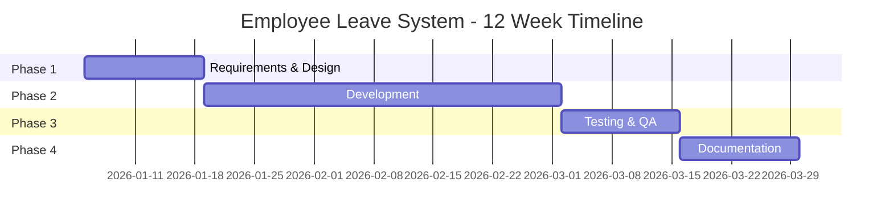

# Employee Leave Request and Approval System

**Hệ thống yêu cầu và phê duyệt nghỉ phép nhân viên**

---

## Project Overview

This is a comprehensive 12-week SAP ABAP capstone project to develop an Employee Leave Request and Approval System. The system automates the complete leave management process from request creation through multi-level approval workflow to reporting and notifications.

### Key Features

1. ✅ **Create Leave Request** - Input leave details with auto-generated request ID
2. ✅ **Multi-level Approval Workflow** - Manager approval based on leave duration/type
3. ✅ **Leave History Lookup** - Filter by date, status, and leave type
4. ✅ **Statistics & Reporting** - ALV reports with Excel export
5. ✅ **Email Notifications & Print Forms** - SmartForm-based printable forms

### Technology Stack

- **ABAP Development**: Core programming logic
- **SAP Workflow**: Multi-level approval process
- **ALV Reports**: Data display and Excel export
- **SmartForms**: Print form generation
- **Email Integration**: Automated notifications
- **HR Integration**: Employee master data

---

## Project Timeline

**Duration**: 12 weeks  
**Team Size**: 5 members  
**Project Type**: Custom ABAP Development

---

## Navigation

### 📋 Project Documentation

- **[00_Project_Overview.md](00_Project_Overview.md)** - Team structure, timeline, architecture overview
- **[Team_Members_Tasks.md](Team_Members_Tasks.md)** - Concise summary of work and tasks for each team member
- **[Technical_Architecture.md](Technical_Architecture.md)** - Detailed technical specifications
- **[Project Management Plan](Project_Management/Project_Management_Plan.md)** - Sprint structure, story points, agile processes

### 📝 Phase Documentation

- **[Phase 1: Requirements & Design](Phase1_Requirements_Design.md)** (Weeks 1-2)
  - Requirements gathering
  - Data model design
  - Workflow design
  - UI/UX design

- **[Phase 2: Development](Phase2_Development.md)** (Weeks 3-8)
  - Foundation & Data Model
  - Core functionality
  - Workflow implementation
  - Reporting & Forms

- **[Phase 3: Testing & QA](Phase3_Testing_QA.md)** (Weeks 9-10)
  - Unit testing
  - Integration testing
  - User acceptance testing

- **[Phase 4: Documentation & Presentation](Phase4_Documentation_Presentation.md)** (Weeks 11-12)
  - Technical documentation
  - User manuals
  - Presentation preparation

### 📚 Resources

- **[References & Resources](References_Resources.md)** - SAP guides, transaction codes, best practices
- **[Sprint Documentation](SAP-Guides/Capstone/Employee-Leave-System/Sprints/README.md)** - Detailed sprint-by-sprint documentation

---

## Team Structure

| Role | Primary Focus | Key Responsibilities |
|------|--------------|---------------------|
| **Team Member 1** | Lead Developer / Data Model | Data Dictionary, Core ABAP Logic, HR Integration |
| **Team Member 2** | Workflow Specialist | SAP Workflow, Approval Logic, Authorization |
| **Team Member 3** | UI & Reporting Specialist | Screens, ALV Reports, User Interface |
| **Team Member 4** | Forms & Integration Specialist | SmartForms, Email Integration, Notifications |
| **Team Member 5** | Development & Quality | Development Support, Testing, Documentation, Quality Assurance |

**Quick Reference**: See [Team_Members_Tasks.md](Team_Members_Tasks.md) for concise task summary for each member.

For detailed role descriptions, see [00_Project_Overview.md](00_Project_Overview.md#team-structure--roles).

---

## Quick Start

### For Team Members

1. **Read this README** to understand the project structure
2. **Review [00_Project_Overview.md](00_Project_Overview.md)** for team roles and timeline
3. **Check your assigned phase** document for detailed tasks
4. **Reference [Technical_Architecture.md](Technical_Architecture.md)** for technical details
5. **Use [References_Resources.md](References_Resources.md)** for SAP guides and examples

### For Project Reviewers

1. Start with this README for project overview
2. Review [00_Project_Overview.md](00_Project_Overview.md) for project scope
3. Check [Technical_Architecture.md](Technical_Architecture.md) for system design
4. Review phase documents for implementation details
5. Check deliverables in each phase document

---

## Key Deliverables Checklist

### Technical Deliverables
- [ ] Database Tables (4 tables: Header, Items, History, Config)
- [ ] ABAP Classes (5+ classes for core functionality)
- [ ] ABAP Programs (4 programs: Create, Approve, History, Report)
- [ ] Workflow Template (ZLEAVE_WF)
- [ ] SmartForm (ZLEAVE_FORM)
- [ ] Email Templates (4+ notification templates)

### Documentation Deliverables
- [ ] Technical Design Document
- [ ] User Manual
- [ ] Administrator Guide
- [ ] Test Documentation
- [ ] API Documentation

### Project Deliverables
- [ ] Working System
- [ ] Source Code
- [ ] Test Cases & Results
- [ ] Presentation
- [ ] Demo

---

## Project Status

| Phase | Status | Progress |
|-------|--------|----------|
| Phase 1: Requirements & Design | 🟡 In Progress | 0% |
| Phase 2: Development | ⚪ Not Started | 0% |
| Phase 3: Testing & QA | ⚪ Not Started | 0% |
| Phase 4: Documentation & Presentation | ⚪ Not Started | 0% |

**Legend**: 🟢 Complete | 🟡 In Progress | ⚪ Not Started

---

## Success Criteria

1. ✅ All 5 features implemented and working
2. ✅ Multi-level approval workflow functional
3. ✅ All tests passing (Unit, Integration, UAT)
4. ✅ Documentation complete
5. ✅ User acceptance achieved
6. ✅ Presentation successful

---

## Related Documents

- **[Project Requirements](../Abap-4.md)** - Original project specification
- **[SAP Capstone Project Guide](../../SAP_CAPSTONE_PROJECT_GUIDE.md)** - General capstone guidance
- **[ABAP Basics Guide](../../ABAP-Guides/01_SAP_ABAP_BASICS_GUIDE.md)** - ABAP fundamentals

---

## Contact & Support

For questions or issues:
- Review the relevant phase document
- Check [References_Resources.md](References_Resources.md) for guides
- Consult [Technical_Architecture.md](Technical_Architecture.md) for technical details

---

**Last Updated**: 2026  
**Project Version**: 1.0  
**Status**: Planning Phase

