# Technical Architecture

**← [Back to README](SAP-Guides/Capstone/Employee-Leave-System/README.md)**

---

## Table of Contents

1. [System Architecture](#system-architecture)
2. [Data Model](#data-model)
3. [Sequence Diagrams](#sequence-diagrams)
4. [Class Diagrams](#class-diagrams)
5. [Integration Architecture](#integration-architecture)
6. [Database Specifications](#database-specifications)
7. [API/Interface Specifications](#apiinterface-specifications)
8. [Workflow Architecture](#workflow-architecture)
9. [Security Architecture](#security-architecture)

---

## System Architecture

### High-Level Architecture

```mermaid
graph TB
    subgraph UserLayer[User Layer]
        Employee[Employee Users]
        Manager[Manager Users]
        HR[HR Administrators]
    end
    
    subgraph PresentationLayer[Presentation Layer]
        CreateScreen[ZLEAVE_CREATE<br/>Create Leave Request]
        ApproveScreen[ZLEAVE_APPROVE<br/>Approval Interface]
        HistoryScreen[ZLEAVE_HISTORY<br/>History Lookup]
        ReportScreen[ZLEAVE_REPORT<br/>Statistics Report]
    end
    
    subgraph BusinessLayer[Business Logic Layer]
        RequestClass[ZCL_LEAVE_REQUEST<br/>Request Management]
        ValidatorClass[ZCL_LEAVE_VALIDATOR<br/>Validation Logic]
        CalculatorClass[ZCL_LEAVE_CALCULATOR<br/>Date Calculations]
        HistoryClass[ZCL_LEAVE_HISTORY<br/>History Management]
        ReportClass[ZCL_LEAVE_REPORT<br/>Reporting Logic]
    end
    
    subgraph WorkflowLayer[Workflow Layer]
        Workflow[ZLEAVE_WF<br/>Approval Workflow]
        WorkflowTasks[Workflow Tasks<br/>Approve/Reject]
    end
    
    subgraph DataLayer[Data Layer]
        HeaderTable[ZLEAVE_REQ_HDR<br/>Header Table]
        ItemTable[ZLEAVE_REQ_ITEM<br/>Items Table]
        HistoryTable[ZLEAVE_HISTORY<br/>History Table]
        ConfigTable[ZLEAVE_CONFIG<br/>Config Table]
    end
    
    subgraph IntegrationLayer[Integration Layer]
        HRModule[HR Module<br/>PA0001, PA0002]
        EmailSystem[Email System<br/>SO_DOCUMENT_SEND]
        SmartForm[ZLEAVE_FORM<br/>SmartForm]
    end
    
    Employee --> CreateScreen
    Manager --> ApproveScreen
    HR --> ReportScreen
    Employee --> HistoryScreen
    
    CreateScreen --> RequestClass
    ApproveScreen --> Workflow
    HistoryScreen --> HistoryClass
    ReportScreen --> ReportClass
    
    RequestClass --> ValidatorClass
    RequestClass --> CalculatorClass
    RequestClass --> HeaderTable
    RequestClass --> ItemTable
    RequestClass --> Workflow
    
    Workflow --> WorkflowTasks
    WorkflowTasks --> RequestClass
    
    HistoryClass --> HistoryTable
    ReportClass --> HeaderTable
    ReportClass --> HistoryTable
    
    RequestClass --> HRModule
    RequestClass --> EmailSystem
    RequestClass --> SmartForm
    
    style UserLayer fill:#e1f5ff
    style PresentationLayer fill:#fff4e6
    style BusinessLayer fill:#e1f5ff
    style WorkflowLayer fill:#fff4e6
    style DataLayer fill:#e1f5ff
    style IntegrationLayer fill:#fff4e6
```

### Component Architecture

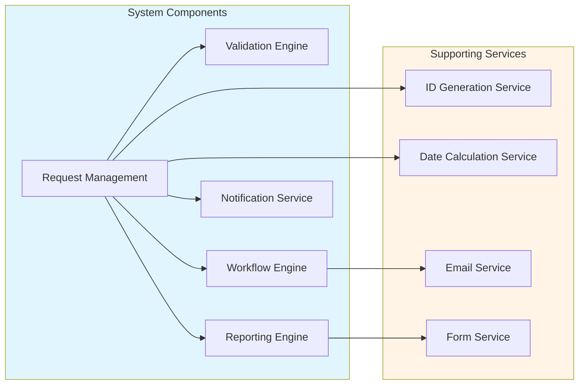

---

## Data Model

### Complete Entity Relationship Diagram

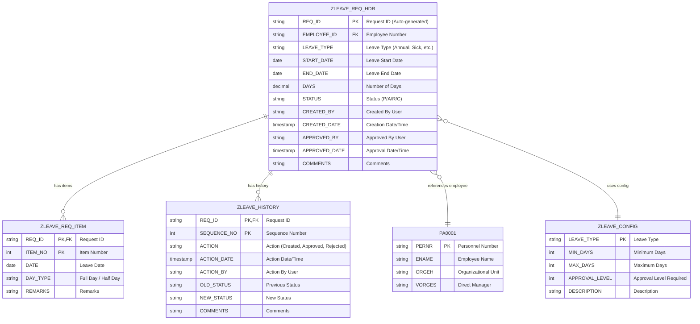

### Table Relationships

| Relationship | Type | Description |
|--------------|------|-------------|
| ZLEAVE_REQ_HDR → ZLEAVE_REQ_ITEM | One-to-Many | One header can have multiple items (for partial days) |
| ZLEAVE_REQ_HDR → ZLEAVE_HISTORY | One-to-Many | One request can have multiple history entries |
| ZLEAVE_REQ_HDR → PA0001 | Many-to-One | Multiple requests belong to one employee |
| ZLEAVE_REQ_HDR → ZLEAVE_CONFIG | Many-to-One | Multiple requests use same leave type config |

---

## Sequence Diagrams

### Leave Request Creation Flow

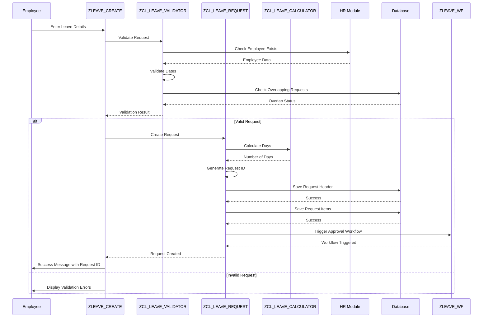

### Approval Workflow Flow

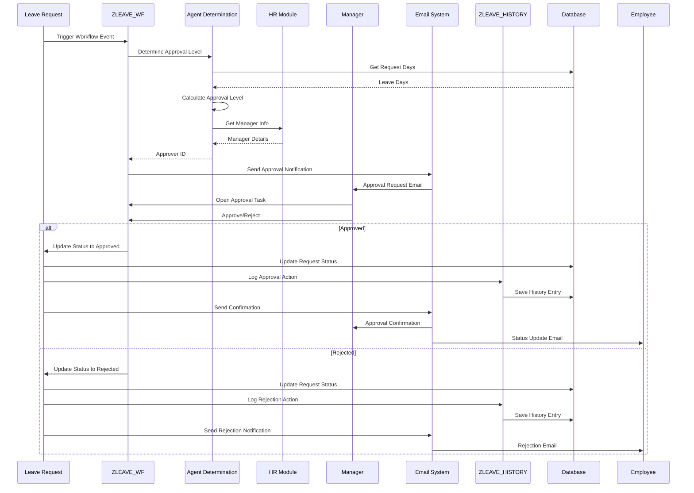

### History Lookup Flow

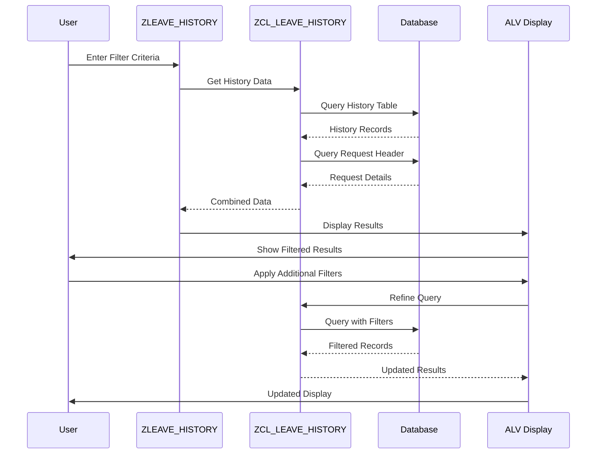

### Reporting Flow

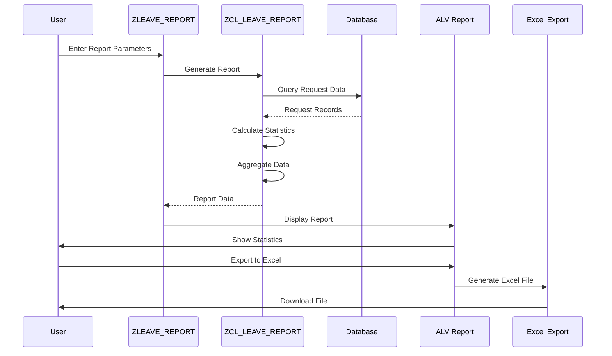

---

## Class Diagrams

### Class Structure

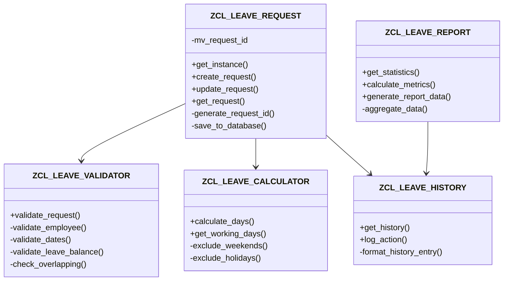

### Class Relationships

| Relationship | Type | Description |
|--------------|------|-------------|
| ZCL_LEAVE_REQUEST → ZCL_LEAVE_VALIDATOR | Uses | Request class uses validator for validation |
| ZCL_LEAVE_REQUEST → ZCL_LEAVE_CALCULATOR | Uses | Request class uses calculator for date calculations |
| ZCL_LEAVE_REQUEST → ZCL_LEAVE_HISTORY | Uses | Request class uses history for logging |
| ZCL_LEAVE_REPORT → ZCL_LEAVE_HISTORY | Uses | Report class uses history for reporting |

---

## Integration Architecture

### Integration Points

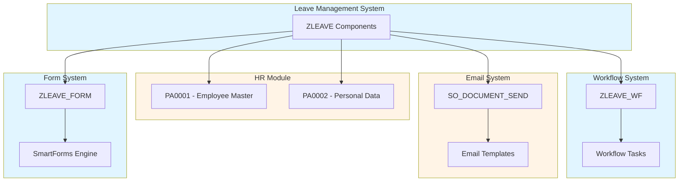

### Integration Details

| Integration Point | Method | Purpose | Data Exchanged |
|-------------------|--------|---------|----------------|
| HR Module | SELECT | Get employee data | Employee ID, Name, Manager |
| Workflow | Event Trigger | Trigger approval | Request ID, Approver |
| Email System | Function Call | Send notifications | Email content, Recipients |
| SmartForms | Form Call | Generate print form | Request data |

---

## Database Specifications

### ZLEAVE_REQ_HDR Table

**Table Name**: ZLEAVE_REQ_HDR  
**Description**: Leave Request Header Table  
**Delivery Class**: A (Application table)  
**Data Browser**: Display/Maintenance Allowed

**Fields**:

| Field Name | Data Element | Data Type | Length | Key | Not Null | Description |
|------------|--------------|-----------|--------|-----|----------|-------------|
| MANDT | MANDT | CLNT | 3 | X | X | Client |
| REQ_ID | ZLEAVE_REQ_ID | CHAR | 10 | X | X | Request ID |
| EMPLOYEE_ID | PERNR_D | NUMC | 8 | | X | Employee Number |
| LEAVE_TYPE | ZLEAVE_TYPE | CHAR | 4 | | X | Leave Type |
| START_DATE | DATUM | DATS | 8 | | X | Start Date |
| END_DATE | DATUM | DATS | 8 | | X | End Date |
| DAYS | ZLEAVE_DAYS | DEC | 5,2 | | X | Number of Days |
| STATUS | ZLEAVE_STATUS | CHAR | 1 | | X | Status |
| CREATED_BY | SYUNAME | CHAR | 12 | | X | Created By |
| CREATED_DATE | TIMESTAMP | TIMESTAMP | 15 | | X | Creation Date |
| APPROVED_BY | SYUNAME | CHAR | 12 | | | Approved By |
| APPROVED_DATE | TIMESTAMP | TIMESTAMP | 15 | | | Approval Date |
| COMMENTS | ZLEAVE_COMMENTS | CHAR | 255 | | | Comments |

**Primary Key**: MANDT, REQ_ID  
**Foreign Keys**: EMPLOYEE_ID → PA0001-PERNR  
**Indexes**: 
- Secondary index on EMPLOYEE_ID
- Secondary index on STATUS
- Secondary index on CREATED_DATE

### ZLEAVE_REQ_ITEM Table

**Table Name**: ZLEAVE_REQ_ITEM  
**Description**: Leave Request Items Table  
**Delivery Class**: A  
**Data Browser**: Display/Maintenance Allowed

**Fields**:

| Field Name | Data Element | Data Type | Length | Key | Not Null | Description |
|------------|--------------|-----------|--------|-----|----------|-------------|
| MANDT | MANDT | CLNT | 3 | X | X | Client |
| REQ_ID | ZLEAVE_REQ_ID | CHAR | 10 | X | X | Request ID |
| ITEM_NO | ZLEAVE_ITEM_NO | NUMC | 4 | X | X | Item Number |
| DATE | DATUM | DATS | 8 | | X | Leave Date |
| DAY_TYPE | ZLEAVE_DAY_TYPE | CHAR | 1 | | X | Full/Half Day |
| REMARKS | ZLEAVE_REMARKS | CHAR | 100 | | | Remarks |

**Primary Key**: MANDT, REQ_ID, ITEM_NO  
**Foreign Keys**: REQ_ID → ZLEAVE_REQ_HDR-REQ_ID

### ZLEAVE_HISTORY Table

**Table Name**: ZLEAVE_HISTORY  
**Description**: Leave Request History/Audit Log  
**Delivery Class**: A  
**Data Browser**: Display Only

**Fields**:

| Field Name | Data Element | Data Type | Length | Key | Not Null | Description |
|------------|--------------|-----------|--------|-----|----------|-------------|
| MANDT | MANDT | CLNT | 3 | X | X | Client |
| REQ_ID | ZLEAVE_REQ_ID | CHAR | 10 | X | X | Request ID |
| SEQUENCE_NO | ZLEAVE_SEQ_NO | NUMC | 6 | X | X | Sequence Number |
| ACTION | ZLEAVE_ACTION | CHAR | 1 | | X | Action |
| ACTION_DATE | TIMESTAMP | TIMESTAMP | 15 | | X | Action Date |
| ACTION_BY | SYUNAME | CHAR | 12 | | X | Action By |
| OLD_STATUS | ZLEAVE_STATUS | CHAR | 1 | | | Old Status |
| NEW_STATUS | ZLEAVE_STATUS | CHAR | 1 | | | New Status |
| COMMENTS | ZLEAVE_COMMENTS | CHAR | 255 | | | Comments |

**Primary Key**: MANDT, REQ_ID, SEQUENCE_NO  
**Foreign Keys**: REQ_ID → ZLEAVE_REQ_HDR-REQ_ID

### ZLEAVE_CONFIG Table

**Table Name**: ZLEAVE_CONFIG  
**Description**: Leave Configuration Table  
**Delivery Class**: C (Customizing table)  
**Data Browser**: Display/Maintenance Allowed

**Fields**:

| Field Name | Data Element | Data Type | Length | Key | Not Null | Description |
|------------|--------------|-----------|--------|-----|----------|-------------|
| MANDT | MANDT | CLNT | 3 | X | X | Client |
| LEAVE_TYPE | ZLEAVE_TYPE | CHAR | 4 | X | X | Leave Type |
| MIN_DAYS | ZLEAVE_MIN_DAYS | INT1 | 3 | | | Minimum Days |
| MAX_DAYS | ZLEAVE_MAX_DAYS | INT1 | 3 | | | Maximum Days |
| APPROVAL_LEVEL | ZLEAVE_APPROVAL_LEVEL | INT1 | 3 | | | Approval Level |
| DESCRIPTION | ZLEAVE_DESC | CHAR | 50 | | | Description |

**Primary Key**: MANDT, LEAVE_TYPE

---

## API/Interface Specifications

### ZCL_LEAVE_REQUEST - Public Methods

#### CREATE_REQUEST

**Method Signature**:
```abap
METHODS create_request
  IMPORTING is_request_data TYPE zst_leave_request
  EXPORTING ev_request_id TYPE zleave_req_id
            et_messages TYPE bapiret2_t.
```

**Parameters**:
- `is_request_data`: Request data structure
- `ev_request_id`: Generated request ID
- `et_messages`: Return messages

**Return Values**:
- Success: Request ID generated, messages with type 'S'
- Error: Empty request ID, messages with type 'E'

#### GET_REQUEST

**Method Signature**:
```abap
METHODS get_request
  IMPORTING iv_request_id TYPE zleave_req_id
  EXPORTING es_request_data TYPE zst_leave_request
            et_messages TYPE bapiret2_t.
```

**Parameters**:
- `iv_request_id`: Request ID to retrieve
- `es_request_data`: Retrieved request data
- `et_messages`: Return messages

---

## Workflow Architecture

### Workflow Template Structure

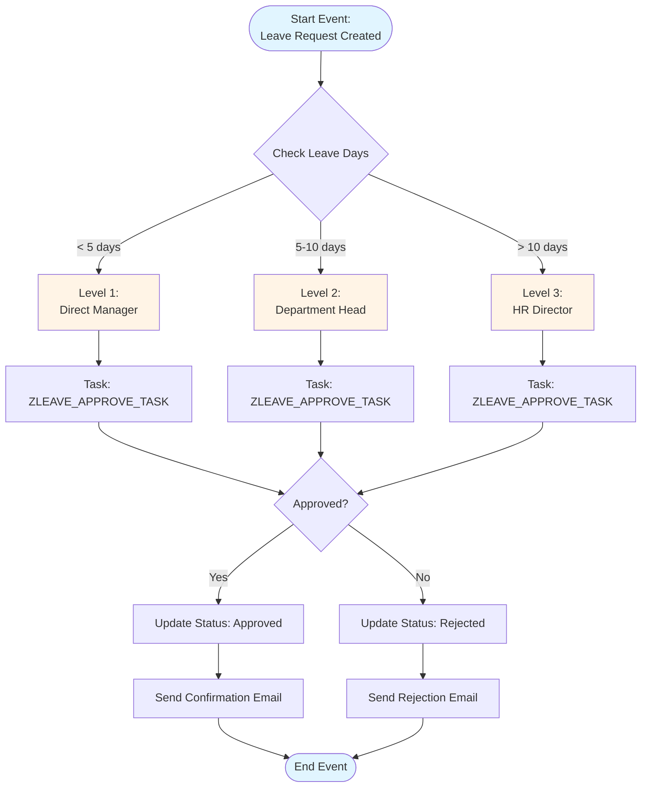

### Workflow Container Elements

| Element Name | Type | Description |
|--------------|------|-------------|
| REQ_ID | ZLEAVE_REQ_ID | Request ID |
| EMPLOYEE_ID | PERNR_D | Employee Number |
| LEAVE_DAYS | ZLEAVE_DAYS | Number of Leave Days |
| APPROVAL_LEVEL | INT1 | Required Approval Level |
| APPROVER_ID | PERNR_D | Approver Employee ID |
| STATUS | ZLEAVE_STATUS | Request Status |

---

## Security Architecture

### Authorization Concept

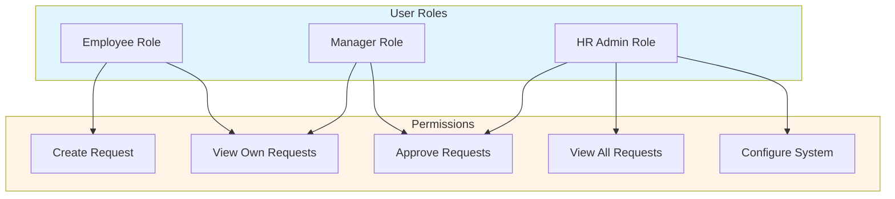

### Authorization Objects

| Authorization Object | Field | Values | Description |
|---------------------|-------|--------|-------------|
| Z_LEAVE_REQ | ACTVT | 01 (Create), 02 (Change), 03 (Display) | Leave Request Authorization |
| Z_LEAVE_REQ | REQ_TYPE | * (All), ANNU, SICK, etc. | Leave Type Restriction |
| Z_LEAVE_APPROVE | ACTVT | 02 (Approve) | Approval Authorization |
| Z_LEAVE_APPROVE | ORG_UNIT | * (All), specific org unit | Organizational Unit Restriction |

---

## References

- **[Project Overview](00_Project_Overview.md)** - Project context
- **[Phase 1: Requirements & Design](Phase1_Requirements_Design.md)** - Design details
- **[Phase 2: Development](Phase2_Development.md)** - Implementation details
- **[Data Dictionary Guide](../../ABAP-Guides/02_SAP_ABAP_DATA_DICTIONARY_GUIDE.md)** - Table design
- **[ABAP Objects Guide](../../ABAP-Guides/08_SAP_ABAP_OBJECTS_GUIDE.md)** - Class design

---

**← [Back to README](SAP-Guides/Capstone/Employee-Leave-System/README.md)**


