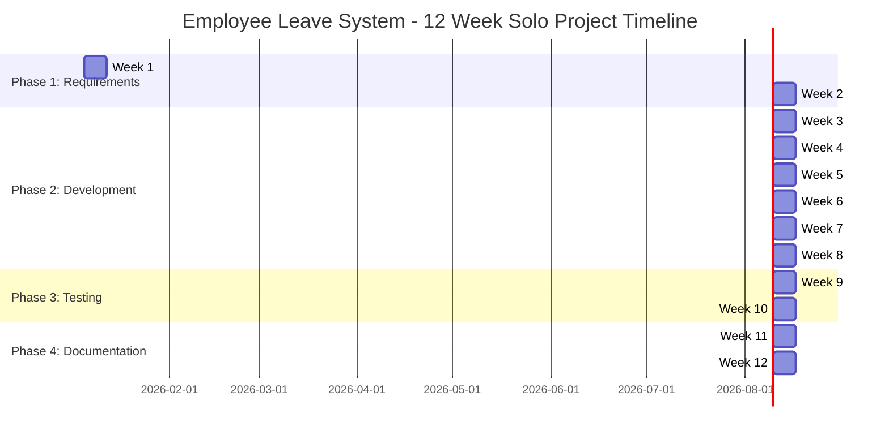
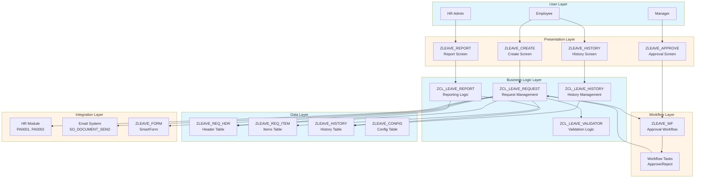
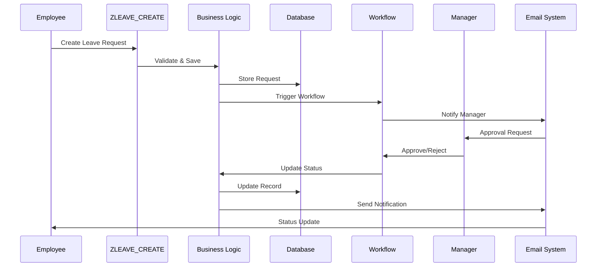

# Project Overview - Employee Leave Request and Approval System (Personal Practice)

**← [Back to README](README.md)**

---

## Table of Contents

1. [Project Information](#project-information)
2. [Solo Developer Workflow](#solo-developer-workflow)
3. [Project Timeline](#project-timeline)
4. [Technology Stack](#technology-stack)
5. [Requirements Mapping](#requirements-mapping)
6. [High-Level Architecture](#high-level-architecture)
7. [Risk Management](#risk-management)
8. [Success Criteria](#success-criteria)

---

## Project Information

**Project Name**: Employee Leave Request and Approval System (ZLEAVE) - Personal Practice  
**Project Code**: ABAP4-Personal  
**Duration**: 12 weeks  
**Project Type**: Solo Personal Practice / Learning Project  
**Target System**: SAP ECC / S/4HANA

### Project Objectives

1. **Automate Leave Management**: Streamline the leave request and approval process
2. **Multi-level Approval**: Implement flexible approval workflow based on leave duration
3. **Comprehensive Reporting**: Provide analytics and reporting capabilities
4. **User Experience**: Create intuitive interfaces for employees and managers
5. **Integration**: Seamlessly integrate with SAP HR module
6. **Learning**: Master SAP ABAP development skills through hands-on practice

### Learning Value

- **Technical Skills**: Master ABAP, Workflow, ALV, SmartForms, Email Integration
- **Project Management**: Practice solo project planning and execution
- **Problem Solving**: Develop debugging and troubleshooting skills
- **Documentation**: Learn to document technical work effectively
- **Portfolio Building**: Create a portfolio-ready project

---

## Solo Developer Workflow

As a solo developer, you'll handle all aspects of the project sequentially. The workflow is organized by functional areas:

### Workflow Areas

#### 1. Data Model & Core Logic (Weeks 3-4, 6)
**Responsibilities**:
- Design and create all database tables (ZLEAVE_*)
- Develop core ABAP classes for business logic
- Integration with HR module (PA0001, PA0002)
- Performance optimization
- Error handling framework

**Key Deliverables**:
- 4 database tables (Header, Items, History, Config)
- 5+ ABAP classes
- Integration code with HR
- Technical documentation

**Time Allocation**: ~30% of development time

#### 2. Workflow & Approval (Week 5)
**Responsibilities**:
- Design and implement SAP Workflow template
- Multi-level approval logic development
- Agent determination rules
- Authorization checks
- Workflow monitoring

**Key Deliverables**:
- Workflow template (ZLEAVE_WF)
- Approval tasks and methods
- Agent determination logic
- Workflow documentation

**Time Allocation**: ~15% of development time

#### 3. UI & Reporting (Weeks 4, 6-7)
**Responsibilities**:
- Screen programming (SE51) for leave request creation
- ALV report development with Excel export
- User interface design and usability
- Filtering and search functionality
- Report layout and formatting

**Key Deliverables**:
- 4 ABAP programs (Create, Approve, History, Report)
- ALV reports with Excel export
- User interface screens
- User manual

**Time Allocation**: ~25% of development time

#### 4. Forms & Integration (Week 8)
**Responsibilities**:
- SmartForm development (SMARTFORMS)
- Email notification system
- Print functionality
- Email template design
- Notification triggers and logic

**Key Deliverables**:
- SmartForm (ZLEAVE_FORM)
- 4+ email templates
- Print functionality
- Email configuration guide

**Time Allocation**: ~15% of development time

#### 5. Testing & Quality (Weeks 9-10)
**Responsibilities**:
- Unit testing (ABAP Unit) for all components
- Integration testing coordination
- Test case development and execution
- Bug tracking and management
- Quality assurance

**Key Deliverables**:
- Test plan and test cases
- Test results documentation
- Bug tracking report
- Quality assurance checklist

**Time Allocation**: ~15% of project time

### Sequential Task Execution

Unlike team projects where tasks run in parallel, solo development requires sequential execution:

1. **Foundation First**: Complete data model before building on top
2. **Core Before UI**: Implement business logic before user interface
3. **Incremental Testing**: Test each component as you build
4. **Documentation Alongside**: Document as you develop, not at the end

---

## Project Timeline

### 12-Week Schedule Overview

### Milestones

| Week | Milestone | Deliverables |
|------|-----------|--------------|
| **Week 2** | Design Complete | Technical design, Data model, Workflow design |
| **Week 4** | Core Functionality | Leave request creation working |
| **Week 5** | Workflow Complete | Approval workflow functional |
| **Week 7** | Reporting Complete | Reports and statistics working |
| **Week 8** | Development Complete | All features implemented |
| **Week 10** | Testing Complete | All tests passed, self-UAT completed |
| **Week 12** | Project Complete | Documentation and portfolio ready |

### Phase Breakdown

1. **Phase 1: Requirements & Design** (Weeks 1-2)
   - Requirements gathering and analysis
   - Technical design and architecture
   - Data model design
   - Workflow design
   - UI/UX design

2. **Phase 2: Development** (Weeks 3-8)
   - Foundation setup
   - Core functionality development
   - Workflow implementation
   - Reporting and forms

3. **Phase 3: Testing & QA** (Weeks 9-10)
   - Unit testing
   - Integration testing
   - Self-testing and validation

4. **Phase 4: Documentation & Presentation** (Weeks 11-12)
   - Technical documentation
   - User documentation
   - Portfolio preparation

---

## Technology Stack

### SAP Components

| Component | Technology | Purpose |
|-----------|-----------|---------|
| **Database** | ABAP Data Dictionary (SE11) | Store leave request data |
| **Programming** | ABAP Objects | Business logic implementation |
| **Workflow** | SAP Workflow (SWDD) | Approval process automation |
| **UI** | Screen Painter (SE51) | User interface screens |
| **Reports** | ALV (CL_SALV_*) | Data display and export |
| **Forms** | SmartForms | Printable leave forms |
| **Email** | SO_DOCUMENT_SEND_API1 | Email notifications |
| **Integration** | HR Module (PA0001, PA0002) | Employee master data |

### Development Tools

- **SAP GUI**: Primary development environment
- **ABAP Development Tools (ADT)**: Modern Eclipse-based IDE (optional)
- **SE11**: Data Dictionary
- **SE24**: Class Builder
- **SE38**: ABAP Editor
- **SE51**: Screen Painter
- **SWDD**: Workflow Builder
- **SMARTFORMS**: Form Builder

### Standards & Guidelines

- **Naming Convention**: Z-prefix for all custom objects (ZLEAVE_*)
- **Code Standards**: Follow SAP coding guidelines
- **Documentation**: Inline comments and technical documentation
- **Testing**: ABAP Unit for unit testing

---

## Requirements Mapping

### Feature 1: Create Leave Request

**Requirement**: Input leave details with auto-generated request ID

**Implementation**:
- Screen program: `ZLEAVE_CREATE`
- Table: `ZLEAVE_REQ_HDR` (header), `ZLEAVE_REQ_ITEM` (items)
- Class: `ZCL_LEAVE_REQUEST` (CREATE_REQUEST method)
- Auto-ID generation logic

**Solo Developer Tasks**: Data Model (Week 3) + UI (Week 4)

---

### Feature 2: Multi-level Approval Workflow

**Requirement**: Manager approval workflow based on leave duration/type

**Implementation**:
- Workflow: `ZLEAVE_WF`
- Approval levels:
  - Level 1: Direct Manager (< 5 days)
  - Level 2: Department Head (5-10 days)
  - Level 3: HR Director (> 10 days)
- Program: `ZLEAVE_APPROVE`

**Solo Developer Tasks**: Workflow (Week 5)

---

### Feature 3: Leave History Lookup

**Requirement**: Filter by date, status, and leave type

**Implementation**:
- Program: `ZLEAVE_HISTORY`
- Table: `ZLEAVE_HISTORY` (audit log)
- ALV display with filtering
- Class: `ZCL_LEAVE_HISTORY`

**Solo Developer Tasks**: Data Model (Week 3) + UI (Week 6)

---

### Feature 4: Statistics & Reporting

**Requirement**: ALV report with Excel export

**Implementation**:
- Program: `ZLEAVE_REPORT`
- ALV Grid with statistics
- Excel export functionality
- Class: `ZCL_LEAVE_REPORT`

**Solo Developer Tasks**: UI & Reporting (Week 7)

---

### Feature 5: Email Notifications & Print Forms

**Requirement**: SmartForm for leave request with email notifications

**Implementation**:
- SmartForm: `ZLEAVE_FORM`
- Email templates (4+ templates)
- Email triggers on status changes
- Print functionality

**Solo Developer Tasks**: Forms & Integration (Week 8)

---

## High-Level Architecture

### System Architecture Diagram

### Data Flow Overview

---

## Risk Management

### Risk Matrix

| Risk | Probability | Impact | Mitigation Strategy |
|------|------------|--------|-------------------|
| **Workflow Complexity** | Medium | High | Start with simple workflow, iterate. Early prototyping. |
| **HR Integration Issues** | Medium | High | Early integration testing. Use standard HR tables. |
| **Performance Issues** | Low | Medium | Regular performance testing. Database optimization. |
| **Scope Creep** | Medium | Medium | Strict change control. Weekly self-reviews. |
| **Time Management** | Medium | High | Use time-boxing. Set daily goals. Track progress. |
| **Technical Challenges** | Medium | Medium | Early technical spikes. Use SAP guides and community. |
| **Testing Time Shortage** | Low | High | Test incrementally during development. |
| **Learning Curve** | Medium | Medium | Allocate buffer time. Focus on learning, not just completion. |

### Mitigation Strategies

1. **Early Prototyping**: Build proof-of-concept for complex components
2. **Self-Reviews**: Weekly self-review checkpoints
3. **Buffer Time**: 20% buffer in each phase for learning and unexpected issues
4. **Documentation**: Document learnings as you go
5. **Incremental Development**: Build and test incrementally
6. **Time Management**: Use time-boxing and daily goals
7. **Seek Help**: Use SAP guides, community forums when stuck

---

## Success Criteria

### Functional Success Criteria

- [ ] All 5 features implemented and working
- [ ] Multi-level approval workflow functional for all scenarios
- [ ] Leave history lookup with all filter options working
- [ ] Reports generate correctly with Excel export
- [ ] Email notifications sent for all status changes
- [ ] SmartForm prints correctly

### Technical Success Criteria

- [ ] All database tables created and activated
- [ ] All ABAP classes follow coding standards
- [ ] All programs tested and working
- [ ] Workflow tested for all approval paths
- [ ] Performance meets requirements (< 2 seconds for reports)
- [ ] No critical bugs in production code

### Learning Success Criteria

- [ ] All learning objectives achieved (see Personal_Learning_Plan.md)
- [ ] Self-assessment checkpoints completed
- [ ] Technical skills demonstrated
- [ ] Portfolio-ready project
- [ ] Documentation complete

### Quality Success Criteria

- [ ] All unit tests passing (target: 80% code coverage)
- [ ] All integration tests passing
- [ ] Self-testing completed with documented results
- [ ] Code review completed (self-review)
- [ ] Documentation complete

### Project Success Criteria

- [ ] Project completed within 12 weeks (or adjusted timeline)
- [ ] All deliverables submitted
- [ ] Portfolio presentation ready
- [ ] Learning objectives achieved
- [ ] Project ready for portfolio showcase

---

## References

- **[Project Requirements](../Abap-4.md)** - Original specification
- **[SAP Capstone Guide](../../SAP_CAPSTONE_PROJECT_GUIDE.md)** - General guidance
- **[Technical Architecture](Technical_Architecture.md)** - Detailed technical specs
- **[Phase 1: Requirements & Design](Phase1_Requirements_Design.md)** - Detailed phase tasks
- **[Personal Learning Plan](Personal_Learning_Plan.md)** - Learning milestones

---

**← [Back to README](README.md)** | **Next: [Phase 1: Requirements & Design](Phase1_Requirements_Design.md)**

