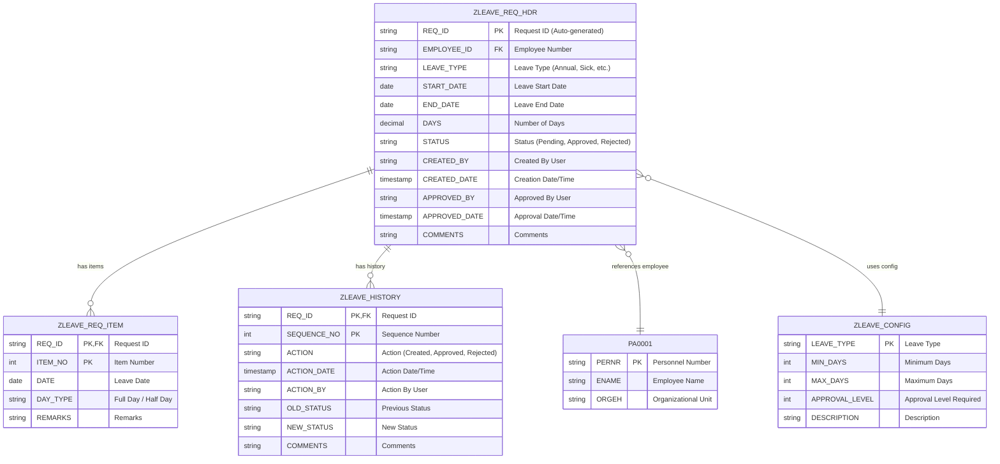
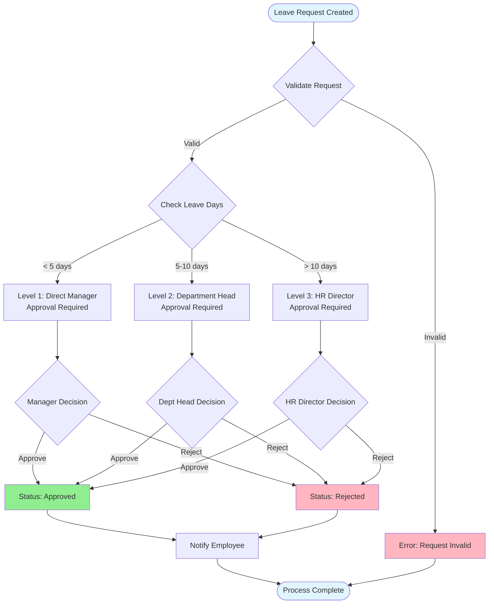
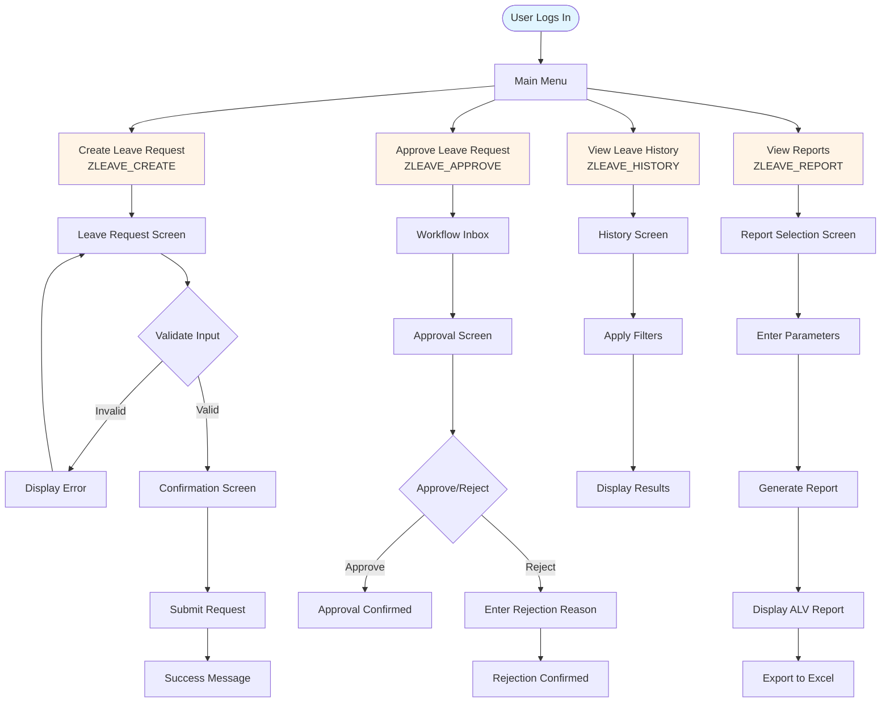

# Phase 1: Requirements & Design (Solo Developer)

**Duration**: Weeks 1-2  
**← [Back to README](README.md)** | **Next: [Phase 2: Development](Phase2_Development.md)**

---

## Table of Contents

1. [Week 1: Requirements Gathering & Analysis](#week-1-requirements-gathering--analysis)
2. [Week 2: Detailed Design & Architecture](#week-2-detailed-design--architecture)
3. [Data Model Design](#data-model-design)
4. [Workflow Design](#workflow-design)
5. [UI/UX Design](#uiux-design)
6. [Technical Specifications](#technical-specifications)
7. [Self-Review Checkpoints](#self-review-checkpoints)
8. [References](#references)

---

## Week 1: Requirements Gathering & Analysis

### Solo Developer Tasks (Sequential Execution)

As a solo developer, you'll handle all aspects sequentially. Estimated time: 35-40 hours for the week.

#### Day 1-2: Business Requirements & Data Model

**Tasks**:

- [ ] **Analyze Business Requirements**
  - Review [project requirements document](../Abap-4.md)
  - Identify all functional requirements
  - Document non-functional requirements
  - Create requirements traceability matrix
  - **Time Estimate**: 4-5 hours

- [ ] **Define Data Model Requirements**
  - Identify all data entities needed
  - Map business requirements to data structures
  - Define relationships between entities
  - Document data retention requirements
  - **Time Estimate**: 3-4 hours

- [ ] **Identify HR Integration Points**
  - Review SAP HR module structure
  - Identify standard tables to use (PA0001, PA0002)
  - Document integration requirements
  - Define data mapping requirements
  - **Time Estimate**: 2-3 hours

**Deliverables**:
- Requirements specification document
- Data model requirements document
- HR integration specification

**References**:
- [ABAP Data Dictionary Guide](../../ABAP-Guides/02_SAP_ABAP_DATA_DICTIONARY_GUIDE.md) - Table design
- [ABAP Basics Guide](../../ABAP-Guides/01_SAP_ABAP_BASICS_GUIDE.md#data-types-and-variables) - Data types

---

#### Day 3: Workflow & Approval Requirements

**Tasks**:

- [ ] **Define Approval Workflow Requirements**
  - Document approval levels needed
  - Define approval rules based on leave duration
  - Document approval routing logic
  - Identify approval agents
  - **Time Estimate**: 3-4 hours

- [ ] **Map Approval Levels**
  - Level 1: Direct Manager (< 5 days)
  - Level 2: Department Head (5-10 days)
  - Level 3: HR Director (> 10 days)
  - Document escalation rules
  - **Time Estimate**: 2 hours

- [ ] **Identify Authorization Requirements**
  - Define authorization objects needed
  - Document role-based access requirements
  - Define approval authority rules
  - Document security requirements
  - **Time Estimate**: 2 hours

- [ ] **Design Workflow Diagram**
  - Create workflow process flow
  - Document workflow tasks
  - Define workflow events
  - Document workflow container elements
  - **Time Estimate**: 2-3 hours

**Deliverables**:
- Workflow requirements document
- Approval rules document
- Workflow design diagram
- Authorization matrix

**References**:
- [SAP Workflow Guide](../../SAP_WORKFLOW_GUIDE.md) - Workflow concepts
- [Capstone Guide](../../SAP_CAPSTONE_PROJECT_GUIDE.md#account-payable-automation) - Similar workflow example

---

#### Day 4: UI/UX & Reporting Requirements

**Tasks**:

- [ ] **Define User Interface Requirements**
  - Document screen requirements
  - Define user interaction flows
  - Document usability requirements
  - Create user personas (Employee, Manager, HR)
  - **Time Estimate**: 3-4 hours

- [ ] **Design Screen Layouts**
  - Leave request creation screen
  - Approval screen
  - History lookup screen
  - Report selection screen
  - **Time Estimate**: 2-3 hours

- [ ] **Define Report Requirements**
  - Document report types needed
  - Define report parameters
  - Document filtering requirements
  - Define export requirements (Excel)
  - **Time Estimate**: 2 hours

- [ ] **Create UI Mockups/Wireframes**
  - Screen layout mockups
  - Field placement and labels
  - Navigation flow
  - Button placement
  - **Time Estimate**: 2-3 hours

- [ ] **Document Filtering Requirements**
  - Date range filtering
  - Status filtering
  - Leave type filtering
  - Employee filtering
  - **Time Estimate**: 1-2 hours

**Deliverables**:
- UI requirements document
- Screen mockups/wireframes
- Report requirements document
- User experience design document

**References**:
- [Screen Programming Guide](../../ABAP-Guides/06_SAP_ABAP_SCREEN_PROGRAMMING_GUIDE.md) - Screen design
- [ALV Programming Guide](../../ABAP-Guides/07_SAP_ABAP_ALV_PROGRAMMING_GUIDE.md) - Report design

---

#### Day 5: Forms, Integration & Testing Requirements

**Tasks**:

- [ ] **Define SmartForm Requirements**
  - Document form layout requirements
  - Define form fields needed
  - Document branding requirements
  - Define print requirements
  - **Time Estimate**: 2 hours

- [ ] **Design Form Layout**
  - Header section design
  - Employee details section
  - Leave details section
  - Approval section
  - Footer section
  - **Time Estimate**: 2 hours

- [ ] **Identify Email Notification Triggers**
  - Request created notification
  - Approval request notification
  - Approval confirmation notification
  - Rejection notification
  - Status change notifications
  - **Time Estimate**: 1-2 hours

- [ ] **Define Notification Templates**
  - Email subject lines
  - Email body templates
  - Email formatting requirements
  - Attachment requirements
  - **Time Estimate**: 2 hours

- [ ] **Create Test Plan**
  - Define testing strategy
  - Document test levels (Unit, Integration, Self-UAT)
  - Define test environment requirements
  - Create test schedule
  - **Time Estimate**: 2-3 hours

- [ ] **Define Test Scenarios**
  - Leave request creation scenarios
  - Approval workflow scenarios
  - History lookup scenarios
  - Reporting scenarios
  - Error handling scenarios
  - **Time Estimate**: 2 hours

**Deliverables**:
- SmartForm requirements document
- Form layout design
- Email notification specification
- Print requirements document
- Test plan document
- Test scenarios document

**References**:
- [SAP Forms Guide](../../SAP_FORMS_GUIDE.md) - SmartForms
- [Unit Testing Guide](../../ABAP-Guides/14_SAP_ABAP_UNIT_TESTING_GUIDE.md) - Testing approach
- [Testing Guide](../../SAP_TESTING_GUIDE.md) - Test planning

---

#### Day 6-7: Consolidation & Technical Specification

**Tasks**:

- [ ] **Create Technical Specification Document**
  - Document system architecture
  - Define technical constraints
  - Document integration points
  - Create data flow diagrams
  - **Time Estimate**: 4-5 hours

- [ ] **Design Database Table Structures**
  - Design ZLEAVE_REQ_HDR table structure
  - Design ZLEAVE_REQ_ITEM table structure
  - Design ZLEAVE_HISTORY table structure
  - Design ZLEAVE_CONFIG table structure
  - **Time Estimate**: 3-4 hours

- [ ] **Consolidate All Requirements**
  - Review all requirements documents
  - Ensure consistency
  - Create requirements package
  - Document any gaps or ambiguities
  - **Time Estimate**: 3-4 hours

- [ ] **Self-Review Week 1 Work**
  - Review all deliverables
  - Check completeness
  - Identify areas needing clarification
  - Prepare for Week 2 detailed design
  - **Time Estimate**: 2 hours

**Deliverables**:
- Technical specification document
- Complete data model design
- Consolidated requirements document
- Requirements review checklist

---

## Week 2: Detailed Design & Architecture

### Solo Developer Tasks (Sequential Execution)

Estimated time: 35-40 hours for the week.

#### Day 1-2: Data Dictionary & Class Design

**Tasks**:

- [ ] **Finalize Data Dictionary Design**

  **ZLEAVE_REQ_HDR (Header Table)**
  - Complete field definitions
  - Define data types and lengths
  - Create domains and search helps
  - Define primary key
  - Define foreign keys
  - **Time Estimate**: 3-4 hours

  **ZLEAVE_REQ_ITEM (Items Table)**
  - Complete field definitions
  - Define relationship to header
  - Create domains
  - Define primary key
  - **Time Estimate**: 2 hours

  **ZLEAVE_HISTORY (Audit Log)**
  - Complete field definitions
  - Define audit trail requirements
  - Create domains
  - Define primary key
  - **Time Estimate**: 2 hours

  **ZLEAVE_CONFIG (Configuration Table)**
  - Complete field definitions
  - Define configuration parameters
  - Create domains
  - Define primary key
  - **Time Estimate**: 1-2 hours

- [ ] **Design ABAP Class Structure**

  **ZCL_LEAVE_REQUEST (Main Class)**
  - Define class structure
  - Define public methods
  - Define private methods
  - Define attributes
  - Document method signatures
  - **Time Estimate**: 3-4 hours

  **ZCL_LEAVE_VALIDATOR (Validation Class)**
  - Define validation methods
  - Define validation rules
  - Document error handling
  - Define return types
  - **Time Estimate**: 2-3 hours

  **ZCL_LEAVE_CALCULATOR (Calculation Class)**
  - Define calculation methods
  - Define date calculation logic
  - Document business rules
  - Define return types
  - **Time Estimate**: 2 hours

- [ ] **Design Integration with HR Tables**
  - Document PA0001 integration
  - Document PA0002 integration
  - Define data mapping
  - Document error handling
  - **Time Estimate**: 2 hours

**Deliverables**:
- Complete data dictionary design
- Class design document
- Integration design document

**References**:
- [Data Dictionary Guide](../../ABAP-Guides/02_SAP_ABAP_DATA_DICTIONARY_GUIDE.md) - Table design
- [ABAP Objects Guide](../../ABAP-Guides/08_SAP_ABAP_OBJECTS_GUIDE.md) - Class design

---

#### Day 3: Workflow Design

**Tasks**:

- [ ] **Design Workflow Template (SWDD)**
  - Define workflow structure
  - Define workflow steps
  - Define workflow tasks
  - Define workflow events
  - **Time Estimate**: 3-4 hours

- [ ] **Define Workflow Tasks**
  - ZLEAVE_APPROVE_TASK
  - ZLEAVE_REJECT_TASK
  - ZLEAVE_ESCALATE_TASK
  - Document task methods
  - **Time Estimate**: 2 hours

- [ ] **Design Approval Agent Determination**
  - Direct manager determination
  - Department head determination
  - HR director determination
  - Fallback rules
  - **Time Estimate**: 2-3 hours

- [ ] **Create Workflow Container Elements**
  - Define container structure
  - Define element types
  - Document data flow
  - Define binding rules
  - **Time Estimate**: 2 hours

- [ ] **Design Workflow Event Triggers**
  - Request created event
  - Approval event
  - Rejection event
  - Timeout event
  - **Time Estimate**: 1-2 hours

**Deliverables**:
- Workflow template design
- Workflow tasks specification
- Agent determination logic
- Workflow configuration document

**References**:
- [SAP Workflow Guide](../../SAP_WORKFLOW_GUIDE.md) - Workflow design

---

#### Day 4: UI/UX Design

**Tasks**:

- [ ] **Design Screen Flow (SE51)**
  - Screen navigation flow
  - Screen sequence
  - Screen transitions
  - Error screen handling
  - **Time Estimate**: 2-3 hours

- [ ] **Design ALV Report Structure**
  - Report layout design
  - Column definitions
  - Sorting and filtering
  - Export functionality
  - **Time Estimate**: 2-3 hours

- [ ] **Define Selection Screen Parameters**
  - Date range parameters
  - Status parameters
  - Leave type parameters
  - Employee parameters
  - **Time Estimate**: 1-2 hours

- [ ] **Design Filter Options**
  - Filter UI design
  - Filter logic
  - Filter combinations
  - Filter persistence
  - **Time Estimate**: 2 hours

- [ ] **Create Report Layout Mockups**
  - Report structure
  - Column layout
  - Grouping options
  - Summary sections
  - **Time Estimate**: 2 hours

- [ ] **Design Excel Export Structure**
  - Export format
  - Column mapping
  - Formatting rules
  - File naming convention
  - **Time Estimate**: 1-2 hours

**Deliverables**:
- Screen flow design
- ALV report design
- Selection screen design
- Excel export specification

**References**:
- [Screen Programming Guide](../../ABAP-Guides/06_SAP_ABAP_SCREEN_PROGRAMMING_GUIDE.md) - Screen design
- [ALV Programming Guide](../../ABAP-Guides/07_SAP_ABAP_ALV_PROGRAMMING_GUIDE.md) - Report design

---

#### Day 5: Forms & Integration Design

**Tasks**:

- [ ] **Design SmartForm Layout (SMARTFORMS)**
  - Form structure design
  - Section layout
  - Field placement
  - Formatting rules
  - **Time Estimate**: 3-4 hours

- [ ] **Define Form Fields and Data Sources**
  - Data source mapping
  - Field definitions
  - Data retrieval logic
  - Field formatting
  - **Time Estimate**: 2 hours

- [ ] **Design Email Templates**
  - Template structure
  - Variable placeholders
  - Formatting rules
  - Attachment handling
  - **Time Estimate**: 2-3 hours

- [ ] **Define Notification Triggers**
  - Trigger events
  - Trigger conditions
  - Trigger logic
  - Error handling
  - **Time Estimate**: 2 hours

- [ ] **Create Form Mockups**
  - Visual layout
  - Field placement
  - Branding elements
  - Print layout
  - **Time Estimate**: 1-2 hours

**Deliverables**:
- SmartForm design
- Email template design
- Notification trigger specification
- Email configuration guide

**References**:
- [SAP Forms Guide](../../SAP_FORMS_GUIDE.md) - SmartForms
- [Integration Guide](../../SAP_INTEGRATION_GUIDE.md) - Email integration

---

#### Day 6-7: Utility Components, Testing & Finalization

**Tasks**:

- [ ] **Design Utility Components**
  - Design utility class structure (ZCL_LEAVE_UTILITIES)
  - Design helper function modules
  - Design error handling framework
  - Document utility component interfaces
  - **Time Estimate**: 2-3 hours

- [ ] **Create Detailed Test Cases**
  - Unit test cases
  - Integration test cases
  - System test cases
  - Self-UAT test cases
  - **Time Estimate**: 3-4 hours

- [ ] **Design Test Data**
  - Test employee data
  - Test leave request data
  - Test approval scenarios
  - Test error scenarios
  - **Time Estimate**: 2 hours

- [ ] **Create Data Flow Diagrams**
  - Request creation flow
  - Approval flow
  - History retrieval flow
  - Reporting flow
  - **Time Estimate**: 2-3 hours

- [ ] **Document API Interfaces**
  - Method signatures
  - Parameter definitions
  - Return types
  - Exception handling
  - **Time Estimate**: 2 hours

- [ ] **Finalize All Design Documents**
  - Review all designs
  - Ensure consistency
  - Create design package
  - Prepare for development phase
  - **Time Estimate**: 3-4 hours

**Deliverables**:
- Utility components design
- Test case document
- Test data specification
- Data flow diagrams
- API documentation

---

## Data Model Design

### Entity Relationship Diagram



### Table Structure Examples

#### ZLEAVE_REQ_HDR Table Structure

| Field Name | Data Element | Data Type | Length | Key | Description |
|------------|--------------|-----------|--------|-----|-------------|
| REQ_ID | ZLEAVE_REQ_ID | CHAR | 10 | X | Request ID (Auto-generated) |
| EMPLOYEE_ID | PERNR_D | NUMC | 8 | | Employee Number |
| LEAVE_TYPE | ZLEAVE_TYPE | CHAR | 4 | | Leave Type |
| START_DATE | DATUM | DATS | 8 | | Start Date |
| END_DATE | DATUM | DATS | 8 | | End Date |
| DAYS | ZLEAVE_DAYS | DEC | 5,2 | | Number of Days |
| STATUS | ZLEAVE_STATUS | CHAR | 1 | | Status |
| CREATED_BY | SYUNAME | CHAR | 12 | | Created By |
| CREATED_DATE | TIMESTAMP | TIMESTAMP | 15 | | Creation Date/Time |
| APPROVED_BY | SYUNAME | CHAR | 12 | | Approved By |
| APPROVED_DATE | TIMESTAMP | TIMESTAMP | 15 | | Approval Date/Time |
| COMMENTS | ZLEAVE_COMMENTS | CHAR | 255 | | Comments |

**Primary Key**: REQ_ID  
**Foreign Keys**: EMPLOYEE_ID → PA0001-PERNR

---

## Workflow Design

### Approval Workflow Diagram



### Approval Level Configuration

| Leave Duration | Approval Level | Approver | Escalation Time |
|----------------|----------------|----------|-----------------|
| < 5 days | Level 1 | Direct Manager | 2 business days |
| 5-10 days | Level 2 | Department Head | 3 business days |
| > 10 days | Level 3 | HR Director | 5 business days |

---

## UI/UX Design

### Screen Flow Diagram



---

## Technical Specifications

### Class Design: ZCL_LEAVE_REQUEST

```abap
CLASS zcl_leave_request DEFINITION
  PUBLIC
  FINAL
  CREATE PRIVATE.

  PUBLIC SECTION.
    " Factory method
    CLASS-METHODS get_instance
      RETURNING VALUE(ro_instance) TYPE REF TO zcl_leave_request.

    " Main methods
    METHODS create_request
      IMPORTING is_request_data TYPE zst_leave_request
      EXPORTING ev_request_id TYPE zleave_req_id
                et_messages TYPE bapiret2_t.

    METHODS update_request
      IMPORTING iv_request_id TYPE zleave_req_id
                is_request_data TYPE zst_leave_request
      EXPORTING et_messages TYPE bapiret2_t.

    METHODS get_request
      IMPORTING iv_request_id TYPE zleave_req_id
      EXPORTING es_request_data TYPE zst_leave_request
                et_messages TYPE bapiret2_t.

  PRIVATE SECTION.
    DATA: mv_request_id TYPE zleave_req_id.

    METHODS generate_request_id
      RETURNING VALUE(rv_request_id) TYPE zleave_req_id.

    METHODS save_to_database
      IMPORTING is_request_data TYPE zst_leave_request
      EXPORTING et_messages TYPE bapiret2_t.

ENDCLASS.
```

---

## Self-Review Checkpoints

### Week 1 Self-Review

**Questions to Answer**:
- [ ] Are all requirements documented?
- [ ] Is the data model complete?
- [ ] Are workflow requirements clear?
- [ ] Are UI requirements defined?
- [ ] Is the test plan created?

**Action Items**: _Document any gaps or questions_

---

### Week 2 Self-Review

**Questions to Answer**:
- [ ] Is the technical design complete?
- [ ] Are all database tables designed?
- [ ] Are all classes designed?
- [ ] Is the workflow design complete?
- [ ] Are screen designs ready?
- [ ] Is the form design complete?

**Action Items**: _Document any areas needing clarification_

---

## Phase 1 Deliverables Summary

### Week 1 Deliverables
- [ ] Requirements specification document
- [ ] Technical design document
- [ ] Data model design
- [ ] Workflow design diagram
- [ ] UI mockups
- [ ] Test plan

### Week 2 Deliverables
- [ ] Complete technical design document
- [ ] Database table specifications
- [ ] Workflow template design
- [ ] Screen designs
- [ ] SmartForm design
- [ ] Test plan document
- [ ] Class design specifications

---

## References

### SAP Guides

- **[SAP Capstone Project Guide](../../SAP_CAPSTONE_PROJECT_GUIDE.md)**
- **[ABAP Basics Guide](../../ABAP-Guides/01_SAP_ABAP_BASICS_GUIDE.md)**
- **[ABAP Data Dictionary Guide](../../ABAP-Guides/02_SAP_ABAP_DATA_DICTIONARY_GUIDE.md)**
- **[ABAP Objects Guide](../../ABAP-Guides/08_SAP_ABAP_OBJECTS_GUIDE.md)**
- **[SAP Workflow Guide](../../SAP_WORKFLOW_GUIDE.md)**
- **[Screen Programming Guide](../../ABAP-Guides/06_SAP_ABAP_SCREEN_PROGRAMMING_GUIDE.md)**
- **[ALV Programming Guide](../../ABAP-Guides/07_SAP_ABAP_ALV_PROGRAMMING_GUIDE.md)**

---

**← [Back to README](README.md)** | **Next: [Phase 2: Development](Phase2_Development.md)**

