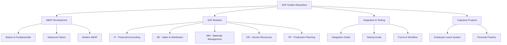
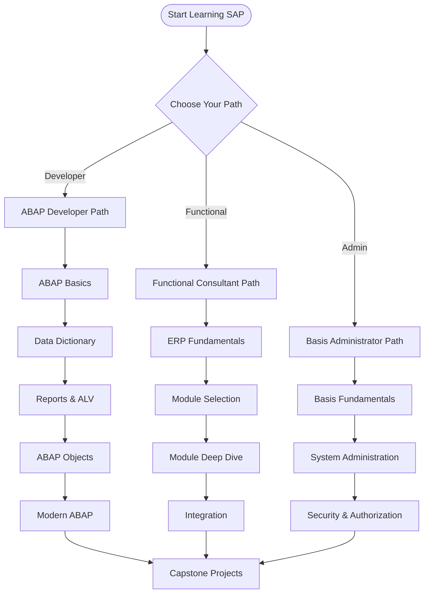

# SAP Guides - Comprehensive Documentation Repository

**Last Updated**: January 2025  
**Version**: 2.0

---

## 📚 Overview

This repository contains comprehensive guides for SAP development, administration, and implementation. All guides are designed with practical examples, diagrams, and the latest best practices.

---

## 🗂️ Repository Structure

### 📖 [ABAP Development Guides](./ABAP-Guides/)
Comprehensive ABAP programming guides from basics to advanced topics.

**Core Guides**:
- [01. ABAP Basics Guide](./ABAP-Guides/01_SAP_ABAP_BASICS_GUIDE.md) ✅
- [02. Data Dictionary Guide](./ABAP-Guides/02_SAP_ABAP_DATA_DICTIONARY_GUIDE.md)
- [03. Internal Tables Guide](./ABAP-Guides/03_SAP_ABAP_INTERNAL_TABLES_GUIDE.md)
- [04. Reports Guide](./ABAP-Guides/04_SAP_ABAP_REPORTS_GUIDE.md)
- [05. Function Modules Guide](./ABAP-Guides/05_SAP_ABAP_FUNCTION_MODULES_GUIDE.md)
- [06. Screen Programming Guide](./ABAP-Guides/06_SAP_ABAP_SCREEN_PROGRAMMING_GUIDE.md)
- [07. ALV Programming Guide](./ABAP-Guides/07_SAP_ABAP_ALV_PROGRAMMING_GUIDE.md)
- [08. ABAP Objects Guide](./ABAP-Guides/08_SAP_ABAP_OBJECTS_GUIDE.md)

**Advanced Topics**:
- [09. Debugging Guide](./ABAP-Guides/09_SAP_ABAP_DEBUGGING_GUIDE.md)
- [10. Performance Guide](./ABAP-Guides/10_SAP_ABAP_PERFORMANCE_GUIDE.md)
- [11. Enhancement Framework Guide](./ABAP-Guides/11_SAP_ABAP_ENHANCEMENT_FRAMEWORK_GUIDE.md)
- [12. Best Practices Guide](./ABAP-Guides/12_SAP_ABAP_BEST_PRACTICES_GUIDE.md)
- [13. Security Guide](./ABAP-Guides/13_SAP_ABAP_SECURITY_GUIDE.md)
- [14. Unit Testing Guide](./ABAP-Guides/14_SAP_ABAP_UNIT_TESTING_GUIDE.md)
- [15. Integration Guide](./ABAP-Guides/15_SAP_ABAP_INTEGRATION_GUIDE.md)

**Modern ABAP**:
- [16. Web Dynpro Guide](./ABAP-Guides/16_SAP_ABAP_WEB_DYNPRO_GUIDE.md)
- [17. OData Services Guide](./ABAP-Guides/17_SAP_ABAP_ODATA_SERVICES_GUIDE.md)
- [18. RESTful Programming Guide](./ABAP-Guides/18_SAP_ABAP_RESTFUL_PROGRAMMING_GUIDE.md)

### 🏢 [SAP Module Guides](./)
Functional module guides for SAP ERP and S/4HANA.

- [FI - Financial Accounting Guide](./SAP_FI_GUIDE.md)
- [SD - Sales & Distribution Guide](./SAP_SD_GUIDE.md)
- [MM - Materials Management Guide](./SAP_MM_GUIDE.md)
- [HR - Human Resources Guide](./SAP_HR_GUIDE.md)
- [PP - Production Planning Guide](./SAP_PP_GUIDE.md)
- [QM - Quality Management Guide](./SAP_QM_GUIDE.md)
- [WM - Warehouse Management Guide](./SAP_WM_GUIDE.md)
- [CO - Controlling Guide](./SAP_CO_GUIDE.md)

### 🔗 [Integration & Specialized Guides](./)
- [Integration Guide](./SAP_INTEGRATION_GUIDE.md)
- [Forms Guide (SmartForms/Adobe Forms)](./SAP_FORMS_GUIDE.md)
- [Workflow Guide](./SAP_WORKFLOW_GUIDE.md)
- [Testing Guide](./SAP_TESTING_GUIDE.md)
- [Reporting & Analytics Guide](./SAP_REPORTING_ANALYTICS_GUIDE.md)
- [Security & Authorization Guide](./SAP_SECURITY_AUTHORIZATION_GUIDE.md)
- [Basis Administration Guide](./SAP_BASIS_ADMINISTRATION_GUIDE.md)
- [S/4HANA Guide](./SAP_S4HANA_GUIDE.md)
- [ERP Fundamentals Guide](./SAP_ERP_FUNDAMENTALS_GUIDE.md)
- [Customization & Enhancement Guide](./SAP_CUSTOMIZATION_ENHANCEMENT_GUIDE.md)

### 🎓 [Capstone Projects](./Capstone/)
Real-world project examples and templates.

- [Capstone Project Guide](./SAP_CAPSTONE_PROJECT_GUIDE.md)
- [Capstone Examples](./SAP_CAPSTONE_EXAMPLES.md)
- [Employee Leave System](./Capstone/Employee-Leave-System/)
- [Personal Practice Project](./Capstone/Personal-Practice-Leave-System/)

---

## 🚀 Quick Start

### For ABAP Developers

1. **Beginner**: Start with [ABAP Basics Guide](./ABAP-Guides/01_SAP_ABAP_BASICS_GUIDE.md)
2. **Intermediate**: Move to [Data Dictionary](./ABAP-Guides/02_SAP_ABAP_DATA_DICTIONARY_GUIDE.md) and [Reports](./ABAP-Guides/04_SAP_ABAP_REPORTS_GUIDE.md)
3. **Advanced**: Explore [ABAP Objects](./ABAP-Guides/08_SAP_ABAP_OBJECTS_GUIDE.md) and [Performance](./ABAP-Guides/10_SAP_ABAP_PERFORMANCE_GUIDE.md)

### For Functional Consultants

1. Start with [ERP Fundamentals Guide](./SAP_ERP_FUNDAMENTALS_GUIDE.md)
2. Choose your module (FI, SD, MM, etc.)
3. Review [Integration Guide](./SAP_INTEGRATION_GUIDE.md) for cross-module understanding

### For Project Teams

1. Review [Capstone Project Guide](./SAP_CAPSTONE_PROJECT_GUIDE.md)
2. Explore [Capstone Examples](./SAP_CAPSTONE_EXAMPLES.md)
3. Use [Employee Leave System](./Capstone/Employee-Leave-System/) as a reference

---

## 📊 Learning Path

---

## 🔥 Latest Updates (2024-2025)

### SAP S/4HANA 2024
- **ABAP Cloud**: New development model for cloud-first applications
- **RAP (Restful ABAP Programming)**: Enhanced framework for OData services
- **ABAP Environment**: Cloud-native development platform
- **Core Data Services (CDS)**: Advanced data modeling capabilities

### Modern ABAP Features
- **ABAP SQL**: Enhanced SQL capabilities
- **Constructor Expressions**: NEW, VALUE, CONV operators
- **Internal Table Expressions**: Modern syntax for table operations
- **String Templates**: Enhanced string manipulation

### Development Tools
- **Eclipse ADT**: Primary IDE for ABAP development
- **ABAP Development Tools**: Enhanced debugging and testing
- **Git Integration**: Version control for ABAP code

---

## 📈 Guide Status

| Category | Total Guides | Completed | Status |
|----------|--------------|-----------|--------|
| ABAP Development | 18 | 18 | ✅ 100% Complete |
| SAP Modules | 9 | 9 | ✅ 100% Complete |
| Integration & Testing | 8 | 8 | ✅ 100% Complete |
| Capstone Projects | 3 | 3 | ✅ 100% Complete |
| Specialized Guides | 2 | 2 | ✅ 100% Complete |
| **Total** | **40** | **40** | ✅ **100% Complete** |

---

## 🎯 Key Features

- ✅ **Comprehensive Coverage**: From basics to advanced topics
- ✅ **Practical Examples**: Real-world code samples
- ✅ **Visual Diagrams**: Mermaid diagrams for better understanding
- ✅ **Latest Updates**: 2024-2025 SAP features included
- ✅ **Best Practices**: Industry-standard approaches
- ✅ **Project Templates**: Ready-to-use project structures

---

## 📝 Contributing

This repository is continuously updated with:
- Latest SAP features and updates
- Best practices from industry experts
- Practical examples and use cases
- Visual diagrams and flowcharts

---

## 🔗 External Resources

- [SAP Community](https://community.sap.com/)
- [SAP Help Portal](https://help.sap.com/)
- [SAP Learning Hub](https://www.sap.com/training-certification/learning-hub.html)
- [ABAP Keyword Documentation](https://help.sap.com/doc/abapdocu_latest_index_htm/latest/en-US/index.htm)

---

## 📧 Support

For questions or suggestions:
- Review the specific guide for detailed information
- Check [Capstone Examples](./SAP_CAPSTONE_EXAMPLES.md) for project templates
- Refer to [Best Practices Guide](./ABAP-Guides/12_SAP_ABAP_BEST_PRACTICES_GUIDE.md)

---

**Happy Learning! 🚀**

