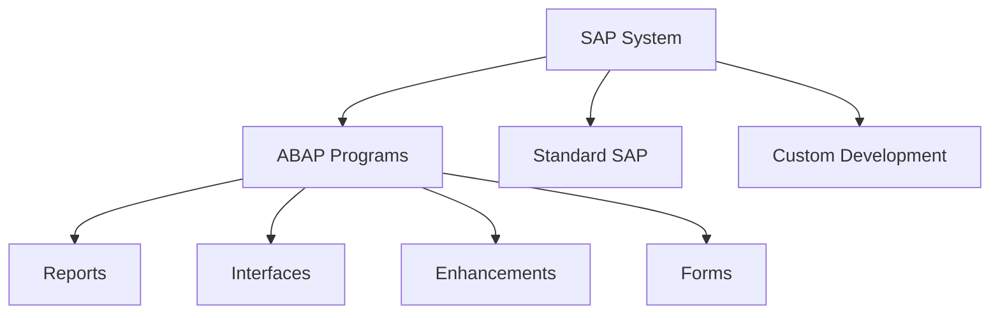
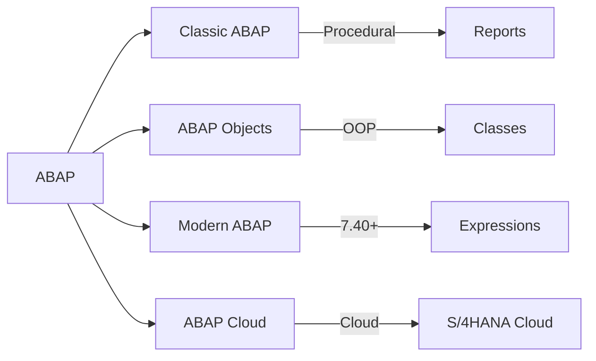
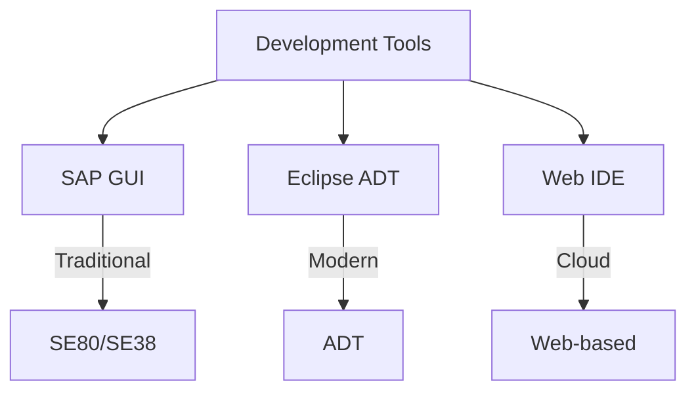
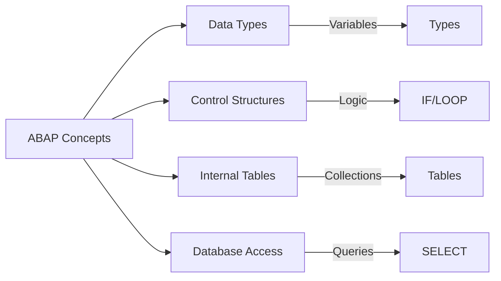
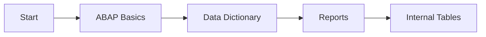
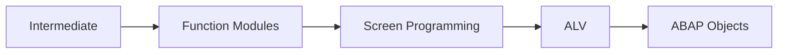
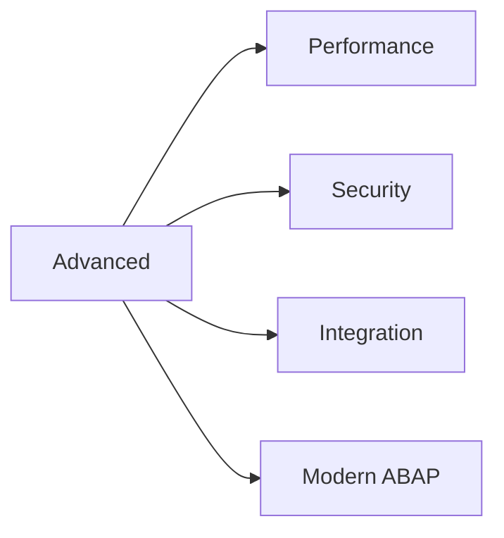

# SAP ABAP Programming Guide

**Comprehensive overview of ABAP programming**

---

## 📚 Table of Contents

1. [Introduction](#introduction)
2. [ABAP Overview](#abap-overview)
3. [ABAP Development Environment](#abap-development-environment)
4. [ABAP Language Fundamentals](#abap-language-fundamentals)
5. [Development Tools](#development-tools)
6. [Learning Path](#learning-path)
7. [Resources](#resources)

---

## Introduction

**ABAP (Advanced Business Application Programming)** is SAP's proprietary programming language for developing business applications.

### ABAP in SAP Ecosystem



### Why ABAP?

- ✅ **Native SAP Language**: Built for SAP
- ✅ **Rich Functionality**: Extensive SAP integration
- ✅ **Business Logic**: Perfect for business applications
- ✅ **SAP Ecosystem**: Seamless SAP integration

---

## ABAP Overview

### ABAP Evolution



### ABAP Versions

| Version | Features | Year |
|---------|----------|------|
| **ABAP 7.0** | Classic ABAP | 1990s |
| **ABAP 7.4** | Modern syntax | 2013 |
| **ABAP 7.5** | Enhanced features | 2016 |
| **ABAP Cloud** | Cloud-first | 2020+ |

---

## ABAP Development Environment

### Development Tools



### Key Transactions

| Transaction | Purpose |
|-------------|---------|
| **SE38** | ABAP Editor |
| **SE80** | Object Navigator |
| **SE11** | Data Dictionary |
| **SE24** | Class Builder |
| **SE37** | Function Builder |

---

## ABAP Language Fundamentals

### Core Concepts



### ABAP Syntax

```abap
" Basic ABAP program
REPORT z_hello_world.

DATA: lv_message TYPE string.

lv_message = 'Hello, World!'.

WRITE: / lv_message.
```

---

## Development Tools

### Eclipse ADT

**ABAP Development Tools (ADT)** is the modern IDE for ABAP development.

**Features**:
- Code completion
- Syntax highlighting
- Debugging
- Git integration
- Code analysis

### SAP GUI

**Traditional development environment** for ABAP.

**Features**:
- Transaction-based
- Integrated with SAP system
- Classic development approach

---

## Learning Path

### Beginner Path



### Intermediate Path



### Advanced Path



---

## Resources

### ABAP Guides

- [01. ABAP Basics Guide](./ABAP-Guides/01_SAP_ABAP_BASICS_GUIDE.md)
- [02. Data Dictionary Guide](./ABAP-Guides/02_SAP_ABAP_DATA_DICTIONARY_GUIDE.md)
- [03. Internal Tables Guide](./ABAP-Guides/03_SAP_ABAP_INTERNAL_TABLES_GUIDE.md)
- [04. Reports Guide](./ABAP-Guides/04_SAP_ABAP_REPORTS_GUIDE.md)
- [05. Function Modules Guide](./ABAP-Guides/05_SAP_ABAP_FUNCTION_MODULES_GUIDE.md)
- [06. Screen Programming Guide](./ABAP-Guides/06_SAP_ABAP_SCREEN_PROGRAMMING_GUIDE.md)
- [07. ALV Programming Guide](./ABAP-Guides/07_SAP_ABAP_ALV_PROGRAMMING_GUIDE.md)
- [08. ABAP Objects Guide](./ABAP-Guides/08_SAP_ABAP_OBJECTS_GUIDE.md)
- [09. Debugging Guide](./ABAP-Guides/09_SAP_ABAP_DEBUGGING_GUIDE.md)
- [10. Performance Guide](./ABAP-Guides/10_SAP_ABAP_PERFORMANCE_GUIDE.md)
- [11. Enhancement Framework Guide](./ABAP-Guides/11_SAP_ABAP_ENHANCEMENT_FRAMEWORK_GUIDE.md)
- [12. Best Practices Guide](./ABAP-Guides/12_SAP_ABAP_BEST_PRACTICES_GUIDE.md)
- [13. Security Guide](./ABAP-Guides/13_SAP_ABAP_SECURITY_GUIDE.md)
- [14. Unit Testing Guide](./ABAP-Guides/14_SAP_ABAP_UNIT_TESTING_GUIDE.md)
- [15. Integration Guide](./ABAP-Guides/15_SAP_ABAP_INTEGRATION_GUIDE.md)
- [16. Web Dynpro Guide](./ABAP-Guides/16_SAP_ABAP_WEB_DYNPRO_GUIDE.md)
- [17. OData Services Guide](./ABAP-Guides/17_SAP_ABAP_ODATA_SERVICES_GUIDE.md)
- [18. RESTful Programming Guide](./ABAP-Guides/18_SAP_ABAP_RESTFUL_PROGRAMMING_GUIDE.md)

### External Resources

- [SAP Community](https://community.sap.com/)
- [ABAP Keyword Documentation](https://help.sap.com/doc/abapdocu_latest_index_htm/latest/en-US/index.htm)
- [SAP Learning Hub](https://www.sap.com/training-certification/learning-hub.html)

---

## Quick Start

### Your First ABAP Program

1. **Open SE38** (ABAP Editor)
2. **Enter program name**: `ZHELLO_WORLD`
3. **Click Create**
4. **Enter code**:
```abap
REPORT zhello_world.

WRITE: / 'Hello, World!'.
```
5. **Save and Activate**
6. **Execute (F8)**

---

## Next Steps

1. **Learn Basics**: Start with [ABAP Basics Guide](./ABAP-Guides/01_SAP_ABAP_BASICS_GUIDE.md)
2. **Practice**: Create simple programs
3. **Explore**: Try different ABAP features
4. **Build Projects**: Work on real-world scenarios

---

**Start your ABAP journey with [ABAP Basics Guide](./ABAP-Guides/01_SAP_ABAP_BASICS_GUIDE.md)!**

