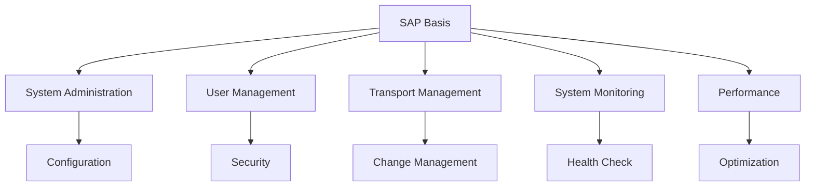
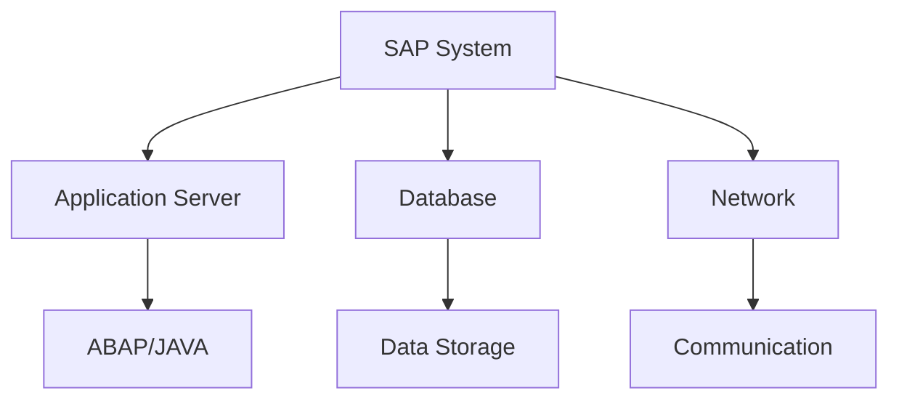
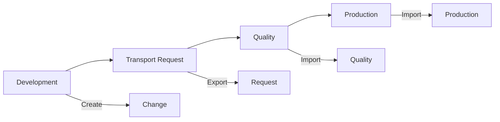
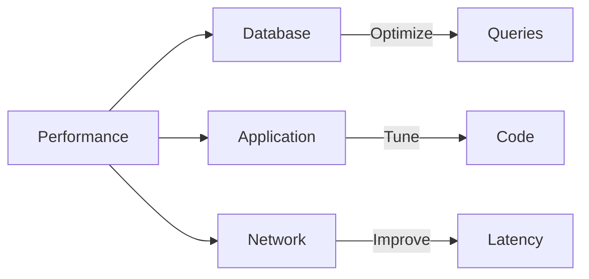

# SAP Basis Administration Guide

**Complete guide to SAP Basis administration**

---

## 📚 Table of Contents

1. [Introduction](#introduction)
2. [Basis Overview](#basis-overview)
3. [System Administration](#system-administration)
4. [User Administration](#user-administration)
5. [Transport Management](#transport-management)
6. [System Monitoring](#system-monitoring)
7. [Performance Tuning](#performance-tuning)
8. [Backup and Recovery](#backup-and-recovery)
9. [Best Practices](#best-practices)

---

## Introduction

**SAP Basis** is the technical foundation of SAP systems, handling system administration, configuration, and maintenance.

### Basis Components

### Basis Responsibilities

- ✅ **System Administration**: System configuration
- ✅ **User Management**: User and authorization
- ✅ **Transport Management**: Change management
- ✅ **Monitoring**: System health monitoring
- ✅ **Performance**: Performance optimization

---

## Basis Overview

### Basis Architecture

### Key Components

- **Application Server**: ABAP/JAVA stack
- **Database**: Data storage
- **Network**: Communication layer
- **Security**: Authentication/authorization

---

## System Administration

### System Configuration

**Key Areas**:
- System parameters
- Profile parameters
- RFC destinations
- Background jobs

### Common Transactions

| Transaction | Purpose |
|-------------|---------|
| **RZ10** | Maintain Profile Parameters |
| **SM59** | RFC Destinations |
| **SM21** | System Log |
| **ST02** | Buffer Statistics |

---

## User Administration

### User Management

**Tasks**:
- Create users
- Assign roles
- Maintain profiles
- Lock/unlock users

**Transaction**: SU01

### Authorization Management

**Tasks**:
- Create roles
- Assign authorizations
- Maintain profiles

**Transaction**: PFCG

---

## Transport Management

### Transport System

**Purpose**: Manage system changes

**Components**:
- Transport requests
- Transport routes
- Transport organizer

**Transaction**: SE01

### Transport Process

---

## System Monitoring

### Monitoring Tools

| Tool | Purpose | Transaction |
|------|---------|-------------|
| **CCMS** | Central monitoring | RZ20 |
| **Workload Monitor** | Performance | ST03N |
| **Database Monitor** | Database | ST04 |
| **System Log** | System errors | SM21 |

### Monitoring Dashboard

**Transaction**: RZ20

**Monitors**:
- System availability
- Performance metrics
- Error logs
- Resource usage

---

## Performance Tuning

### Performance Areas

### Performance Optimization

1. **Database**: Optimize queries, indexes
2. **Application**: Code optimization
3. **Memory**: Buffer tuning
4. **Network**: Reduce latency

---

## Backup and Recovery

### Backup Strategy

**Types**:
- Database backup
- File system backup
- Configuration backup

### Recovery Procedures

**Scenarios**:
- Complete recovery
- Point-in-time recovery
- Selective recovery

---

## Best Practices

### Basis Best Practices

1. **Documentation**: Document all changes
2. **Monitoring**: Regular system monitoring
3. **Backup**: Regular backups
4. **Security**: Strong security measures
5. **Performance**: Continuous optimization

---

## Common Transactions

| Transaction | Purpose |
|-------------|---------|
| **SM21** | System Log |
| **ST02** | Buffer Statistics |
| **ST04** | Database Monitor |
| **SM59** | RFC Destinations |
| **SU01** | User Maintenance |
| **SE01** | Transport Organizer |

---

## References

- [Security Guide](./SAP_SECURITY_AUTHORIZATION_GUIDE.md)
- [Integration Guide](./SAP_INTEGRATION_GUIDE.md)
- [Performance Guide](./ABAP-Guides/10_SAP_ABAP_PERFORMANCE_GUIDE.md)

---

**Related Guides**:
- [ERP Fundamentals Guide](./SAP_ERP_FUNDAMENTALS_GUIDE.md)

