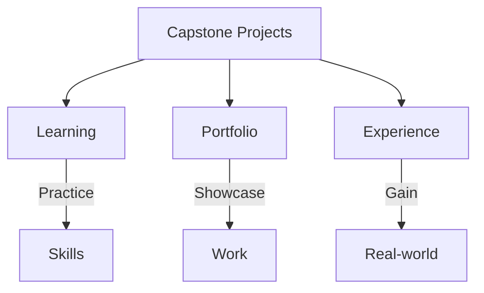
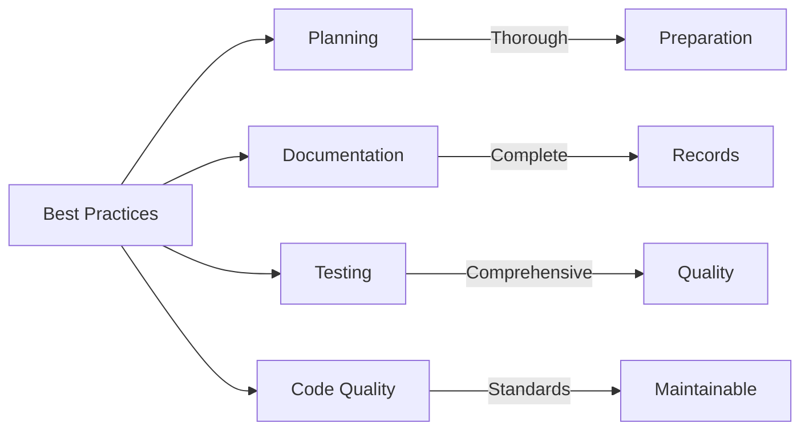

# SAP Capstone Project Examples

**Collection of SAP capstone project examples and templates**

---

## 📚 Table of Contents

1. [Introduction](#introduction)
2. [Project Examples](#project-examples)
3. [Project Templates](#project-templates)
4. [Best Practices](#best-practices)
5. [Resources](#resources)

---

## Introduction

**SAP Capstone Projects** are comprehensive projects that demonstrate real-world SAP development skills and business process understanding.

### Capstone Project Benefits



### Project Types

- **Employee Management Systems**
- **Leave Management Systems**
- **Inventory Management**
- **Order Processing Systems**
- **Reporting Systems**

---

## Project Examples

### Example 1: Employee Leave System

**Project**: Employee Leave Request and Approval System

**Features**:
- Leave request creation
- Approval workflow
- Leave balance tracking
- Reporting and analytics

**Technology Stack**:
- ABAP
- Data Dictionary
- ALV Reports
- SmartForms
- SAP Workflow

**Location**: [Employee Leave System](../Capstone/Employee-Leave-System/)

### Example 2: Personal Practice Project

**Project**: Solo 12-week ABAP development journey

**Features**:
- Complete leave management system
- Step-by-step learning approach
- Comprehensive documentation

**Location**: [Personal Practice Leave System](../Capstone/Personal-Practice-Leave-System/)

---

## Project Templates

### Project Structure Template

```
Project-Name/
├── README.md
├── 00_Project_Overview.md
├── Technical_Architecture.md
├── Phase1_Requirements_Design.md
├── Phase2_Development.md
├── Phase3_Testing_QA.md
├── Phase4_Documentation_Presentation.md
├── References_Resources.md
└── Sprints/
    ├── README.md
    ├── Sprint01_*.md
    └── ...
```

### Documentation Template

**Project Overview**:
- Business requirements
- Technical requirements
- Team structure
- Timeline
- Success criteria

**Technical Architecture**:
- System architecture
- Data model
- Class structure
- Integration points

---

## Best Practices

### Project Best Practices



1. **Clear Requirements**: Well-defined requirements
2. **Architecture First**: Design before coding
3. **Incremental Development**: Build iteratively
4. **Testing**: Test throughout development
5. **Documentation**: Document as you go

---

## Project Ideas

### Beginner Projects

- Simple report with selection screen
- Material master data maintenance
- Customer master report
- Basic workflow

### Intermediate Projects

- Leave management system
- Purchase requisition system
- Employee directory
- Inventory tracking

### Advanced Projects

- Complete order-to-cash system
- Integrated HR-FI system
- Advanced analytics dashboard
- Multi-module integration

---

## Resources

### Learning Resources

- [ABAP Guides](../ABAP-Guides/)
- [Integration Guide](../SAP_INTEGRATION_GUIDE.md)
- [Testing Guide](../SAP_TESTING_GUIDE.md)
- [Best Practices Guide](../ABAP-Guides/12_SAP_ABAP_BEST_PRACTICES_GUIDE.md)

### Project Resources

- [Capstone Project Guide](../SAP_CAPSTONE_PROJECT_GUIDE.md)
- [Employee Leave System](../Capstone/Employee-Leave-System/)
- [Personal Practice Project](../Capstone/Personal-Practice-Leave-System/)

---

## Common Transactions

| Transaction | Purpose |
|-------------|---------|
| **SE11** | Data Dictionary |
| **SE38** | ABAP Editor |
| **SE80** | Object Navigator |
| **SE24** | Class Builder |
| **SE37** | Function Builder |

---

## References

- [Capstone Project Guide](../SAP_CAPSTONE_PROJECT_GUIDE.md)
- [ABAP Guides](../ABAP-Guides/)
- [SAP Community](https://community.sap.com/)

---

**Explore the example projects to get started with your own capstone project!**

