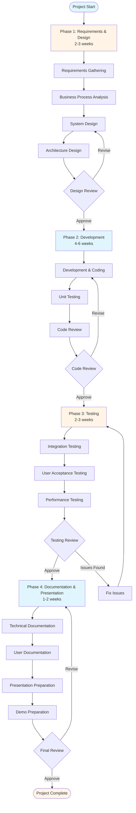
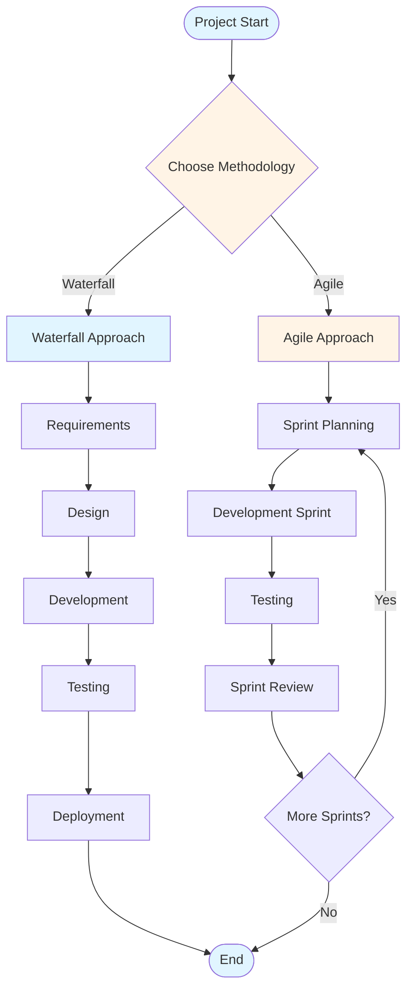
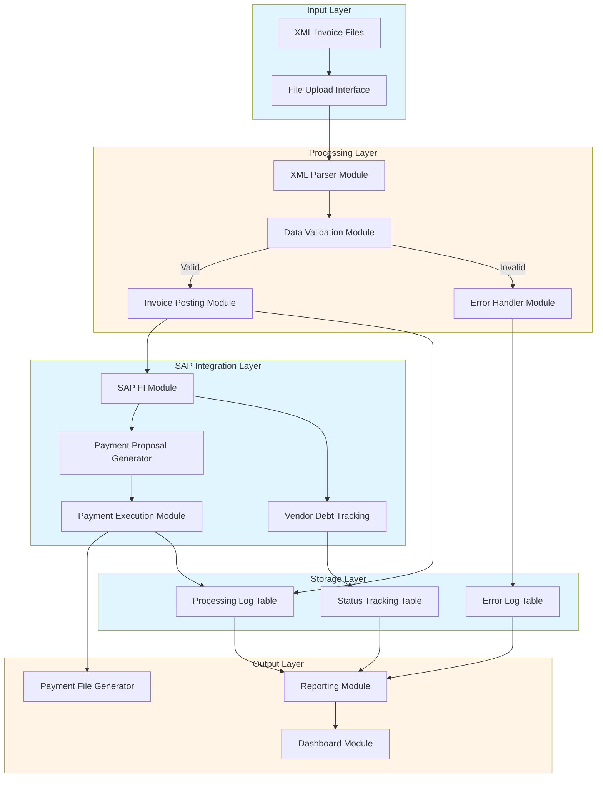
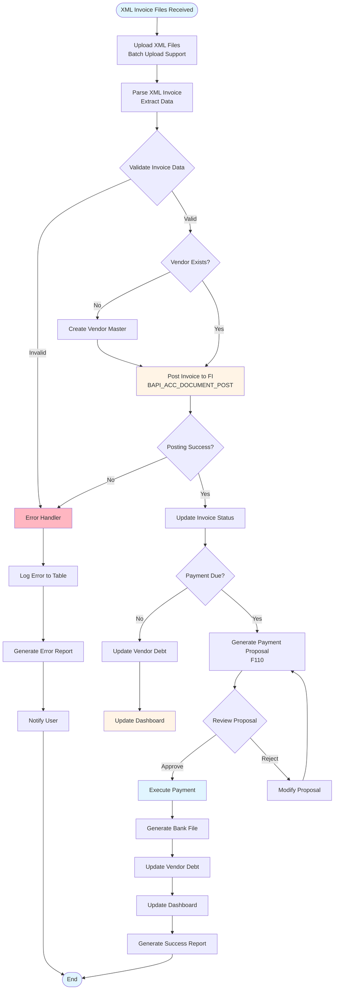
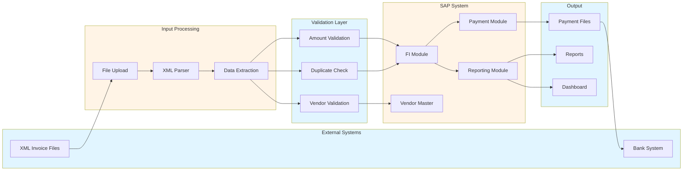
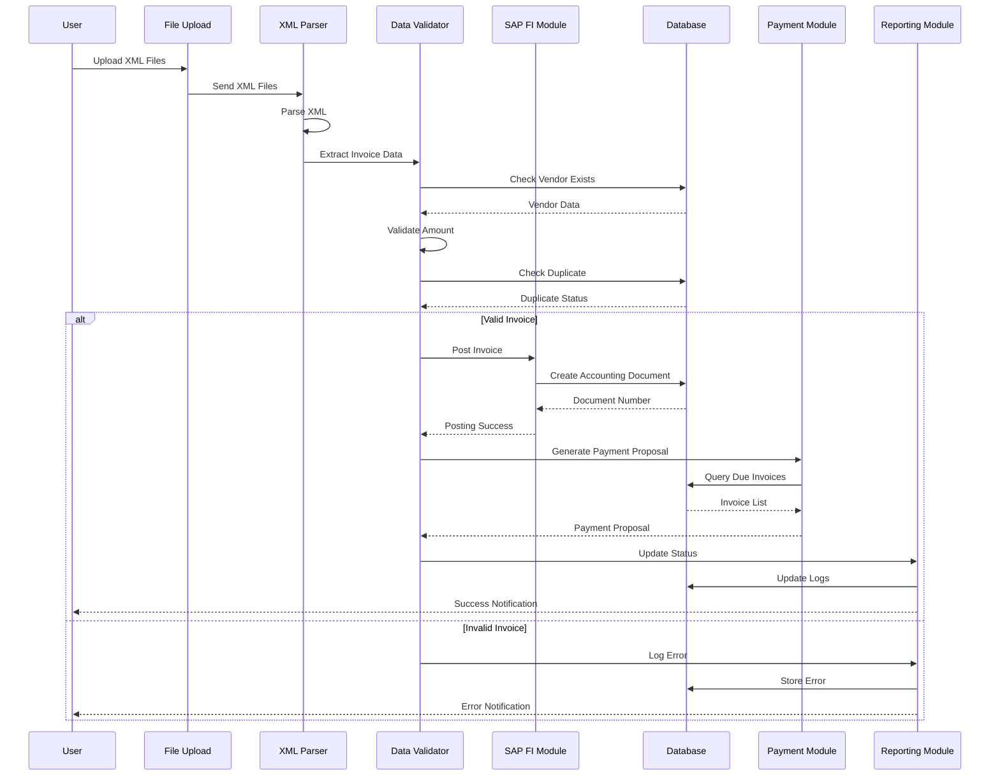
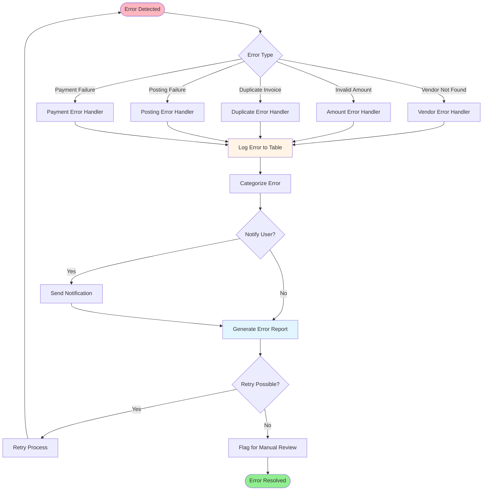
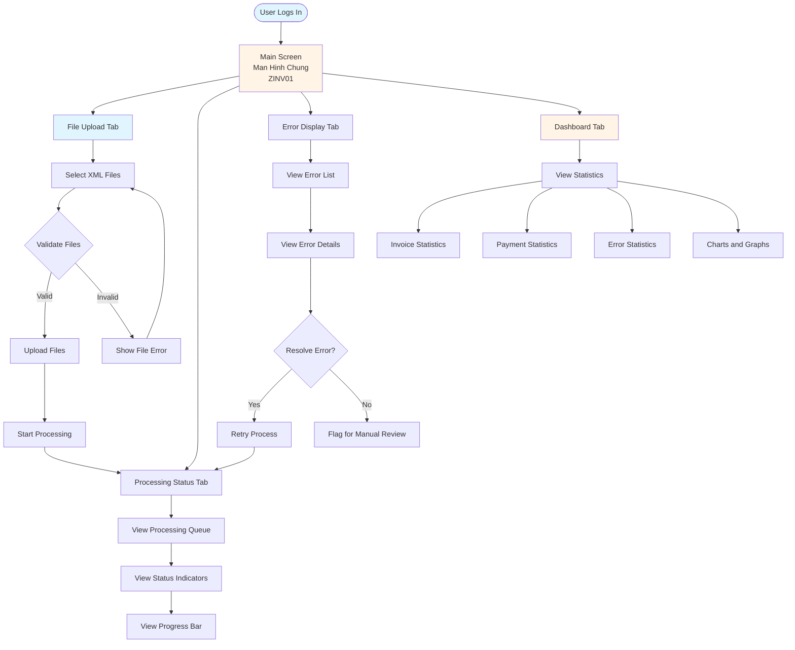

# SAP Capstone Project Guide - Comprehensive

## Table of Contents
1. [Introduction](#introduction)
2. [Capstone Project Overview](#capstone-project-overview)
3. [Project Selection Criteria](#project-selection-criteria)
4. [Requirements Gathering](#requirements-gathering)
5. [Project Planning](#project-planning)
6. [Development Methodology](#development-methodology)
7. [Testing Approach](#testing-approach)
8. [Documentation Standards](#documentation-standards)
9. [Presentation Guidelines](#presentation-guidelines)
10. [Example Projects](#example-projects)
11. [Account Payable Automation - Detailed Example](#account-payable-automation---detailed-example)
12. [Best Practices](#best-practices)
13. [Common Pitfalls](#common-pitfalls)
14. [Evaluation Criteria](#evaluation-criteria)
15. [Templates & Checklists](#templates--checklists)
16. [Resources](#resources)
17. [Summary](#summary)

---

## Introduction

This guide provides comprehensive guidance for SAP capstone projects, including project selection, planning, development, testing, documentation, and presentation.

### Who This Guide Is For
- Students preparing capstone projects
- SAP developers starting projects
- Project managers overseeing SAP projects
- Anyone planning SAP implementations

### Key Learning Objectives
- Select appropriate capstone projects
- Plan and execute SAP projects
- Develop and test SAP solutions
- Document and present projects effectively

---

## Capstone Project Overview

### Definition

**Capstone Project**: A comprehensive project that demonstrates mastery of SAP concepts, development skills, and business process understanding.

### Objectives

1. **Demonstrate Skills**: Show SAP knowledge and skills
2. **Solve Problems**: Address real business problems
3. **Apply Learning**: Apply learned concepts
4. **Build Portfolio**: Create portfolio piece

### Project Characteristics

- **Comprehensive**: Covers multiple SAP areas
- **Real-World**: Addresses real business needs
- **Documented**: Well-documented
- **Presented**: Professional presentation

---

## Project Selection Criteria

### Criteria for Selection

#### 1. Business Value
- **Relevance**: Addresses real business need
- **Impact**: Significant business impact
- **Feasibility**: Achievable within timeframe

#### 2. Technical Complexity
- **Appropriate**: Matches skill level
- **Challenging**: Demonstrates capabilities
- **Comprehensive**: Covers multiple areas

#### 3. Scope
- **Manageable**: Can be completed in time
- **Focused**: Clear boundaries
- **Complete**: Delivers complete solution

#### 4. Learning Value
- **Educational**: Enhances learning
- **Portfolio**: Builds portfolio
- **Career**: Relevant to career goals

### Project Types

1. **Automation Projects**: Automate business processes
2. **Integration Projects**: Integrate systems
3. **Reporting Projects**: Develop reports and analytics
4. **Enhancement Projects**: Enhance existing processes
5. **Custom Development**: Build custom applications

---

## Requirements Gathering

### Process

#### 1. Stakeholder Interviews
- **Identify Stakeholders**: Key users and managers
- **Conduct Interviews**: Understand needs
- **Document Requirements**: Document findings

#### 2. Business Process Analysis
- **Current State**: Understand current process
- **Pain Points**: Identify issues
- **Future State**: Define desired state

#### 3. Requirements Documentation

**Functional Requirements**:
- What the system should do
- Business processes
- User interactions

**Non-Functional Requirements**:
- Performance
- Security
- Usability
- Scalability

### Requirements Template

```
Project: [Project Name]
Stakeholder: [Name]
Date: [Date]

Functional Requirements:
1. [Requirement 1]
2. [Requirement 2]

Non-Functional Requirements:
1. [Requirement 1]
2. [Requirement 2]
```

---

## Project Planning

### Project Lifecycle



### Planning Components

#### 1. Project Scope
- **In Scope**: What's included
- **Out of Scope**: What's excluded
- **Assumptions**: Project assumptions
- **Constraints**: Limitations

#### 2. Timeline

**Phases**:
- **Phase 1**: Requirements and Design (2-3 weeks)
- **Phase 2**: Development (4-6 weeks)
- **Phase 3**: Testing (2-3 weeks)
- **Phase 4**: Documentation and Presentation (1-2 weeks)

#### 3. Resources

**Required**:
- SAP system access
- Development tools
- Test data
- Documentation tools

#### 4. Risk Management

**Common Risks**:
- **Technical**: Technical challenges
- **Time**: Schedule delays
- **Scope**: Scope creep
- **Resources**: Resource availability

**Mitigation**:
- Identify risks early
- Plan contingencies
- Regular reviews
- Adjust as needed

---

## Development Methodology

### Development Methodology Flow



### Methodology Selection

#### Waterfall Approach
- **Sequential**: Phases in sequence
- **Documented**: Heavy documentation
- **Predictable**: Clear milestones

#### Agile Approach
- **Iterative**: Iterative development
- **Flexible**: Adaptable to changes
- **Collaborative**: Close collaboration

### Development Phases

#### 1. Design Phase
- **Architecture**: System architecture
- **Data Model**: Data structures
- **Interfaces**: User interfaces
- **Integration**: Integration points

#### 2. Development Phase
- **Coding**: Write code
- **Unit Testing**: Test components
- **Code Review**: Review code
- **Documentation**: Document code

#### 3. Testing Phase
- **Unit Testing**: Component testing
- **Integration Testing**: Integration testing
- **UAT**: User acceptance testing
- **Performance Testing**: Performance validation

#### 4. Deployment Phase
- **Deployment**: Deploy solution
- **Training**: User training
- **Support**: Provide support
- **Monitoring**: Monitor system

---

## Testing Approach

### Testing Strategy

#### 1. Unit Testing
- **Purpose**: Test individual components
- **Tools**: ABAP Unit, manual testing
- **Coverage**: All code paths

#### 2. Integration Testing
- **Purpose**: Test integration points
- **Scenarios**: End-to-end scenarios
- **Data**: Test with real data

#### 3. User Acceptance Testing
- **Purpose**: Validate business requirements
- **Users**: End users
- **Scenarios**: Business scenarios

#### 4. Performance Testing
- **Purpose**: Validate performance
- **Metrics**: Response time, throughput
- **Load**: Test under load

### Test Documentation

**Test Plan**:
- Test objectives
- Test scenarios
- Test data
- Test results

**Test Cases**:
- Test case ID
- Description
- Steps
- Expected results
- Actual results

---

## Documentation Standards

### Documentation Types

#### 1. Technical Documentation
- **Architecture**: System architecture
- **Design**: Design documents
- **Code**: Code documentation
- **API**: API documentation

#### 2. User Documentation
- **User Guide**: User manual
- **Training**: Training materials
- **FAQs**: Frequently asked questions

#### 3. Project Documentation
- **Project Plan**: Project plan
- **Requirements**: Requirements document
- **Test Plan**: Test plan
- **Status Reports**: Status reports

### Documentation Template

```
1. Introduction
   - Project Overview
   - Objectives
   - Scope

2. Architecture
   - System Architecture
   - Components
   - Data Flow

3. Design
   - Design Decisions
   - Data Model
   - Interfaces

4. Implementation
   - Development Approach
   - Code Structure
   - Key Components

5. Testing
   - Test Strategy
   - Test Results
   - Issues and Resolutions

6. Deployment
   - Deployment Plan
   - User Training
   - Support Plan

7. Conclusion
   - Summary
   - Lessons Learned
   - Future Enhancements
```

---

## Presentation Guidelines

### Presentation Structure

#### 1. Introduction (5 minutes)
- **Project Overview**: What is the project?
- **Objectives**: What are the goals?
- **Business Value**: Why is it important?

#### 2. Requirements and Design (10 minutes)
- **Requirements**: What are the requirements?
- **Current State**: Current process
- **Future State**: Desired state
- **Design**: System design

#### 3. Implementation (15 minutes)
- **Architecture**: System architecture
- **Key Components**: Main components
- **Development**: Development approach
- **Challenges**: Technical challenges
- **Solutions**: How challenges were solved

#### 4. Testing and Results (10 minutes)
- **Testing Approach**: Testing strategy
- **Test Results**: Test results
- **Performance**: Performance metrics
- **Business Impact**: Business impact

#### 5. Demonstration (10 minutes)
- **Live Demo**: Show working solution
- **Key Features**: Highlight features
- **User Experience**: Show user experience

#### 6. Conclusion (5 minutes)
- **Summary**: Project summary
- **Lessons Learned**: Key learnings
- **Future Work**: Future enhancements
- **Q&A**: Questions and answers

### Presentation Tips

1. **Practice**: Practice presentation
2. **Visuals**: Use visuals effectively
3. **Demo**: Prepare demo carefully
4. **Time**: Manage time well
5. **Q&A**: Prepare for questions

---

## Example Projects

### Project 1: Custom Inventory Management System

**Objective**: Develop custom inventory management system

**Components**:
- Material master enhancement
- Custom inventory reports
- Stock monitoring dashboard
- Alert system

**Technologies**:
- ABAP development
- ALV reports
- Workflow
- Fiori (optional)

### Project 2: Sales Order Processing Enhancement

**Objective**: Enhance sales order processing

**Components**:
- Custom pricing logic
- Order validation
- Automated approval workflow
- Integration with external system

**Technologies**:
- BADI implementation
- Workflow
- RFC/IDoc
- Custom reports

### Project 3: Financial Reporting Dashboard

**Objective**: Create financial reporting dashboard

**Components**:
- Financial data extraction
- Custom reports
- Dashboard visualization
- Automated report distribution

**Technologies**:
- ABAP reports
- ALV
- BW (optional)
- Forms

### Project 4: Employee Self-Service Portal

**Objective**: Develop employee self-service portal

**Components**:
- Leave request
- Timesheet entry
- Expense reporting
- Personal information update

**Technologies**:
- Web Dynpro or Fiori
- Workflow
- HR integration
- Forms

---

## Account Payable Automation - Detailed Example

### Project Overview

**Project Name**: Automation of Account Payable Process from XML Invoice to Payment and Reporting

**Objective**: Automate the complete accounts payable process from receiving XML invoices to payment execution and reporting, handling high-volume invoices with error checking and vendor payment management.

### Business Requirements

#### Functional Requirements

1. **XML Invoice Processing**
   - Receive XML invoice files
   - Parse XML invoice data
   - Extract invoice information (vendor, amount, date, line items)
   - Validate invoice data

2. **Invoice Posting**
   - Post invoices automatically to SAP FI
   - Handle vendor invoices
   - Create accounting documents
   - Link to purchase orders (if applicable)

3. **Error Handling**
   - Check for errors in invoice data
   - Validate vendor master data
   - Verify invoice amounts
   - Handle duplicate invoices
   - Generate error reports

4. **Payment Processing**
   - Generate payment proposals
   - Execute vendor payments
   - Handle payment methods (check, wire transfer, etc.)
   - Generate payment files for banks

5. **Vendor Debt Management**
   - Track vendor debts
   - Aging analysis
   - Payment status tracking

6. **Reporting**
   - Invoice processing reports
   - Payment reports
   - Error reports
   - Vendor debt reports
   - Dashboard for monitoring

#### Non-Functional Requirements

1. **Performance**
   - Handle high-volume invoices (1000+ per day)
   - Process invoices in batch
   - Fast processing time

2. **Reliability**
   - Error handling and recovery
   - Data validation
   - Audit trail

3. **Usability**
   - User-friendly interface
   - Clear error messages
   - Easy monitoring

4. **Security**
   - Authorization checks
   - Secure file handling
   - Audit logging

### System Architecture



### Account Payable Automation - Complete Process Flow



### Data Flow Diagram



### Sequence Diagram - Invoice Processing



### Error Handling Flow



### Technical Design

#### 1. Data Structures

**Invoice Data Structure**:
```abap
TYPES: BEGIN OF ty_invoice_header,
         invoice_number TYPE string,
         vendor_number TYPE lifnr,
         invoice_date TYPE budat,
         due_date TYPE zfbdt,
         total_amount TYPE dmbtr,
         currency TYPE waers,
         payment_terms TYPE zterm,
       END OF ty_invoice_header.

TYPES: BEGIN OF ty_invoice_item,
         invoice_number TYPE string,
         line_number TYPE posnr,
         gl_account TYPE saknr,
         amount TYPE dmbtr,
         tax_code TYPE mwskz,
         description TYPE sgtxt,
       END OF ty_invoice_item.
```

#### 2. Main Components

**Component 1: XML Parser**
- **Purpose**: Parse XML invoice files
- **Technology**: ABAP XML parsing
- **Input**: XML file
- **Output**: Invoice data structure

**Component 2: Data Validator**
- **Purpose**: Validate invoice data
- **Checks**:
  - Vendor exists
  - Amount is valid
  - Date is valid
  - Required fields present
  - No duplicates

**Component 3: Invoice Posting Module**
- **Purpose**: Post invoices to SAP FI
- **Technology**: BAPI_ACC_DOCUMENT_POST
- **Input**: Validated invoice data
- **Output**: Posted document number

**Component 4: Payment Processor**
- **Purpose**: Generate and execute payments
- **Technology**: F110 (Automatic Payment Program)
- **Input**: Posted invoices
- **Output**: Payment documents

**Component 5: Error Handler**
- **Purpose**: Handle errors and generate reports
- **Technology**: Custom error logging
- **Input**: Error information
- **Output**: Error reports

**Component 6: Reporting Module**
- **Purpose**: Generate reports and dashboard
- **Technology**: ALV reports, Fiori dashboard
- **Input**: Invoice and payment data
- **Output**: Reports and dashboard

### Development Steps

#### Step 1: XML Parser Development

```abap
CLASS z_cl_xml_parser DEFINITION.
  PUBLIC SECTION.
    METHODS: parse_invoice
               IMPORTING iv_xml_file TYPE string
               EXPORTING et_header TYPE ty_t_invoice_header
                        et_items TYPE ty_t_invoice_item
                        ev_error TYPE string.
ENDCLASS.

CLASS z_cl_xml_parser IMPLEMENTATION.
  METHOD parse_invoice.
    DATA: lo_reader TYPE REF TO if_sxml_reader,
          lv_value TYPE string.
    
    " Create XML reader
    lo_reader = cl_sxml_string_reader=>create( iv_xml_file ).
    
    " Parse XML
    WHILE lo_reader->read_next_node( ) = 0.
      CASE lo_reader->node_type.
        WHEN if_sxml_node=>co_nt_element_open.
          " Process element
        WHEN if_sxml_node=>co_nt_value.
          " Process value
      ENDCASE.
    ENDWHILE.
  ENDMETHOD.
ENDCLASS.
```

#### Step 2: Data Validator

```abap
CLASS z_cl_invoice_validator DEFINITION.
  PUBLIC SECTION.
    METHODS: validate_invoice
               IMPORTING is_header TYPE ty_invoice_header
                        it_items TYPE ty_t_invoice_item
               EXPORTING ev_valid TYPE abap_bool
                        et_errors TYPE ty_t_errors.
ENDCLASS.

CLASS z_cl_invoice_validator IMPLEMENTATION.
  METHOD validate_invoice.
    " Check vendor exists
    SELECT SINGLE * FROM lfa1
      INTO @DATA(ls_vendor)
      WHERE lifnr = @is_header-vendor_number.
    
    IF sy-subrc <> 0.
      APPEND VALUE #( type = 'E' message = 'Vendor not found' ) TO et_errors.
      ev_valid = abap_false.
      RETURN.
    ENDIF.
    
    " Check amount
    IF is_header-total_amount <= 0.
      APPEND VALUE #( type = 'E' message = 'Invalid amount' ) TO et_errors.
      ev_valid = abap_false.
      RETURN.
    ENDIF.
    
    " Check for duplicates
    SELECT SINGLE * FROM bkpf
      INTO @DATA(ls_doc)
      WHERE belnr = @is_header-invoice_number.
    
    IF sy-subrc = 0.
      APPEND VALUE #( type = 'E' message = 'Duplicate invoice' ) TO et_errors.
      ev_valid = abap_false.
      RETURN.
    ENDIF.
    
    ev_valid = abap_true.
  ENDMETHOD.
ENDCLASS.
```

#### Step 3: Invoice Posting

```abap
CLASS z_cl_invoice_poster DEFINITION.
  PUBLIC SECTION.
    METHODS: post_invoice
               IMPORTING is_header TYPE ty_invoice_header
                        it_items TYPE ty_t_invoice_item
               EXPORTING ev_document_number TYPE belnr
                        ev_fiscal_year TYPE gjahr
                        ev_error TYPE string.
ENDCLASS.

CLASS z_cl_invoice_poster IMPLEMENTATION.
  METHOD post_invoice.
    DATA: ls_header TYPE bapiache09,
          lt_items TYPE TABLE OF bapiacgl09,
          ls_item TYPE bapiacgl09,
          lv_obj_key TYPE bapiache09-obj_key.
    
    " Prepare document header
    ls_header-obj_type = 'BKPFF'.
    ls_header-username = sy-uname.
    ls_header-header_txt = is_header-invoice_number.
    ls_header-comp_code = '1000'.
    ls_header-doc_date = is_header-invoice_date.
    ls_header-pstng_date = sy-datum.
    ls_header-doc_type = 'KR'.
    ls_header-ref_doc_no = is_header-invoice_number.
    
    " Prepare line items
    LOOP AT it_items INTO DATA(ls_invoice_item).
      CLEAR ls_item.
      ls_item-itemno_acc = sy-tabix * 10.
      ls_item-gl_account = ls_invoice_item-gl_account.
      ls_item-item_text = ls_invoice_item-description.
      ls_item-alloc_nmbr = is_header-vendor_number.
      ls_item-amount = ls_invoice_item-amount.
      ls_item-tax_code = ls_invoice_item-tax_code.
      APPEND ls_item TO lt_items.
    ENDLOOP.
    
    " Vendor line item
    CLEAR ls_item.
    ls_item-itemno_acc = 999999.
    ls_item-gl_account = '200000'. " Accounts Payable
    ls_item-vendor_no = is_header-vendor_number.
    ls_item-amount = is_header-total_amount * -1.
    APPEND ls_item TO lt_items.
    
    " Post document
    CALL FUNCTION 'BAPI_ACC_DOCUMENT_POST'
      EXPORTING
        documentheader = ls_header
      IMPORTING
        obj_key = lv_obj_key
      TABLES
        accountgl = lt_items.
    
    IF sy-subrc = 0.
      COMMIT WORK.
      ev_document_number = lv_obj_key(10).
      ev_fiscal_year = sy-datum(4).
    ELSE.
      ROLLBACK WORK.
      ev_error = 'Error posting invoice'.
    ENDIF.
  ENDMETHOD.
ENDCLASS.
```

#### Step 4: Payment Processing

```abap
CLASS z_cl_payment_processor DEFINITION.
  PUBLIC SECTION.
    METHODS: generate_payment_proposal
               IMPORTING iv_company_code TYPE bukrs
                        iv_payment_date TYPE datum
               EXPORTING et_proposal TYPE ty_t_payment_proposal
                        ev_error TYPE string.
    
    METHODS: execute_payment
               IMPORTING it_proposal TYPE ty_t_payment_proposal
               EXPORTING ev_success TYPE abap_bool
                        ev_error TYPE string.
ENDCLASS.

CLASS z_cl_payment_processor IMPLEMENTATION.
  METHOD generate_payment_proposal.
    " Use F110 automatic payment program
    " Configure payment run parameters
    " Generate proposal
    " Return proposal list
  ENDMETHOD.
  
  METHOD execute_payment.
    " Execute payment based on proposal
    " Generate payment documents
    " Create bank file
  ENDMETHOD.
ENDCLASS.
```

#### Step 5: Error Handling and Reporting

```abap
CLASS z_cl_error_handler DEFINITION.
  PUBLIC SECTION.
    METHODS: log_error
               IMPORTING iv_invoice_number TYPE string
                        iv_error_message TYPE string
                        iv_error_type TYPE char1.
    
    METHODS: generate_error_report
               EXPORTING et_errors TYPE ty_t_errors.
ENDCLASS.

CLASS z_cl_reporting DEFINITION.
  PUBLIC SECTION.
    METHODS: generate_invoice_report
               IMPORTING iv_date_from TYPE datum
                        iv_date_to TYPE datum
               EXPORTING et_data TYPE ty_t_invoice_data.
    
    METHODS: generate_payment_report
               IMPORTING iv_date_from TYPE datum
                        iv_date_to TYPE datum
               EXPORTING et_data TYPE ty_t_payment_data.
    
    METHODS: generate_dashboard
               EXPORTING es_dashboard_data TYPE ty_dashboard_data.
ENDCLASS.
```

### User Interface Design

#### User Interface Flow



#### Main Screen (Man Hinh Chung)

**Components**:
1. **File Upload Section**
   - Upload XML invoice files
   - Batch upload support
   - File validation

2. **Processing Status**
   - Processing queue
   - Status indicators
   - Progress bar

3. **Error Display**
   - Error list
   - Error details
   - Error resolution

4. **Dashboard**
   - Invoice statistics
   - Payment statistics
   - Error statistics
   - Charts and graphs

**Transaction Code**: **ZINV01** (Invoice Processing), **ZPAY01** (Payment Processing), **ZRPT01** (Reports)

### Testing Strategy

#### Unit Testing
- Test XML parser with sample files
- Test data validator with various scenarios
- Test invoice posting with test data
- Test payment processing

#### Integration Testing
- End-to-end invoice processing
- Payment execution
- Error handling
- Reporting

#### Performance Testing
- High-volume invoice processing (1000+ invoices)
- Batch processing performance
- Response time validation

#### User Acceptance Testing
- Test with real XML invoices
- Validate business requirements
- User feedback and adjustments

### Documentation

#### Technical Documentation
- System architecture
- Component design
- Code documentation
- API documentation

#### User Documentation
- User manual
- Process flow
- Error handling guide
- Training materials

### Presentation Points

1. **Business Problem**: High-volume invoice processing challenges
2. **Solution**: Automated XML invoice processing
3. **Key Features**: 
   - XML parsing
   - Automatic posting
   - Error handling
   - Payment automation
   - Reporting dashboard
4. **Technical Highlights**:
   - ABAP NetWeaver development
   - BAPI integration
   - Error handling
   - Performance optimization
5. **Business Impact**:
   - Reduced manual effort
   - Faster processing
   - Error reduction
   - Better visibility

---

## Best Practices

### Project Management

1. **Planning**: Detailed planning upfront
2. **Scope**: Clear scope definition
3. **Timeline**: Realistic timeline
4. **Communication**: Regular communication
5. **Documentation**: Continuous documentation

### Development

1. **Standards**: Follow SAP coding standards
2. **Code Quality**: Write clean, maintainable code
3. **Testing**: Test thoroughly
4. **Performance**: Optimize performance
5. **Security**: Implement security checks

### Documentation

1. **Complete**: Complete documentation
2. **Clear**: Clear and understandable
3. **Updated**: Keep documentation updated
4. **User-Friendly**: User-friendly documentation

### Presentation

1. **Practice**: Practice presentation
2. **Visuals**: Use visuals effectively
3. **Demo**: Prepare demo carefully
4. **Time**: Manage time well

---

## Common Pitfalls

### Project Management Pitfalls

1. **Scope Creep**: Uncontrolled scope expansion
2. **Poor Planning**: Inadequate planning
3. **Time Management**: Poor time management
4. **Communication**: Lack of communication

### Development Pitfalls

1. **No Testing**: Insufficient testing
2. **Poor Code Quality**: Low code quality
3. **No Documentation**: Missing documentation
4. **Performance Issues**: Performance problems

### Presentation Pitfalls

1. **No Practice**: Unprepared presentation
2. **Poor Demo**: Demo failures
3. **Time Overrun**: Exceeding time limit
4. **No Q&A Prep**: Unprepared for questions

---

## Evaluation Criteria

### Technical Evaluation

1. **Functionality**: Meets requirements
2. **Code Quality**: Clean, maintainable code
3. **Architecture**: Good architecture
4. **Performance**: Performance optimization
5. **Testing**: Comprehensive testing

### Documentation Evaluation

1. **Completeness**: Complete documentation
2. **Clarity**: Clear documentation
3. **Quality**: High-quality documentation

### Presentation Evaluation

1. **Clarity**: Clear presentation
2. **Demo**: Successful demo
3. **Communication**: Good communication
4. **Q&A**: Good Q&A handling

---

## Templates & Checklists

### Project Planning Checklist

- [ ] Project scope defined
- [ ] Requirements gathered
- [ ] Timeline created
- [ ] Resources identified
- [ ] Risks identified
- [ ] Stakeholders identified

### Development Checklist

- [ ] Architecture designed
- [ ] Data model created
- [ ] Code developed
- [ ] Unit tested
- [ ] Integration tested
- [ ] Performance tested

### Documentation Checklist

- [ ] Technical documentation complete
- [ ] User documentation complete
- [ ] Code documented
- [ ] Test documentation complete

### Presentation Checklist

- [ ] Presentation prepared
- [ ] Demo prepared
- [ ] Visuals ready
- [ ] Q&A prepared
- [ ] Practice completed

---

## Resources

### SAP Resources

1. **SAP Help Portal**: SAP documentation
2. **SAP Community**: Community forums
3. **openSAP**: Free courses
4. **SAP Learning Hub**: Training materials

### Books

1. "SAP ABAP Development"
2. "SAP Financial Accounting"
3. "SAP Integration Guide"

### Tools

1. **SAP GUI**: Development environment
2. **Eclipse**: Modern IDE
3. **Postman**: API testing
4. **Git**: Version control

---

## Summary

### Key Takeaways

1. **Project Selection**: Choose appropriate project
2. **Planning**: Detailed planning essential
3. **Development**: Follow best practices
4. **Testing**: Comprehensive testing
5. **Documentation**: Complete documentation
6. **Presentation**: Professional presentation

### Final Recommendations

1. **Start Early**: Begin planning early
2. **Plan Well**: Detailed planning
3. **Code Quality**: Write quality code
4. **Test Thoroughly**: Test everything
5. **Document Continuously**: Document as you go
6. **Practice Presentation**: Practice well
7. **Learn from Examples**: Study examples

Remember: A successful capstone project demonstrates not just technical skills, but also business understanding, problem-solving ability, and professional presentation skills. Focus on delivering value and solving real business problems.

---

**Last Updated**: 2024

**Related Guides**:
- [SAP ERP Fundamentals Guide](./SAP_ERP_FUNDAMENTALS_GUIDE.md)
- [SAP ABAP Programming Guide](./SAP_ABAP_PROGRAMMING_GUIDE.md)
- [SAP FI Guide](./SAP_FI_GUIDE.md)
- [SAP Integration Guide](./SAP_INTEGRATION_GUIDE.md)
- [SAP Testing Guide](./SAP_TESTING_GUIDE.md)


