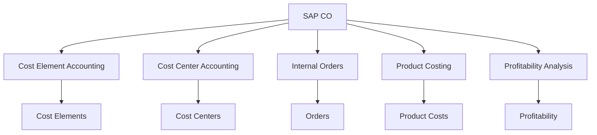
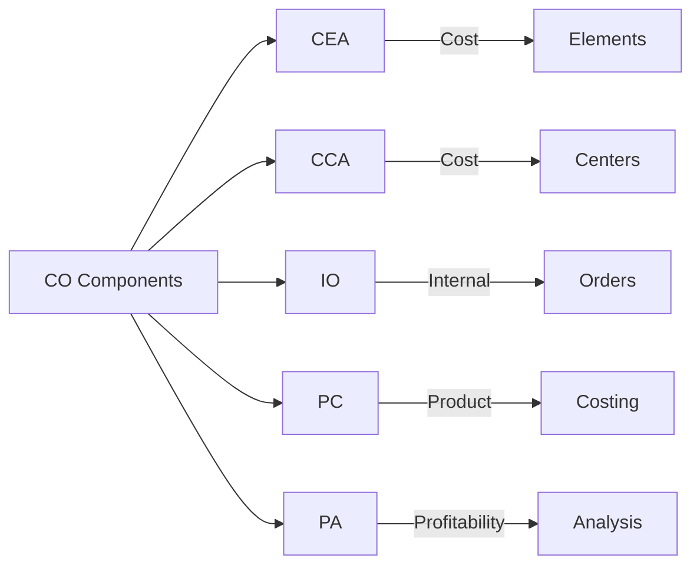
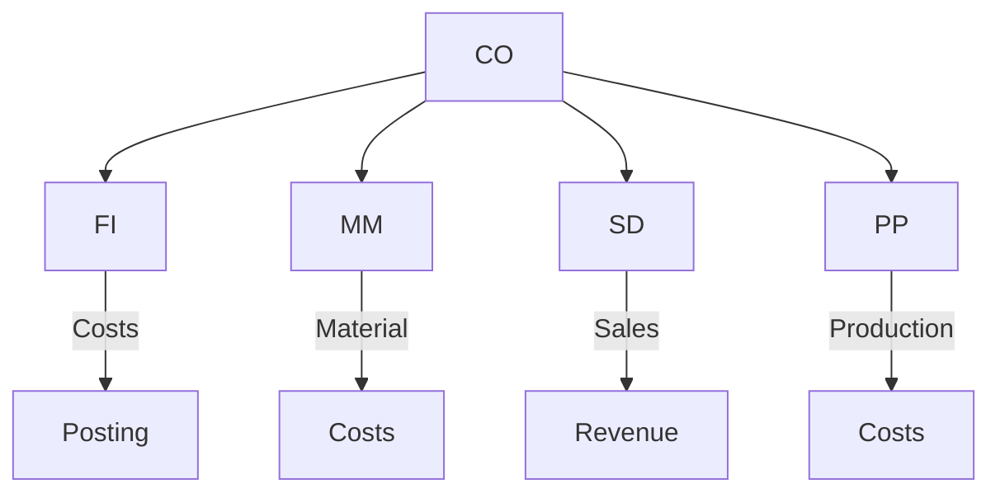

# SAP CO (Controlling) Guide

**Complete guide to SAP Controlling module**

---

## 📚 Table of Contents

1. [Introduction](#introduction)
2. [CO Overview](#co-overview)
3. [CO Sub-modules](#co-sub-modules)
4. [Cost Element Accounting](#cost-element-accounting)
5. [Cost Center Accounting](#cost-center-accounting)
6. [Internal Orders](#internal-orders)
7. [Product Costing](#product-costing)
8. [Profitability Analysis](#profitability-analysis)
9. [Integration](#integration)
10. [Best Practices](#best-practices)

---

## Introduction

**SAP CO (Controlling)** provides cost accounting and management accounting capabilities.

### CO Architecture

### CO Benefits

- ✅ **Cost Control**: Monitor and control costs
- ✅ **Profitability**: Analyze profitability
- ✅ **Planning**: Budget and planning
- ✅ **Integration**: Integrated with FI

---

## CO Overview

### CO Components

### Key Transactions

| Transaction | Purpose |
|-------------|---------|
| **KS01** | Create Cost Center |
| **OKKP** | Maintain Controlling Area |
| **KK01** | Create Cost Element |
| **KO01** | Create Internal Order |
| **CK11N** | Cost Estimate |

---

## CO Sub-modules

### Cost Element Accounting (CEA)

**Purpose**: Track costs by cost element

**Key Concepts**:
- Primary cost elements
- Secondary cost elements
- Cost element groups

### Cost Center Accounting (CCA)

**Purpose**: Track costs by cost center

**Key Concepts**:
- Cost centers
- Cost center groups
- Activity types
- Cost allocation

### Internal Orders (IO)

**Purpose**: Track costs for specific projects/activities

**Key Concepts**:
- Internal orders
- Order types
- Settlement rules

### Product Costing (PC)

**Purpose**: Calculate product costs

**Key Concepts**:
- Cost estimates
- Material costs
- Overhead costs
- Standard costs

### Profitability Analysis (PA)

**Purpose**: Analyze profitability

**Key Concepts**:
- Profitability segments
- Characteristics
- Value fields
- Reports

---

## Cost Element Accounting

### Cost Elements

**Types**:
- Primary: Direct costs from FI
- Secondary: Internal allocations

**Transaction**: KK01

---

## Cost Center Accounting

### Cost Centers

**Purpose**: Organizational units for cost tracking

**Structure**:
- Cost center hierarchy
- Cost center groups
- Activity types

**Transaction**: KS01

### Cost Allocation

**Methods**:
- Distribution
- Assessment
- Activity allocation

---

## Internal Orders

### Internal Order Types

| Type | Description |
|------|-------------|
| **Investment** | Capital projects |
| **Overhead** | Overhead costs |
| **Accrual** | Accrual orders |

**Transaction**: KO01

---

## Product Costing

### Cost Estimate

**Process**:
1. Create cost estimate
2. Calculate material costs
3. Calculate overhead
4. Determine standard cost

**Transaction**: CK11N

---

## Profitability Analysis

### Profitability Segments

**Characteristics**:
- Customer
- Product
- Sales organization
- Distribution channel

**Value Fields**:
- Revenue
- Costs
- Contribution margin

---

## Integration

### CO Integration Points

### Integration Examples

- **FI-CO**: Financial postings create controlling documents
- **MM-CO**: Material costs for costing
- **SD-CO**: Sales revenue for profitability
- **PP-CO**: Production costs

---

## Best Practices

### CO Best Practices

1. **Cost Structure**: Well-defined cost structure
2. **Allocation Rules**: Clear allocation rules
3. **Planning**: Regular planning cycles
4. **Reporting**: Timely reporting
5. **Integration**: Proper FI-CO integration

---

## Common Transactions

| Transaction | Purpose |
|-------------|---------|
| **KS01** | Create Cost Center |
| **KK01** | Create Cost Element |
| **KO01** | Create Internal Order |
| **CK11N** | Cost Estimate |
| **OKKP** | Maintain Controlling Area |

---

## References

- [FI Guide](./SAP_FI_GUIDE.md)
- [MM Guide](./SAP_MM_GUIDE.md)
- [SD Guide](./SAP_SD_GUIDE.md)
- [Reporting Guide](./SAP_REPORTING_ANALYTICS_GUIDE.md)

---

**Related Guides**:
- [ERP Fundamentals Guide](./SAP_ERP_FUNDAMENTALS_GUIDE.md)

