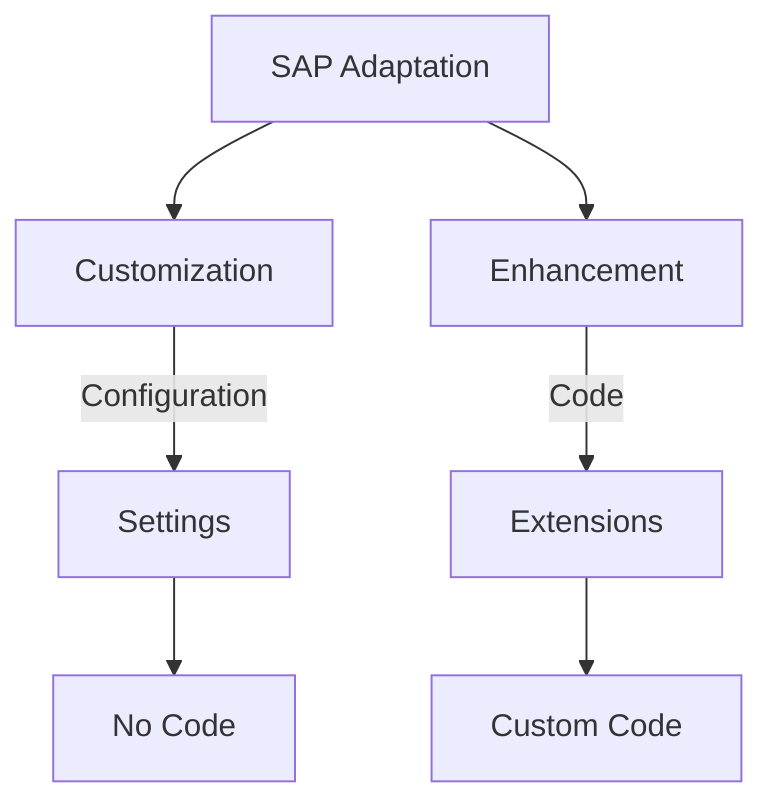
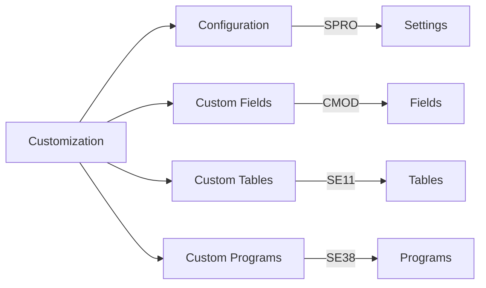
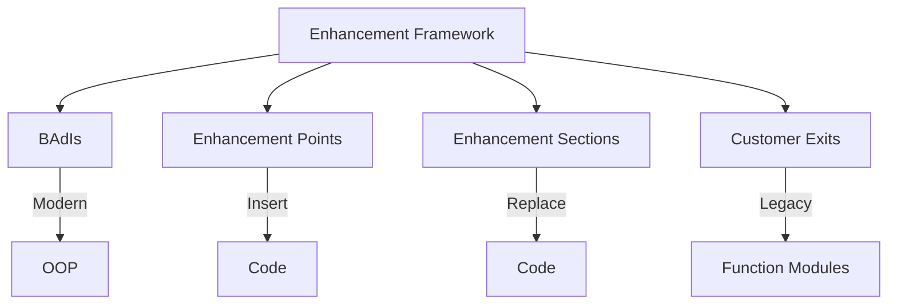
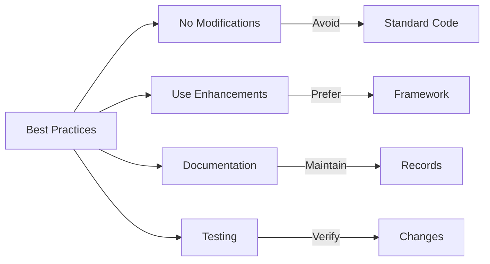

# SAP Customization & Enhancement Guide

**Complete guide to SAP customization and enhancement**

---

## 📚 Table of Contents

1. [Introduction](#introduction)
2. [Customization Overview](#customization-overview)
3. [Enhancement Types](#enhancement-types)
4. [Customization Methods](#customization-methods)
5. [Enhancement Framework](#enhancement-framework)
6. [Best Practices](#best-practices)
7. [Examples](#examples)

---

## Introduction

**SAP Customization & Enhancement** allows you to adapt SAP standard functionality to meet business requirements without modifying standard code.

### Customization vs. Enhancement



### Key Principles

- ✅ **No Modifications**: Avoid modifying standard code
- ✅ **Upgrade Safe**: Use upgrade-safe methods
- ✅ **Best Practices**: Follow SAP best practices
- ✅ **Documentation**: Document all changes

---

## Customization Overview

### Customization Methods



### Configuration vs. Development

| Method | Use When | Upgrade Impact |
|--------|----------|----------------|
| **Configuration** | Standard functionality | None |
| **Enhancement** | Extend standard | Minimal |
| **Custom Development** | New functionality | None |

---

## Enhancement Types

### Enhancement Framework



### Enhancement Methods

| Method | Technology | Use Case |
|--------|-----------|----------|
| **BAdI** | Object-oriented | Modern enhancements |
| **Enhancement Point** | Source code | Code insertion |
| **Enhancement Section** | Source code | Code replacement |
| **Customer Exit** | Function module | Legacy exits |

---

## Customization Methods

### Configuration (SPRO)

**Transaction**: SPRO

**Areas**:
- Organizational structure
- Master data
- Business processes
- Integration settings

### Custom Fields

**Methods**:
- Append structures
- Custom fields in standard tables
- Customer exits

**Transaction**: CMOD

### Custom Tables

**Purpose**: Store custom data

**Transaction**: SE11

**Best Practices**:
- Use Z or Y prefix
- Follow naming conventions
- Create indexes

---

## Enhancement Framework

### BAdIs (Business Add-Ins)

**Purpose**: Object-oriented enhancements

**Transaction**: SE18/SE19

**Advantages**:
- Multiple implementations
- Filter-dependent
- Upgrade-safe

### Enhancement Points

**Purpose**: Insert custom code

**Transaction**: SE80

**Use Cases**:
- Add validation
- Additional processing
- Data enrichment

### Customer Exits

**Purpose**: Legacy enhancement method

**Transaction**: CMOD

**Types**:
- Function module exits
- Menu exits
- Screen exits

---

## Best Practices

### Customization Best Practices



1. **Avoid Modifications**: Never modify standard code
2. **Use Enhancements**: Prefer enhancement framework
3. **Documentation**: Document all customizations
4. **Testing**: Test thoroughly
5. **Upgrade Planning**: Plan for upgrades

---

## Examples

### Example 1: BAdI Implementation

```abap
" BAdI: LE_SHP_DELIVERY_PROC
" Implementation: ZCL_LEAVE_DELIVERY_IMPL

CLASS zcl_leave_delivery_impl DEFINITION.
  PUBLIC SECTION.
    INTERFACES if_ex_le_shp_delivery_proc.
ENDCLASS.

CLASS zcl_leave_delivery_impl IMPLEMENTATION.
  METHOD if_ex_le_shp_delivery_proc~change_delivery_header.
    " Custom logic
    cs_likp-vbeln = |Z{ cs_likp-vbeln }|.
  ENDMETHOD.
ENDCLASS.
```

### Example 2: Enhancement Point

```abap
" Enhancement Point: ZLEAVE_POST_PROCESSING
ENHANCEMENT-POINT zleave_post_processing.
  " Custom code
  PERFORM send_notification_email.
END-ENHANCEMENT-POINT.
```

---

## Common Transactions

| Transaction | Purpose |
|-------------|---------|
| **SPRO** | Customizing |
| **SE18** | BAdI Builder |
| **SE19** | BAdI Implementation |
| **SE80** | Enhancement Operations |
| **CMOD** | Enhancement Projects |

---

## References

- [Enhancement Framework Guide](./ABAP-Guides/11_SAP_ABAP_ENHANCEMENT_FRAMEWORK_GUIDE.md)
- [Best Practices Guide](./ABAP-Guides/12_SAP_ABAP_BEST_PRACTICES_GUIDE.md)
- [Integration Guide](./SAP_INTEGRATION_GUIDE.md)

---

**Related Guides**:
- [ERP Fundamentals Guide](./SAP_ERP_FUNDAMENTALS_GUIDE.md)

