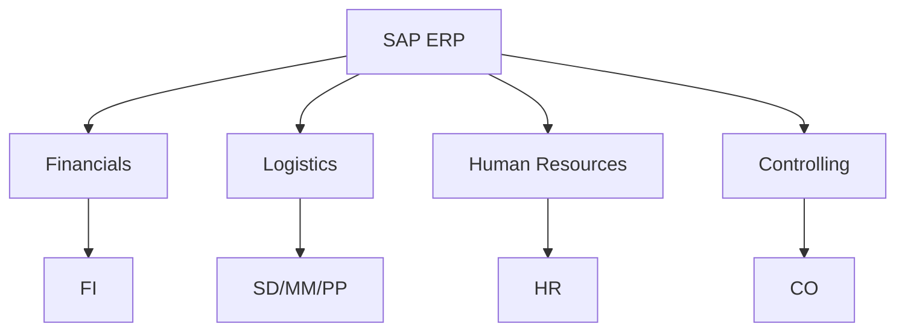
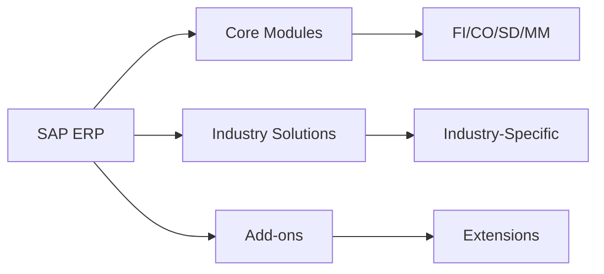
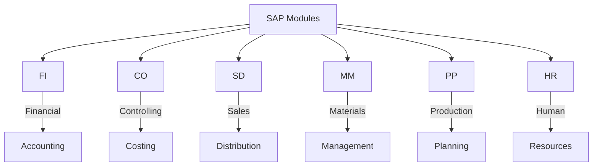
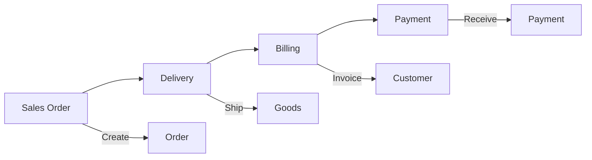
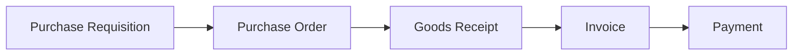
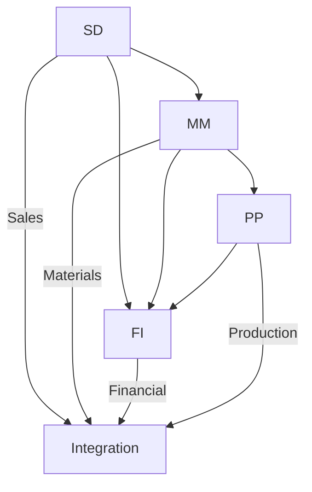
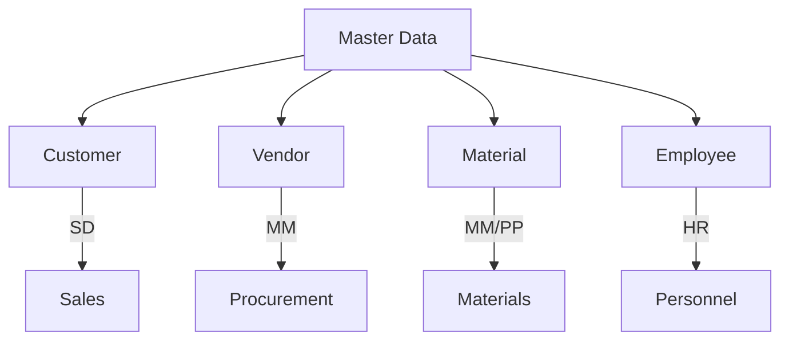
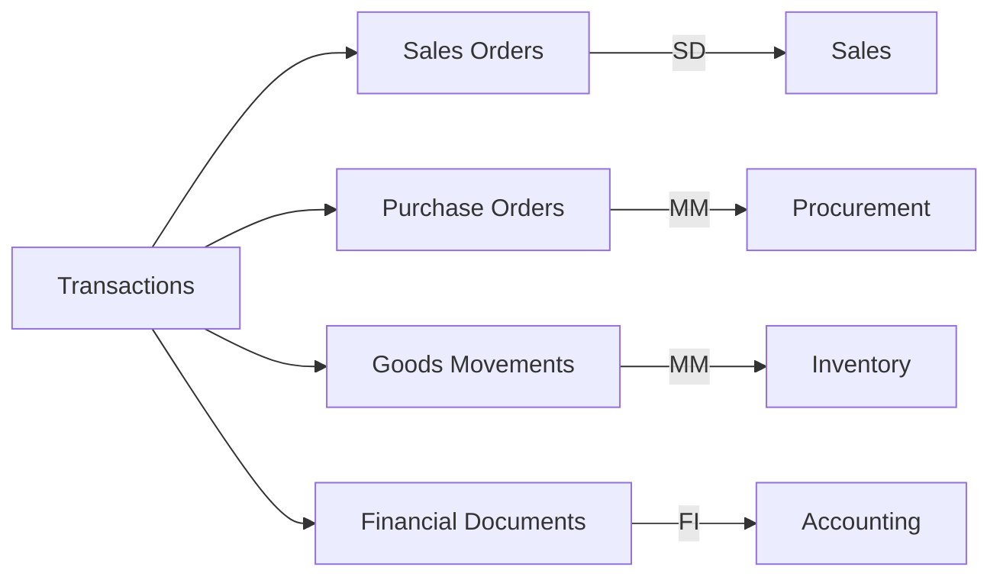

# SAP ERP Fundamentals Guide

**Complete guide to SAP ERP fundamentals**

---

## 📚 Table of Contents

1. [Introduction](#introduction)
2. [ERP Overview](#erp-overview)
3. [SAP ERP Modules](#sap-erp-modules)
4. [Core Business Processes](#core-business-processes)
5. [Integration Points](#integration-points)
6. [Master Data](#master-data)
7. [Transaction Data](#transaction-data)
8. [Best Practices](#best-practices)

---

## Introduction

**SAP ERP (Enterprise Resource Planning)** is an integrated business management software that helps organizations manage their business processes.

### ERP Architecture

### ERP Benefits

- ✅ **Integration**: Integrated business processes
- ✅ **Efficiency**: Streamlined operations
- ✅ **Visibility**: Real-time information
- ✅ **Standardization**: Best practices

---

## ERP Overview

### SAP ERP System

### ERP Evolution

| Version | Description | Year |
|---------|-------------|------|
| **R/2** | Mainframe | 1970s-1980s |
| **R/3** | Client-Server | 1990s |
| **ECC** | Enterprise Central Component | 2000s |
| **S/4HANA** | Next-generation | 2015+ |

---

## SAP ERP Modules

### Core Modules

### Module Overview

| Module | Full Name | Purpose |
|--------|-----------|---------|
| **FI** | Financial Accounting | Financial transactions |
| **CO** | Controlling | Cost management |
| **SD** | Sales & Distribution | Sales processes |
| **MM** | Materials Management | Procurement |
| **PP** | Production Planning | Manufacturing |
| **HR** | Human Resources | HR management |

---

## Core Business Processes

### Order-to-Cash

### Procure-to-Pay

---

## Integration Points

### Module Integration

### Integration Examples

- **SD-FI**: Sales orders create accounting documents
- **MM-FI**: Material movements update financials
- **PP-MM**: Production requires materials
- **HR-FI**: Payroll updates financials

---

## Master Data

### Master Data Types

### Master Data Management

- **Customer Master**: Customer information
- **Vendor Master**: Vendor information
- **Material Master**: Material information
- **Employee Master**: Employee information

---

## Transaction Data

### Transaction Types

---

## Best Practices

### ERP Implementation

1. **Master Data**: Clean and accurate master data
2. **Process Standardization**: Standardize processes
3. **User Training**: Train users properly
4. **Change Management**: Manage changes effectively
5. **Continuous Improvement**: Improve processes

---

## Module Guides

- [FI Guide](./SAP_FI_GUIDE.md) - Financial Accounting
- [CO Guide](./SAP_CO_GUIDE.md) - Controlling
- [SD Guide](./SAP_SD_GUIDE.md) - Sales & Distribution
- [MM Guide](./SAP_MM_GUIDE.md) - Materials Management
- [HR Guide](./SAP_HR_GUIDE.md) - Human Resources
- [PP Guide](./SAP_PP_GUIDE.md) - Production Planning

---

## References

- [SAP Help Portal](https://help.sap.com/)
- [SAP Community](https://community.sap.com/)

---

**Explore specific modules using the module guides above!**

