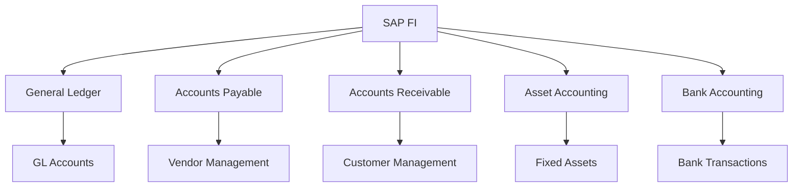
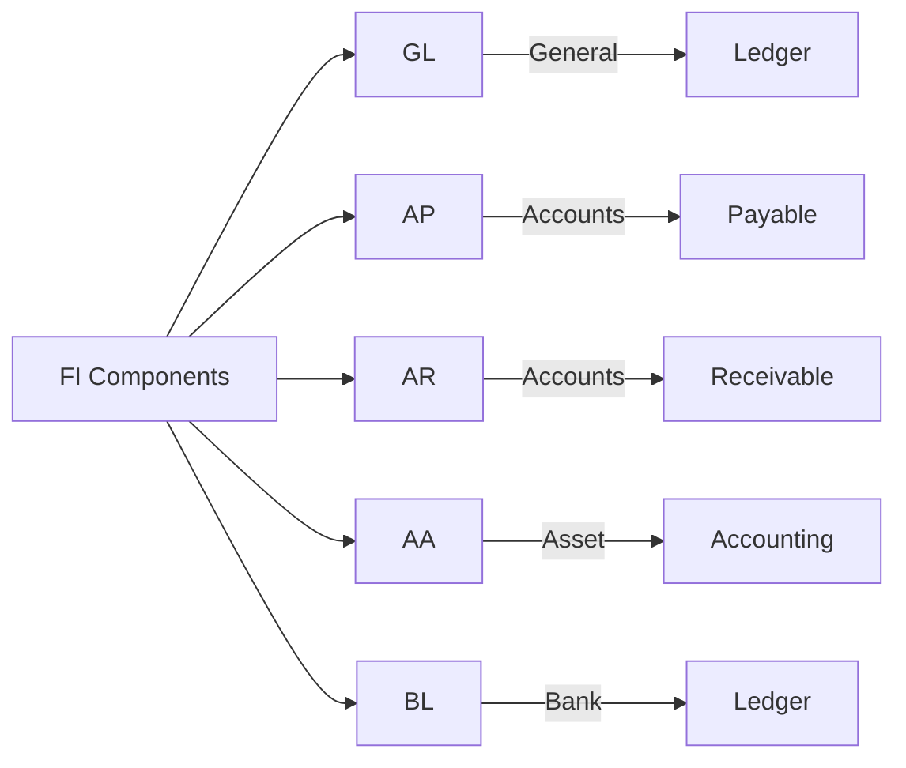
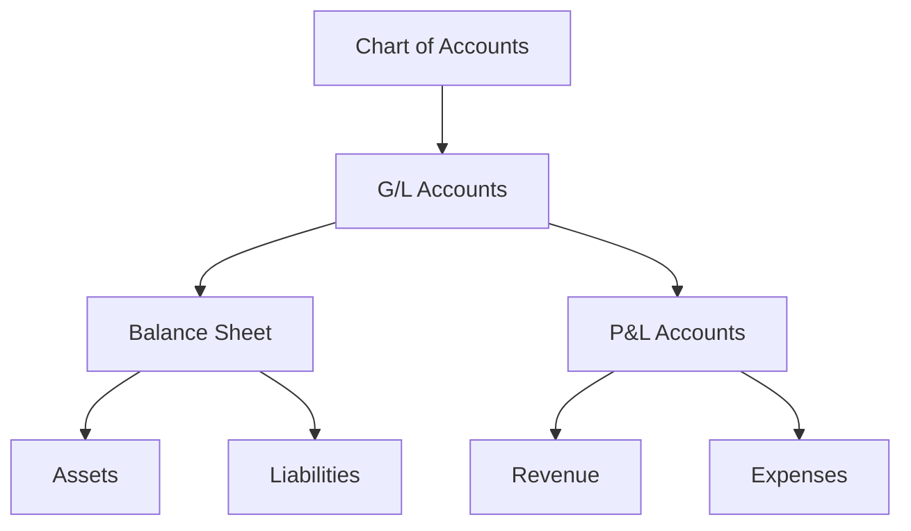
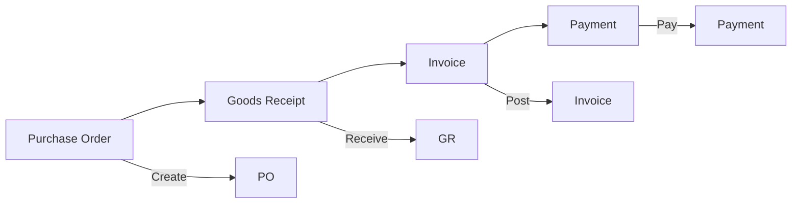
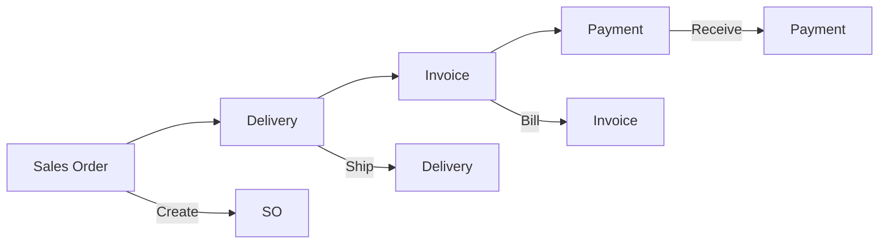
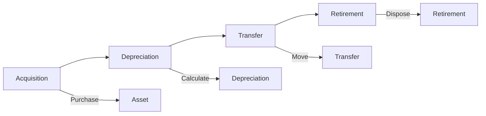
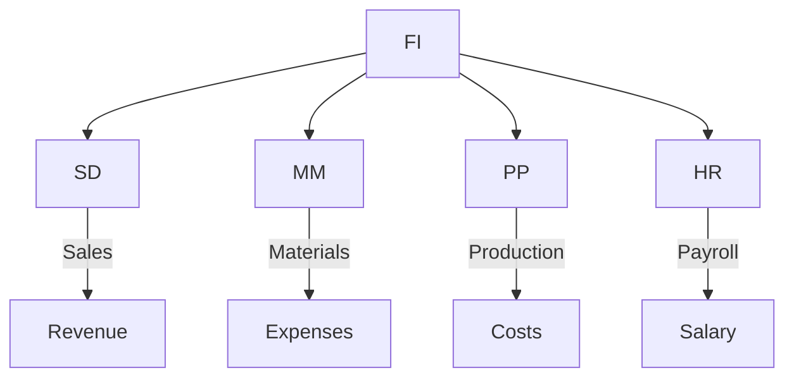

# SAP FI (Financial Accounting) Guide

**Complete guide to SAP Financial Accounting module**

---

## 📚 Table of Contents

1. [Introduction](#introduction)
2. [FI Overview](#fi-overview)
3. [FI Sub-modules](#fi-sub-modules)
4. [General Ledger](#general-ledger)
5. [Accounts Payable](#accounts-payable)
6. [Accounts Receivable](#accounts-receivable)
7. [Asset Accounting](#asset-accounting)
8. [Bank Accounting](#bank-accounting)
9. [Integration](#integration)
10. [Best Practices](#best-practices)

---

## Introduction

**SAP FI (Financial Accounting)** manages financial transactions and provides financial reporting capabilities.

### FI Architecture

### FI Benefits

- ✅ **Real-time Processing**: Immediate posting
- ✅ **Integration**: Integrated with other modules
- ✅ **Compliance**: Legal compliance support
- ✅ **Reporting**: Comprehensive financial reports

---

## FI Overview

### FI Components

### Key Transactions

| Transaction | Purpose |
|-------------|---------|
| **F-02** | Post General Document |
| **FB01** | Post Document |
| **F-43** | Post Vendor Invoice |
| **F-22** | Post Customer Invoice |
| **FS00** | Maintain G/L Account |
| **FB03** | Display Document |

---

## FI Sub-modules

### General Ledger (GL)

**Purpose**: Central accounting

**Key Features**:
- Chart of accounts
- G/L accounts
- Document posting
- Financial statements

**Transactions**:
- **FS00**: Maintain G/L Account
- **F-02**: Post General Document
- **FBL3N**: G/L Account Line Items

### Accounts Payable (AP)

**Purpose**: Manage vendor transactions

**Key Features**:
- Vendor master data
- Invoice processing
- Payment processing
- Vendor reconciliation

**Transactions**:
- **F-43**: Post Vendor Invoice
- **F-53**: Post Outgoing Payment
- **FBL1N**: Vendor Line Items

### Accounts Receivable (AR)

**Purpose**: Manage customer transactions

**Key Features**:
- Customer master data
- Invoice processing
- Payment receipt
- Customer reconciliation

**Transactions**:
- **F-22**: Post Customer Invoice
- **F-28**: Post Incoming Payment
- **FBL5N**: Customer Line Items

### Asset Accounting (AA)

**Purpose**: Manage fixed assets

**Key Features**:
- Asset master data
- Asset acquisition
- Depreciation
- Asset retirement

**Transactions**:
- **AS01**: Create Asset
- **AB01**: Post Asset Acquisition
- **AW01N**: Asset Explorer

### Bank Accounting (BL)

**Purpose**: Manage bank transactions

**Key Features**:
- Bank master data
- Bank statement processing
- Payment processing
- Bank reconciliation

**Transactions**:
- **FF67**: Post Bank Statement
- **F-53**: Post Outgoing Payment
- **FF03**: Display Bank Account

---

## General Ledger

### Chart of Accounts

### Document Posting

**Document Structure**:
- Document header
- Line items
- Debit/Credit
- Posting key

---

## Accounts Payable

### Vendor Process

### Vendor Master Data

**Key Data**:
- Vendor number
- Name and address
- Payment terms
- Bank details

---

## Accounts Receivable

### Customer Process

### Customer Master Data

**Key Data**:
- Customer number
- Name and address
- Payment terms
- Credit limit

---

## Asset Accounting

### Asset Lifecycle

### Depreciation Methods

- Straight-line
- Declining balance
- Units of production

---

## Integration

### FI Integration Points

### Integration Examples

- **SD-FI**: Sales orders create accounting documents
- **MM-FI**: Material movements update financials
- **PP-FI**: Production costs post to FI
- **HR-FI**: Payroll posts to accounting

---

## Best Practices

### FI Best Practices

1. **Chart of Accounts**: Well-structured chart
2. **Document Control**: Proper document numbering
3. **Reconciliation**: Regular account reconciliation
4. **Authorization**: Proper access control
5. **Period End**: Timely period-end closing

---

## Common Transactions

| Transaction | Purpose |
|-------------|---------|
| **F-02** | Post General Document |
| **FB01** | Post Document |
| **FS00** | Maintain G/L Account |
| **F-43** | Post Vendor Invoice |
| **F-22** | Post Customer Invoice |
| **FB03** | Display Document |
| **FBL3N** | G/L Account Line Items |

---

## References

- [CO Guide](./SAP_CO_GUIDE.md)
- [Integration Guide](./SAP_INTEGRATION_GUIDE.md)
- [Reporting Guide](./SAP_REPORTING_ANALYTICS_GUIDE.md)

---

**Related Guides**:
- [ERP Fundamentals Guide](./SAP_ERP_FUNDAMENTALS_GUIDE.md)

