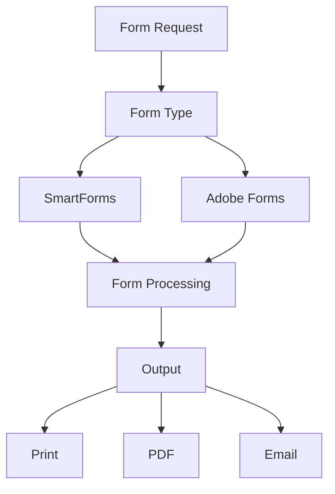
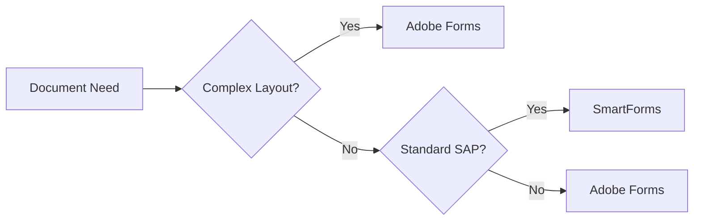
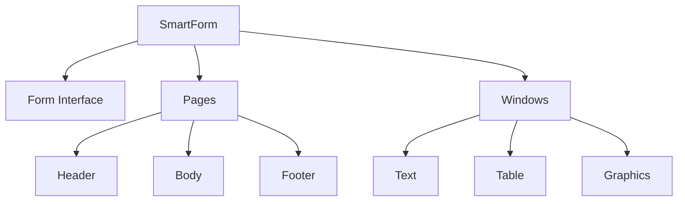
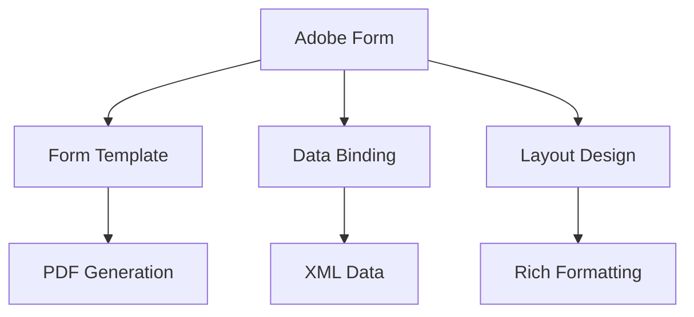
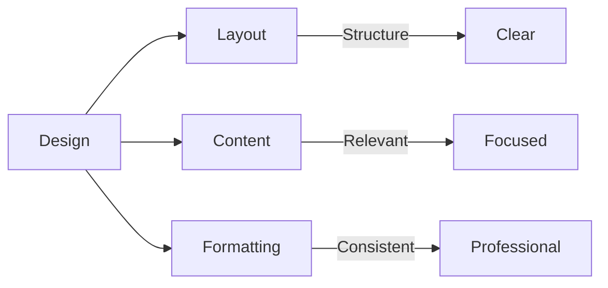
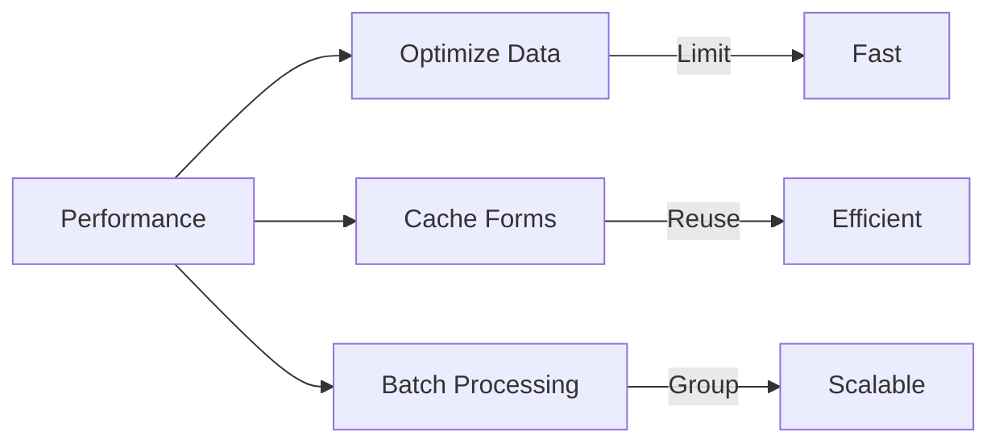

# SAP Forms Guide

**Complete guide to SAP forms (SmartForms and Adobe Forms)**

---

## 📚 Table of Contents

1. [Introduction](#introduction)
2. [Forms Overview](#forms-overview)
3. [SmartForms](#smartforms)
4. [Adobe Forms](#adobe-forms)
5. [Form Design](#form-design)
6. [Printing](#printing)
7. [Email Integration](#email-integration)
8. [Best Practices](#best-practices)
9. [Examples](#examples)

---

## Introduction

**SAP Forms** are used to create printable documents like invoices, purchase orders, and reports. SAP supports two main form technologies: SmartForms and Adobe Forms.

### Forms Architecture



### Form Comparison

| Feature | SmartForms | Adobe Forms |
|---------|-----------|-------------|
| **Technology** | ABAP-based | Adobe LiveCycle |
| **Complexity** | Medium | High |
| **Design** | Form Builder | Adobe Designer |
| **Performance** | Good | Excellent |
| **Modern** | Legacy | Current |
| **Use Case** | Standard forms | Complex layouts |

---

## Forms Overview

### When to Use Forms



**Use SmartForms When**:
- Standard SAP documents
- Simple to medium complexity
- Quick implementation needed

**Use Adobe Forms When**:
- Complex layouts required
- Rich formatting needed
- Modern design requirements
- Interactive forms

---

## SmartForms

### What is SmartForms?

**SmartForms** is SAP's form technology for creating printable documents using a graphical form builder.

### SmartForms Architecture



### Creating SmartForms

**Transaction**: SMARTFORMS

**Steps**:
1. Enter form name (e.g., `ZLEAVE_FORM`)
2. Click "Create"
3. Define form interface (import parameters)
4. Create pages and windows
5. Add elements (text, tables, graphics)
6. Activate
7. Test

### SmartForm Structure

```
SmartForm: ZLEAVE_FORM
├── Form Interface
│   ├── IV_REQ_ID (Import)
│   ├── IV_EMPLOYEE_ID (Import)
│   └── IV_LEAVE_TYPE (Import)
├── Page: FIRST
│   ├── Window: HEADER
│   │   └── Company Logo, Title
│   ├── Window: BODY
│   │   ├── Employee Details
│   │   ├── Leave Details Table
│   │   └── Approval Section
│   └── Window: FOOTER
│       └── Page Number, Date
```

### SmartForm Example

```abap
" Call SmartForm
DATA: lv_fm_name TYPE funcname,
      ls_output_params TYPE sfpoutputparams,
      ls_doc_params TYPE sfpdocparams.

" Set form name
lv_fm_name = '/1BCDWB/SF00000001'. " Generated function module

" Set output parameters
ls_output_params-nodialog = 'X'.
ls_output_params-preview = 'X'.
ls_output_params-getpdf = 'X'.

" Set document parameters
ls_doc_params-langu = sy-langu.

" Call form
CALL FUNCTION lv_fm_name
  EXPORTING
    /1bcdwb/docparams = ls_doc_params
    iv_req_id = lv_req_id
    iv_employee_id = lv_empno
    iv_leave_type = lv_leave_type
  IMPORTING
    /1bcdwb/formoutput = ls_output_params
  EXCEPTIONS
    usage_error = 1
    system_error = 2
    OTHERS = 3.
```

### SmartForm Elements

**Text Elements**:
- Static text
- Dynamic text (variables)
- Text modules

**Table Elements**:
- Main windows
- Table windows
- Loop processing

**Graphic Elements**:
- Company logo
- Images
- Barcodes

**Program Lines**:
- ABAP code in forms
- Calculations
- Conditional logic

---

## Adobe Forms

### What is Adobe Forms?

**Adobe Forms** use Adobe LiveCycle Designer to create sophisticated, interactive forms with rich formatting.

### Adobe Forms Architecture



### Creating Adobe Forms

**Transaction**: SFP (Form Builder)

**Steps**:
1. Create form interface (SE80)
2. Create Adobe form template
3. Design layout in Adobe Designer
4. Bind data fields
5. Activate
6. Test

### Adobe Form Example

```abap
" Call Adobe Form
DATA: lo_fp TYPE REF TO if_fp,
      lo_fp_doc TYPE REF TO if_fp_doc,
      lv_output_params TYPE sfpoutputparams.

" Get form interface
CALL FUNCTION 'FP_JOB_OPEN'
  CHANGING
    ie_outputparams = lv_output_params
  EXCEPTIONS
    cancel = 1
    usage_error = 2
    system_error = 3
    OTHERS = 4.

" Call form
CALL FUNCTION 'FP_FUNCTION_MODULE_NAME'
  EXPORTING
    i_name = 'ZLEAVE_FORM'
  IMPORTING
    e_fm_name = lv_fm_name.

CALL FUNCTION lv_fm_name
  EXPORTING
    /1bcdwb/docparams = ls_doc_params
    iv_req_id = lv_req_id
  IMPORTING
    /1bcdwb/formoutput = lv_output_params
  EXCEPTIONS
    usage_error = 1
    system_error = 2
    OTHERS = 3.

" Close job
CALL FUNCTION 'FP_JOB_CLOSE'
  EXCEPTIONS
    usage_error = 1
    system_error = 2
    OTHERS = 3.
```

---

## Form Design

### Design Principles



### Layout Guidelines

1. **Header Section**
   - Company logo
   - Document title
   - Document number
   - Date

2. **Body Section**
   - Main content
   - Tables for data
   - Clear sections

3. **Footer Section**
   - Page numbers
   - Footer text
   - Legal information

### Form Elements

**Text Elements**:
- Headers and labels
- Dynamic data fields
- Calculated fields

**Table Elements**:
- Line items
- Summary tables
- Detail sections

**Graphic Elements**:
- Logos
- Signatures
- Barcodes

---

## Printing

### Print Configuration

**Transaction**: SPAD (Spool Administration)

**Steps**:
1. Configure printer
2. Set output device
3. Define print parameters

### Print from ABAP

```abap
" Print SmartForm
CALL FUNCTION 'SSF_FUNCTION_MODULE_NAME'
  EXPORTING
    formname = 'ZLEAVE_FORM'
  IMPORTING
    fm_name = lv_fm_name.

" Set print parameters
ls_output_params-nodialog = 'X'.
ls_output_params-preview = space.
ls_output_params-printer = 'LOCL'.

" Call form
CALL FUNCTION lv_fm_name
  EXPORTING
    /1bcdwb/docparams = ls_doc_params
    iv_req_id = lv_req_id
  IMPORTING
    /1bcdwb/formoutput = ls_output_params
  EXCEPTIONS
    OTHERS = 1.
```

### PDF Generation

```abap
" Generate PDF
ls_output_params-nodialog = 'X'.
ls_output_params-preview = space.
ls_output_params-getpdf = 'X'.

" Call form
CALL FUNCTION lv_fm_name
  EXPORTING
    /1bcdwb/docparams = ls_doc_params
    iv_req_id = lv_req_id
  IMPORTING
    /1bcdwb/formoutput = ls_output_params.

" PDF is in ls_output_params-pdf
```

---

## Email Integration

### Send Form via Email

```abap
" Generate PDF
PERFORM generate_pdf_form
  USING lv_req_id
  CHANGING lv_pdf_data.

" Send email
CALL FUNCTION 'SO_DOCUMENT_SEND_API1'
  EXPORTING
    document_data = ls_doc_data
    document_type = 'PDF'
    put_in_outbox = abap_true
  TABLES
    object_content = lt_pdf_content
    receivers = lt_receivers
  EXCEPTIONS
    OTHERS = 1.

IF sy-subrc = 0.
  COMMIT WORK.
ENDIF.
```

---

## Best Practices

### Performance



1. **Limit Data**: Only pass required data
2. **Cache Forms**: Reuse form instances
3. **Batch Processing**: Process multiple forms together
4. **Optimize Queries**: Use efficient database queries

### Design

1. **Consistent Layout**: Use templates
2. **Clear Structure**: Organize sections logically
3. **Professional Appearance**: Use proper formatting
4. **Test Thoroughly**: Test with various data

---

## Examples

### Example 1: Leave Request Form

```abap
" SmartForm: ZLEAVE_FORM
" Interface:
"   IV_REQ_ID TYPE ZLEAVE_REQ_ID
"   IV_EMPLOYEE_ID TYPE PERNR_D
"   IV_LEAVE_TYPE TYPE ZLEAVE_TYPE
"   IV_START_DATE TYPE DATUM
"   IV_END_DATE TYPE DATUM
"   IV_DAYS TYPE ZLEAVE_DAYS

" Call form
DATA: lv_fm_name TYPE funcname.

CALL FUNCTION 'SSF_FUNCTION_MODULE_NAME'
  EXPORTING
    formname = 'ZLEAVE_FORM'
  IMPORTING
    fm_name = lv_fm_name.

CALL FUNCTION lv_fm_name
  EXPORTING
    /1bcdwb/docparams = ls_doc_params
    iv_req_id = lv_req_id
    iv_employee_id = lv_empno
    iv_leave_type = lv_leave_type
    iv_start_date = lv_start_date
    iv_end_date = lv_end_date
    iv_days = lv_days
  IMPORTING
    /1bcdwb/formoutput = ls_output_params.
```

### Example 2: Print Multiple Forms

```abap
" Batch print forms
LOOP AT lt_requests INTO ls_request.
  " Generate form for each request
  CALL FUNCTION lv_fm_name
    EXPORTING
      /1bcdwb/docparams = ls_doc_params
      iv_req_id = ls_request-req_id
    IMPORTING
      /1bcdwb/formoutput = ls_output_params.
ENDLOOP.
```

---

## Common Transactions

| Transaction | Purpose |
|-------------|---------|
| **SMARTFORMS** | SmartForms Builder |
| **SFP** | Adobe Forms Builder |
| **SE80** | Form Interface (Adobe) |
| **SPAD** | Spool Administration |
| **SM37** | Background Jobs |

---

## Troubleshooting

### Common Issues

1. **Form Not Displaying**
   - Check form is activated
   - Verify function module exists
   - Check parameters

2. **Print Issues**
   - Verify printer configuration
   - Check spool settings
   - Verify output device

3. **Data Not Showing**
   - Check data binding
   - Verify import parameters
   - Check data source

---

## References

- [ABAP Basics Guide](./ABAP-Guides/01_SAP_ABAP_BASICS_GUIDE.md)
- [Integration Guide](./SAP_INTEGRATION_GUIDE.md)
- [SAP Help - Forms](https://help.sap.com/)

---

**Related Guides**:
- [Workflow Guide](./SAP_WORKFLOW_GUIDE.md)
- [Integration Guide](./SAP_INTEGRATION_GUIDE.md)

