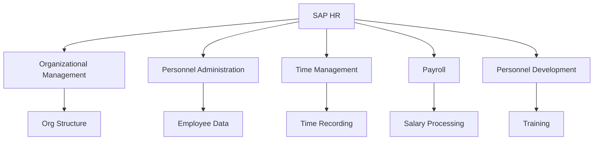
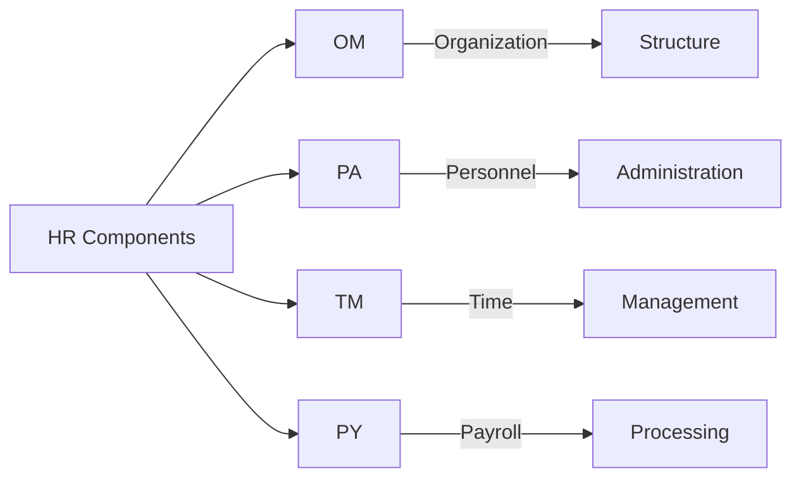
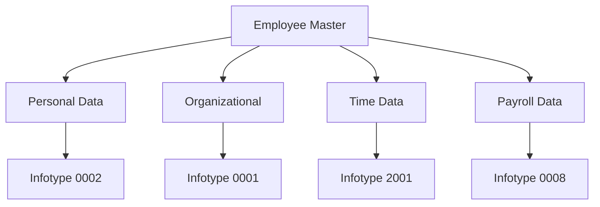
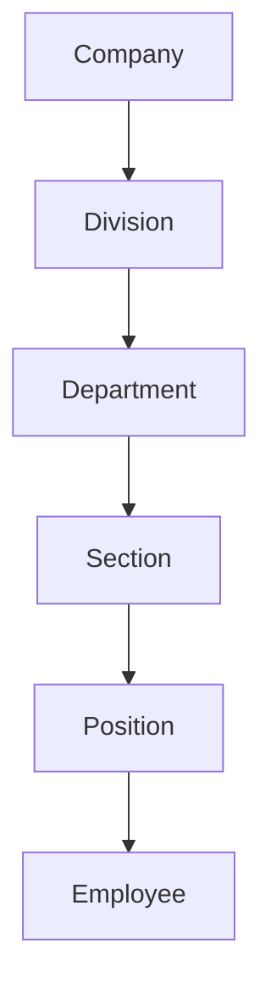
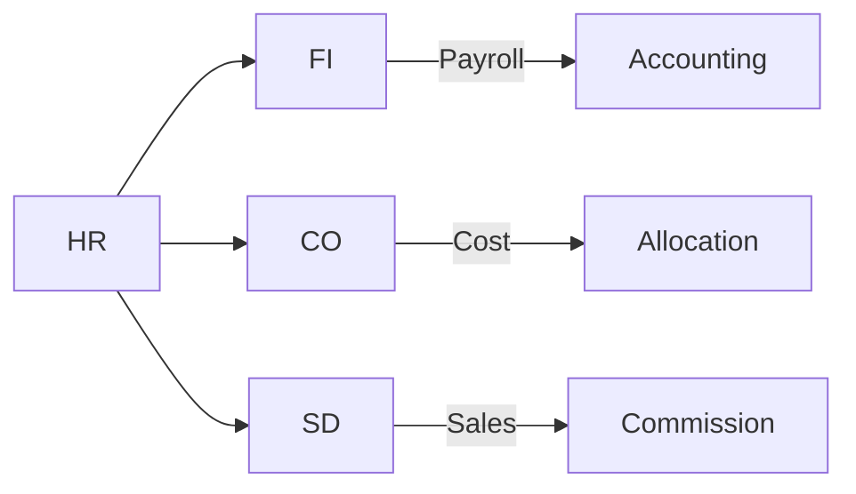

# SAP HR (Human Resources) Guide

**Complete guide to SAP Human Resources module**

---

## 📚 Table of Contents

1. [Introduction](#introduction)
2. [HR Overview](#hr-overview)
3. [HR Sub-modules](#hr-sub-modules)
4. [Master Data](#master-data)
5. [Organizational Management](#organizational-management)
6. [Personnel Administration](#personnel-administration)
7. [Time Management](#time-management)
8. [Payroll](#payroll)
9. [Integration](#integration)
10. [Best Practices](#best-practices)

---

## Introduction

**SAP HR (Human Resources)** manages employee data, organizational structure, time recording, and payroll processing.

### HR Architecture



### HR Benefits

- ✅ **Centralized Data**: Single source of truth
- ✅ **Process Automation**: Automated HR processes
- ✅ **Compliance**: Legal compliance support
- ✅ **Integration**: Integrated with other modules

---

## HR Overview

### HR Components



### Key Transactions

| Transaction | Purpose |
|-------------|---------|
| **PPOME** | Organizational Management |
| **PA30** | Maintain HR Master Data |
| **PA40** | Personnel Actions |
| **PT60** | Time Evaluation |
| **PC00_M99_CALC** | Payroll |

---

## HR Sub-modules

### Organizational Management (OM)

**Purpose**: Manage organizational structure

**Key Concepts**:
- Organizational units
- Positions
- Jobs
- Relationships

**Transactions**:
- **PPOME**: Organizational Structure
- **PPOCE**: Create Org Unit
- **PPOME_OLD**: Classic OM

### Personnel Administration (PA)

**Purpose**: Manage employee master data

**Key Infotypes**:
- **0001**: Organizational Assignment
- **0002**: Personal Data
- **0006**: Addresses
- **0008**: Basic Pay
- **0014**: Recurring Payments

**Transactions**:
- **PA30**: Maintain HR Master Data
- **PA40**: Personnel Actions

### Time Management (TM)

**Purpose**: Record and manage employee time

**Key Features**:
- Time recording
- Attendance/absence
- Overtime
- Leave management

**Transactions**:
- **PT60**: Time Evaluation
- **PT80**: Time Statement

### Payroll (PY)

**Purpose**: Process employee payroll

**Key Features**:
- Salary calculation
- Deductions
- Benefits
- Tax processing

**Transactions**:
- **PC00_M99_CALC**: Payroll
- **PC00_M99_PA03**: Payroll Results

---

## Master Data

### Employee Master Data



### Key Infotypes

| Infotype | Description | Purpose |
|----------|-------------|---------|
| **0001** | Organizational Assignment | Org unit, position |
| **0002** | Personal Data | Name, DOB, etc. |
| **0006** | Addresses | Home/work address |
| **0008** | Basic Pay | Salary information |
| **2001** | Absences | Leave records |
| **2002** | Attendances | Time records |

---

## Organizational Management

### Organizational Structure



### Key Objects

- **Organizational Unit**: Department, division
- **Position**: Specific job position
- **Job**: Job classification
- **Work Center**: Work location

---

## Personnel Administration

### Personnel Actions

**Common Actions**:
- Hire
- Transfer
- Promotion
- Termination

### Infotype Maintenance

```abap
" Access employee data
" Transaction: PA30
" Enter employee number
" Select infotype
" Maintain data
```

---

## Time Management

### Time Recording

**Methods**:
- Manual entry
- Time clock
- Mobile app
- Integration

### Leave Management

**Leave Types**:
- Annual leave
- Sick leave
- Personal leave
- Maternity leave

**Process**:
1. Employee requests leave
2. Manager approves
3. System updates balance
4. Payroll processes

---

## Payroll

### Payroll Process


### Payroll Components

- **Basic Pay**: Base salary
- **Allowances**: Additional payments
- **Deductions**: Taxes, benefits
- **Benefits**: Health insurance, etc.

---

## Integration

### HR Integration Points



### Integration Examples

- **HR-FI**: Payroll posting to accounting
- **HR-CO**: Cost center assignment
- **HR-SD**: Sales commission calculation

---

## Best Practices

### HR Best Practices

1. **Data Quality**: Maintain accurate master data
2. **Process Standardization**: Standardize HR processes
3. **Security**: Protect sensitive employee data
4. **Compliance**: Ensure legal compliance
5. **Documentation**: Document HR processes

---

## Common Transactions

| Transaction | Purpose |
|-------------|---------|
| **PPOME** | Organizational Management |
| **PA30** | Maintain HR Master Data |
| **PA40** | Personnel Actions |
| **PT60** | Time Evaluation |
| **PC00_M99_CALC** | Payroll |
| **PA20** | Display HR Master Data |

---

## References

- [Integration Guide](./SAP_INTEGRATION_GUIDE.md)
- [Security Guide](./SAP_SECURITY_AUTHORIZATION_GUIDE.md)
- [SAP Help - HR](https://help.sap.com/)

---

**Related Guides**:
- [Capstone Employee Leave System](../Capstone/Employee-Leave-System/)

