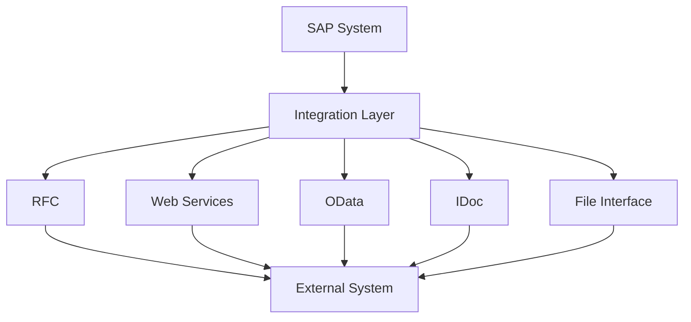
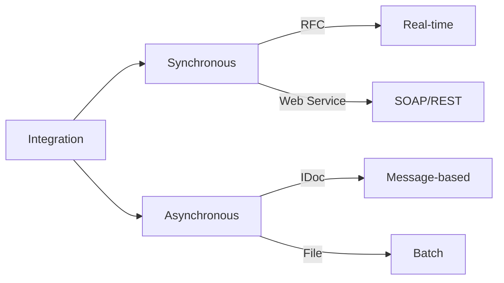
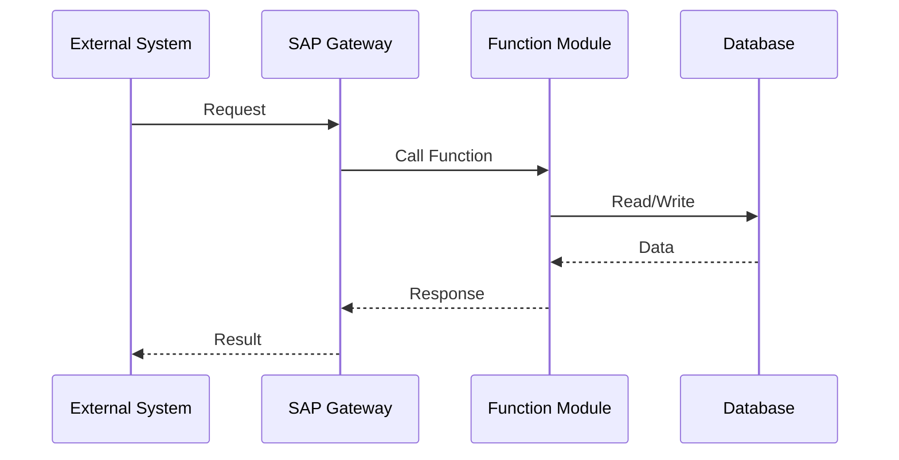
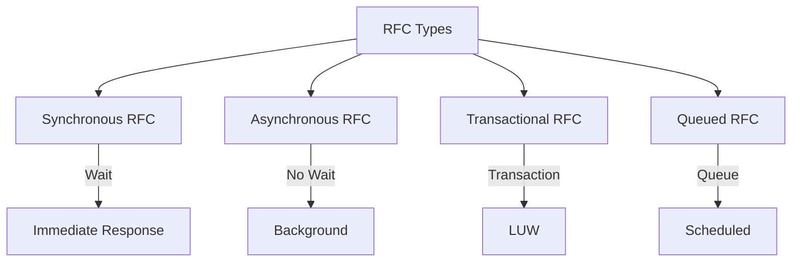
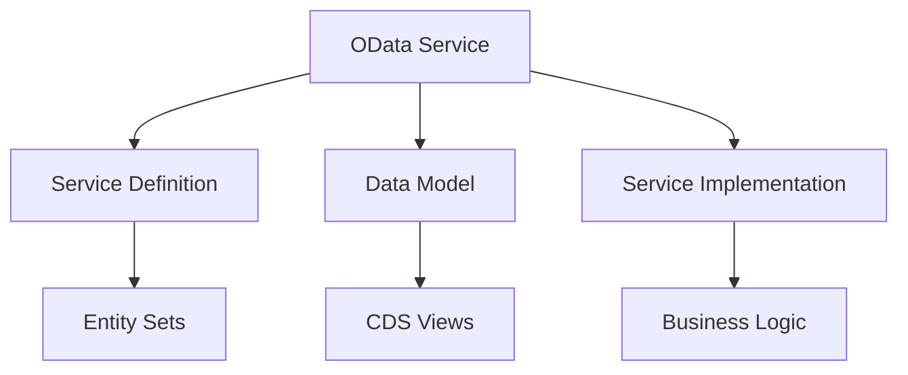
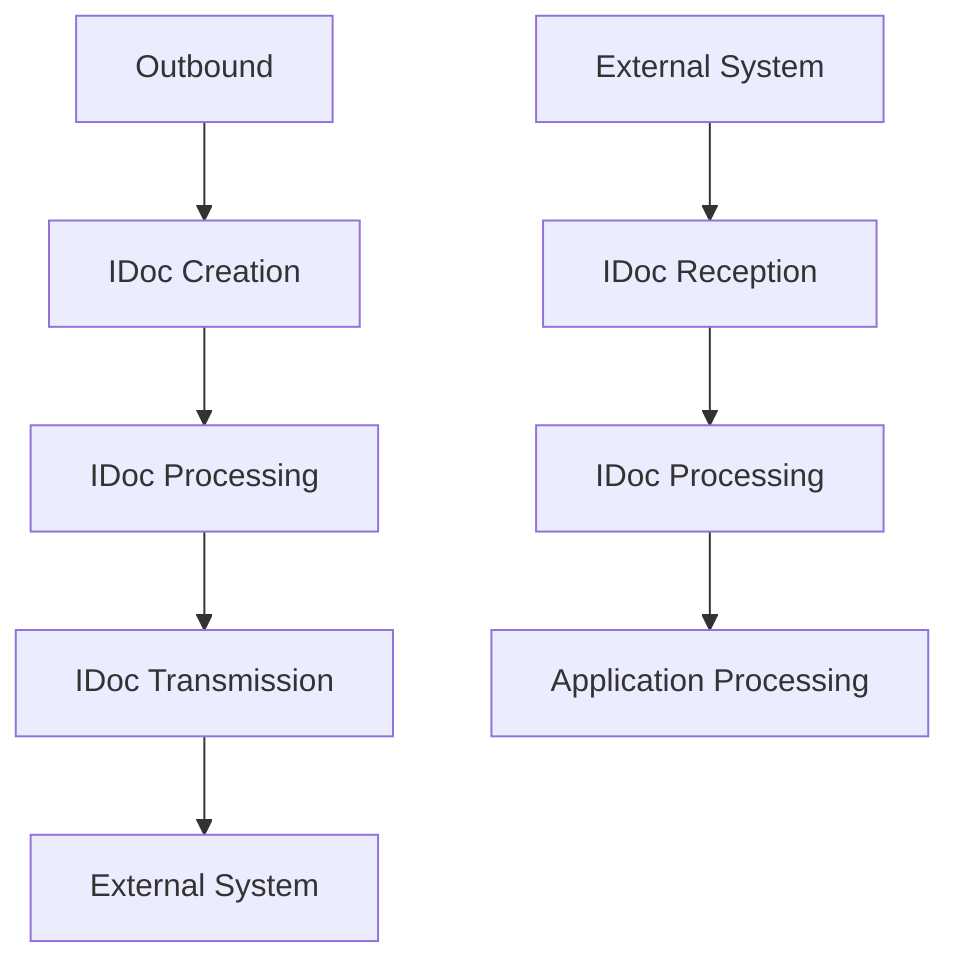
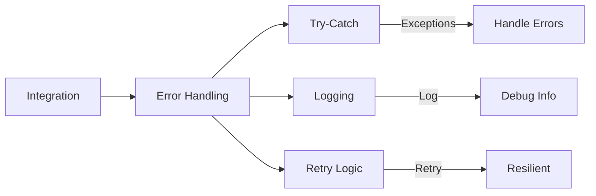

# SAP Integration Guide

**Complete guide to SAP system integration**

---

## 📚 Table of Contents

1. [Introduction](#introduction)
2. [Integration Overview](#integration-overview)
3. [RFC (Remote Function Call)](#rfc-remote-function-call)
4. [Web Services](#web-services)
5. [OData Services](#odata-services)
6. [IDoc Processing](#idoc-processing)
7. [File Interfaces](#file-interfaces)
8. [API Integration](#api-integration)
9. [Best Practices](#best-practices)
10. [Examples](#examples)

---

## Introduction

**SAP Integration** enables communication between SAP systems and external systems, allowing data exchange and process automation.

### Integration Architecture



### Integration Methods



---

## Integration Overview

### Integration Scenarios

| Scenario | Method | Use Case |
|----------|--------|----------|
| **SAP to SAP** | RFC | System-to-system communication |
| **SAP to External** | Web Service | Application integration |
| **External to SAP** | OData | Mobile/web applications |
| **Batch Integration** | IDoc/File | Bulk data transfer |
| **Real-time** | RFC/API | Immediate processing |

### Integration Flow



---

## RFC (Remote Function Call)

### What is RFC?

**RFC (Remote Function Call)** enables function modules to be called from remote systems.

### RFC Types



### Creating RFC Function Module

**Transaction**: SE37

**Steps**:
1. Create function module
2. Set Processing Type: **Remote-Enabled Module**
3. Define parameters
4. Write code
5. Activate

### RFC Example

```abap
FUNCTION z_rfc_get_employee.
*"----------------------------------------------------------------------
*"*"Remote Interface:
*"  IMPORTING
*"     VALUE(IV_EMPLOYEE_ID) TYPE PERNR_D
*"  EXPORTING
*"     VALUE(EV_EMPLOYEE_NAME) TYPE STRING
*"  EXCEPTIONS
*"     EMPLOYEE_NOT_FOUND
*"----------------------------------------------------------------------

  SELECT SINGLE ename
    FROM pa0001
    INTO ev_employee_name
    WHERE pernr = iv_employee_id
      AND endda >= sy-datum
      AND begda <= sy-datum.

  IF sy-subrc <> 0.
    RAISE employee_not_found.
  ENDIF.

ENDFUNCTION.
```

### Calling RFC

```abap
" Synchronous RFC
CALL FUNCTION 'Z_RFC_GET_EMPLOYEE'
  DESTINATION 'REMOTE_SYSTEM'
  EXPORTING
    iv_employee_id = lv_empno
  IMPORTING
    ev_employee_name = lv_name
  EXCEPTIONS
    employee_not_found = 1
    communication_failure = 2
    system_failure = 3
    OTHERS = 4.

" Asynchronous RFC
CALL FUNCTION 'Z_RFC_PROCESS_DATA'
  DESTINATION 'REMOTE_SYSTEM'
  STARTING NEW TASK 'TASK1'
  EXPORTING
    iv_data = lv_data
  EXCEPTIONS
    communication_failure = 1
    system_failure = 2
    OTHERS = 3.
```

### RFC Destinations

**Transaction**: SM59

**Types**:
- **Type 3**: RFC to SAP System
- **Type G**: HTTP Connection
- **Type H**: HTTP Connection to External Server
- **Type L**: Logical Destination

---

## Web Services

### SOAP Web Services

**Purpose**: Standard web service protocol

### Creating SOAP Web Service

**Steps**:
1. Create RFC function module
2. SE80 → Utilities → Create Web Service
3. Configure service
4. Activate
5. Test (SOAP UI)

### SOAP Service Example

```abap
FUNCTION z_ws_get_employee_data.
*"----------------------------------------------------------------------
*"*"Web Service Interface:
*"  IMPORTING
*"     VALUE(IV_EMPLOYEE_ID) TYPE PERNR_D
*"  EXPORTING
*"     VALUE(EV_EMPLOYEE_NAME) TYPE STRING
*"     VALUE(EV_DEPARTMENT) TYPE STRING
*"  EXCEPTIONS
*"     EMPLOYEE_NOT_FOUND
*"----------------------------------------------------------------------

  SELECT SINGLE ename orgeh
    FROM pa0001
    INTO (ev_employee_name, ev_department)
    WHERE pernr = iv_employee_id
      AND endda >= sy-datum
      AND begda <= sy-datum.

  IF sy-subrc <> 0.
    RAISE employee_not_found.
  ENDIF.

ENDFUNCTION.
```

### REST Web Services

**Purpose**: Lightweight web service

### Creating REST Service

**Transaction**: SICF

**Steps**:
1. Create handler class
2. Implement IF_HTTP_EXTENSION
3. Register in SICF
4. Test

---

## OData Services

### What is OData?

**OData (Open Data Protocol)** is a REST-based protocol for data access.

### OData Architecture



### Creating OData Service

**Transaction**: SEGW (Gateway Service Builder)

**Steps**:
1. Create project
2. Import data model (CDS/DDIC)
3. Define service
4. Generate runtime objects
5. Activate
6. Test

### OData Service Example

```abap
" Service Definition
DEFINE ENTITY z_employee_service.
  KEY employee_id : pernr_d;
      employee_name : string;
      department : string;
ENDDEFINE.

" Service Implementation
CLASS zcl_employee_service_impl DEFINITION.
  PUBLIC SECTION.
    INTERFACES /iwbep/if_mgw_appl_srv_runtime.
ENDCLASS.

CLASS zcl_employee_service_impl IMPLEMENTATION.
  METHOD /iwbep/if_mgw_appl_srv_runtime~get_entityset.
    " Read data
    SELECT pernr ename orgeh
      FROM pa0001
      INTO TABLE @DATA(lt_employees).
    
    " Return entity set
    copy_data_to_ref( EXPORTING is_data = lt_employees
                      CHANGING cr_data = er_entityset ).
  ENDMETHOD.
ENDCLASS.
```

**See**: [OData Services Guide](./ABAP-Guides/17_SAP_ABAP_ODATA_SERVICES_GUIDE.md) for detailed information.

---

## IDoc Processing

### What is IDoc?

**IDoc (Intermediate Document)** is SAP's standard format for asynchronous data exchange.

### IDoc Architecture



### IDoc Types

**Transaction**: WE30

**Common IDoc Types**:
- **MATMAS**: Material Master
- **DEBMAS**: Customer Master
- **CREMAS**: Vendor Master
- **ORDERS**: Sales Order

### Outbound IDoc Processing

```abap
" Create IDoc
CALL FUNCTION 'IDOC_CREATE_FROM_DATA'
  EXPORTING
    pi_idoc_control = ls_control
    pi_idoc_data = lt_idoc_data
  IMPORTING
    pe_idoc_number = lv_idoc_number
  EXCEPTIONS
    error = 1
    OTHERS = 2.

" Send IDoc
CALL FUNCTION 'IDOC_WRITE_AND_START_INBOUND'
  EXPORTING
    pi_idoc_number = lv_idoc_number
  EXCEPTIONS
    error = 1
    OTHERS = 2.
```

### Inbound IDoc Processing

```abap
" Process inbound IDoc
FUNCTION z_idoc_process_inbound.
*"  IMPORTING
*"     VALUE(IV_IDOC_NUMBER) TYPE EDIDC-DOCNUM

  DATA: lt_idoc_data TYPE TABLE OF edidd,
        ls_idoc_data TYPE edidd.

  " Read IDoc data
  CALL FUNCTION 'IDOC_READ_COMPLETELY'
    EXPORTING
      pi_idoc_number = iv_idoc_number
    IMPORTING
      pe_idoc_data = lt_idoc_data
    EXCEPTIONS
      idoc_not_found = 1
      OTHERS = 2.

  " Process segments
  LOOP AT lt_idoc_data INTO ls_idoc_data.
    CASE ls_idoc_data-segnam.
      WHEN 'E1KNA1M'.
        " Process customer data
        PERFORM process_customer USING ls_idoc_data-sdata.
    ENDCASE.
  ENDLOOP.

ENDFUNCTION.
```

---

## File Interfaces

### File Upload

```abap
" Upload file from application server
OPEN DATASET lv_filename FOR INPUT IN TEXT MODE ENCODING UTF-8.
IF sy-subrc = 0.
  DO.
    READ DATASET lv_filename INTO lv_line.
    IF sy-subrc <> 0.
      EXIT.
    ENDIF.
    " Process line
    APPEND lv_line TO lt_data.
  ENDDO.
  CLOSE DATASET lv_filename.
ENDIF.
```

### File Download

```abap
" Download file to application server
OPEN DATASET lv_filename FOR OUTPUT IN TEXT MODE ENCODING UTF-8.
IF sy-subrc = 0.
  LOOP AT lt_data INTO ls_data.
    TRANSFER ls_data TO lv_filename.
  ENDLOOP.
  CLOSE DATASET lv_filename.
ENDIF.
```

### CSV Processing

```abap
" Read CSV file
DATA: lt_csv TYPE TABLE OF string,
      ls_csv TYPE string.

" Upload file
CALL FUNCTION 'GUI_UPLOAD'
  EXPORTING
    filename = lv_filename
  TABLES
    data_tab = lt_csv
  EXCEPTIONS
    OTHERS = 1.

" Parse CSV
LOOP AT lt_csv INTO ls_csv.
  SPLIT ls_csv AT ',' INTO
    DATA(lv_field1)
    DATA(lv_field2)
    DATA(lv_field3).
  " Process fields
ENDLOOP.
```

---

## API Integration

### REST API Consumption

```abap
" Call REST API
DATA: lo_http_client TYPE REF TO if_http_client,
      lv_url TYPE string,
      lv_response TYPE string.

lv_url = 'https://api.example.com/employees'.

" Create HTTP client
CALL METHOD cl_http_client=>create_by_url
  EXPORTING
    url = lv_url
  IMPORTING
    client = lo_http_client.

" Set method
lo_http_client->request->set_method( 'GET' ).

" Send request
lo_http_client->send( ).
lo_http_client->receive( ).

" Get response
lv_response = lo_http_client->response->get_cdata( ).

" Close connection
lo_http_client->close( ).
```

### JSON Processing

```abap
" Parse JSON response
DATA: lo_json TYPE REF TO /ui2/cl_json,
      ls_data TYPE ty_employee.

" Parse JSON
lo_json = /ui2/cl_json=>deserialize(
  EXPORTING json = lv_response
  CHANGING data = ls_data
).
```

---

## Best Practices

### Error Handling



1. **Always handle exceptions**
2. **Log errors for debugging**
3. **Implement retry logic**
4. **Validate input data**
5. **Use transactions for data consistency**

### Performance

1. **Batch Processing**: Process multiple records together
2. **Async Processing**: Use async RFC for long operations
3. **Connection Pooling**: Reuse connections
4. **Data Filtering**: Filter at source

### Security

1. **Authentication**: Use secure authentication
2. **Authorization**: Check user permissions
3. **Data Encryption**: Encrypt sensitive data
4. **Input Validation**: Validate all inputs

---

## Examples

### Example 1: RFC Integration

```abap
" Call remote function
CALL FUNCTION 'Z_REMOTE_GET_DATA'
  DESTINATION 'REMOTE_SAP'
  EXPORTING
    iv_key = lv_key
  IMPORTING
    ev_data = lv_data
  EXCEPTIONS
    communication_failure = 1
    system_failure = 2
    OTHERS = 3.

IF sy-subrc = 0.
  " Process data
ELSE.
  " Handle error
  MESSAGE 'Remote call failed' TYPE 'E'.
ENDIF.
```

### Example 2: OData Service Call

```abap
" Call OData service
DATA: lo_http_client TYPE REF TO if_http_client,
      lv_url TYPE string.

lv_url = 'https://sap-system.com/sap/opu/odata/sap/ZEMPLOYEE_SRV/EmployeeSet'.

" Create client and call
CALL METHOD cl_http_client=>create_by_url
  EXPORTING
    url = lv_url
  IMPORTING
    client = lo_http_client.

lo_http_client->request->set_method( 'GET' ).
lo_http_client->send( ).
lo_http_client->receive( ).

" Process response
DATA(lv_response) = lo_http_client->response->get_cdata( ).
```

---

## Common Transactions

| Transaction | Purpose |
|-------------|---------|
| **SM59** | RFC Destinations |
| **SE37** | Function Builder (RFC) |
| **SEGW** | Gateway Service Builder (OData) |
| **WE19** | IDoc Test Tool |
| **WE30** | IDoc Type Maintenance |
| **SICF** | HTTP Service Maintenance |

---

## Troubleshooting

### Common Issues

1. **RFC Connection Failed**
   - Check SM59 destination
   - Verify network connectivity
   - Check user authorization

2. **OData Service Not Found**
   - Verify service is activated
   - Check SICF service
   - Verify URL

3. **IDoc Processing Error**
   - Check IDoc status (WE02)
   - Verify partner profile
   - Check IDoc structure

---

## References

- [Function Modules Guide](./ABAP-Guides/05_SAP_ABAP_FUNCTION_MODULES_GUIDE.md)
- [OData Services Guide](./ABAP-Guides/17_SAP_ABAP_ODATA_SERVICES_GUIDE.md)
- [RESTful Programming Guide](./ABAP-Guides/18_SAP_ABAP_RESTFUL_PROGRAMMING_GUIDE.md)
- [SAP Help - Integration](https://help.sap.com/)

---

**Related Guides**:
- [ABAP Integration Guide](./ABAP-Guides/15_SAP_ABAP_INTEGRATION_GUIDE.md)
- [Testing Guide](./SAP_TESTING_GUIDE.md)

