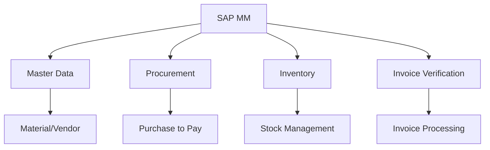
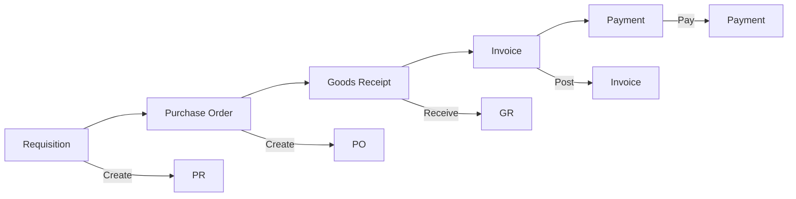
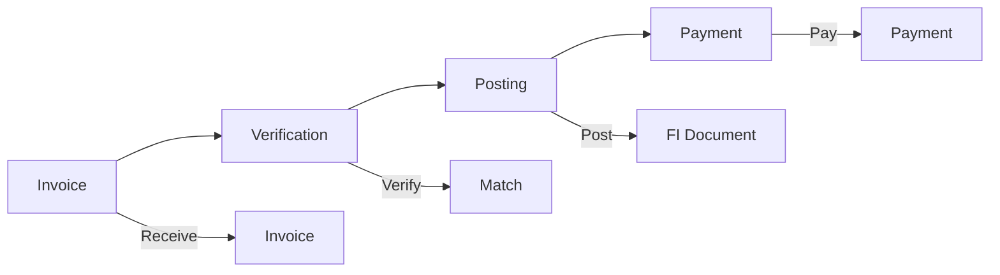
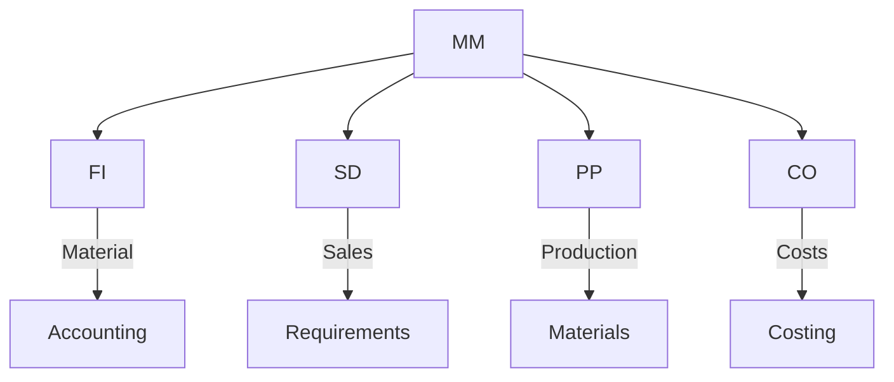

# SAP MM (Materials Management) Guide

**Complete guide to SAP Materials Management module**

---

## 📚 Table of Contents

1. [Introduction](#introduction)
2. [MM Overview](#mm-overview)
3. [MM Master Data](#mm-master-data)
4. [Procurement Process](#procurement-process)
5. [Inventory Management](#inventory-management)
6. [Invoice Verification](#invoice-verification)
7. [Integration](#integration)
8. [Best Practices](#best-practices)

---

## Introduction

**SAP MM (Materials Management)** manages procurement, inventory, and material master data.

### MM Architecture

### MM Benefits

- ✅ **Procurement**: Streamlined procurement
- ✅ **Inventory**: Efficient inventory management
- ✅ **Integration**: Integrated with FI/SD
- ✅ **Cost Control**: Material cost control

---

## MM Overview

### MM Process Flow

### Key Transactions

| Transaction | Purpose |
|-------------|---------|
| **ME21N** | Create Purchase Order |
| **ME23N** | Display Purchase Order |
| **MIGO** | Goods Receipt |
| **MIRO** | Invoice Verification |
| **MM01** | Create Material |

---

## MM Master Data

### Material Master

**Key Data**:
- Material number
- Description
- Material type
- Units of measure
- Valuation data

**Views**:
- Basic Data
- Purchasing
- Sales
- Accounting
- Costing

**Transaction**: MM01

### Vendor Master

**Key Data**:
- Vendor number
- Name and address
- Purchasing data
- Accounting data
- Payment terms

**Transaction**: XK01

### Purchase Info Record

**Purpose**: Vendor-material relationship

**Key Data**:
- Vendor
- Material
- Price
- Delivery time
- Conditions

**Transaction**: ME11

---

## Procurement Process

### Purchase Requisition

**Purpose**: Internal request for materials

**Transaction**: ME51N

**Process**:
1. Create requisition
2. Approve requisition
3. Convert to purchase order

### Purchase Order

**Purpose**: Order to vendor

**Transaction**: ME21N

**Key Information**:
- Vendor
- Material
- Quantity
- Price
- Delivery date

### Goods Receipt

**Purpose**: Receive materials

**Transaction**: MIGO

**Process**:
1. Enter purchase order
2. Enter quantity received
3. Post goods receipt
4. Update inventory

---

## Inventory Management

### Goods Movement Types

| Movement Type | Description |
|---------------|-------------|
| **101** | Goods Receipt |
| **201** | Goods Issue |
| **311** | Transfer |
| **561** | Initial Entry |

### Stock Types

- Unrestricted use
- Quality inspection
- Blocked stock
- In transit

### Physical Inventory

**Process**:
1. Create physical inventory document
2. Count materials
3. Enter count results
4. Post differences

**Transaction**: MI01

---

## Invoice Verification

### Invoice Process

### Invoice Verification

**Transaction**: MIRO

**Process**:
1. Enter invoice
2. Match with PO/GR
3. Verify amounts
4. Post invoice

---

## Integration

### MM Integration Points

### Integration Examples

- **MM-FI**: Material movements post to accounting
- **MM-SD**: Sales orders create material requirements
- **MM-PP**: Production requires materials
- **MM-CO**: Material costs for costing

---

## Best Practices

### MM Best Practices

1. **Master Data**: Accurate material/vendor data
2. **Procurement**: Standardize procurement process
3. **Inventory**: Regular inventory checks
4. **Invoice Verification**: Timely invoice processing
5. **Integration**: Proper integration setup

---

## Common Transactions

| Transaction | Purpose |
|-------------|---------|
| **MM01** | Create Material |
| **ME21N** | Create Purchase Order |
| **MIGO** | Goods Receipt |
| **MIRO** | Invoice Verification |
| **MB51** | Material Document List |
| **MMBE** | Stock Overview |

---

## References

- [FI Guide](./SAP_FI_GUIDE.md)
- [SD Guide](./SAP_SD_GUIDE.md)
- [Integration Guide](./SAP_INTEGRATION_GUIDE.md)

---

**Related Guides**:
- [ERP Fundamentals Guide](./SAP_ERP_FUNDAMENTALS_GUIDE.md)

