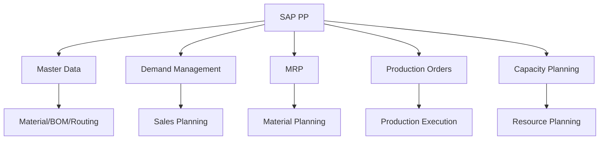
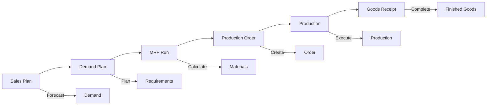
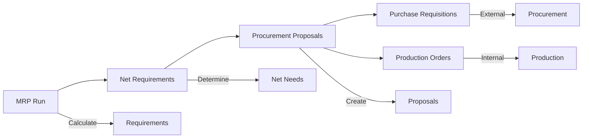
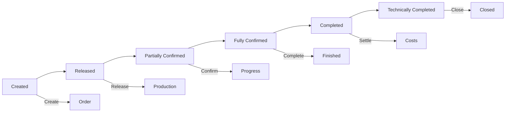
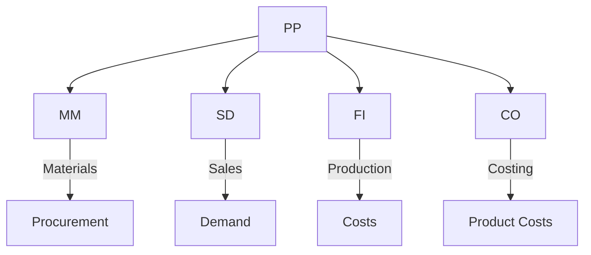

# SAP PP (Production Planning) Guide

**Complete guide to SAP Production Planning module**

---

## 📚 Table of Contents

1. [Introduction](#introduction)
2. [PP Overview](#pp-overview)
3. [PP Master Data](#pp-master-data)
4. [Demand Management](#demand-management)
5. [Material Requirements Planning](#material-requirements-planning)
6. [Production Orders](#production-orders)
7. [Capacity Planning](#capacity-planning)
8. [Integration](#integration)
9. [Best Practices](#best-practices)

---

## Introduction

**SAP PP (Production Planning)** manages production planning, scheduling, and execution processes.

### PP Architecture

### PP Benefits

- ✅ **Planning**: Efficient production planning
- ✅ **Optimization**: Optimize production resources
- ✅ **Integration**: Integrated with MM/SD
- ✅ **Visibility**: Real-time production visibility

---

## PP Overview

### PP Process Flow

### Key Transactions

| Transaction | Purpose |
|-------------|---------|
| **MD01** | MRP Run |
| **CO01** | Create Production Order |
| **CO02** | Change Production Order |
| **CO03** | Display Production Order |
| **CS01** | Create BOM |

---

## PP Master Data

### Bill of Materials (BOM)

**Purpose**: List of components for a product

**Structure**:
- Header material
- Component materials
- Quantities
- Usage

**Transaction**: CS01

### Work Center

**Purpose**: Production resource

**Key Data**:
- Work center number
- Capacity
- Cost center
- Formulas

**Transaction**: CR01

### Routing

**Purpose**: Production sequence

**Structure**:
- Operations
- Work centers
- Times
- Components

**Transaction**: CA01

---

## Demand Management

### Sales Planning

**Purpose**: Forecast sales demand

**Process**:
1. Create sales plan
2. Convert to demand
3. Use in MRP

### Demand Types

- Independent demand (sales)
- Dependent demand (production)

---

## Material Requirements Planning

### MRP Process

### MRP Run

**Transaction**: MD01

**Process**:
1. Select materials
2. Run MRP
3. System calculates requirements
4. Creates procurement proposals

---

## Production Orders

### Production Order Types

| Type | Description |
|------|-------------|
| **Standard** | Normal production |
| **Fert** | Finished product |
| **Semi** | Semi-finished product |

### Production Order Lifecycle

### Production Order Creation

**Transaction**: CO01

**Key Information**:
- Material
- Quantity
- Start date
- Finish date

---

## Capacity Planning

### Capacity Requirements

**Purpose**: Plan production capacity

**Process**:
1. Calculate capacity requirements
2. Check available capacity
3. Level capacity if needed

### Capacity Leveling

**Methods**:
- Forward scheduling
- Backward scheduling
- Finite scheduling

---

## Integration

### PP Integration Points

### Integration Examples

- **PP-MM**: Production requires materials
- **PP-SD**: Sales orders create production requirements
- **PP-FI**: Production costs post to accounting
- **PP-CO**: Product costing

---

## Best Practices

### PP Best Practices

1. **Master Data**: Accurate BOMs and routings
2. **Planning**: Regular MRP runs
3. **Capacity**: Monitor capacity utilization
4. **Orders**: Timely order confirmation
5. **Integration**: Proper integration setup

---

## Common Transactions

| Transaction | Purpose |
|-------------|---------|
| **MD01** | MRP Run |
| **CO01** | Create Production Order |
| **CO02** | Change Production Order |
| **CS01** | Create BOM |
| **CA01** | Create Routing |
| **CR01** | Create Work Center |

---

## References

- [MM Guide](./SAP_MM_GUIDE.md)
- [SD Guide](./SAP_SD_GUIDE.md)
- [CO Guide](./SAP_CO_GUIDE.md)
- [Integration Guide](./SAP_INTEGRATION_GUIDE.md)

---

**Related Guides**:
- [ERP Fundamentals Guide](./SAP_ERP_FUNDAMENTALS_GUIDE.md)

