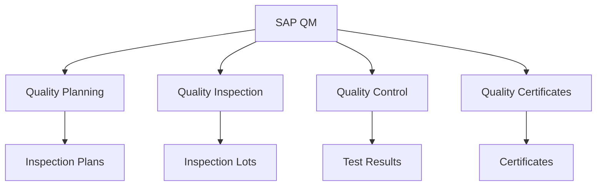
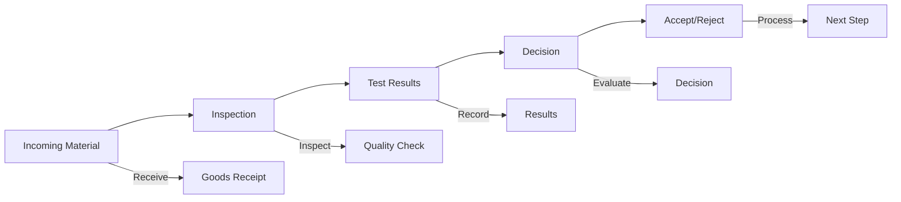
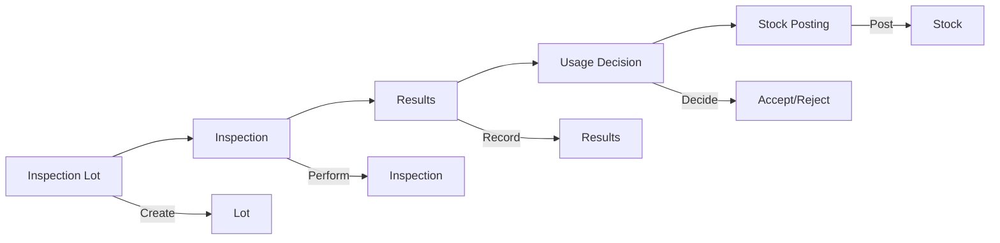
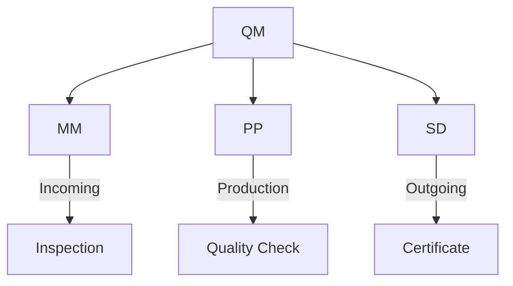

# SAP QM (Quality Management) Guide

**Complete guide to SAP Quality Management module**

---

## 📚 Table of Contents

1. [Introduction](#introduction)
2. [QM Overview](#qm-overview)
3. [QM Master Data](#qm-master-data)
4. [Quality Planning](#quality-planning)
5. [Quality Inspection](#quality-inspection)
6. [Quality Control](#quality-control)
7. [Quality Certificates](#quality-certificates)
8. [Integration](#integration)
9. [Best Practices](#best-practices)

---

## Introduction

**SAP QM (Quality Management)** manages quality processes throughout the supply chain.

### QM Architecture

### QM Benefits

- ✅ **Quality Control**: Comprehensive quality control
- ✅ **Compliance**: Regulatory compliance
- ✅ **Traceability**: Full quality traceability
- ✅ **Integration**: Integrated with MM/PP

---

## QM Overview

### QM Process Flow

### Key Transactions

| Transaction | Purpose |
|-------------|---------|
| **QP01** | Create Inspection Plan |
| **QA01** | Create Inspection Lot |
| **QE01** | Record Results |
| **QE51N** | Quality Certificate |

---

## QM Master Data

### Inspection Plan

**Purpose**: Define inspection procedures

**Structure**:
- Material
- Inspection characteristics
- Sampling procedure
- Inspection methods

**Transaction**: QP01

### Inspection Characteristics

**Types**:
- Quantitative (measurements)
- Qualitative (attributes)
- Text (descriptions)

### Sampling Procedure

**Purpose**: Define sample sizes

**Methods**:
- Fixed sample
- Percentage sample
- Statistical sampling

---

## Quality Planning

### Inspection Plan Creation

**Process**:
1. Create inspection plan
2. Define characteristics
3. Assign sampling procedure
4. Activate plan

**Transaction**: QP01

---

## Quality Inspection

### Inspection Lot

**Purpose**: Quality inspection unit

**Creation**:
- Automatic (goods receipt)
- Manual creation

**Transaction**: QA01

### Inspection Process

---

## Quality Control

### Test Results

**Recording**:
- Manual entry
- Automatic (equipment integration)

**Transaction**: QE01

### Usage Decision

**Options**:
- Accept
- Reject
- Accept with restrictions

---

## Quality Certificates

### Certificate Types

- Vendor certificates
- Batch certificates
- Material certificates

**Transaction**: QE51N

---

## Integration

### QM Integration Points

### Integration Examples

- **QM-MM**: Incoming inspection at goods receipt
- **QM-PP**: Production quality checks
- **QM-SD**: Quality certificates for shipments

---

## Best Practices

### QM Best Practices

1. **Inspection Plans**: Well-defined plans
2. **Sampling**: Appropriate sampling procedures
3. **Documentation**: Complete test documentation
4. **Traceability**: Maintain quality traceability
5. **Integration**: Proper integration setup

---

## Common Transactions

| Transaction | Purpose |
|-------------|---------|
| **QP01** | Create Inspection Plan |
| **QA01** | Create Inspection Lot |
| **QE01** | Record Results |
| **QE51N** | Quality Certificate |
| **QA11** | Usage Decision |

---

## References

- [MM Guide](./SAP_MM_GUIDE.md)
- [PP Guide](./SAP_PP_GUIDE.md)
- [Integration Guide](./SAP_INTEGRATION_GUIDE.md)

---

**Related Guides**:
- [ERP Fundamentals Guide](./SAP_ERP_FUNDAMENTALS_GUIDE.md)

