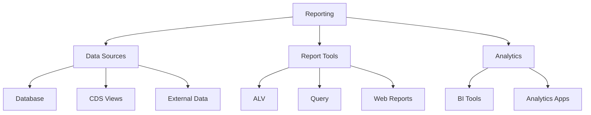
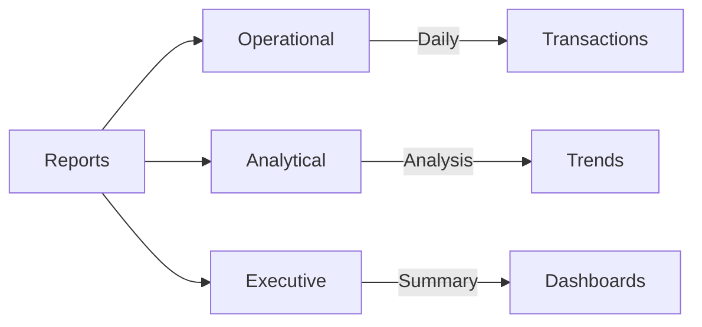
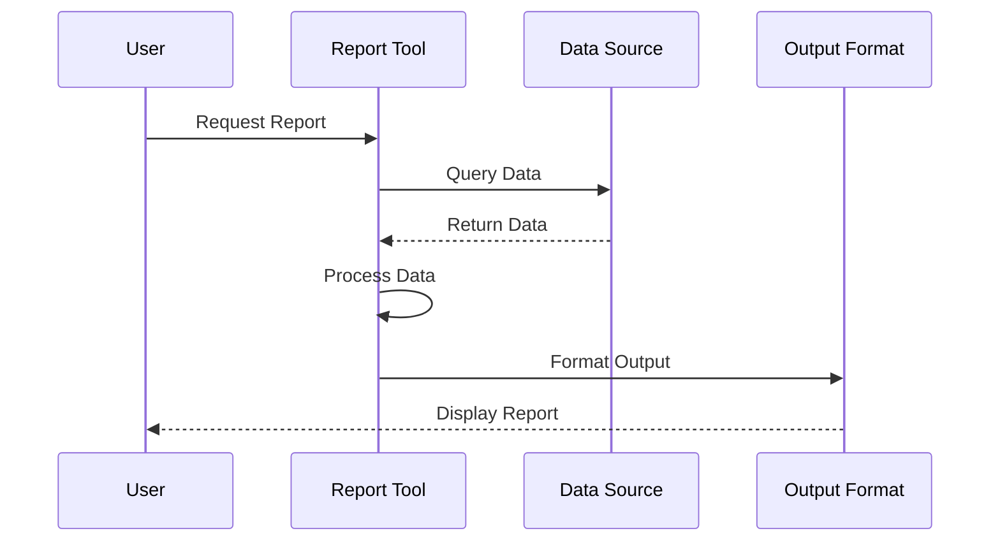
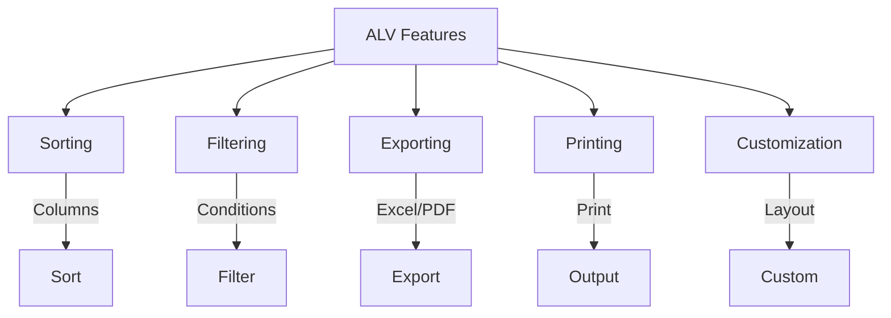
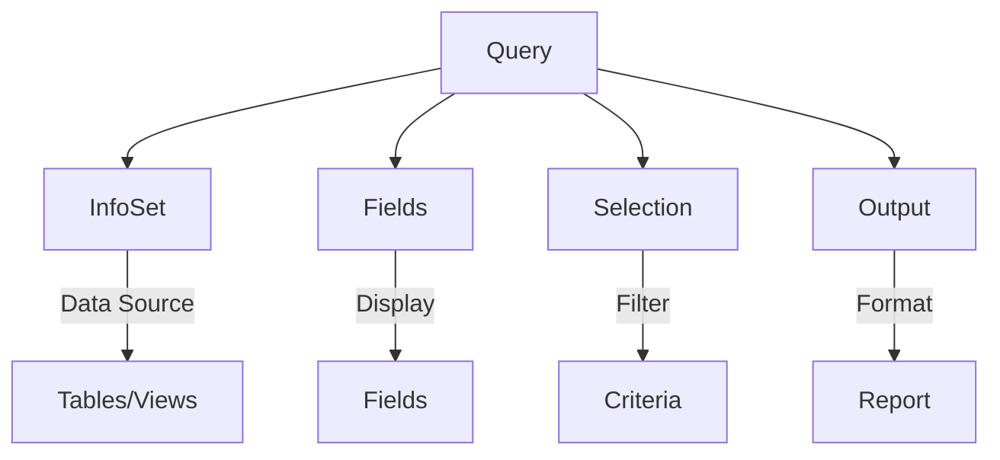
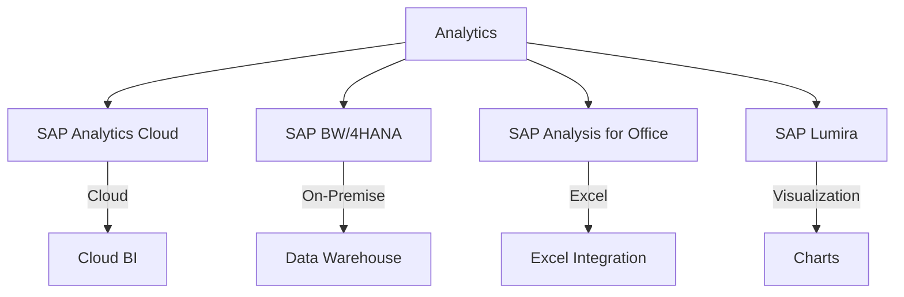
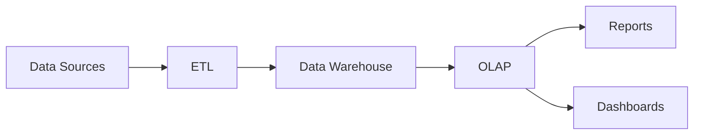
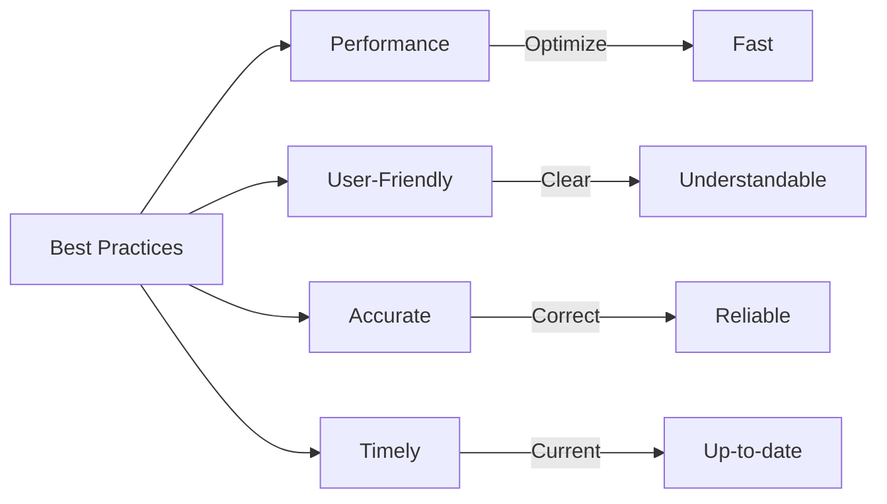

# SAP Reporting & Analytics Guide

**Complete guide to SAP reporting and analytics**

---

## 📚 Table of Contents

1. [Introduction](#introduction)
2. [Reporting Overview](#reporting-overview)
3. [Report Types](#report-types)
4. [ALV Reports](#alv-reports)
5. [Query Reports](#query-reports)
6. [Analytics Tools](#analytics-tools)
7. [Business Intelligence](#business-intelligence)
8. [Best Practices](#best-practices)
9. [Examples](#examples)

---

## Introduction

**SAP Reporting & Analytics** provides tools and techniques for extracting, analyzing, and presenting business data.

### Reporting Architecture



### Reporting Tools

| Tool | Purpose | Transaction |
|------|---------|-------------|
| **ALV** | List reports | SE38 |
| **Query** | Ad-hoc queries | SQ01 |
| **Report Painter** | Financial reports | GRR1 |
| **BI Tools** | Business intelligence | Various |

---

## Reporting Overview

### Report Categories



### Reporting Flow



---

## Report Types

### Report Classification

| Type | Description | Example |
|------|-------------|---------|
| **List Report** | Simple data list | Employee list |
| **Detail Report** | Detailed information | Leave request details |
| **Summary Report** | Aggregated data | Monthly summary |
| **Analytical Report** | Analysis and trends | Trend analysis |

---

## ALV Reports

### ALV Features



### ALV Report Example

```abap
REPORT z_leave_analytics_report.

DATA: lt_data TYPE TABLE OF zst_leave_report,
      lo_alv TYPE REF TO cl_salv_table.

SELECT-OPTIONS: s_date FOR sy-datum,
                 s_status FOR lt_data-status.

START-OF-SELECTION.
  " Get data
  SELECT * FROM zleave_req_hdr
    INTO CORRESPONDING FIELDS OF TABLE lt_data
    WHERE start_date IN s_date
      AND status IN s_status.

  " Create ALV
  cl_salv_table=>factory(
    IMPORTING r_salv_table = lo_alv
    CHANGING t_table = lt_data
  ).

  " Enable features
  lo_alv->get_functions( )->set_all( abap_true ).

  " Add aggregations
  lo_alv->get_aggregations( )->add_aggregation(
    columnname = 'DAYS'
    aggregation = if_salv_c_aggregation=>total
  ).

  " Display
  lo_alv->display( ).
```

**See**: [ALV Programming Guide](./ABAP-Guides/07_SAP_ABAP_ALV_PROGRAMMING_GUIDE.md) for details.

---

## Query Reports

### SAP Query

**Transaction**: SQ01 (Query)

**Purpose**: Create ad-hoc reports without programming

**Steps**:
1. Create query
2. Select data source
3. Define fields
4. Set selection criteria
5. Execute

### Query Structure



---

## Analytics Tools

### SAP Analytics Tools



### Analytics Capabilities

- **Data Visualization**: Charts and graphs
- **Dashboards**: Executive dashboards
- **Predictive Analytics**: Forecasting
- **Self-Service BI**: User-created reports

---

## Business Intelligence

### BI Architecture



### BI Components

1. **Data Extraction**: Extract from source systems
2. **Data Transformation**: Clean and transform
3. **Data Loading**: Load into data warehouse
4. **OLAP Processing**: Online analytical processing
5. **Reporting**: Generate reports

---

## Best Practices

### Reporting Best Practices



1. **Performance**: Optimize queries
2. **User Experience**: Clear and intuitive
3. **Data Accuracy**: Verify data correctness
4. **Timeliness**: Provide current data
5. **Documentation**: Document report purpose

---

## Examples

### Example 1: Analytics Report

```abap
REPORT z_leave_analytics.

" Analytics report with aggregations
DATA: lt_data TYPE TABLE OF zst_leave_analytics,
      lo_alv TYPE REF TO cl_salv_table,
      lo_aggregations TYPE REF TO cl_salv_aggregations.

SELECT-OPTIONS: s_year FOR sy-datum.

START-OF-SELECTION.
  " Get aggregated data
  SELECT leave_type
         COUNT(*) AS request_count
         SUM( days ) AS total_days
         AVG( days ) AS avg_days
    FROM zleave_req_hdr
    INTO CORRESPONDING FIELDS OF TABLE lt_data
    WHERE start_date IN s_year
    GROUP BY leave_type.

  " Create ALV
  cl_salv_table=>factory(
    IMPORTING r_salv_table = lo_alv
    CHANGING t_table = lt_data
  ).

  " Add aggregations
  lo_aggregations = lo_alv->get_aggregations( ).
  lo_aggregations->add_aggregation(
    columnname = 'TOTAL_DAYS'
    aggregation = if_salv_c_aggregation=>total
  ).

  " Display
  lo_alv->display( ).
```

---

## Common Transactions

| Transaction | Purpose |
|-------------|---------|
| **SE38** | ABAP Editor (reports) |
| **SQ01** | Query |
| **GRR1** | Report Painter |
| **SE80** | Object Navigator |

---

## References

- [Reports Guide](./ABAP-Guides/04_SAP_ABAP_REPORTS_GUIDE.md)
- [ALV Programming Guide](./ABAP-Guides/07_SAP_ABAP_ALV_PROGRAMMING_GUIDE.md)
- [Performance Guide](./ABAP-Guides/10_SAP_ABAP_PERFORMANCE_GUIDE.md)

---

**Related Guides**:
- [Testing Guide](./SAP_TESTING_GUIDE.md)

