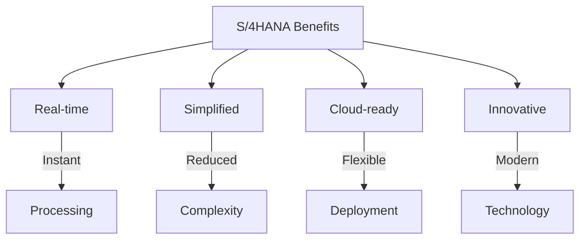
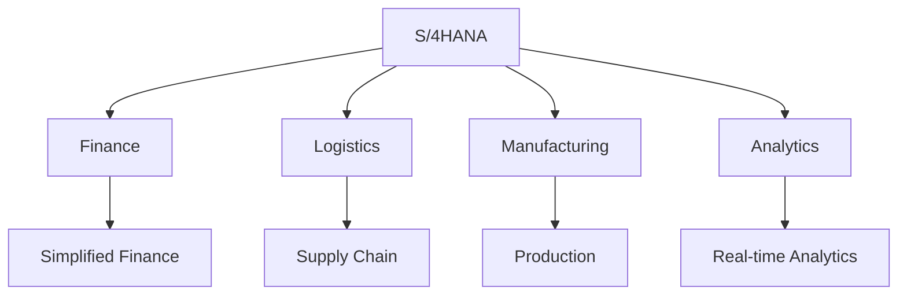
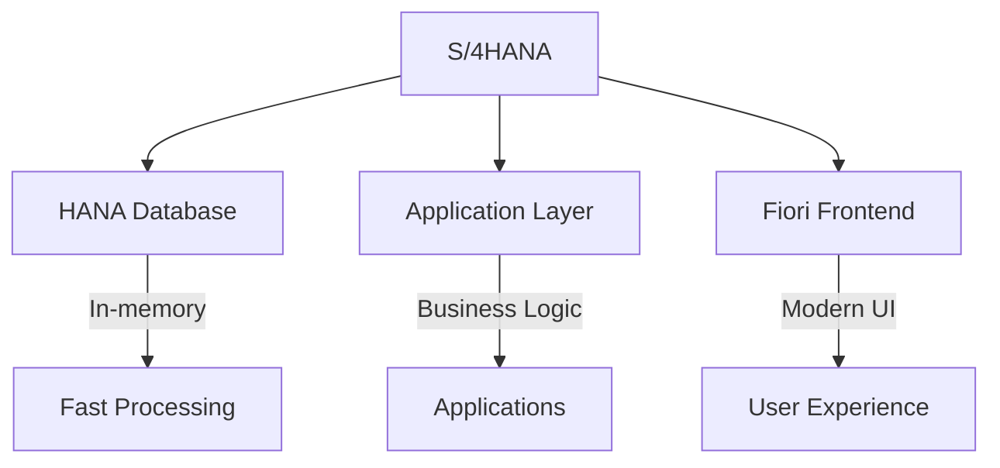
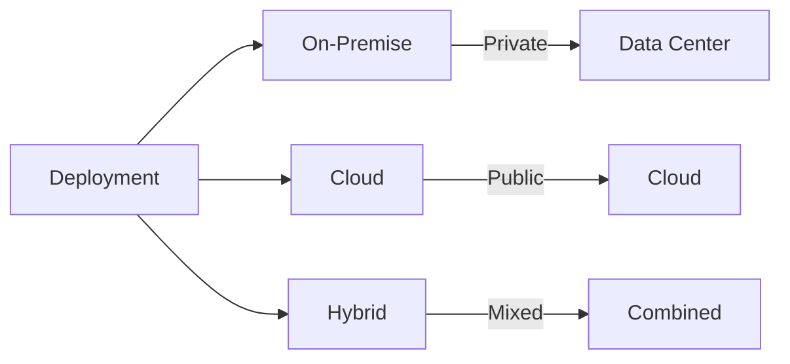
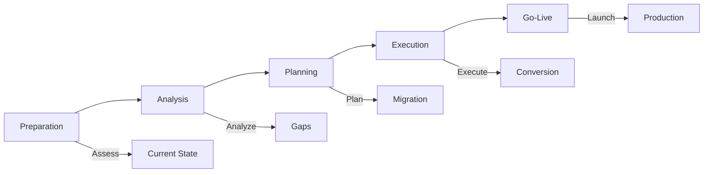

# SAP S/4HANA Guide

**Complete guide to SAP S/4HANA**

---

## 📚 Table of Contents

1. [Introduction](#introduction)
2. [S/4HANA Overview](#s4hana-overview)
3. [Key Features](#key-features)
4. [Architecture](#architecture)
5. [Deployment Options](#deployment-options)
6. [Migration](#migration)
7. [Fiori Integration](#fiori-integration)
8. [Best Practices](#best-practices)

---

## Introduction

**SAP S/4HANA** is SAP's next-generation ERP business suite, built on the SAP HANA in-memory database.

### S/4HANA Benefits

### S/4HANA vs. ECC

| Aspect | ECC | S/4HANA |
|--------|-----|---------|
| **Database** | Any database | HANA only |
| **User Interface** | SAP GUI | Fiori |
| **Architecture** | Traditional | Simplified |
| **Real-time** | Limited | Full |

---

## S/4HANA Overview

### S/4HANA Components

### Key Innovations

- **Simplified Data Model**: Reduced tables
- **Fiori UX**: Modern user experience
- **Real-time Analytics**: Embedded analytics
- **Cloud Architecture**: Cloud-first design

---

## Key Features

### Simplified Finance

**Features**:
- Universal Journal
- Central Finance
- Real-time reporting
- Simplified closing

### Advanced Logistics

**Features**:
- Material Ledger
- Advanced ATP
- Extended Warehouse Management
- Transportation Management

### Embedded Analytics

**Features**:
- Real-time reporting
- Embedded analytics
- Predictive analytics
- Machine learning

---

## Architecture

### S/4HANA Architecture

### Technical Architecture

- **Database**: SAP HANA
- **Application Server**: ABAP Platform
- **Frontend**: SAP Fiori
- **Integration**: Cloud Platform

---

## Deployment Options

### Deployment Models

### Deployment Options

| Option | Description | Use Case |
|--------|-------------|----------|
| **On-Premise** | Customer data center | Full control |
| **Cloud** | SAP Cloud | Managed service |
| **Hybrid** | Combination | Flexible |

---

## Migration

### Migration Paths

**From ECC to S/4HANA**:
1. System conversion
2. New implementation
3. Landscape transformation

### Migration Process

---

## Fiori Integration

### Fiori Apps

**Categories**:
- Transactional apps
- Analytical apps
- Fact sheet apps

### Fiori Launchpad

**Features**:
- Role-based access
- Personalized tiles
- Responsive design

---

## Best Practices

### S/4HANA Best Practices

1. **Planning**: Comprehensive migration planning
2. **Training**: User training on Fiori
3. **Simplification**: Leverage simplifications
4. **Cloud**: Consider cloud deployment
5. **Innovation**: Adopt new capabilities

---

## Common Transactions

| Transaction | Purpose |
|-------------|---------|
| **Fiori Launchpad** | Access apps |
| **SE16N** | Data Browser |
| **SE80** | Object Navigator |

---

## References

- [ERP Fundamentals Guide](./SAP_ERP_FUNDAMENTALS_GUIDE.md)
- [Integration Guide](./SAP_INTEGRATION_GUIDE.md)
- [SAP Help - S/4HANA](https://help.sap.com/)

---

**Related Guides**:
- [ABAP Guides](./ABAP-Guides/)

