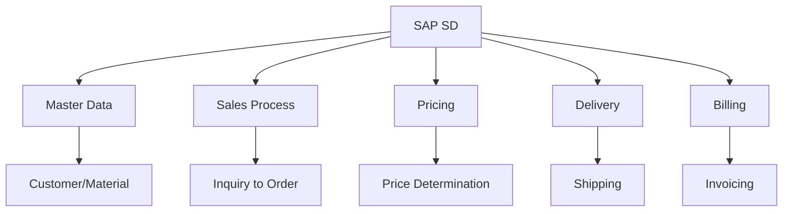
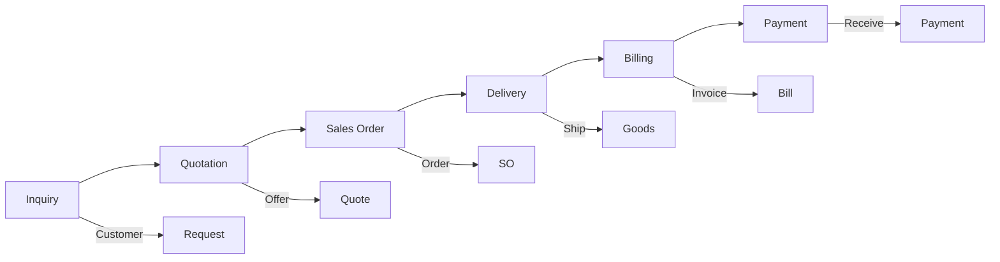
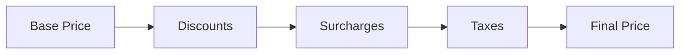
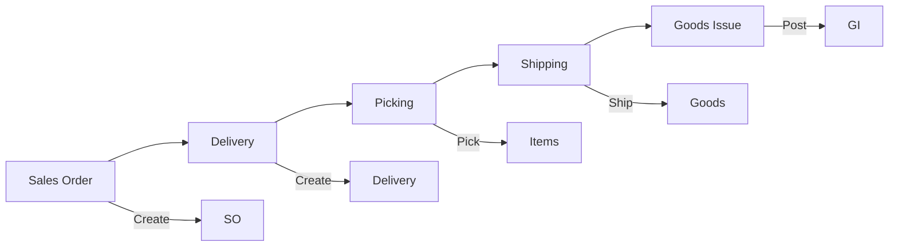
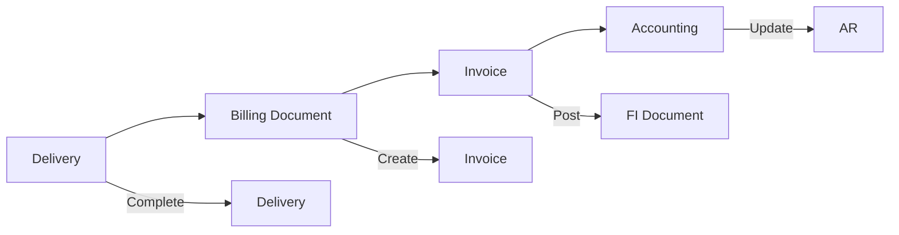
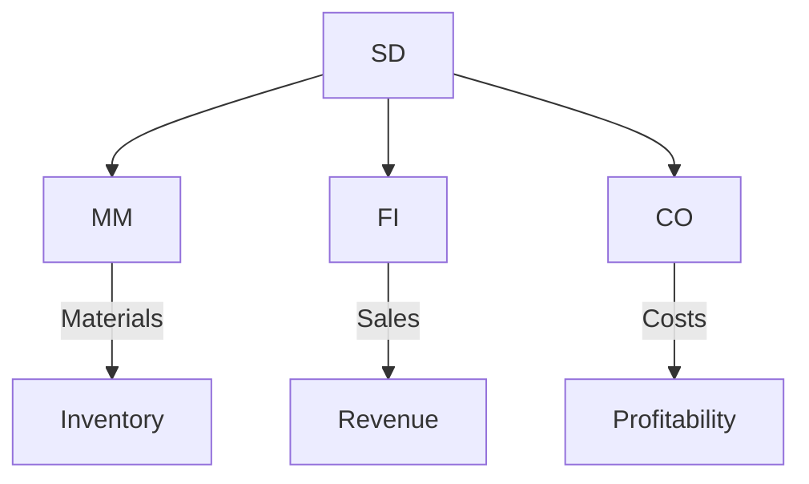

# SAP SD (Sales & Distribution) Guide

**Complete guide to SAP Sales & Distribution module**

---

## 📚 Table of Contents

1. [Introduction](#introduction)
2. [SD Overview](#sd-overview)
3. [SD Master Data](#sd-master-data)
4. [Sales Process](#sales-process)
5. [Pricing](#pricing)
6. [Delivery](#delivery)
7. [Billing](#billing)
8. [Integration](#integration)
9. [Best Practices](#best-practices)

---

## Introduction

**SAP SD (Sales & Distribution)** manages sales processes from inquiry to delivery and billing.

### SD Architecture

### SD Benefits

- ✅ **End-to-End**: Complete sales cycle
- ✅ **Integration**: Integrated with FI/MM
- ✅ **Pricing**: Flexible pricing
- ✅ **Efficiency**: Streamlined processes

---

## SD Overview

### SD Process Flow

### Key Transactions

| Transaction | Purpose |
|-------------|---------|
| **VA01** | Create Sales Order |
| **VA02** | Change Sales Order |
| **VA03** | Display Sales Order |
| **VL01N** | Create Delivery |
| **VF01** | Create Billing Document |
| **VD01** | Create Customer |

---

## SD Master Data

### Customer Master

**Key Data**:
- Customer number
- Name and address
- Sales area
- Payment terms
- Pricing conditions

**Transactions**:
- **VD01**: Create Customer
- **VD02**: Change Customer
- **VD03**: Display Customer

### Material Master

**Key Data**:
- Material number
- Description
- Sales data
- Pricing
- Units of measure

### Pricing Conditions

**Condition Types**:
- Price (PR00)
- Discount (RA00)
- Surcharge (ZU00)
- Freight (FRB1)

---

## Sales Process

### Sales Order Creation

**Steps**:
1. Enter customer
2. Enter material
3. Enter quantity
4. System determines price
5. Save order

**Transaction**: VA01

### Sales Order Types

| Order Type | Description |
|------------|-------------|
| **OR** | Standard Order |
| **CR** | Credit Order |
| **RE** | Returns |
| **ZOR** | Custom Order |

---

## Pricing

### Pricing Procedure

### Price Determination

**Factors**:
- Material price
- Customer discount
- Quantity discount
- Promotional pricing
- Taxes

---

## Delivery

### Delivery Process

### Delivery Document

**Key Information**:
- Delivery number
- Shipping point
- Route
- Delivery date

**Transaction**: VL01N

---

## Billing

### Billing Process

### Billing Document

**Key Information**:
- Billing document number
- Invoice date
- Payment terms
- Tax amount

**Transaction**: VF01

---

## Integration

### SD Integration Points

### Integration Examples

- **SD-MM**: Sales orders create material requirements
- **SD-FI**: Billing creates accounting documents
- **SD-CO**: Sales analysis for profitability

---

## Best Practices

### SD Best Practices

1. **Master Data**: Accurate customer/material data
2. **Pricing**: Consistent pricing rules
3. **Process Standardization**: Standard processes
4. **Document Flow**: Clear document flow
5. **Integration**: Proper integration setup

---

## Common Transactions

| Transaction | Purpose |
|-------------|---------|
| **VA01** | Create Sales Order |
| **VA02** | Change Sales Order |
| **VA03** | Display Sales Order |
| **VL01N** | Create Delivery |
| **VF01** | Create Billing Document |
| **VD01** | Create Customer |

---

## References

- [FI Guide](./SAP_FI_GUIDE.md)
- [MM Guide](./SAP_MM_GUIDE.md)
- [Integration Guide](./SAP_INTEGRATION_GUIDE.md)

---

**Related Guides**:
- [ERP Fundamentals Guide](./SAP_ERP_FUNDAMENTALS_GUIDE.md)

