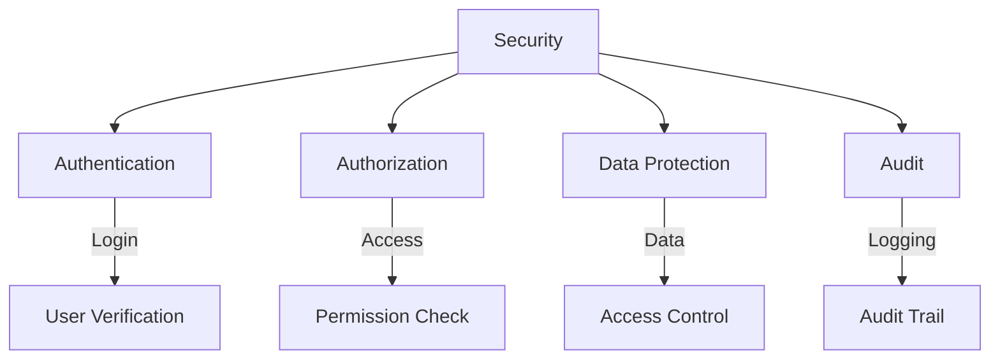
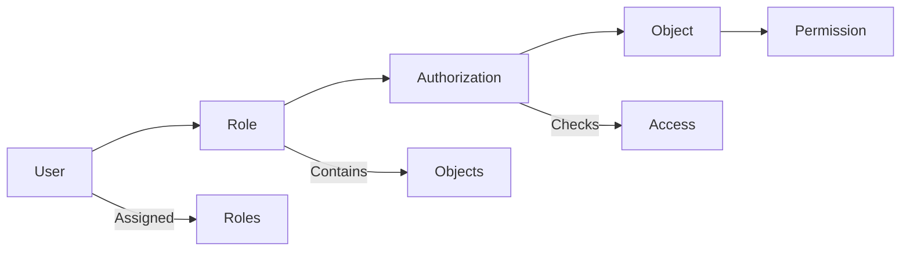
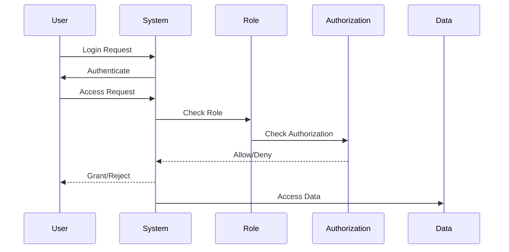
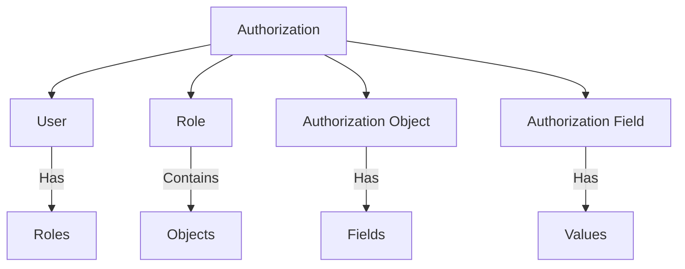
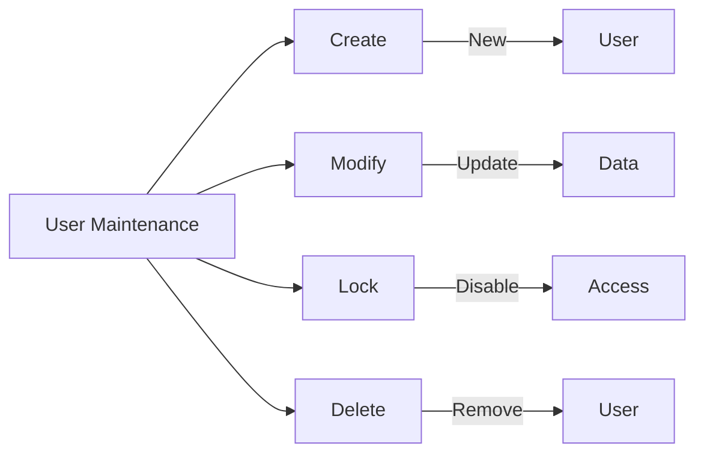
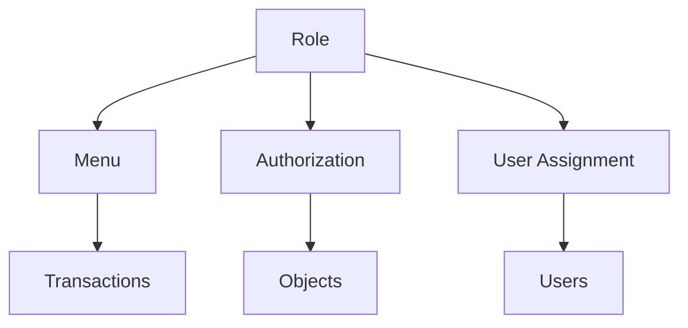
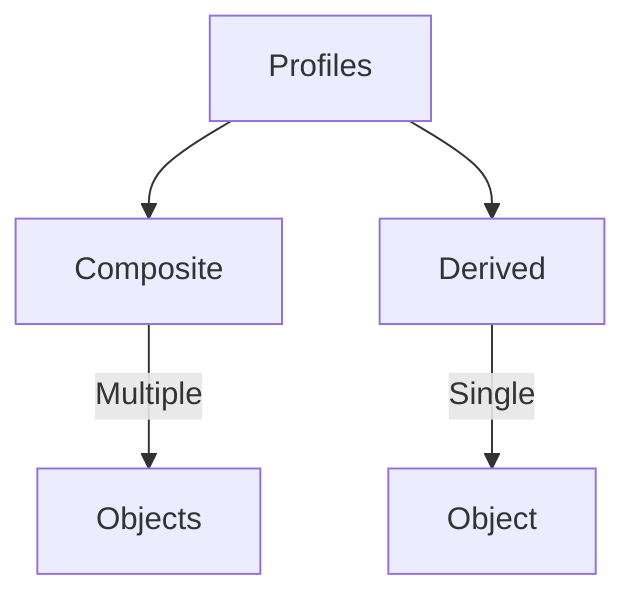
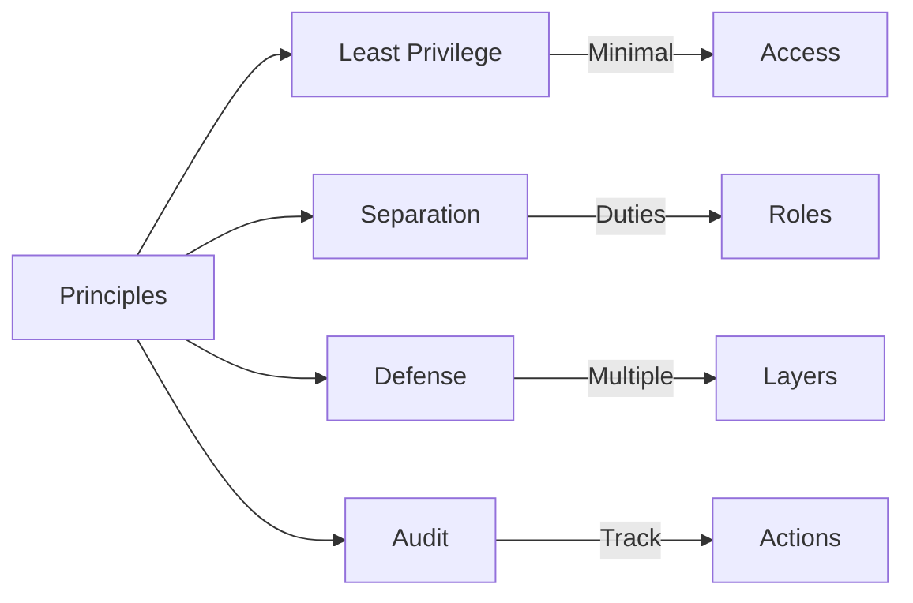

# SAP Security & Authorization Guide

**Complete guide to SAP security and authorization**

---

## 📚 Table of Contents

1. [Introduction](#introduction)
2. [Security Overview](#security-overview)
3. [Authorization Concept](#authorization-concept)
4. [User Management](#user-management)
5. [Role Management](#role-management)
6. [Authorization Objects](#authorization-objects)
7. [Profile Management](#profile-management)
8. [Security Best Practices](#security-best-practices)
9. [Examples](#examples)

---

## Introduction

**SAP Security** ensures that only authorized users can access appropriate data and functions in the SAP system.

### Security Layers



### Security Components

| Component | Purpose | Transaction |
|-----------|---------|-------------|
| **User Management** | User accounts | SU01 |
| **Role Management** | User roles | PFCG |
| **Authorization Objects** | Permission checks | SU21 |
| **Profiles** | Permission sets | SU02 |

---

## Security Overview

### Security Architecture



### Security Flow



---

## Authorization Concept

### Authorization Components



### Authorization Check

```abap
" Check transaction authorization
AUTHORITY-CHECK OBJECT 'S_TCODE'
  ID 'TCD' FIELD 'ZLEAVE_CREATE'.

IF sy-subrc <> 0.
  MESSAGE 'Not authorized' TYPE 'E'.
  RETURN.
ENDIF.

" Check table authorization
AUTHORITY-CHECK OBJECT 'S_TABU_NAM'
  ID 'ACTVT' FIELD '02' " Display
  ID 'TABLE' FIELD 'ZLEAVE_REQ_HDR'.

IF sy-subrc <> 0.
  MESSAGE 'Not authorized to view table' TYPE 'E'.
  RETURN.
ENDIF.
```

---

## User Management

### User Types

| Type | Description | Use Case |
|------|-------------|----------|
| **Dialog User** | Interactive user | End users |
| **System User** | System communication | Background jobs |
| **Service User** | Service account | System integration |
| **Reference User** | Template user | User templates |

### Creating Users

**Transaction**: SU01

**Steps**:
1. Enter user ID
2. Click "Create"
3. Enter user data
4. Assign roles
5. Set password
6. Save

### User Maintenance



---

## Role Management

### Role Structure



### Creating Roles

**Transaction**: PFCG (Role Maintenance)

**Steps**:
1. Enter role name
2. Click "Create"
3. Add menu (transactions)
4. Add authorizations
5. Generate profile
6. Assign users
7. Activate

### Role Example

```
Role: ZLEAVE_EMPLOYEE
├── Menu
│   ├── ZLEAVE_CREATE
│   └── ZLEAVE_HISTORY
├── Authorizations
│   ├── S_TCODE: ZLEAVE_CREATE, ZLEAVE_HISTORY
│   └── S_TABU_NAM: ZLEAVE_REQ_HDR (Display)
└── Users
    └── Employee users
```

---

## Authorization Objects

### Common Authorization Objects

| Object | Purpose | Fields |
|--------|---------|--------|
| **S_TCODE** | Transaction authorization | TCD |
| **S_TABU_NAM** | Table authorization | ACTVT, TABLE |
| **S_DEVELOP** | Development authorization | DEVCLASS, OBJTYPE |
| **S_USER_GRP** | User group | CLASS |

### Creating Authorization Objects

**Transaction**: SU21

**Steps**:
1. Enter object name
2. Click "Create"
3. Define fields
4. Define field values
5. Activate

### Authorization Object Example

```abap
" Object: ZLEAVE_REQ
" Fields:
"   ACTVT - Activity (01=Create, 02=Display, 03=Change, 06=Delete)
"   REQ_TYPE - Request Type (ANNU, SICK, etc.)

" Check authorization
AUTHORITY-CHECK OBJECT 'ZLEAVE_REQ'
  ID 'ACTVT' FIELD '02'
  ID 'REQ_TYPE' FIELD 'ANNU'.

IF sy-subrc <> 0.
  MESSAGE 'Not authorized' TYPE 'E'.
ENDIF.
```

---

## Profile Management

### Profile Types



### Profile Structure

**Profile** = Collection of authorizations

**Generated from**: Role authorizations

**Assigned to**: Users via roles

---

## Security Best Practices

### Security Principles



1. **Least Privilege**: Grant minimum required access
2. **Role-Based Access**: Use roles, not direct authorizations
3. **Regular Reviews**: Review user access regularly
4. **Strong Passwords**: Enforce password policies
5. **Audit Logging**: Log security events

### Security Checklist

- ✅ User accounts properly managed
- ✅ Roles assigned correctly
- ✅ Authorization checks in code
- ✅ Regular access reviews
- ✅ Audit logging enabled
- ✅ Password policies enforced

---

## Examples

### Example 1: Authorization Check in Program

```abap
REPORT z_secure_leave_report.

" Check transaction authorization
AUTHORITY-CHECK OBJECT 'S_TCODE'
  ID 'TCD' FIELD sy-tcode.

IF sy-subrc <> 0.
  MESSAGE 'Not authorized to execute this transaction' TYPE 'E'.
  LEAVE PROGRAM.
ENDIF.

SELECT-OPTIONS: s_empno FOR sy-uname.

AT SELECTION-SCREEN.
  " Check user can only see their own data (unless HR)
  LOOP AT s_empno.
    IF s_empno-low <> sy-uname.
      " Check HR authorization
      AUTHORITY-CHECK OBJECT 'ZLEAVE_HR'
        ID 'ACTVT' FIELD '02'.
      IF sy-subrc <> 0.
        MESSAGE 'Not authorized to view other employees' TYPE 'E'.
      ENDIF.
    ENDIF.
  ENDLOOP.

START-OF-SELECTION.
  " Check table authorization
  AUTHORITY-CHECK OBJECT 'S_TABU_NAM'
    ID 'ACTVT' FIELD '02'
    ID 'TABLE' FIELD 'ZLEAVE_REQ_HDR'.

  IF sy-subrc <> 0.
    MESSAGE 'Not authorized to view table' TYPE 'E'.
    RETURN.
  ENDIF.

  " Get data with authorization
  SELECT * FROM zleave_req_hdr
    INTO TABLE @DATA(lt_data)
    WHERE employee_id IN @s_empno.
```

---

## Common Transactions

| Transaction | Purpose |
|-------------|---------|
| **SU01** | User Maintenance |
| **PFCG** | Role Maintenance |
| **SU21** | Authorization Objects |
| **SU02** | Profile Maintenance |
| **SU53** | Authorization Check |
| **SM19** | Security Audit Log |

---

## Troubleshooting

### Common Issues

1. **Authorization Errors**
   - Check SU53 for missing authorization
   - Verify role assignment
   - Check authorization values

2. **User Cannot Access**
   - Verify user is active
   - Check role assignment
   - Verify profile generation

3. **Too Much Access**
   - Review role authorizations
   - Remove unnecessary permissions
   - Implement least privilege

---

## References

- [ABAP Security Guide](./ABAP-Guides/13_SAP_ABAP_SECURITY_GUIDE.md)
- [Integration Guide](./SAP_INTEGRATION_GUIDE.md)
- [SAP Help - Security](https://help.sap.com/)

---

**Related Guides**:
- [Testing Guide](./SAP_TESTING_GUIDE.md)

