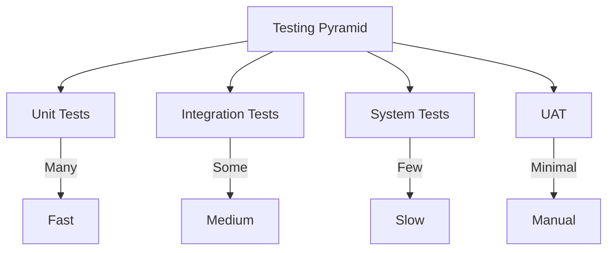
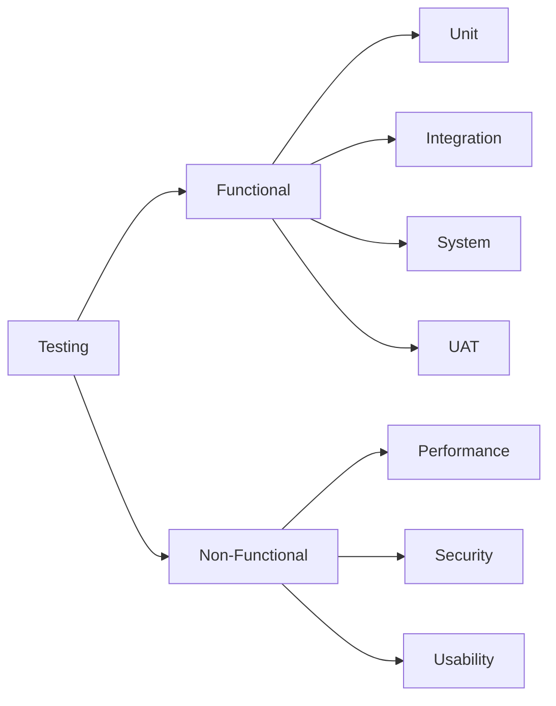
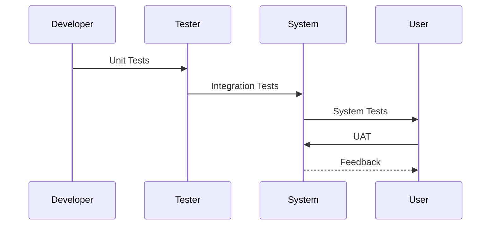
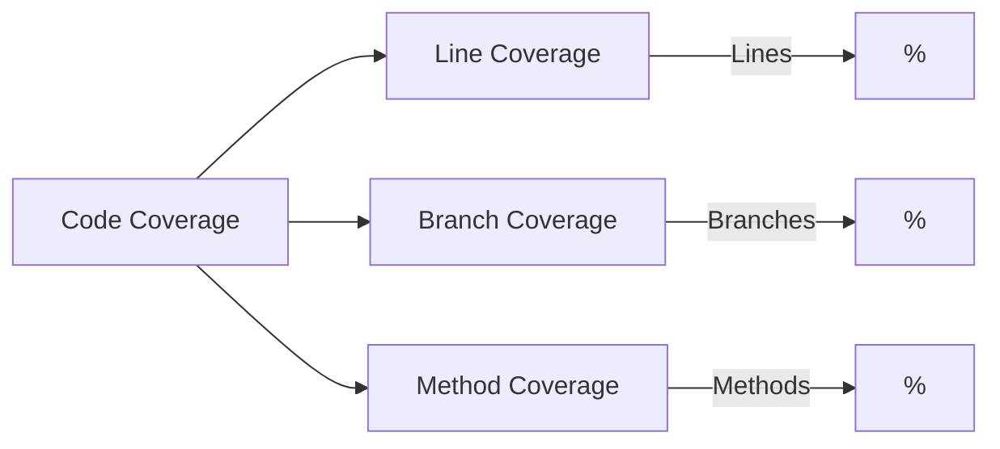
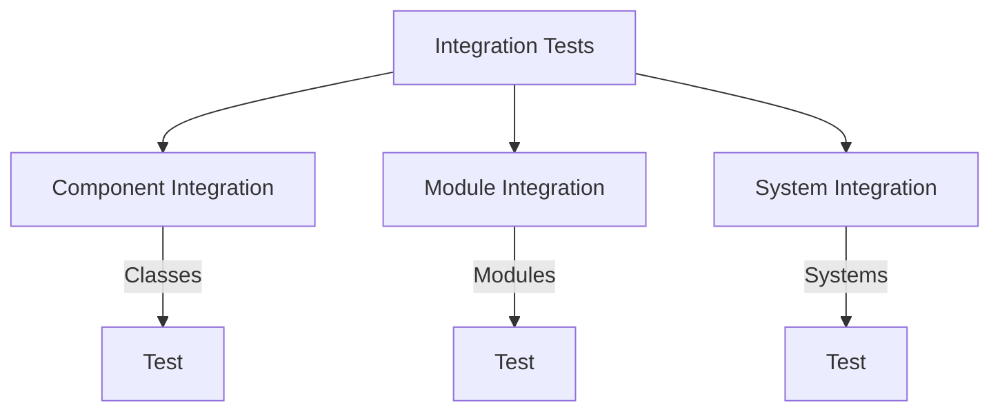
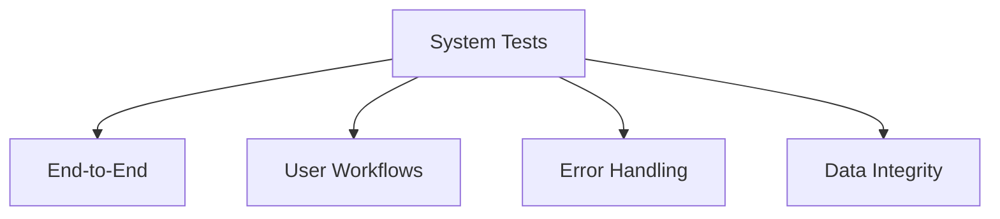
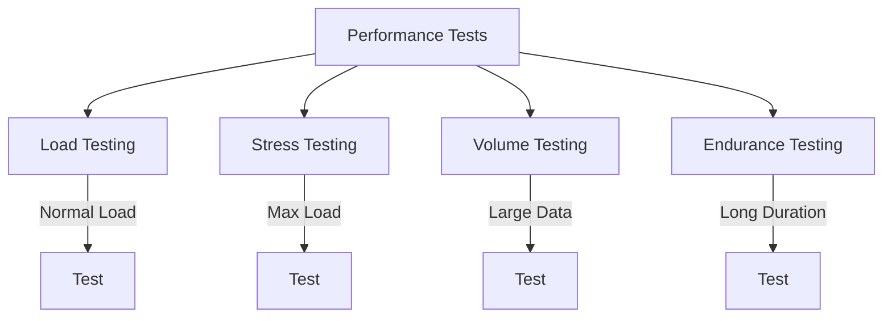
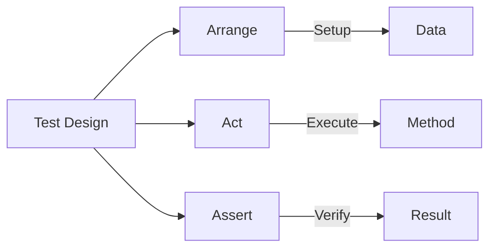

# SAP Testing Guide

**Complete guide to testing SAP applications**

---

## 📚 Table of Contents

1. [Introduction](#introduction)
2. [Testing Overview](#testing-overview)
3. [Unit Testing](#unit-testing)
4. [Integration Testing](#integration-testing)
5. [System Testing](#system-testing)
6. [User Acceptance Testing](#user-acceptance-testing)
7. [Performance Testing](#performance-testing)
8. [Test Automation](#test-automation)
9. [Best Practices](#best-practices)
10. [Examples](#examples)

---

## Introduction

**Testing** is crucial for ensuring SAP applications work correctly, meet requirements, and perform well.

### Testing Pyramid



### Testing Types



---

## Testing Overview

### Testing Levels

| Level | Scope | Responsibility |
|-------|-------|----------------|
| **Unit Testing** | Individual components | Developers |
| **Integration Testing** | Component interaction | Developers/Testers |
| **System Testing** | Complete system | Testers |
| **UAT** | Business scenarios | Users |

### Testing Process



---

## Unit Testing

### ABAP Unit Testing

**Framework**: ABAP Unit (built into ABAP)

### Test Class Structure

```abap
CLASS ltc_leave_calculator DEFINITION
  FOR TESTING
  RISK LEVEL HARMLESS
  DURATION SHORT.

  PRIVATE SECTION.
    METHODS test_calculate_days FOR TESTING.
    METHODS test_calculate_days_weekend FOR TESTING.
    METHODS test_calculate_days_invalid FOR TESTING.

ENDCLASS.

CLASS ltc_leave_calculator IMPLEMENTATION.

  METHOD test_calculate_days.
    " Arrange
    DATA: lo_calc TYPE REF TO zcl_leave_calculator,
          lv_days TYPE zleave_days.

    CREATE OBJECT lo_calc.

    " Act
    lv_days = lo_calc->calculate_days(
      iv_start_date = '20260119'
      iv_end_date = '20260123'
    ).

    " Assert
    cl_abap_unit_assert=>assert_equals(
      exp = 5
      act = lv_days
      msg = 'Days should be 5'
    ).
  ENDMETHOD.

  METHOD test_calculate_days_weekend.
    " Test with weekend
    DATA: lo_calc TYPE REF TO zcl_leave_calculator,
          lv_days TYPE zleave_days.

    CREATE OBJECT lo_calc.

    lv_days = lo_calc->calculate_days(
      iv_start_date = '20260119' " Monday
      iv_end_date = '20260125'    " Sunday
    ).

    " Should exclude weekends
    cl_abap_unit_assert=>assert_equals(
      exp = 5
      act = lv_days
      msg = 'Should exclude weekends'
    ).
  ENDMETHOD.

ENDCLASS.
```

### Running Unit Tests

**Transaction**: SE80 → Class → Unit Tests → Execute

**Or**: Use ATC (ABAP Test Cockpit)

### Test Coverage



**Target**: 80%+ code coverage

---

## Integration Testing

### Integration Test Scenarios



### Integration Test Example

```abap
" Test leave request creation flow
CLASS ltc_leave_integration DEFINITION
  FOR TESTING
  RISK LEVEL CRITICAL
  DURATION LONG.

  PRIVATE SECTION.
    METHODS test_create_request_flow FOR TESTING.

ENDCLASS.

CLASS ltc_leave_integration IMPLEMENTATION.

  METHOD test_create_request_flow.
    " Test complete flow: Validation → Creation → Workflow
    
    DATA: lo_request TYPE REF TO zcl_leave_request,
          lo_validator TYPE REF TO zcl_leave_validator,
          ls_request_data TYPE zst_leave_request,
          lv_request_id TYPE zleave_req_id,
          lt_messages TYPE bapiret2_t.

    CREATE OBJECT lo_request.
    CREATE OBJECT lo_validator.

    " Prepare test data
    ls_request_data-employee_id = '00001234'.
    ls_request_data-leave_type = 'ANNU'.
    ls_request_data-start_date = '20260119'.
    ls_request_data-end_date = '20260123'.

    " Validate
    lo_validator->validate_request(
      EXPORTING is_request_data = ls_request_data
      IMPORTING ev_valid = DATA(lv_valid)
                et_messages = lt_messages
    ).

    cl_abap_unit_assert=>assert_true(
      act = lv_valid
      msg = 'Validation should pass'
    ).

    " Create request
    lo_request->create_request(
      EXPORTING is_request_data = ls_request_data
      IMPORTING ev_request_id = lv_request_id
                et_messages = lt_messages
    ).

    cl_abap_unit_assert=>assert_not_initial(
      act = lv_request_id
      msg = 'Request ID should be generated'
    ).

  ENDMETHOD.

ENDCLASS.
```

---

## System Testing

### System Test Scenarios

**Purpose**: Test complete system functionality

### Test Scenarios



### System Test Example

```abap
" System test: Complete leave request process
" 1. Employee creates request
" 2. System validates
" 3. Workflow triggers
" 4. Manager approves
" 5. Employee receives confirmation

" Manual test script:
" Step 1: Create leave request
" - Transaction: ZLEAVE_CREATE
" - Enter employee: 00001234
" - Enter dates: 2026-01-19 to 2026-01-23
" - Submit
" Expected: Request created with ID

" Step 2: Check workflow
" - Transaction: SWI1
" - Find workflow for request
" Expected: Workflow active

" Step 3: Approve request
" - Transaction: SWI2
" - Open approval task
" - Approve
" Expected: Status changed to Approved

" Step 4: Verify confirmation
" - Check email sent
" - Check request status
" Expected: Status = 'A', Email sent
```

---

## User Acceptance Testing

### UAT Process


### UAT Scenarios

**Scenario 1: Create Leave Request**
- User creates annual leave request
- System validates input
- Request is created
- User receives confirmation

**Scenario 2: Approve Leave Request**
- Manager receives notification
- Manager opens approval task
- Manager approves request
- Employee receives confirmation

**Scenario 3: View Leave History**
- User opens history screen
- User applies filters
- System displays filtered results
- User exports to Excel

---

## Performance Testing

### Performance Test Types



### Performance Metrics

| Metric | Target | Measurement |
|--------|--------|-------------|
| **Response Time** | < 2 seconds | Transaction duration |
| **Throughput** | 100 req/hour | Requests per hour |
| **Database Time** | < 500ms | Query execution |
| **Memory Usage** | < 2GB | System memory |

### Performance Test Example

```abap
" Performance test: Create multiple requests
DATA: lv_start_time TYPE timestampl,
      lv_end_time TYPE timestampl,
      lv_duration TYPE i,
      lv_count TYPE i.

" Start timer
GET TIME STAMP FIELD lv_start_time.

" Create 100 requests
DO 100 TIMES.
  " Create request
  PERFORM create_test_request.
  lv_count = lv_count + 1.
ENDDO.

" End timer
GET TIME STAMP FIELD lv_end_time.

" Calculate duration
lv_duration = cl_abap_tstmp=>subtract(
  tstmp1 = lv_end_time
  tstmp2 = lv_start_time
).

" Check performance
IF lv_duration > 200. " 200 seconds for 100 requests
  cl_abap_unit_assert=>fail( 'Performance not met' ).
ENDIF.
```

---

## Test Automation

### Automation Tools

| Tool | Purpose | Use Case |
|------|---------|----------|
| **ABAP Unit** | Unit testing | Developer tests |
| **eCATT** | System testing | Automated scenarios |
| **SAP Test Data Migration Server** | Test data | Data management |

### Automated Test Example

```abap
" Automated integration test
CLASS ltc_automated_test DEFINITION
  FOR TESTING
  RISK LEVEL CRITICAL.

  PRIVATE SECTION.
    METHODS setup.
    METHODS teardown.
    METHODS test_automated_flow FOR TESTING.

ENDCLASS.

CLASS ltc_automated_test IMPLEMENTATION.

  METHOD setup.
    " Prepare test environment
    " Create test data
  ENDMETHOD.

  METHOD teardown.
    " Clean up test data
  ENDMETHOD.

  METHOD test_automated_flow.
    " Automated test execution
    " Verify results
  ENDMETHOD.

ENDCLASS.
```

---

## Best Practices

### Test Design



1. **Arrange-Act-Assert**: Clear test structure
2. **Isolated Tests**: Each test independent
3. **Test Data**: Use test data, not production
4. **Clear Assertions**: Specific error messages
5. **Test Coverage**: Aim for 80%+

### Test Organization

```abap
" Recommended test class structure:
CLASS ltc_component_name DEFINITION
  FOR TESTING
  RISK LEVEL HARMLESS
  DURATION SHORT.

  PRIVATE SECTION.
    " Setup/Teardown
    METHODS setup.
    METHODS teardown.

    " Positive tests
    METHODS test_success_scenario FOR TESTING.
    
    " Negative tests
    METHODS test_error_scenario FOR TESTING.
    
    " Edge cases
    METHODS test_edge_case FOR TESTING.

ENDCLASS.
```

---

## Examples

### Example 1: Complete Test Suite

```abap
CLASS ltc_leave_validator DEFINITION
  FOR TESTING
  RISK LEVEL HARMLESS
  DURATION SHORT.

  PRIVATE SECTION.
    DATA: lo_validator TYPE REF TO zcl_leave_validator.

    METHODS setup.
    METHODS test_validate_valid_request FOR TESTING.
    METHODS test_validate_invalid_employee FOR TESTING.
    METHODS test_validate_overlapping_dates FOR TESTING.

ENDCLASS.

CLASS ltc_leave_validator IMPLEMENTATION.

  METHOD setup.
    CREATE OBJECT lo_validator.
  ENDMETHOD.

  METHOD test_validate_valid_request.
    " Arrange
    DATA: ls_request TYPE zst_leave_request,
          lv_valid TYPE abap_bool,
          lt_messages TYPE bapiret2_t.

    ls_request-employee_id = '00001234'.
    ls_request-leave_type = 'ANNU'.
    ls_request-start_date = '20260119'.
    ls_request-end_date = '20260123'.

    " Act
    lo_validator->validate_request(
      EXPORTING is_request_data = ls_request
      IMPORTING ev_valid = lv_valid
                et_messages = lt_messages
    ).

    " Assert
    cl_abap_unit_assert=>assert_true(
      act = lv_valid
      msg = 'Valid request should pass'
    ).
    cl_abap_unit_assert=>assert_initial(
      act = lt_messages
      msg = 'No error messages expected'
    ).
  ENDMETHOD.

  METHOD test_validate_invalid_employee.
    " Test invalid employee
    DATA: ls_request TYPE zst_leave_request,
          lv_valid TYPE abap_bool,
          lt_messages TYPE bapiret2_t.

    ls_request-employee_id = '99999999'. " Invalid
    ls_request-start_date = '20260119'.
    ls_request-end_date = '20260123'.

    lo_validator->validate_request(
      EXPORTING is_request_data = ls_request
      IMPORTING ev_valid = lv_valid
                et_messages = lt_messages
    ).

    cl_abap_unit_assert=>assert_false(
      act = lv_valid
      msg = 'Invalid employee should fail'
    ).
    cl_abap_unit_assert=>assert_not_initial(
      act = lt_messages
      msg = 'Error messages expected'
    ).
  ENDMETHOD.

ENDCLASS.
```

---

## Common Transactions

| Transaction | Purpose |
|-------------|---------|
| **SE80** | Object Navigator (run tests) |
| **ATC** | ABAP Test Cockpit |
| **SE38** | ABAP Editor |
| **SWI1** | Workflow Monitor |
| **SM37** | Background Jobs |

---

## Troubleshooting

### Common Issues

1. **Tests Not Running**
   - Check test class is active
   - Verify FOR TESTING flag
   - Check test method names

2. **Test Failures**
   - Review assertion messages
   - Check test data
   - Verify expected results

3. **Performance Issues**
   - Optimize test data
   - Use test doubles
   - Limit test scope

---

## References

- [Unit Testing Guide](./ABAP-Guides/14_SAP_ABAP_UNIT_TESTING_GUIDE.md)
- [Performance Guide](./ABAP-Guides/10_SAP_ABAP_PERFORMANCE_GUIDE.md)
- [Best Practices Guide](./ABAP-Guides/12_SAP_ABAP_BEST_PRACTICES_GUIDE.md)

---

**Related Guides**:
- [Capstone Testing Guide](../Capstone/Employee-Leave-System/Phase3_Testing_QA.md)

