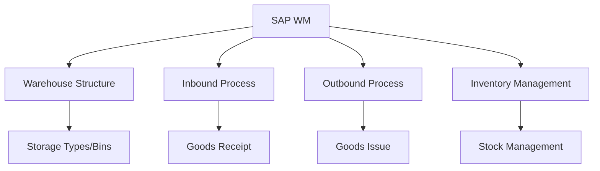
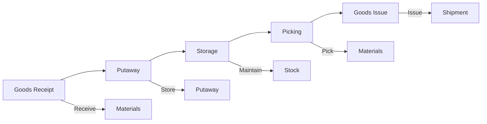
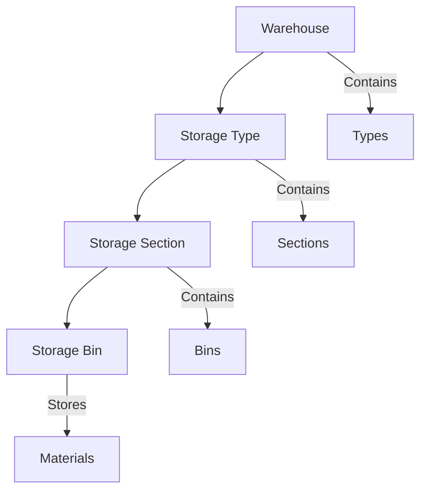
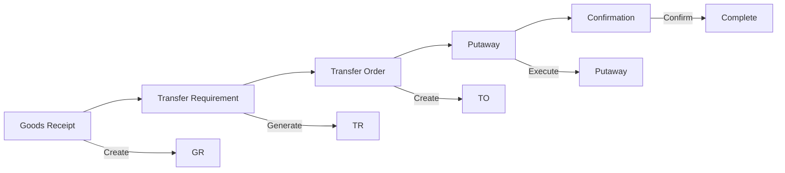
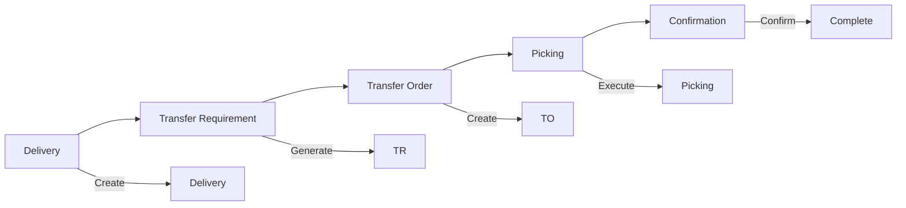
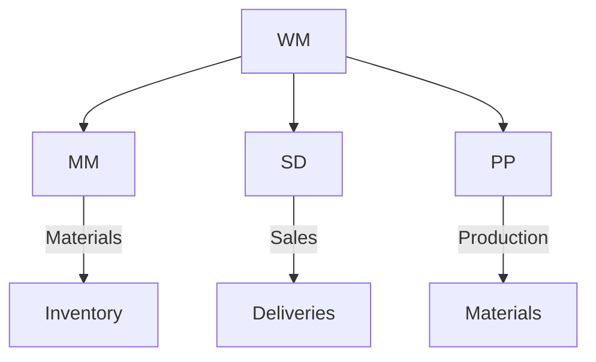

# SAP WM (Warehouse Management) Guide

**Complete guide to SAP Warehouse Management module**

---

## 📚 Table of Contents

1. [Introduction](#introduction)
2. [WM Overview](#wm-overview)
3. [WM Master Data](#wm-master-data)
4. [Warehouse Structure](#warehouse-structure)
5. [Inbound Process](#inbound-process)
6. [Outbound Process](#outbound-process)
7. [Inventory Management](#inventory-management)
8. [Integration](#integration)
9. [Best Practices](#best-practices)

---

## Introduction

**SAP WM (Warehouse Management)** manages warehouse operations and inventory movements.

### WM Architecture

### WM Benefits

- ✅ **Efficiency**: Optimized warehouse operations
- ✅ **Accuracy**: Accurate inventory tracking
- ✅ **Integration**: Integrated with MM/SD
- ✅ **Visibility**: Real-time warehouse visibility

---

## WM Overview

### WM Process Flow

### Key Transactions

| Transaction | Purpose |
|-------------|---------|
| **LS01** | Create Storage Bin |
| **LT01** | Create Transfer Order |
| **LT03** | Display Transfer Order |
| **LX01** | Create Storage Unit |
| **LI01N** | Create Transfer Requirement |

---

## WM Master Data

### Storage Type

**Purpose**: Warehouse area classification

**Types**:
- Bulk storage
- High-rack storage
- Picking area
- Staging area

**Transaction**: LS01

### Storage Bin

**Purpose**: Physical storage location

**Structure**:
- Storage type
- Storage section
- Storage bin number

**Transaction**: LS01

### Storage Unit

**Purpose**: Handling unit (pallet, container)

**Transaction**: LX01

---

## Warehouse Structure

### Warehouse Hierarchy

### Storage Type Configuration

**Key Settings**:
- Storage type indicator
- Capacity check
- Putaway strategy
- Picking strategy

---

## Inbound Process

### Goods Receipt Process

### Transfer Order Creation

**Transaction**: LT01

**Process**:
1. Create transfer requirement
2. System creates transfer order
3. Execute putaway
4. Confirm transfer order

---

## Outbound Process

### Goods Issue Process

### Picking Process

**Transaction**: LT01

**Strategies**:
- FIFO (First In First Out)
- LIFO (Last In First Out)
- Fixed bin
- Partial quantity

---

## Inventory Management

### Stock Overview

**Transaction**: LS24

**Information**:
- Material stock
- Storage bin
- Storage unit
- Quantities

### Physical Inventory

**Process**:
1. Create physical inventory document
2. Count materials
3. Enter count results
4. Post differences

**Transaction**: LI01N

---

## Integration

### WM Integration Points

### Integration Examples

- **WM-MM**: Warehouse movements update MM inventory
- **WM-SD**: Sales deliveries trigger picking
- **WM-PP**: Production requires materials from warehouse

---

## Best Practices

### WM Best Practices

1. **Structure**: Well-organized warehouse structure
2. **Strategies**: Appropriate putaway/picking strategies
3. **Inventory**: Regular inventory checks
4. **Processes**: Standardized warehouse processes
5. **Integration**: Proper MM-WM integration

---

## Common Transactions

| Transaction | Purpose |
|-------------|---------|
| **LS01** | Create Storage Bin |
| **LT01** | Create Transfer Order |
| **LT03** | Display Transfer Order |
| **LS24** | Stock Overview |
| **LI01N** | Physical Inventory |

---

## References

- [MM Guide](./SAP_MM_GUIDE.md)
- [SD Guide](./SAP_SD_GUIDE.md)
- [PP Guide](./SAP_PP_GUIDE.md)
- [Integration Guide](./SAP_INTEGRATION_GUIDE.md)

---

**Related Guides**:
- [ERP Fundamentals Guide](./SAP_ERP_FUNDAMENTALS_GUIDE.md)

