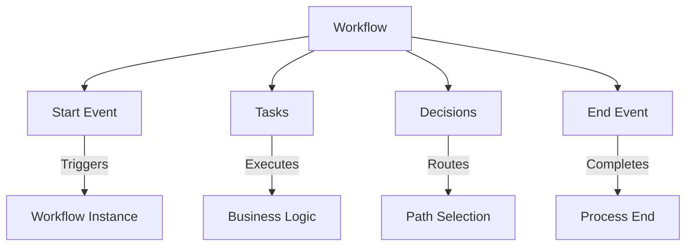
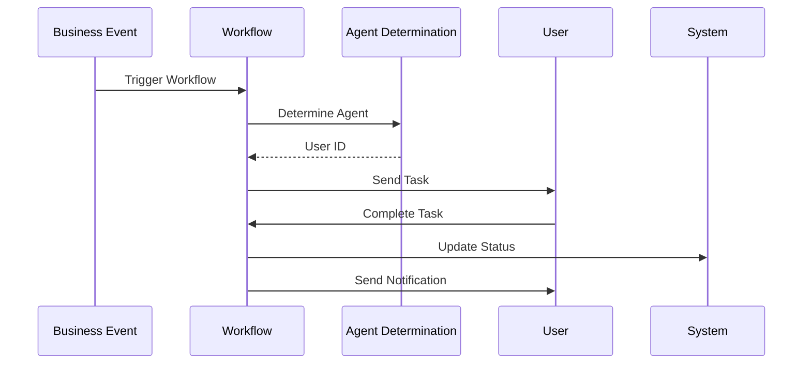
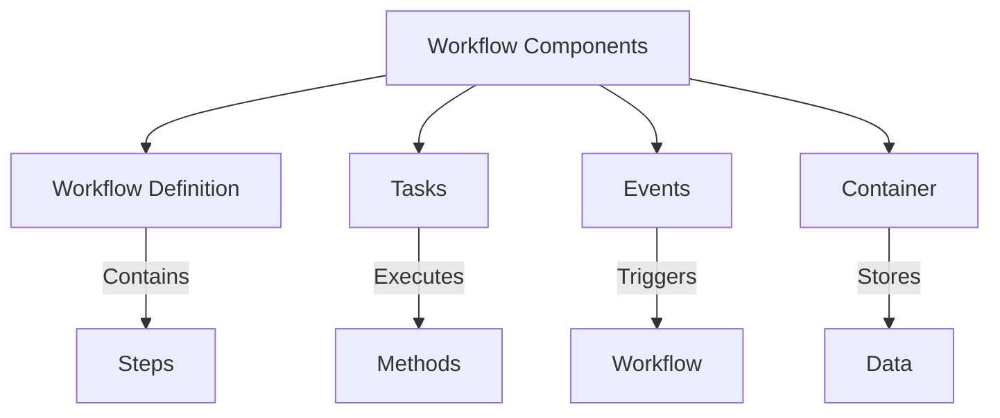
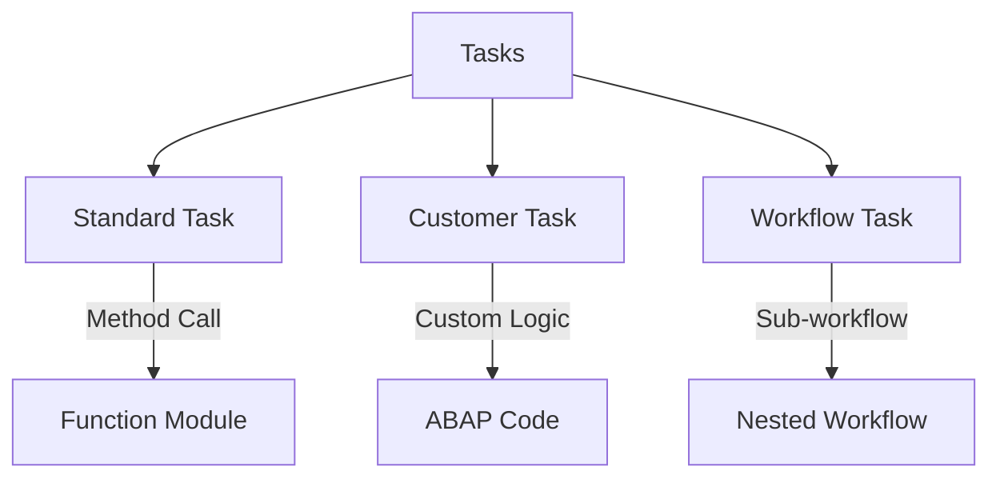
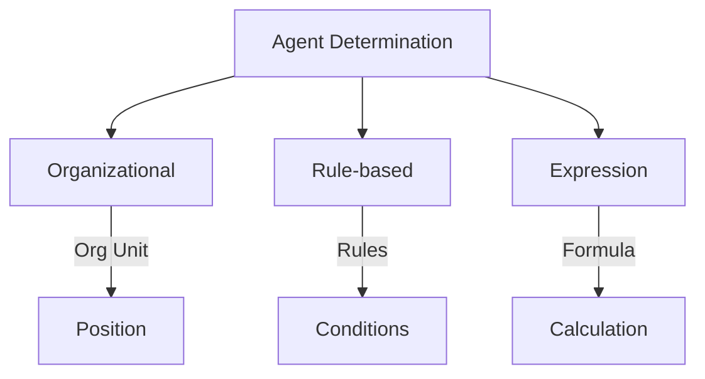
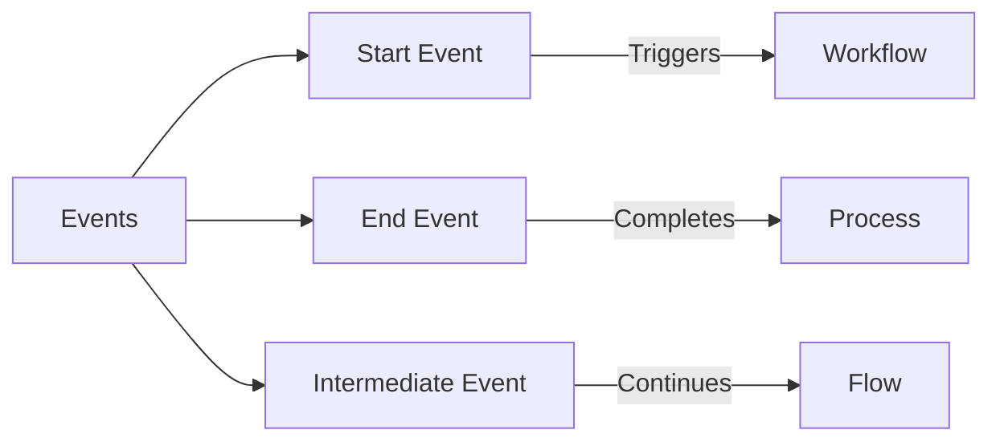
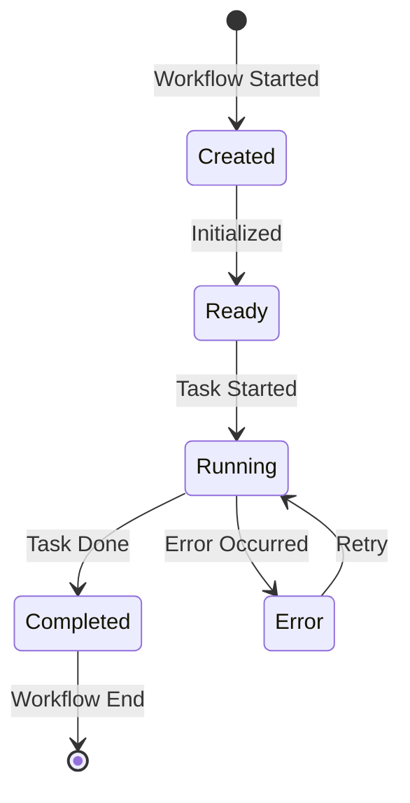
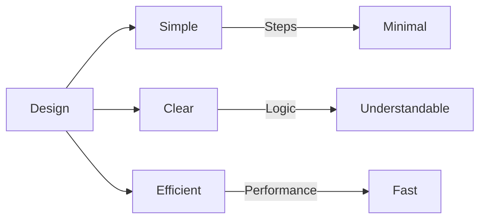

# SAP Workflow Guide

**Complete guide to SAP Business Workflow**

---

## 📚 Table of Contents

1. [Introduction](#introduction)
2. [Workflow Overview](#workflow-overview)
3. [Workflow Components](#workflow-components)
4. [Creating Workflows](#creating-workflows)
5. [Workflow Tasks](#workflow-tasks)
6. [Agent Determination](#agent-determination)
7. [Workflow Events](#workflow-events)
8. [Workflow Monitoring](#workflow-monitoring)
9. [Best Practices](#best-practices)
10. [Examples](#examples)

---

## Introduction

**SAP Business Workflow** automates business processes by routing tasks to appropriate users and executing business logic automatically.

### Workflow Architecture



### Workflow Benefits

- ✅ **Automation**: Automatic task routing
- ✅ **Visibility**: Track process status
- ✅ **Compliance**: Enforce business rules
- ✅ **Efficiency**: Reduce manual work

---

## Workflow Overview

### Workflow Process Flow



### Workflow Types

| Type | Description | Use Case |
|------|-------------|----------|
| **Standard Workflow** | Predefined workflow | Common processes |
| **Ad-hoc Workflow** | Created on-the-fly | One-time processes |
| **Template Workflow** | Reusable template | Similar processes |

---

## Workflow Components

### Component Structure



### Key Components

1. **Workflow Definition**: Process structure
2. **Tasks**: Work items to be executed
3. **Events**: Triggers for workflow
4. **Container**: Data storage
5. **Agents**: Users who execute tasks

---

## Creating Workflows

### Step-by-Step Creation

**Transaction**: SWDD (Workflow Builder)

**Steps**:
1. Enter workflow name (e.g., `ZLEAVE_WF`)
2. Click "Create"
3. Define workflow container
4. Add steps (tasks, decisions)
5. Define agent determination
6. Activate
7. Test

### Workflow Structure Example

```
Workflow: ZLEAVE_WF
├── Container
│   ├── REQ_ID (Import)
│   ├── EMPLOYEE_ID (Import)
│   ├── STATUS (Export)
│   └── MESSAGE (Export)
├── Start Event: Leave Request Created
├── Step 1: Determine Approval Level
├── Decision: Approval Level
│   ├── Level 1: < 5 days
│   ├── Level 2: 5-10 days
│   └── Level 3: > 10 days
├── Step 2: Approval Task
├── Decision: Approved/Rejected
└── End Event: Process Complete
```

---

## Workflow Tasks

### Task Types



### Creating a Task

**Transaction**: SWDD → Tasks

**Steps**:
1. Enter task name (e.g., `ZLEAVE_APPROVE_TASK`)
2. Define task type
3. Assign method/function
4. Define agent determination
5. Activate

### Task Example

```abap
" Task: ZLEAVE_APPROVE_TASK
" Method: ZCL_LEAVE_APPROVAL=>APPROVE
" Agent: Manager of employee

" Task implementation
CLASS zcl_leave_approval DEFINITION.
  PUBLIC SECTION.
    CLASS-METHODS approve
      IMPORTING iv_request_id TYPE zleave_req_id
                iv_approver_id TYPE pernr_d
                iv_decision TYPE char1
      EXPORTING ev_status TYPE zleave_status
                ev_message TYPE string.
ENDCLASS.

CLASS zcl_leave_approval IMPLEMENTATION.

  METHOD approve.
    DATA: ls_request TYPE zleave_req_hdr.

    " Get request
    SELECT SINGLE *
      FROM zleave_req_hdr
      INTO ls_request
      WHERE req_id = iv_request_id.

    " Update status
    IF iv_decision = 'A'.
      ls_request-status = 'A'.
      ev_status = 'A'.
      ev_message = 'Request approved'.
    ELSE.
      ls_request-status = 'R'.
      ev_status = 'R'.
      ev_message = 'Request rejected'.
    ENDIF.

    " Update database
    UPDATE zleave_req_hdr FROM ls_request.
    COMMIT WORK.
  ENDMETHOD.

ENDCLASS.
```

---

## Agent Determination

### Agent Types



### Agent Determination Example

```abap
" Determine approver based on employee's manager
METHOD determine_approver.
  DATA: lv_manager_id TYPE pernr_d.

  " Get employee's manager from HR
  SELECT SINGLE vorges
    FROM pa0001
    INTO lv_manager_id
    WHERE pernr = iv_employee_id
      AND endda >= sy-datum
      AND begda <= sy-datum.

  IF sy-subrc = 0 AND lv_manager_id IS NOT INITIAL.
    rv_approver_id = lv_manager_id.
  ELSE.
    " Fallback to HR admin
    rv_approver_id = '00000001'.
  ENDIF.
ENDMETHOD.
```

### Multi-level Approval

```abap
" Determine approval level based on leave days
METHOD determine_approval_level.
  DATA: lv_days TYPE zleave_days.

  " Get leave days
  SELECT SINGLE days
    FROM zleave_req_hdr
    INTO lv_days
    WHERE req_id = iv_request_id.

  " Determine level
  IF lv_days < 5.
    rv_level = 1. " Direct Manager
  ELSEIF lv_days >= 5 AND lv_days <= 10.
    rv_level = 2. " Department Head
  ELSE.
    rv_level = 3. " HR Director
  ENDIF.
ENDMETHOD.
```

---

## Workflow Events

### Event Types



### Triggering Workflow

```abap
" Trigger workflow from ABAP
DATA: ls_event TYPE swetaskevt,
      lt_event_container TYPE swr_cont,
      ls_container TYPE swr_cont.

" Set event
ls_event-event = 'ZLEAVE_REQUEST_CREATED'.
ls_event-objtype = 'ZLEAVE_REQ'.
ls_event-objkey = lv_req_id.

" Set container
ls_container-element = 'REQ_ID'.
ls_container-value = lv_req_id.
APPEND ls_container TO lt_event_container.

" Trigger workflow
CALL FUNCTION 'SAP_WAPI_CREATE_EVENT'
  EXPORTING
    event = ls_event
  TABLES
    input_container = lt_event_container
  EXCEPTIONS
    OTHERS = 1.
```

---

## Workflow Monitoring

### Monitoring Tools

| Transaction | Purpose |
|-------------|---------|
| **SWI1** | Workflow Inbox |
| **SWI2** | Workflow Outbox |
| **SWI3** | Workflow Log |
| **SWI4** | Workflow Administration |
| **SWI5** | Workflow Builder |

### Workflow Status



---

## Best Practices

### Workflow Design



1. **Keep Simple**: Avoid complex workflows
2. **Clear Logic**: Make decisions obvious
3. **Error Handling**: Handle exceptions
4. **Documentation**: Document workflow logic
5. **Testing**: Test all paths

---

## Examples

### Example 1: Leave Approval Workflow

```abap
" Workflow: ZLEAVE_APPROVE_WF

" Step 1: Determine Approval Level
" Method: ZCL_LEAVE_WORKFLOW=>DETERMINE_LEVEL
" Input: REQ_ID
" Output: APPROVAL_LEVEL

" Step 2: Decision
" Condition: APPROVAL_LEVEL = 1, 2, or 3

" Step 3: Approval Task (for each level)
" Task: ZLEAVE_APPROVE_TASK
" Agent: Determined by level
" Method: ZCL_LEAVE_APPROVAL=>APPROVE

" Step 4: Update Status
" Method: ZCL_LEAVE_WORKFLOW=>UPDATE_STATUS

" Step 5: Send Notification
" Method: ZCL_LEAVE_NOTIFICATION=>SEND_EMAIL
```

### Example 2: Workflow Trigger

```abap
" Trigger workflow when leave request is created
METHOD create_request.
  " Create request
  INSERT zleave_req_hdr FROM is_request_data.
  
  IF sy-subrc = 0.
    " Trigger workflow
    CALL FUNCTION 'SAP_WAPI_CREATE_EVENT'
      EXPORTING
        event = VALUE swetaskevt(
          event = 'ZLEAVE_REQUEST_CREATED'
          objtype = 'ZLEAVE_REQ'
          objkey = is_request_data-req_id
        )
      TABLES
        input_container = VALUE swr_cont_tab(
          ( element = 'REQ_ID' value = is_request_data-req_id )
          ( element = 'EMPLOYEE_ID' value = is_request_data-employee_id )
        )
      EXCEPTIONS
        OTHERS = 1.
  ENDIF.
ENDMETHOD.
```

---

## Common Transactions

| Transaction | Purpose |
|-------------|---------|
| **SWDD** | Workflow Builder |
| **SWI1** | Workflow Inbox |
| **SWI2** | Workflow Outbox |
| **SWI3** | Workflow Log |
| **SWI4** | Workflow Administration |
| **SWI5** | Workflow Builder (Alternative) |

---

## Troubleshooting

### Common Issues

1. **Workflow Not Triggering**
   - Check event is raised
   - Verify workflow is active
   - Check event linkage

2. **Task Not Assigned**
   - Check agent determination
   - Verify user exists
   - Check organizational structure

3. **Workflow Stuck**
   - Check SWI3 for errors
   - Verify task completion
   - Check for blocking conditions

---

## References

- [Integration Guide](./SAP_INTEGRATION_GUIDE.md)
- [Forms Guide](./SAP_FORMS_GUIDE.md)
- [SAP Help - Workflow](https://help.sap.com/)

---

**Related Guides**:
- [Capstone Workflow Examples](../Capstone/Employee-Leave-System/Phase2_Development.md#week-5-approval-workflow-implementation)

