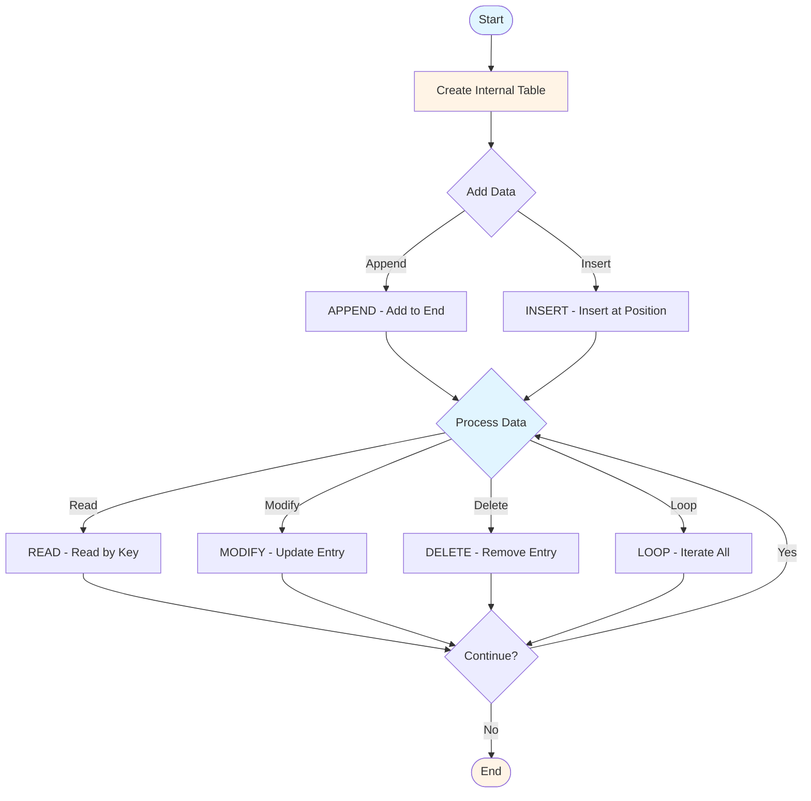
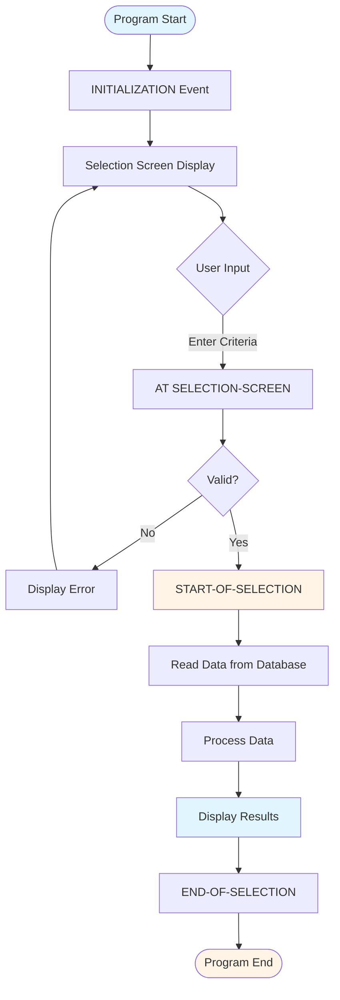
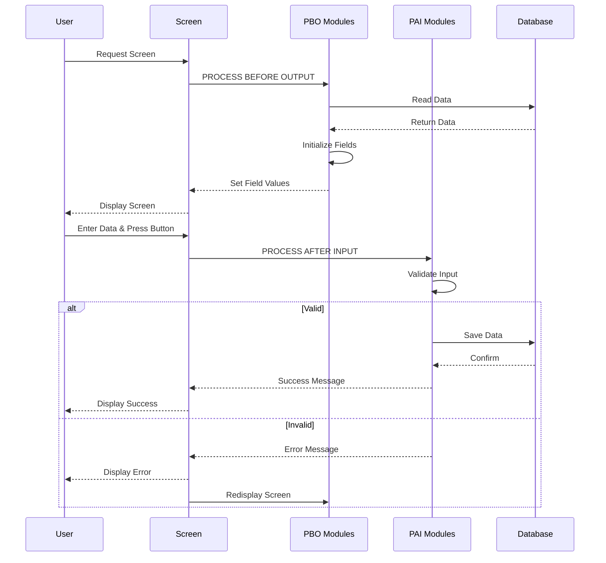
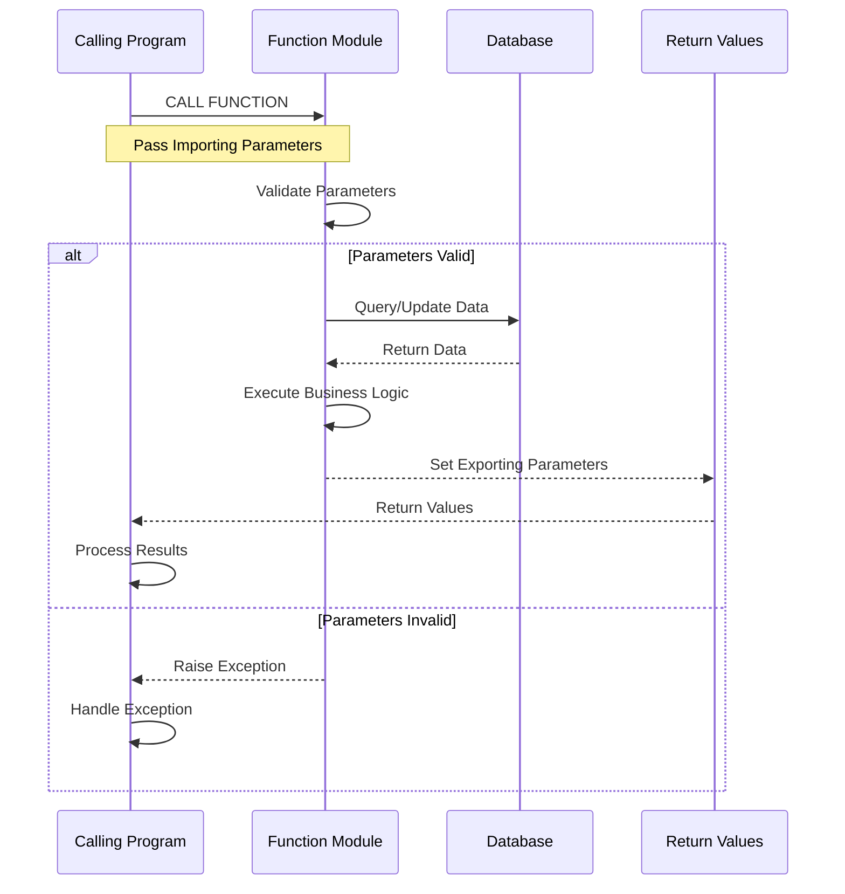
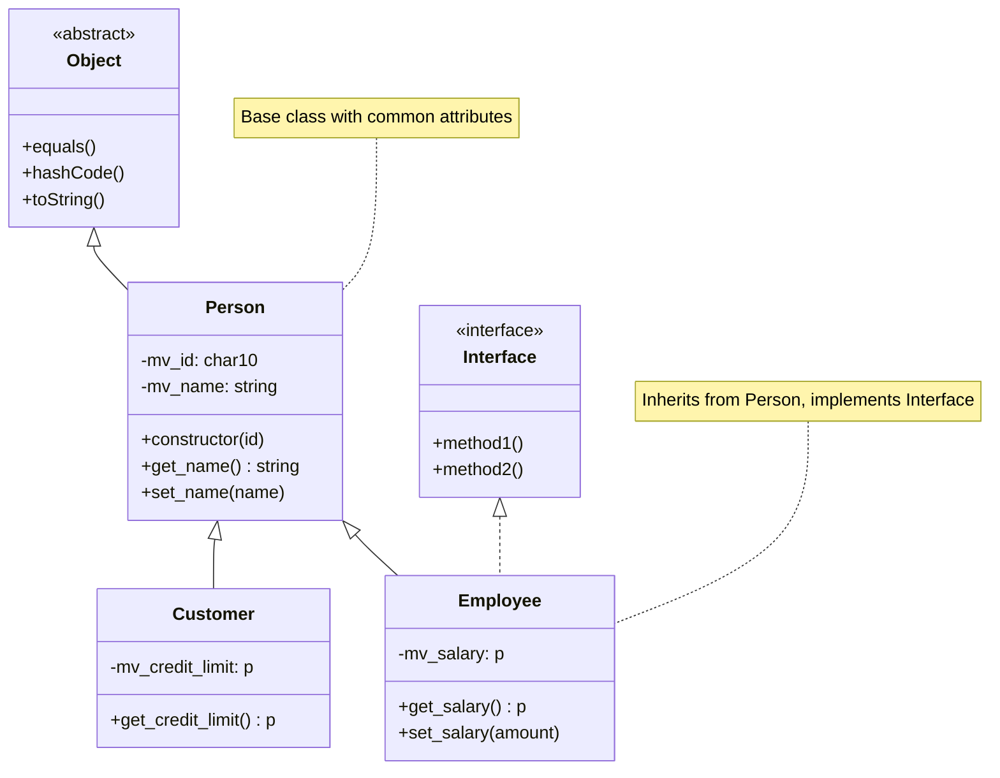
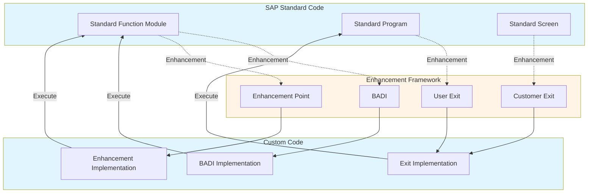
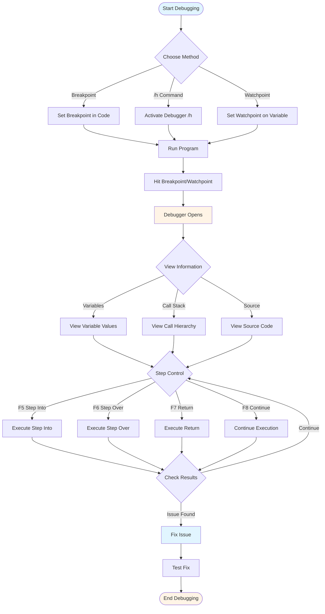

# SAP ABAP Programming Guide - Comprehensive

## Table of Contents
1. [Introduction](#introduction)
2. [ABAP Language Overview](#abap-language-overview)
3. [Data Types and Variables](#data-types-and-variables)
4. [Internal Tables](#internal-tables)
5. [Control Structures](#control-structures)
6. [Data Dictionary](#data-dictionary)
7. [Report Programming](#report-programming)
8. [Screen Programming](#screen-programming)
9. [Function Modules and BAPIs](#function-modules-and-bapis)
10. [ABAP Objects](#abap-objects)
11. [Enhancement Framework](#enhancement-framework)
12. [Performance Optimization](#performance-optimization)
13. [Debugging Techniques](#debugging-techniques)
14. [Best Practices](#best-practices)
15. [Common Pitfalls](#common-pitfalls)
16. [Real-World Examples](#real-world-examples)
17. [Templates & Checklists](#templates--checklists)
18. [Tools & Software](#tools--software)
19. [Resources](#resources)
20. [Summary](#summary)

---

## Introduction

ABAP (Advanced Business Application Programming) is SAP's proprietary programming language used to develop and customize SAP applications. This guide covers ABAP language fundamentals, development techniques, and best practices for SAP development.

### Who This Guide Is For
- ABAP developers
- SAP developers learning ABAP
- Students learning SAP development
- Anyone customizing SAP systems

### Key Learning Objectives
- Master ABAP language syntax
- Understand Data Dictionary
- Develop reports and screens
- Use ABAP Objects
- Implement enhancements
- Optimize performance
- Debug effectively

---

## ABAP Language Overview

### Definition

**ABAP** (Advanced Business Application Programming) is SAP's high-level programming language for developing business applications in the SAP environment.

### ABAP Characteristics

#### 1. High-Level Language
- Business-oriented
- English-like syntax
- Easy to learn
- Readable code

#### 2. Database Integration
- Native SQL support
- Open SQL (database-independent)
- Automatic data dictionary integration
- Database abstraction

#### 3. SAP Integration
- Tightly integrated with SAP
- Access to SAP data and functions
- Standard SAP objects available
- Business logic built-in

#### 4. Object-Oriented
- Supports OOP (ABAP Objects)
- Classes and interfaces
- Inheritance and polymorphism
- Modern development

### ABAP Development Environment

#### SAP GUI (Traditional)
- **SE80**: Object Navigator
- **SE38**: ABAP Editor
- **SE11**: Data Dictionary
- **SE37**: Function Builder
- **SE51**: Screen Painter

#### SAP NetWeaver Development Studio
- Eclipse-based IDE
- Modern development environment
- Better for ABAP Objects
- Version control integration

#### SAP Business Application Studio
- Cloud-based development
- Modern IDE
- For SAP Cloud Platform

---

## Data Types and Variables

### Data Types

#### Elementary Data Types

**Character Types**:
```abap
DATA: lv_char TYPE c LENGTH 10,      " Character
      lv_string TYPE string,         " String
      lv_numc TYPE n LENGTH 5.      " Numeric character
```

**Numeric Types**:
```abap
DATA: lv_int TYPE i,                 " Integer
      lv_packed TYPE p DECIMALS 2,   " Packed number
      lv_float TYPE f.               " Floating point
```

**Date and Time Types**:
```abap
DATA: lv_date TYPE d,                " Date (YYYYMMDD)
      lv_time TYPE t,                 " Time (HHMMSS)
      lv_timestamp TYPE timestamp.   " Timestamp
```

**Hexadecimal Types**:
```abap
DATA: lv_hex TYPE x LENGTH 10.       " Hexadecimal
```

### Variable Declaration

#### Basic Declaration
```abap
DATA: lv_name TYPE string,
      lv_age TYPE i,
      lv_salary TYPE p DECIMALS 2.
```

#### Constants
```abap
CONSTANTS: gc_company_code TYPE c LENGTH 4 VALUE '1000',
           gc_tax_rate TYPE p DECIMALS 2 VALUE '0.10'.
```

#### Field Symbols
```abap
FIELD-SYMBOLS: <fs_data> TYPE any,
               <fs_table> TYPE STANDARD TABLE.
```

#### Data References
```abap
DATA: lr_data TYPE REF TO data,
      lr_table TYPE REF TO data.
```

### Naming Conventions

**Prefixes**:
- **lv_**: Local variable
- **gv_**: Global variable
- **lc_**: Local constant
- **gc_**: Global constant
- **ls_**: Local structure
- **lt_**: Local internal table
- **lr_**: Local reference
- **lo_**: Local object

**Examples**:
```abap
DATA: lv_customer_name TYPE string,
      lt_materials TYPE TABLE OF mara,
      ls_header TYPE bapisdhd1.
```

---

## Internal Tables

### Overview

Internal tables are dynamic arrays in ABAP used to store multiple rows of data.

### Internal Table Types

#### 1. Standard Table
```abap
DATA: lt_standard TYPE STANDARD TABLE OF mara
      WITH NON-UNIQUE KEY matnr.
```
- Index access
- Linear search
- No unique key required

#### 2. Sorted Table
```abap
DATA: lt_sorted TYPE SORTED TABLE OF mara
      WITH UNIQUE KEY matnr.
```
- Sorted by key
- Binary search
- Unique or non-unique key

#### 3. Hashed Table
```abap
DATA: lt_hashed TYPE HASHED TABLE OF mara
      WITH UNIQUE KEY matnr.
```
- Hash access
- Fastest access
- Unique key required

### Internal Table Operations

#### Internal Table Operations Flow



#### Append
```abap
DATA: ls_material TYPE mara.
APPEND ls_material TO lt_materials.
```

#### Insert
```abap
INSERT ls_material INTO TABLE lt_materials.
```

#### Read
```abap
READ TABLE lt_materials INTO ls_material
  WITH KEY matnr = 'MAT001'.
```

#### Modify
```abap
MODIFY TABLE lt_materials FROM ls_material.
```

#### Delete
```abap
DELETE TABLE lt_materials FROM ls_material.
DELETE lt_materials WHERE matnr = 'MAT001'.
```

#### Loop
```abap
LOOP AT lt_materials INTO ls_material.
  " Process each row
ENDLOOP.
```

### Internal Table Best Practices

1. **Choose Right Type**: Standard, Sorted, or Hashed
2. **Use WHERE Clause**: Filter in SELECT
3. **Avoid Nested Loops**: Use efficient algorithms
4. **Clear Tables**: CLEAR before reuse
5. **Free Memory**: FREE for large tables

---

## Control Structures

### Conditional Statements

#### IF Statement
```abap
IF lv_amount > 1000.
  " Do something
ELSEIF lv_amount > 500.
  " Do something else
ELSE.
  " Default action
ENDIF.
```

#### CASE Statement
```abap
CASE lv_status.
  WHEN 'A'.
    " Active
  WHEN 'I'.
    " Inactive
  WHEN OTHERS.
    " Other status
ENDCASE.
```

### Loops

#### DO Loop
```abap
DO 10 TIMES.
  " Execute 10 times
ENDDO.
```

#### WHILE Loop
```abap
WHILE lv_counter < 100.
  lv_counter = lv_counter + 1.
ENDWHILE.
```

#### LOOP AT
```abap
LOOP AT lt_materials INTO ls_material.
  " Process each row
ENDLOOP.
```

---

## Data Dictionary

### Overview

Data Dictionary (DDIC) is the central repository for data definitions in SAP.

### Key DDIC Objects

#### 1. Tables

**Creating Tables**:
- **Transaction**: **SE11**
- **Type**: Transparent table
- **Fields**: Field name, data type, length
- **Key Fields**: Primary key

**Example Table Structure**:
```
Table: ZCUSTOMER
Fields:
  - CUSTOMER_ID (Key): CHAR 10
  - NAME: CHAR 50
  - EMAIL: CHAR 100
  - PHONE: CHAR 20
```

#### 2. Structures

**Purpose**: Group related fields

**Creating Structures**:
- **Transaction**: **SE11**
- **Type**: Structure
- **Fields**: Similar to tables

**Example**:
```abap
TYPES: BEGIN OF ty_customer,
         customer_id TYPE char10,
         name TYPE char50,
         email TYPE char100,
       END OF ty_customer.
```

#### 3. Data Elements

**Purpose**: Semantic definition of fields

**Creating Data Elements**:
- **Transaction**: **SE11**
- **Type**: Data Element
- **Domain**: Technical definition
- **Description**: Semantic meaning

#### 4. Domains

**Purpose**: Technical definition of fields

**Creating Domains**:
- **Transaction**: **SE11**
- **Type**: Domain
- **Data Type**: CHAR, NUMC, etc.
- **Length**: Field length
- **Value Range**: Valid values

#### 5. Views

**Types**:
- **Database View**: Join tables
- **Projection View**: Select fields
- **Help View**: For search help
- **Maintenance View**: For maintenance

### DDIC Best Practices

1. **Reuse**: Use standard data elements
2. **Naming**: Follow SAP conventions
3. **Documentation**: Document all objects
4. **Activation**: Activate after changes
5. **Transport**: Transport to other systems

---

## Report Programming

### Overview

Reports extract and display data from SAP.

### ABAP Program Execution Flow



### Report Types

#### 1. Classic Reports

**Structure**:
```abap
REPORT z_my_report.

DATA: lv_material TYPE matnr.

SELECT-OPTIONS: s_matnr FOR lv_material.

START-OF-SELECTION.
  SELECT * FROM mara
    INTO TABLE @DATA(lt_materials)
    WHERE matnr IN @s_matnr.
  
  LOOP AT lt_materials INTO DATA(ls_material).
    WRITE: / ls_material-matnr,
             ls_material-maktx.
  ENDLOOP.
```

**Events**:
- **INITIALIZATION**: Before selection screen
- **AT SELECTION-SCREEN**: Selection screen events
- **START-OF-SELECTION**: Main processing
- **END-OF-SELECTION**: After processing

#### 2. Interactive Reports

**Features**:
- User interaction
- Secondary lists
- Hotspots
- At-line selection

**Example**:
```abap
REPORT z_interactive_report.

START-OF-SELECTION.
  " Display primary list

AT LINE-SELECTION.
  " Handle line selection
  " Display secondary list
```

#### 3. ALV Reports

**ALV Grid**:
```abap
DATA: lo_alv TYPE REF TO cl_salv_table.

" Create ALV object
cl_salv_table=>factory(
  IMPORTING
    r_salv_table = lo_alv
  CHANGING
    t_table = lt_materials ).

" Display
lo_alv->display( ).
```

**ALV Features**:
- Grid format
- Sorting
- Filtering
- Export to Excel
- Print

### Report Best Practices

1. **Selection Screen**: Clear selection criteria
2. **Performance**: Efficient SELECT statements
3. **Error Handling**: Handle errors gracefully
4. **User-Friendly**: Clear output
5. **Documentation**: Comment code

---

## Screen Programming

### Overview

Screen programming creates custom user interfaces.

### Screen Elements

#### Screen Types
- **Normal Screen**: Standard screen
- **Subscreen**: Embedded screen
- **Modal Dialog**: Popup dialog

#### Screen Elements
- **Input Fields**: User input
- **Output Fields**: Display only
- **Pushbuttons**: Buttons
- **Checkboxes**: Checkboxes
- **Radio Buttons**: Radio buttons
- **Table Controls**: Grid input

### Screen Flow Logic

#### Screen Programming Flow (PBO/PAI)



#### Process Before Output (PBO)
```abap
PROCESS BEFORE OUTPUT.
  MODULE init_screen.
  MODULE set_screen_fields.
```

#### Process After Input (PAI)
```abap
PROCESS AFTER INPUT.
  MODULE validate_input.
  MODULE save_data.
```

### Module Pool Programming

**Structure**:
```abap
PROGRAM z_my_program.

" Global data
DATA: gv_customer_id TYPE char10.

" PBO Module
MODULE init_screen OUTPUT.
  " Initialize screen
ENDMODULE.

" PAI Module
MODULE validate_input INPUT.
  " Validate input
ENDMODULE.
```

### Screen Best Practices

1. **Validation**: Validate all input
2. **User Feedback**: Clear messages
3. **Navigation**: Logical flow
4. **Error Handling**: Handle errors
5. **User-Friendly**: Intuitive interface

---

## Function Modules

### Overview

Function modules are reusable code blocks that can be called from anywhere.

### Function Module Structure

```abap
FUNCTION z_calculate_total.
  " Importing parameters
  IMPORTING
    iv_amount TYPE p
    iv_tax_rate TYPE p.
  
  " Exporting parameters
  EXPORTING
    ev_total TYPE p.
  
  " Tables parameters
  TABLES
    it_items TYPE ztt_items.
  
  " Local data
  DATA: lv_total TYPE p.
  
  " Logic
  lv_total = iv_amount * ( 1 + iv_tax_rate ).
  ev_total = lv_total.
  
ENDFUNCTION.
```

### Function Module Call Sequence



### Calling Function Modules

```abap
DATA: lv_total TYPE p.

CALL FUNCTION 'Z_CALCULATE_TOTAL'
  EXPORTING
    iv_amount = 1000
    iv_tax_rate = '0.10'
  IMPORTING
    ev_total = lv_total
  EXCEPTIONS
    error = 1.
```

### BAPIs (Business Application Programming Interfaces)

**Definition**: Standardized function modules for external integration

**Characteristics**:
- RFC-enabled
- Standardized interface
- Documented
- Stable

**Example**:
```abap
CALL FUNCTION 'BAPI_MATERIAL_GET_DETAIL'
  EXPORTING
    material = 'MAT001'
  IMPORTING
    materialdata = ls_material.
```

---

## ABAP Objects

### Overview

ABAP Objects is object-oriented programming in ABAP.

### ABAP Objects Class Hierarchy



### Classes

#### Class Definition
```abap
CLASS z_customer DEFINITION.
  PUBLIC SECTION.
    METHODS: constructor
             IMPORTING iv_id TYPE char10,
             get_name RETURNING VALUE(rv_name) TYPE string,
             set_name IMPORTING iv_name TYPE string.
  
  PRIVATE SECTION.
    DATA: mv_id TYPE char10,
          mv_name TYPE string.
ENDCLASS.
```

#### Class Implementation
```abap
CLASS z_customer IMPLEMENTATION.
  METHOD constructor.
    mv_id = iv_id.
  ENDMETHOD.
  
  METHOD get_name.
    rv_name = mv_name.
  ENDMETHOD.
  
  METHOD set_name.
    mv_name = iv_name.
  ENDMETHOD.
ENDCLASS.
```

#### Using Classes
```abap
DATA: lo_customer TYPE REF TO z_customer.

CREATE OBJECT lo_customer
  EXPORTING
    iv_id = 'CUST001'.

lo_customer->set_name( 'John Doe' ).
DATA(lv_name) = lo_customer->get_name( ).
```

### Interfaces

```abap
INTERFACE z_interface.
  METHODS: method1,
           method2.
ENDINTERFACE.

CLASS z_class DEFINITION.
  PUBLIC SECTION.
    INTERFACES: z_interface.
ENDCLASS.
```

### Inheritance

```abap
CLASS z_employee DEFINITION INHERITING FROM z_person.
  PUBLIC SECTION.
    METHODS: get_salary RETURNING VALUE(rv_salary) TYPE p.
ENDCLASS.
```

---

## Enhancement Framework

### Overview

Enhancement framework allows customizing SAP without modifying standard code.

### Enhancement Framework Architecture



### Enhancement Types

#### 1. BADIs (Business Add-Ins)

**Definition**: Object-oriented enhancement points

**Implementation**:
```abap
CLASS z_badi_impl DEFINITION.
  PUBLIC SECTION.
    INTERFACES: if_ex_badi_interface.
ENDCLASS.

CLASS z_badi_impl IMPLEMENTATION.
  METHOD if_ex_badi_interface~method.
    " Custom logic
  ENDMETHOD.
ENDCLASS.
```

**Transaction**: **SE18** (BADI Definition), **SE19** (BADI Implementation)

#### 2. User Exits

**Definition**: Standard SAP exits

**Finding User Exits**:
- **Transaction**: **SMOD**
- Search by function module
- Implement in **CMOD**

#### 3. Customer Exits

**Definition**: Customer-specific exits

**Transaction**: **CMOD**

#### 4. Enhancement Points

**Definition**: Modern enhancement points

**Implementation**:
```abap
ENHANCEMENT-POINT z_enhancement_point.
  " Custom code
END-ENHANCEMENT-POINT.
```

### Enhancement Best Practices

1. **Use Enhancements**: Don't modify standard
2. **Document**: Document all enhancements
3. **Test**: Test thoroughly
4. **Transport**: Transport properly
5. **Maintain**: Keep enhancements updated

---

## Performance Optimization

### Overview

Performance optimization ensures efficient ABAP programs.

### Database Access Optimization

#### 1. SELECT Optimization

**Bad**:
```abap
LOOP AT lt_materials INTO ls_material.
  SELECT SINGLE * FROM mara
    INTO ls_mara
    WHERE matnr = ls_material-matnr.
ENDLOOP.
```

**Good**:
```abap
SELECT * FROM mara
  INTO TABLE lt_mara
  FOR ALL ENTRIES IN lt_materials
  WHERE matnr = lt_materials-matnr.
```

#### 2. Use Indexes
- Use indexed fields in WHERE clause
- Avoid functions on indexed fields
- Use proper key fields

#### 3. Avoid SELECT *
```abap
" Bad
SELECT * FROM mara INTO TABLE lt_mara.

" Good
SELECT matnr maktx FROM mara
  INTO CORRESPONDING FIELDS OF TABLE lt_mara.
```

### Internal Table Optimization

#### 1. Choose Right Table Type
- Standard: For sequential access
- Sorted: For sorted data, binary search
- Hashed: For key-based access

#### 2. Use WHERE Clause
```abap
" Bad
LOOP AT lt_materials INTO ls_material.
  IF ls_material-matnr = 'MAT001'.
    " Process
  ENDIF.
ENDLOOP.

" Good
LOOP AT lt_materials INTO ls_material
  WHERE matnr = 'MAT001'.
  " Process
ENDLOOP.
```

#### 3. Avoid Nested Loops
- Use efficient algorithms
- Use hash tables for lookups
- Use SORTED BY for sorted access

### Performance Best Practices

1. **Database**: Efficient SELECT statements
2. **Tables**: Choose right table type
3. **Algorithms**: Efficient algorithms
4. **Memory**: Manage memory efficiently
5. **Profiling**: Use runtime analysis

---

## Debugging Techniques

### Overview

Debugging finds and fixes errors in ABAP programs.

### Debugger

#### Debugging Process Flow



#### Starting Debugger

**Methods**:
1. **Breakpoint**: Set breakpoint in code
2. **/h**: Activate debugger before transaction
3. **Watchpoint**: Set watchpoint on variable

#### Debugger Features

**Views**:
- **Variables**: View variable values
- **Breakpoints**: Manage breakpoints
- **Call Stack**: View call hierarchy
- **Source Code**: View code

**Controls**:
- **F5**: Execute (Step Into)
- **F6**: Execute (Step Over)
- **F7**: Execute (Return)
- **F8**: Execute (Continue)

### Common Debugging Scenarios

#### 1. Variable Value Check
- Set breakpoint
- Check variable values
- Step through code

#### 2. Logic Error
- Trace execution flow
- Check conditions
- Verify calculations

#### 3. Data Issue
- Check data at runtime
- Verify database reads
- Check data transformations

### Debugging Best Practices

1. **Breakpoints**: Strategic breakpoints
2. **Watchpoints**: Monitor key variables
3. **Step Through**: Understand flow
4. **Check Data**: Verify data values
5. **Document**: Document findings

---

## Best Practices

### ABAP Coding Best Practices

1. **Naming Conventions**: Follow SAP standards
2. **Code Structure**: Clear structure
3. **Comments**: Document code
4. **Error Handling**: Handle all errors
5. **Performance**: Optimize for performance
6. **Security**: Check authorizations
7. **Maintainability**: Write maintainable code

### Code Quality

**Standards**:
- **SAP Code Inspector**: Check code quality
- **ABAP Test Cockpit**: Automated testing
- **Code Review**: Peer review
- **Documentation**: Clear documentation

---

## Common Pitfalls

### ABAP Pitfalls

1. **SELECT in Loop**: Inefficient database access
2. **No Error Handling**: Unhandled exceptions
3. **Hardcoded Values**: Should use constants
4. **No Authorization Check**: Security risk
5. **Inefficient Algorithms**: Performance issues
6. **Poor Naming**: Unclear variable names
7. **No Comments**: Unmaintainable code

---

## Real-World Examples

### Example 1: Material Report

```abap
REPORT z_material_report.

DATA: lt_materials TYPE TABLE OF mara,
      ls_material TYPE mara.

SELECT-OPTIONS: s_matnr FOR ls_material-matnr.

START-OF-SELECTION.
  SELECT * FROM mara
    INTO TABLE lt_materials
    WHERE matnr IN s_matnr.
  
  LOOP AT lt_materials INTO ls_material.
    WRITE: / ls_material-matnr,
             ls_material-maktx.
  ENDLOOP.
```

### Example 2: ALV Report

```abap
REPORT z_alv_report.

DATA: lo_alv TYPE REF TO cl_salv_table,
      lt_data TYPE TABLE OF mara.

START-OF-SELECTION.
  SELECT * FROM mara INTO TABLE lt_data.
  
  cl_salv_table=>factory(
    IMPORTING r_salv_table = lo_alv
    CHANGING t_table = lt_data ).
  
  lo_alv->display( ).
```

---

## Templates & Checklists

### ABAP Development Checklist

- [ ] Requirements understood
- [ ] Data Dictionary objects created
- [ ] Program structure designed
- [ ] Code written
- [ ] Error handling implemented
- [ ] Authorization checks added
- [ ] Code tested
- [ ] Performance optimized
- [ ] Code documented
- [ ] Code reviewed

---

## Tools & Software

### Development Tools

1. **SE80**: Object Navigator
2. **SE38**: ABAP Editor
3. **SE11**: Data Dictionary
4. **SE37**: Function Builder
5. **Eclipse**: Modern IDE

### Testing Tools

1. **SE30**: Runtime Analysis
2. **SAT**: Performance Analysis
3. **Code Inspector**: Code Quality

---

## Resources

### Books

1. "ABAP Objects: Object-Oriented Programming"
2. "SAP ABAP: The Complete Guide"
3. "ABAP Performance Tuning"

### Online Resources

1. **SAP Help Portal**: ABAP documentation
2. **SAP Community**: ABAP forums
3. **openSAP**: Free ABAP courses

---

## Summary

### Key Takeaways

1. **ABAP**: SAP's programming language
2. **Data Dictionary**: Central repository
3. **Reports**: Extract and display data
4. **Screens**: Custom user interfaces
5. **Function Modules**: Reusable code
6. **ABAP Objects**: Object-oriented programming
7. **Enhancements**: Customize without modifying standard
8. **Performance**: Optimize database access and algorithms
9. **Debugging**: Use debugger effectively

### Final Recommendations

1. **Practice**: Code regularly
2. **Learn Standards**: Follow SAP coding standards
3. **Use Help**: F1 for help
4. **Optimize**: Always optimize performance
5. **Test**: Test thoroughly
6. **Document**: Document your code
7. **Review**: Code review with peers

Remember: ABAP is a powerful language. Master the fundamentals, practice regularly, and follow SAP best practices for success.

---

**Last Updated**: 2024

**Related Guides**:
- [SAP ERP Fundamentals Guide](./SAP_ERP_FUNDAMENTALS_GUIDE.md)
- [SAP Customization & Enhancement Guide](./SAP_CUSTOMIZATION_ENHANCEMENT_GUIDE.md)
- [SAP Reporting & Analytics Guide](./SAP_REPORTING_ANALYTICS_GUIDE.md)


