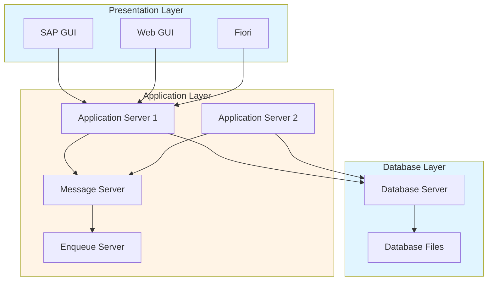
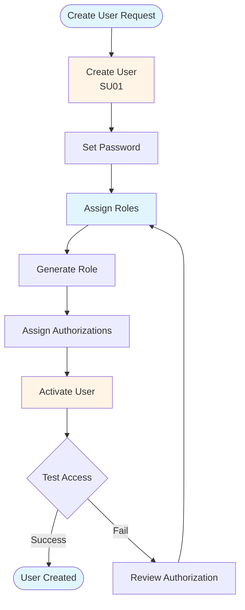
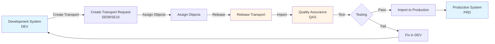
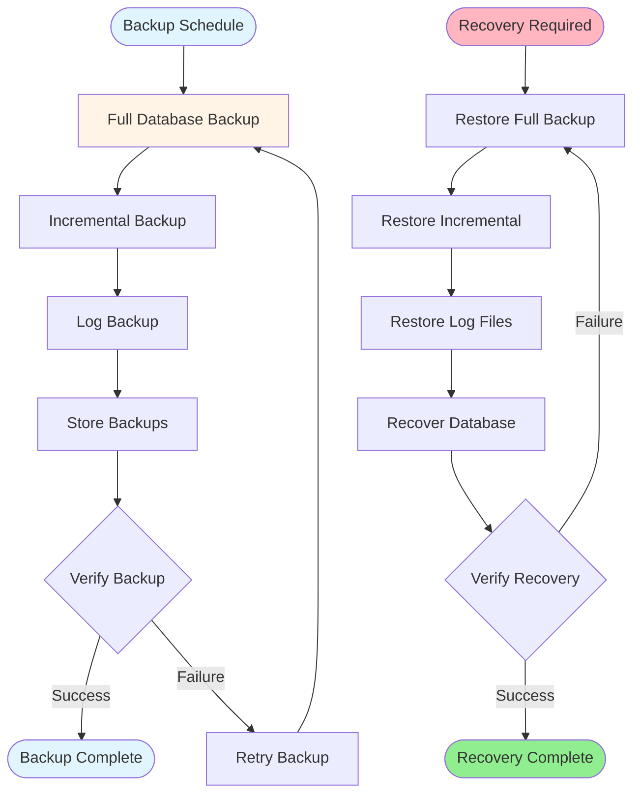

# SAP BASIS Administration Guide - Comprehensive

## Table of Contents
1. [Introduction](#introduction)
2. [BASIS Overview](#basis-overview)
3. [System Administration](#system-administration)
4. [User Management](#user-management)
5. [Authorization and Roles](#authorization-and-roles)
6. [Transport Management](#transport-management)
7. [System Monitoring](#system-monitoring)
8. [Database Administration](#database-administration)
9. [Backup and Recovery](#backup-and-recovery)
10. [Performance Tuning](#performance-tuning)
11. [Best Practices](#best-practices)
12. [Summary](#summary)

---

## Introduction

SAP BASIS manages system administration, user management, and system operations.

### Key Learning Objectives
- Understand BASIS administration
- Master user management
- Handle transports
- Monitor system performance

---

## BASIS Overview

**SAP BASIS** manages system administration and infrastructure.

### SAP System Architecture

### Key Components
1. **System Administration**: System operations
2. **User Management**: User administration
3. **Transport Management**: Change management
4. **Monitoring**: System monitoring

---

## User Management

### User Management Flow

### Create User

**Transaction**: **SU01** (User Maintenance)

**Key Fields**:
- User ID
- Password
- Roles
- Authorizations

---

## Authorization and Roles

### Role Maintenance

**Transaction**: **PFCG** (Role Maintenance)

**Process**:
1. Create role
2. Assign transactions
3. Assign authorizations
4. Generate role

---

## Transport Management

### Transport Process Flow

### Transport Organizer

**Transaction**: **SE09** (Transport Organizer), **SE10** (Customizing Organizer)

**Process**:
1. Create transport request
2. Assign objects
3. Release request
4. Import to target system

---

## System Monitoring

### System Monitoring

**Transaction**: **SM50** (Work Process Overview), **SM51** (Application Servers)

**Purpose**: Monitor system performance

---

## Database Administration

### Database Administration

**Transaction**: **DB02** (Database Performance), **ST04** (Database Performance)

**Purpose**: Monitor database performance

---

## Backup and Recovery

### Backup and Recovery Flow

### Backup Strategy

**Components**:
- Database backup
- Log backup
- Recovery procedures

---

## Performance Tuning

### Performance Analysis

**Transaction**: **ST05** (SQL Trace), **ST12** (Application Monitor)

**Purpose**: Analyze performance issues

---

## Best Practices

1. **Users**: Proper user management
2. **Security**: Strong authorization
3. **Monitoring**: Regular monitoring
4. **Backup**: Regular backups

---

## Summary

BASIS manages system administration, users, transports, and system operations.

---

**Related Guides**:
- [SAP Security & Authorization Guide](./SAP_SECURITY_AUTHORIZATION_GUIDE.md)

