# SAP Capstone Project Examples - Comprehensive

## Table of Contents
1. [Introduction](#introduction)
2. [How to Use This Guide](#how-to-use-this-guide)
3. [Project Phase Overview](#project-phase-overview)
4. [Timeline Structure](#timeline-structure)
5. [Example 1: Custom Inventory Management System](#example-1-custom-inventory-management-system)
6. [Example 2: Sales Order Processing Enhancement](#example-2-sales-order-processing-enhancement)
7. [Example 3: Financial Reporting Dashboard](#example-3-financial-reporting-dashboard)
8. [Example 4: Employee Self-Service Portal](#example-4-employee-self-service-portal)
9. [Example 5: Material Requirements Planning Enhancement](#example-5-material-requirements-planning-enhancement)
10. [Example 6: Vendor Management System](#example-6-vendor-management-system)
11. [Related Guides](#related-guides)

---

## Introduction

This guide provides detailed, real-world SAP capstone project examples to help students and developers understand how to structure, plan, and execute comprehensive SAP projects. Each example follows a structured approach with emphasis on project management, development, testing, documentation, and presentation phases.

### Purpose

- **Learning Tool**: Understand complete project lifecycle from requirements to presentation
- **Reference Guide**: Use as a template for your own capstone projects
- **Best Practices**: Learn industry-standard project management and development practices
- **Visualization**: Comprehensive diagrams help visualize system architecture and processes

### Key Features

- **No Code**: Focus on concepts, architecture, and processes rather than implementation details
- **Comprehensive Diagrams**: Visual representation of systems, flows, and processes
- **3-Month Timeline**: Realistic project timelines with week-by-week breakdowns
- **Phase-Based Approach**: Clear separation of PM, Development, Testing, Documentation, and Presentation phases

---

## How to Use This Guide

### For Students

1. **Study the Structure**: Review how projects are organized and planned
2. **Understand the Timeline**: Learn realistic timeframes for each phase
3. **Analyze Diagrams**: Study system architectures and process flows
4. **Adapt to Your Project**: Use as a template for your own capstone project

### For Project Managers

1. **Timeline Planning**: Use timelines as reference for project planning
2. **Phase Breakdown**: Understand resource allocation across phases
3. **Risk Management**: Review risk identification and mitigation strategies
4. **Stakeholder Management**: Learn effective stakeholder engagement approaches

### For Developers

1. **Architecture Design**: Study system architecture patterns
2. **Integration Points**: Understand module integrations
3. **Process Flows**: Learn end-to-end process design
4. **Testing Strategies**: Review comprehensive testing approaches

---

## Project Phase Overview

SAP capstone projects typically follow five main phases:

### Phase 1: Project Management (PM)
- **Duration**: Weeks 1-4 (Month 1)
- **Activities**: 
  - Project kickoff and stakeholder identification
  - Requirements gathering and analysis
  - Business process analysis
  - System design and architecture planning
  - Design review and approval
- **Deliverables**: Project plan, requirements document, system design

### Phase 2: Development
- **Duration**: Weeks 5-8 (Month 2)
- **Activities**:
  - Core component development
  - Integration development
  - Unit testing
  - Code review
- **Deliverables**: Developed components, unit test results

### Phase 3: Testing
- **Duration**: Weeks 9-10 (Month 3)
- **Activities**:
  - Integration testing
  - User acceptance testing (UAT)
  - Bug fixes and retesting
  - Performance testing
- **Deliverables**: Test results, bug reports, performance metrics

### Phase 4: Documentation
- **Duration**: Week 11 (Month 3)
- **Activities**:
  - Technical documentation
  - User documentation
  - Process flow documentation
  - Demo preparation
- **Deliverables**: Complete documentation set, demo scripts

### Phase 5: Presentation
- **Duration**: Week 12 (Month 3)
- **Activities**:
  - Presentation preparation
  - Demo rehearsal
  - Final review
  - Project presentation
- **Deliverables**: Presentation materials, live demo

---

## Timeline Structure

Each example project includes a detailed 3-month timeline with the following structure:

### Month 1: Project Management & Requirements
- **Week 1**: Project kickoff, stakeholder identification, initial planning
- **Week 2**: Requirements gathering, business process analysis
- **Week 3**: System design, architecture planning
- **Week 4**: Design review, approval, finalize requirements

### Month 2: Development
- **Week 5-6**: Core development, component building
- **Week 7**: Integration development, module connections
- **Week 8**: Unit testing, code review, initial bug fixes

### Month 3: Testing, Documentation & Presentation
- **Week 9**: Integration testing, UAT preparation
- **Week 10**: User acceptance testing, bug fixes, performance testing
- **Week 11**: Documentation completion, demo preparation
- **Week 12**: Presentation preparation, final review, project presentation

---

## Example 1: Custom Inventory Management System

### Project Overview

**Project Name**: Custom Inventory Management System with Real-Time Monitoring and Alert System

**Objective**: Develop a comprehensive inventory management system that enhances standard SAP MM functionality with real-time stock monitoring, automated alerts for low stock levels, custom inventory reports, and a dashboard for inventory visibility.

**Business Value**:
- Reduce stockouts through proactive monitoring
- Optimize inventory levels and reduce carrying costs
- Improve inventory visibility across locations
- Automate manual inventory tracking processes
- Enable data-driven inventory decisions

**Project Duration**: 3 Months (12 Weeks)

---

### Business Requirements

#### Functional Requirements

1. **Material Master Enhancement**
   - Add custom fields for inventory thresholds
   - Track reorder points and safety stock levels
   - Store supplier lead times
   - Maintain ABC classification

2. **Real-Time Stock Monitoring**
   - Monitor stock levels across all storage locations
   - Track stock movements in real-time
   - Display current stock levels by material
   - Show stock status (available, reserved, blocked)

3. **Automated Alert System**
   - Generate alerts when stock falls below reorder point
   - Notify when stock reaches critical levels
   - Alert on slow-moving inventory
   - Notify on stock discrepancies

4. **Custom Inventory Reports**
   - Stock level reports by material group
   - Inventory valuation reports
   - Stock movement reports
   - Aging analysis reports

5. **Inventory Dashboard**
   - Visual dashboard with key metrics
   - Stock level indicators
   - Alert summary
   - Trend charts

6. **Integration with MM Module**
   - Integrate with material master data
   - Connect with goods receipt/issue processes
   - Link with purchase requisitions
   - Integrate with physical inventory

#### Non-Functional Requirements

1. **Performance**
   - Support 1000+ materials
   - Real-time data refresh (< 5 seconds)
   - Handle concurrent users (50+)
   - Fast report generation (< 30 seconds)

2. **Reliability**
   - 99% uptime availability
   - Data consistency checks
   - Error handling and recovery
   - Audit trail for all changes

3. **Usability**
   - User-friendly interface
   - Intuitive navigation
   - Clear error messages
   - Responsive design

4. **Security**
   - Authorization checks
   - Role-based access control
   - Secure data access
   - Audit logging

---

### 3-Month Project Timeline

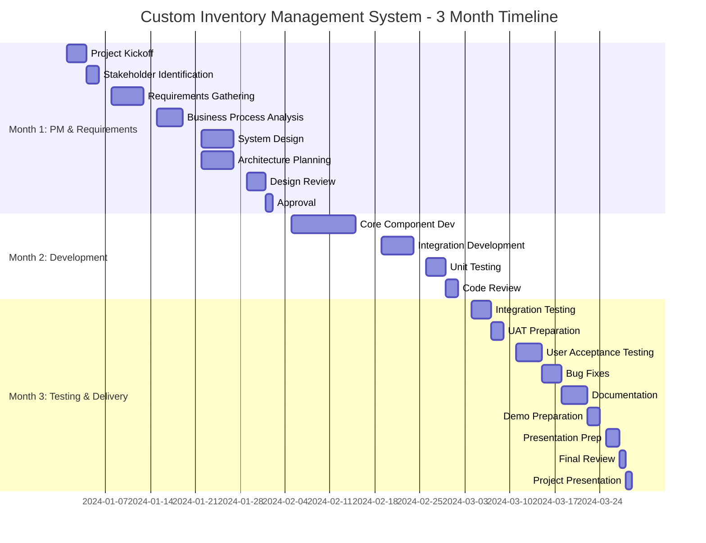
```mermaid
gantt
    title Custom Inventory Management System - 3 Month Timeline
    dateFormat YYYY-MM-DD
    section Month 1: PM & Requirements
    Project Kickoff           :2024-01-01, 3d
    Stakeholder Identification :2024-01-04, 2d
    Requirements Gathering    :2024-01-08, 5d
    Business Process Analysis  :2024-01-15, 4d
    System Design             :2024-01-22, 5d
    Architecture Planning     :2024-01-22, 5d
    Design Review            :2024-01-29, 3d
    Approval                 :2024-02-01, 1d
    
    section Month 2: Development
    Core Component Dev       :2024-02-05, 10d
    Integration Development  :2024-02-19, 5d
    Unit Testing             :2024-02-26, 3d
    Code Review              :2024-02-29, 2d
    
    section Month 3: Testing & Delivery
    Integration Testing      :2024-03-04, 3d
    UAT Preparation          :2024-03-07, 2d
    User Acceptance Testing  :2024-03-11, 4d
    Bug Fixes                :2024-03-15, 3d
    Documentation            :2024-03-18, 4d
    Demo Preparation         :2024-03-22, 2d
    Presentation Prep        :2024-03-25, 2d
    Final Review             :2024-03-27, 1d
    Project Presentation     :2024-03-28, 1d
```

#### Week-by-Week Breakdown

**Month 1: Project Management & Requirements**

- **Week 1 (Days 1-7)**:
  - Day 1-3: Project kickoff meeting, team formation
  - Day 4-5: Stakeholder identification and interviews
  - Day 6-7: Initial project planning and scope definition

- **Week 2 (Days 8-14)**:
  - Day 8-10: Requirements gathering sessions
  - Day 11-12: Business process analysis
  - Day 13-14: Document current state processes

- **Week 3 (Days 15-21)**:
  - Day 15-17: System design and architecture planning
  - Day 18-19: Create system architecture diagrams
  - Day 20-21: Define technical specifications

- **Week 4 (Days 22-28)**:
  - Day 22-24: Design review with stakeholders
  - Day 25-26: Incorporate feedback and revisions
  - Day 27-28: Final approval and sign-off

**Month 2: Development**

- **Week 5-6 (Days 29-42)**:
  - Material master enhancement development
  - Stock monitoring module development
  - Alert system development
  - Custom table creation

- **Week 7 (Days 43-49)**:
  - Integration with MM module
  - Integration with reporting module
  - Dashboard development
  - Component integration testing

- **Week 8 (Days 50-56)**:
  - Unit testing of all components
  - Code review sessions
  - Initial bug fixes
  - Performance optimization

**Month 3: Testing, Documentation & Presentation**

- **Week 9 (Days 57-63)**:
  - Integration testing
  - End-to-end scenario testing
  - UAT preparation and test case creation
  - Test data preparation

- **Week 10 (Days 64-70)**:
  - User acceptance testing execution
  - Bug identification and logging
  - Bug fixes and retesting
  - Performance testing

- **Week 11 (Days 71-77)**:
  - Technical documentation completion
  - User documentation creation
  - Demo script preparation
  - Demo rehearsal

- **Week 12 (Days 78-84)**:
  - Presentation slide creation
  - Final demo preparation
  - Presentation rehearsal
  - Final review and adjustments
  - Project presentation

---

### System Architecture

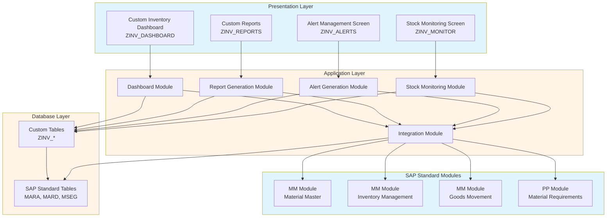
```mermaid
graph TB
    subgraph Presentation[Presentation Layer]
        A[Custom Inventory Dashboard<br/>ZINV_DASHBOARD]
        B[Stock Monitoring Screen<br/>ZINV_MONITOR]
        C[Alert Management Screen<br/>ZINV_ALERTS]
        D[Custom Reports<br/>ZINV_REPORTS]
    end
    
    subgraph Application[Application Layer]
        E[Stock Monitoring Module]
        F[Alert Generation Module]
        G[Report Generation Module]
        H[Dashboard Module]
        I[Integration Module]
    end
    
    subgraph SAP[SAP Standard Modules]
        J[MM Module<br/>Material Master]
        K[MM Module<br/>Inventory Management]
        L[MM Module<br/>Goods Movement]
        M[PP Module<br/>Material Requirements]
    end
    
    subgraph Database[Database Layer]
        N[Custom Tables<br/>ZINV_*]
        O[SAP Standard Tables<br/>MARA, MARD, MSEG]
    end
    
    A --> H
    B --> E
    C --> F
    D --> G
    
    E --> I
    F --> I
    G --> I
    H --> I
    
    I --> J
    I --> K
    I --> L
    I --> M
    
    E --> N
    F --> N
    G --> N
    H --> N
    
    I --> O
    N --> O
    
    style Presentation fill:#e1f5ff
    style Application fill:#fff4e6
    style SAP fill:#e1f5ff
    style Database fill:#fff4e6
```

---

### Complete Process Flow

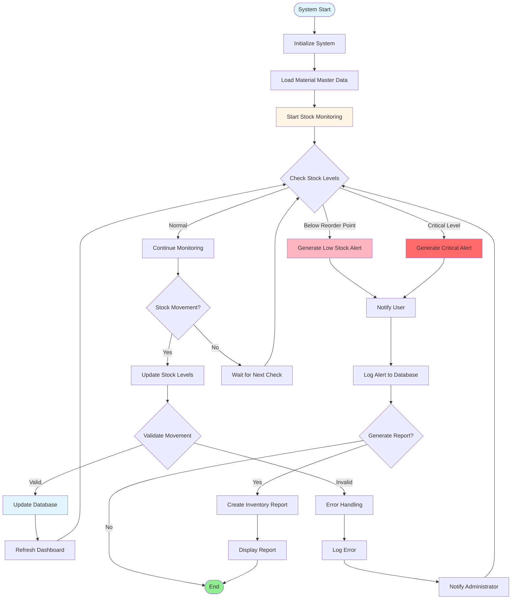
```mermaid
flowchart TD
    Start([System Start]) --> Init[Initialize System]
    Init --> LoadData[Load Material Master Data]
    
    LoadData --> Monitor[Start Stock Monitoring]
    Monitor --> CheckStock{Check Stock Levels}
    
    CheckStock -->|Below Reorder Point| GenerateAlert[Generate Low Stock Alert]
    CheckStock -->|Critical Level| GenerateCritical[Generate Critical Alert]
    CheckStock -->|Normal| ContinueMonitor[Continue Monitoring]
    
    GenerateAlert --> NotifyUser[Notify User]
    GenerateCritical --> NotifyUser
    NotifyUser --> LogAlert[Log Alert to Database]
    
    ContinueMonitor --> CheckMovement{Stock Movement?}
    CheckMovement -->|Yes| UpdateStock[Update Stock Levels]
    CheckMovement -->|No| Wait[Wait for Next Check]
    
    UpdateStock --> Validate{Validate Movement}
    Validate -->|Valid| UpdateDB[Update Database]
    Validate -->|Invalid| Error[Error Handling]
    
    UpdateDB --> RefreshDashboard[Refresh Dashboard]
    RefreshDashboard --> CheckStock
    
    Error --> LogError[Log Error]
    LogError --> NotifyAdmin[Notify Administrator]
    NotifyAdmin --> CheckStock
    
    Wait --> CheckStock
    
    LogAlert --> GenerateReport{Generate Report?}
    GenerateReport -->|Yes| CreateReport[Create Inventory Report]
    GenerateReport -->|No| End([End])
    
    CreateReport --> DisplayReport[Display Report]
    DisplayReport --> End
    
    style Start fill:#e1f5ff
    style Monitor fill:#fff4e6
    style GenerateAlert fill:#FFB6C1
    style GenerateCritical fill:#FF6B6B
    style UpdateDB fill:#e1f5ff
    style End fill:#90EE90
```

---

### Data Flow Diagram

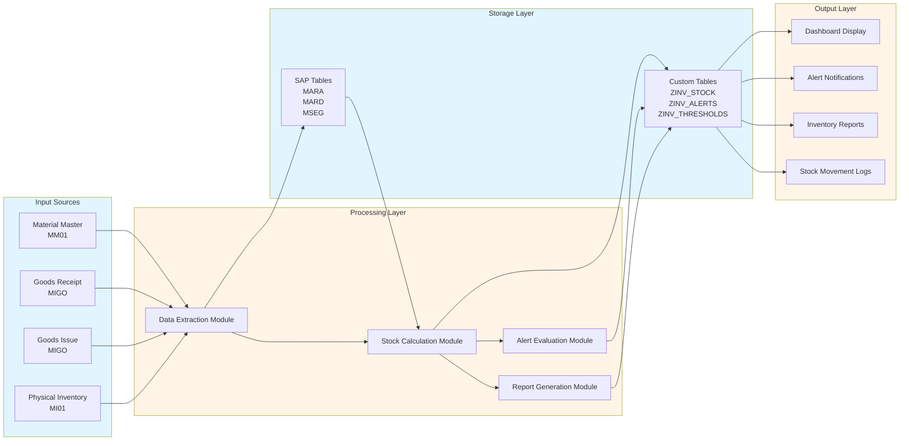
```mermaid
flowchart LR
    subgraph Input[Input Sources]
        A[Material Master<br/>MM01]
        B[Goods Receipt<br/>MIGO]
        C[Goods Issue<br/>MIGO]
        D[Physical Inventory<br/>MI01]
    end
    
    subgraph Processing[Processing Layer]
        E[Data Extraction Module]
        F[Stock Calculation Module]
        G[Alert Evaluation Module]
        H[Report Generation Module]
    end
    
    subgraph Storage[Storage Layer]
        I[Custom Tables<br/>ZINV_STOCK<br/>ZINV_ALERTS<br/>ZINV_THRESHOLDS]
        J[SAP Tables<br/>MARA<br/>MARD<br/>MSEG]
    end
    
    subgraph Output[Output Layer]
        K[Dashboard Display]
        L[Alert Notifications]
        M[Inventory Reports]
        N[Stock Movement Logs]
    end
    
    A --> E
    B --> E
    C --> E
    D --> E
    
    E --> F
    F --> G
    F --> H
    
    E --> J
    F --> I
    G --> I
    H --> I
    
    I --> K
    I --> L
    I --> M
    I --> N
    
    J --> F
    
    style Input fill:#e1f5ff
    style Processing fill:#fff4e6
    style Storage fill:#e1f5ff
    style Output fill:#fff4e6
```

---

### Sequence Diagram - Stock Monitoring Process

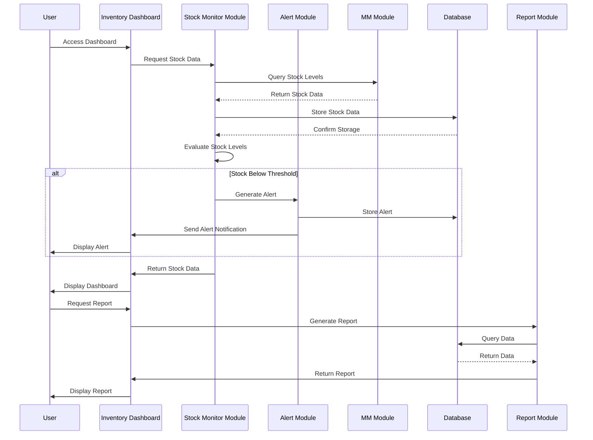
```mermaid
sequenceDiagram
    participant User
    participant Dashboard as Inventory Dashboard
    participant Monitor as Stock Monitor Module
    participant Alert as Alert Module
    participant MM as MM Module
    participant DB as Database
    participant Report as Report Module
    
    User->>Dashboard: Access Dashboard
    Dashboard->>Monitor: Request Stock Data
    Monitor->>MM: Query Stock Levels
    MM-->>Monitor: Return Stock Data
    Monitor->>DB: Store Stock Data
    DB-->>Monitor: Confirm Storage
    
    Monitor->>Monitor: Evaluate Stock Levels
    alt Stock Below Threshold
        Monitor->>Alert: Generate Alert
        Alert->>DB: Store Alert
        Alert->>Dashboard: Send Alert Notification
        Dashboard->>User: Display Alert
    end
    
    Monitor->>Dashboard: Return Stock Data
    Dashboard->>User: Display Dashboard
    
    User->>Dashboard: Request Report
    Dashboard->>Report: Generate Report
    Report->>DB: Query Data
    DB-->>Report: Return Data
    Report->>Dashboard: Return Report
    Dashboard->>User: Display Report
```

---

### Sequence Diagram - Alert Generation Process

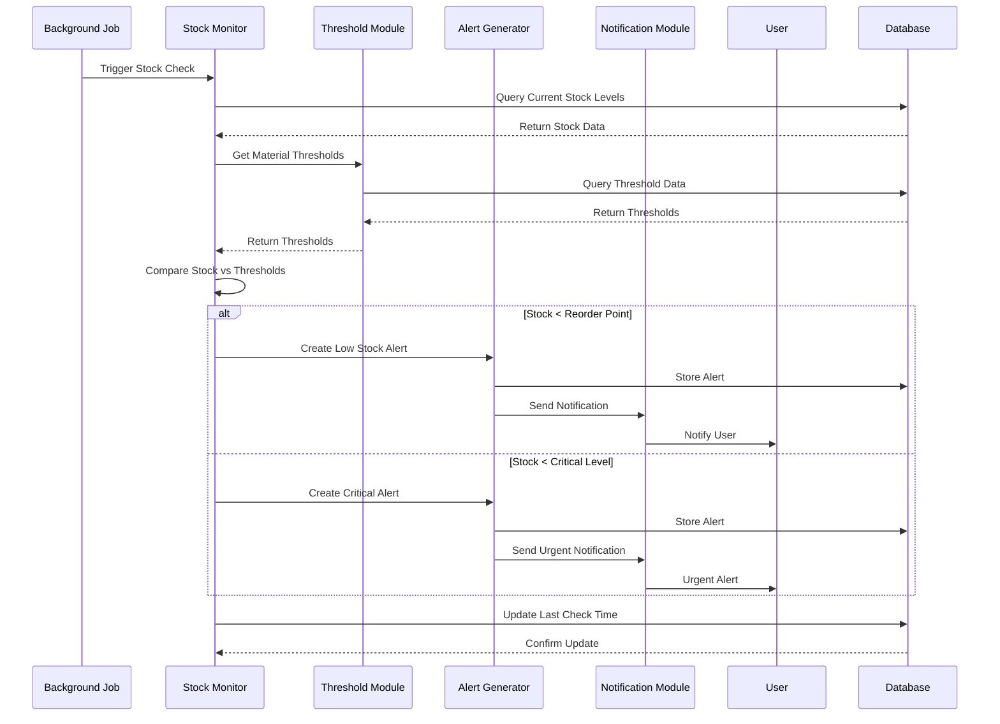
```mermaid
sequenceDiagram
    participant System as Background Job
    participant Monitor as Stock Monitor
    participant Threshold as Threshold Module
    participant Alert as Alert Generator
    participant Notification as Notification Module
    participant User
    participant DB as Database
    
    System->>Monitor: Trigger Stock Check
    Monitor->>DB: Query Current Stock Levels
    DB-->>Monitor: Return Stock Data
    
    Monitor->>Threshold: Get Material Thresholds
    Threshold->>DB: Query Threshold Data
    DB-->>Threshold: Return Thresholds
    Threshold-->>Monitor: Return Thresholds
    
    Monitor->>Monitor: Compare Stock vs Thresholds
    
    alt Stock < Reorder Point
        Monitor->>Alert: Create Low Stock Alert
        Alert->>DB: Store Alert
        Alert->>Notification: Send Notification
        Notification->>User: Notify User
    else Stock < Critical Level
        Monitor->>Alert: Create Critical Alert
        Alert->>DB: Store Alert
        Alert->>Notification: Send Urgent Notification
        Notification->>User: Urgent Alert
    end
    
    Monitor->>DB: Update Last Check Time
    DB-->>Monitor: Confirm Update
```

---

### Error Handling Flow

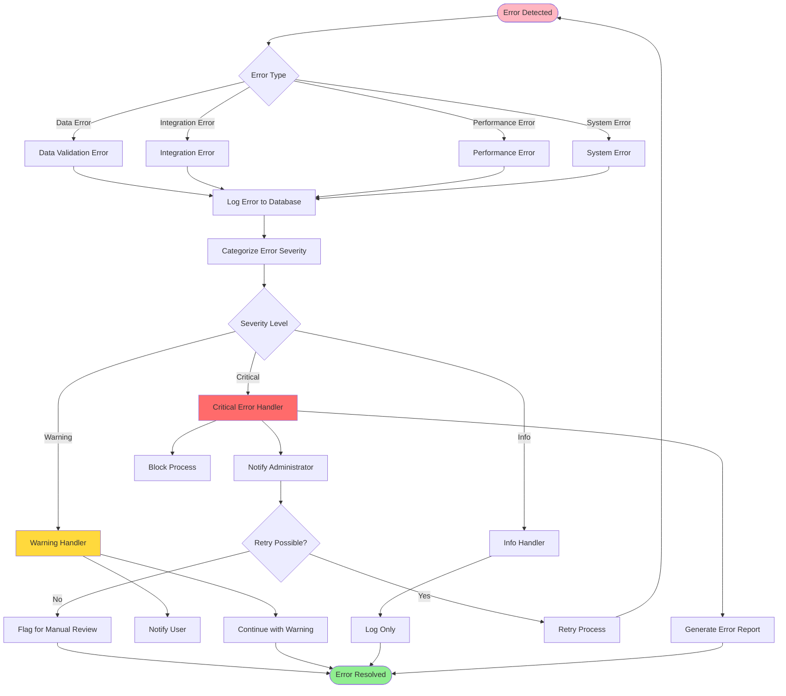
```mermaid
flowchart TD
    Start([Error Detected]) --> Identify{Error Type}
    
    Identify -->|Data Error| DataError[Data Validation Error]
    Identify -->|Integration Error| IntegrationError[Integration Error]
    Identify -->|Performance Error| PerformanceError[Performance Error]
    Identify -->|System Error| SystemError[System Error]
    
    DataError --> LogError[Log Error to Database]
    IntegrationError --> LogError
    PerformanceError --> LogError
    SystemError --> LogError
    
    LogError --> Categorize[Categorize Error Severity]
    Categorize --> Severity{Severity Level}
    
    Severity -->|Critical| Critical[Critical Error Handler]
    Severity -->|Warning| Warning[Warning Handler]
    Severity -->|Info| Info[Info Handler]
    
    Critical --> NotifyAdmin[Notify Administrator]
    Critical --> BlockProcess[Block Process]
    Critical --> GenerateReport[Generate Error Report]
    
    Warning --> NotifyUser[Notify User]
    Warning --> ContinueProcess[Continue with Warning]
    
    Info --> LogOnly[Log Only]
    
    NotifyAdmin --> Retry{Retry Possible?}
    Retry -->|Yes| RetryProcess[Retry Process]
    Retry -->|No| ManualReview[Flag for Manual Review]
    
    RetryProcess --> Start
    ManualReview --> End([Error Resolved])
    ContinueProcess --> End
    LogOnly --> End
    GenerateReport --> End
    
    style Start fill:#FFB6C1
    style Critical fill:#FF6B6B
    style Warning fill:#FFD93D
    style End fill:#90EE90
```

---

### User Interface Flow

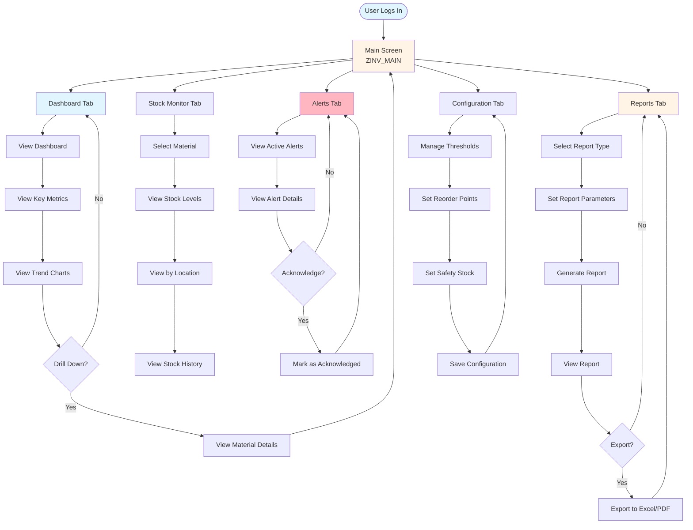
```mermaid
flowchart TD
    Start([User Logs In]) --> MainScreen[Main Screen<br/>ZINV_MAIN]
    
    MainScreen --> DashboardTab[Dashboard Tab]
    MainScreen --> MonitorTab[Stock Monitor Tab]
    MainScreen --> AlertTab[Alerts Tab]
    MainScreen --> ReportTab[Reports Tab]
    MainScreen --> ConfigTab[Configuration Tab]
    
    DashboardTab --> ViewDashboard[View Dashboard]
    ViewDashboard --> ViewMetrics[View Key Metrics]
    ViewMetrics --> ViewCharts[View Trend Charts]
    ViewCharts --> DrillDown{Drill Down?}
    DrillDown -->|Yes| DetailView[View Material Details]
    DrillDown -->|No| DashboardTab
    
    MonitorTab --> SelectMaterial[Select Material]
    SelectMaterial --> ViewStock[View Stock Levels]
    ViewStock --> ViewLocations[View by Location]
    ViewLocations --> ViewHistory[View Stock History]
    
    AlertTab --> ViewAlerts[View Active Alerts]
    ViewAlerts --> AlertDetails[View Alert Details]
    AlertDetails --> Acknowledge{Acknowledge?}
    Acknowledge -->|Yes| MarkAcknowledged[Mark as Acknowledged]
    Acknowledge -->|No| AlertTab
    
    ReportTab --> SelectReport[Select Report Type]
    SelectReport --> SetParameters[Set Report Parameters]
    SetParameters --> GenerateReport[Generate Report]
    GenerateReport --> ViewReport[View Report]
    ViewReport --> Export{Export?}
    Export -->|Yes| ExportReport[Export to Excel/PDF]
    Export -->|No| ReportTab
    
    ConfigTab --> ManageThresholds[Manage Thresholds]
    ManageThresholds --> SetReorderPoint[Set Reorder Points]
    SetReorderPoint --> SetSafetyStock[Set Safety Stock]
    SetSafetyStock --> SaveConfig[Save Configuration]
    
    DetailView --> MainScreen
    MarkAcknowledged --> AlertTab
    ExportReport --> ReportTab
    SaveConfig --> ConfigTab
    
    style Start fill:#e1f5ff
    style MainScreen fill:#fff4e6
    style DashboardTab fill:#e1f5ff
    style AlertTab fill:#FFB6C1
    style ReportTab fill:#fff4e6
```

---

### Technical Design

#### Component 1: Stock Monitoring Module
- **Purpose**: Monitor stock levels across all materials and storage locations
- **Functionality**:
  - Real-time stock level queries
  - Stock movement tracking
  - Stock status calculation (available, reserved, blocked)
  - Historical stock data maintenance
- **Integration Points**: MM Module (MARD, MSEG tables), Custom tables

#### Component 2: Alert Generation Module
- **Purpose**: Generate automated alerts based on stock thresholds
- **Functionality**:
  - Threshold evaluation
  - Alert creation and categorization
  - Alert notification distribution
  - Alert acknowledgment tracking
- **Integration Points**: Stock Monitoring Module, Notification system, Custom alert tables

#### Component 3: Report Generation Module
- **Purpose**: Generate custom inventory reports
- **Functionality**:
  - Stock level reports
  - Inventory valuation reports
  - Stock movement reports
  - Aging analysis reports
  - Export capabilities (Excel, PDF)
- **Integration Points**: Stock Monitoring Module, Custom tables, ALV framework

#### Component 4: Dashboard Module
- **Purpose**: Provide visual dashboard with key inventory metrics
- **Functionality**:
  - Real-time metric calculation
  - Chart and graph generation
  - Drill-down capabilities
  - Customizable views
- **Integration Points**: Stock Monitoring Module, Report Generation Module

#### Component 5: Integration Module
- **Purpose**: Integrate with SAP standard modules
- **Functionality**:
  - Material master data access
  - Goods movement integration
  - Purchase requisition integration
  - Physical inventory integration
- **Integration Points**: MM Module, PP Module, Standard SAP tables

#### Data Dictionary Objects

**Custom Tables**:
- **ZINV_STOCK**: Stores current stock levels and status
- **ZINV_ALERTS**: Stores alert information and status
- **ZINV_THRESHOLDS**: Stores material threshold configurations
- **ZINV_MOVEMENTS**: Stores stock movement history
- **ZINV_CONFIG**: Stores system configuration

**Append Structures**:
- Material Master enhancement (add custom fields for thresholds)
- Storage location enhancement (add custom tracking fields)

---

### Testing Strategy

#### Unit Testing
- **Stock Monitoring Module**: Test stock level calculations, status determination
- **Alert Generation Module**: Test threshold evaluation, alert creation logic
- **Report Generation Module**: Test report queries, data aggregation
- **Dashboard Module**: Test metric calculations, chart generation
- **Integration Module**: Test data extraction, transformation

#### Integration Testing
- **End-to-End Scenarios**:
  - Complete stock monitoring cycle
  - Alert generation and notification flow
  - Report generation with various parameters
  - Dashboard refresh and data update
  - Integration with goods receipt/issue processes

#### User Acceptance Testing
- **Test Cases**:
  - User can view dashboard and understand metrics
  - User receives alerts when stock is low
  - User can generate and export reports
  - User can configure thresholds
  - User can acknowledge alerts
  - System handles concurrent users

#### Performance Testing
- **Criteria**:
  - Dashboard load time < 5 seconds
  - Report generation < 30 seconds for 1000 materials
  - Alert generation < 10 seconds for batch processing
  - Support 50+ concurrent users
  - Handle 1000+ materials efficiently

---

### Documentation Requirements

#### Technical Documentation
- System architecture document
- Component design specifications
- Data dictionary documentation
- Integration point documentation
- API documentation (if applicable)
- Error handling documentation

#### User Documentation
- User manual for dashboard
- Alert management guide
- Report generation guide
- Configuration guide
- Troubleshooting guide

#### Process Documentation
- Stock monitoring process flow
- Alert generation process flow
- Report generation process flow
- Integration process flows

---

### Presentation Points

#### 1. Business Problem
- Manual inventory tracking is time-consuming
- Lack of real-time visibility into stock levels
- Reactive approach leads to stockouts
- Difficulty in identifying slow-moving inventory
- No automated alert system for low stock

#### 2. Solution Overview
- Custom inventory management system
- Real-time stock monitoring
- Automated alert system
- Comprehensive reporting
- Visual dashboard

#### 3. Key Features
- Real-time stock monitoring across locations
- Automated alerts for low stock and critical levels
- Custom inventory reports with export capabilities
- Visual dashboard with key metrics
- Integration with standard SAP MM processes

#### 4. Technical Highlights
- Custom development using ABAP
- Integration with SAP MM module
- Real-time data processing
- Efficient database queries
- User-friendly interface

#### 5. Business Impact
- Reduced stockouts through proactive monitoring
- Optimized inventory levels (estimated 15% reduction)
- Improved inventory visibility
- Time savings (estimated 20 hours/week)
- Better decision-making through data-driven insights

#### 6. Project Timeline
- 3-month project duration
- Successful completion of all phases
- On-time delivery
- All requirements met

---

### Project Phases Breakdown

#### Phase 1: Project Management (Weeks 1-4)

**Activities**:
- Project kickoff and team formation
- Stakeholder identification and engagement
- Requirements gathering and documentation
- Business process analysis
- System design and architecture planning
- Design review and approval

**Deliverables**:
- Project charter
- Requirements document
- Business process documentation
- System design document
- Architecture diagrams
- Approved project plan

**Key Milestones**:
- Week 1: Project kickoff completed
- Week 2: Requirements gathered
- Week 3: System design completed
- Week 4: Design approved

#### Phase 2: Development (Weeks 5-8)

**Activities**:
- Material master enhancement development
- Stock monitoring module development
- Alert generation module development
- Report generation module development
- Dashboard module development
- Integration module development
- Unit testing
- Code review

**Deliverables**:
- Developed components
- Unit test results
- Code review reports
- Technical documentation (in progress)

**Key Milestones**:
- Week 5-6: Core components developed
- Week 7: Integration completed
- Week 8: Unit testing completed

#### Phase 3: Testing (Weeks 9-10)

**Activities**:
- Integration testing
- End-to-end scenario testing
- User acceptance testing preparation
- UAT execution
- Bug identification and logging
- Bug fixes and retesting
- Performance testing

**Deliverables**:
- Integration test results
- UAT test cases and results
- Bug reports
- Performance test results
- Fixed components

**Key Milestones**:
- Week 9: Integration testing completed
- Week 10: UAT completed, bugs fixed

#### Phase 4: Documentation (Week 11)

**Activities**:
- Technical documentation completion
- User documentation creation
- Process flow documentation
- Demo script preparation
- Demo rehearsal

**Deliverables**:
- Complete technical documentation
- User manual
- Process documentation
- Demo scripts
- Training materials

**Key Milestones**:
- Week 11: All documentation completed

#### Phase 5: Presentation (Week 12)

**Activities**:
- Presentation slide creation
- Demo preparation
- Presentation rehearsal
- Final review
- Project presentation

**Deliverables**:
- Presentation slides
- Live demo
- Project summary document

**Key Milestones**:
- Week 12: Project presentation completed

---

## Example 2: Sales Order Processing Enhancement

### Project Overview

**Project Name**: Sales Order Processing Enhancement with Custom Pricing Logic and Automated Approval Workflow

**Objective**: Enhance standard SAP SD sales order processing with custom pricing logic, automated approval workflows for high-value orders, integration with external systems via RFC/IDoc, and comprehensive order tracking capabilities.

**Business Value**:
- Automate approval processes for sales orders
- Implement custom pricing rules based on business logic
- Improve order processing efficiency
- Enhance integration with external systems
- Provide better order visibility and tracking

**Project Duration**: 3 Months (12 Weeks)

---

### Business Requirements

#### Functional Requirements

1. **Custom Pricing Logic**
   - Implement volume-based pricing discounts
   - Customer-specific pricing rules
   - Product group-based pricing
   - Promotional pricing support
   - Price override with authorization

2. **Automated Approval Workflow**
   - Automatic approval for orders within limits
   - Multi-level approval for high-value orders
   - Manager approval workflow
   - Credit check integration
   - Approval history tracking

3. **Order Validation**
   - Custom validation rules
   - Material availability check
   - Customer credit limit validation
   - Delivery date validation
   - Custom business rule validation

4. **External System Integration**
   - RFC integration for pricing data
   - IDoc integration for order transmission
   - External CRM system integration
   - E-commerce platform integration

5. **Order Tracking**
   - Real-time order status tracking
   - Order history and audit trail
   - Delivery status updates
   - Billing status tracking

6. **Reporting and Analytics**
   - Order processing reports
   - Approval workflow reports
   - Pricing analysis reports
   - Order performance metrics

#### Non-Functional Requirements

1. **Performance**
   - Process orders within 30 seconds
   - Support 500+ orders per day
   - Handle concurrent users (100+)
   - Fast approval workflow processing

2. **Reliability**
   - 99.5% uptime availability
   - Data consistency checks
   - Error handling and recovery
   - Audit trail for all changes

3. **Usability**
   - User-friendly interface
   - Clear approval notifications
   - Intuitive workflow navigation
   - Responsive design

4. **Security**
   - Authorization checks for approvals
   - Role-based access control
   - Secure external integration
   - Audit logging

---

### 3-Month Project Timeline

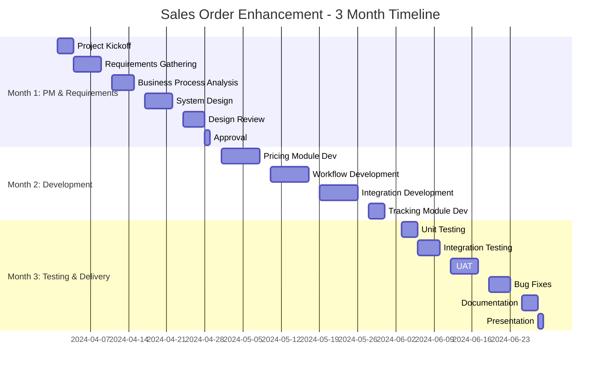
```mermaid
gantt
    title Sales Order Enhancement - 3 Month Timeline
    dateFormat YYYY-MM-DD
    section Month 1: PM & Requirements
    Project Kickoff           :2024-04-01, 3d
    Requirements Gathering    :2024-04-04, 5d
    Business Process Analysis  :2024-04-11, 4d
    System Design             :2024-04-17, 5d
    Design Review            :2024-04-24, 4d
    Approval                 :2024-04-28, 1d
    
    section Month 2: Development
    Pricing Module Dev       :2024-05-01, 7d
    Workflow Development     :2024-05-10, 7d
    Integration Development  :2024-05-19, 7d
    Tracking Module Dev      :2024-05-28, 3d
    
    section Month 3: Testing & Delivery
    Unit Testing             :2024-06-03, 3d
    Integration Testing      :2024-06-06, 4d
    UAT                      :2024-06-12, 5d
    Bug Fixes                :2024-06-19, 4d
    Documentation            :2024-06-25, 3d
    Presentation             :2024-06-28, 1d
```

#### Week-by-Week Breakdown

**Month 1: Project Management & Requirements**
- **Week 1**: Project kickoff, stakeholder identification, requirements gathering
- **Week 2**: Business process analysis, current state documentation
- **Week 3**: System design, architecture planning, workflow design
- **Week 4**: Design review, approval, finalize requirements

**Month 2: Development**
- **Week 5**: Custom pricing logic development
- **Week 6**: Approval workflow development
- **Week 7**: External system integration (RFC/IDoc)
- **Week 8**: Order tracking module, unit testing

**Month 3: Testing, Documentation & Presentation**
- **Week 9**: Integration testing, UAT preparation
- **Week 10**: User acceptance testing, bug fixes
- **Week 11**: Documentation completion, demo preparation
- **Week 12**: Presentation preparation and delivery

---

### System Architecture

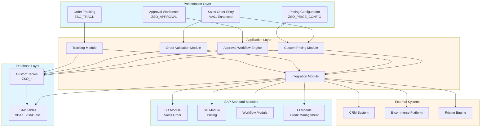
```mermaid
graph TB
    subgraph Presentation[Presentation Layer]
        A[Sales Order Entry<br/>VA01 Enhanced]
        B[Approval Workbench<br/>ZSO_APPROVAL]
        C[Order Tracking<br/>ZSO_TRACK]
        D[Pricing Configuration<br/>ZSO_PRICE_CONFIG]
    end
    
    subgraph Application[Application Layer]
        E[Custom Pricing Module]
        F[Approval Workflow Engine]
        G[Order Validation Module]
        H[Integration Module]
        I[Tracking Module]
    end
    
    subgraph SAP[SAP Standard Modules]
        J[SD Module<br/>Sales Order]
        K[SD Module<br/>Pricing]
        L[Workflow Module]
        M[FI Module<br/>Credit Management]
    end
    
    subgraph External[External Systems]
        N[CRM System]
        O[E-commerce Platform]
        P[Pricing Engine]
    end
    
    subgraph Database[Database Layer]
        Q[Custom Tables<br/>ZSO_*]
        R[SAP Tables<br/>VBAK, VBAP, etc.]
    end
    
    A --> E
    A --> G
    B --> F
    C --> I
    D --> E
    
    E --> H
    F --> H
    G --> H
    I --> H
    
    H --> J
    H --> K
    H --> L
    H --> M
    
    H --> N
    H --> O
    H --> P
    
    E --> Q
    F --> Q
    G --> Q
    I --> Q
    
    H --> R
    Q --> R
    
    style Presentation fill:#e1f5ff
    style Application fill:#fff4e6
    style SAP fill:#e1f5ff
    style External fill:#fff4e6
    style Database fill:#e1f5ff
```

---

### Complete Process Flow

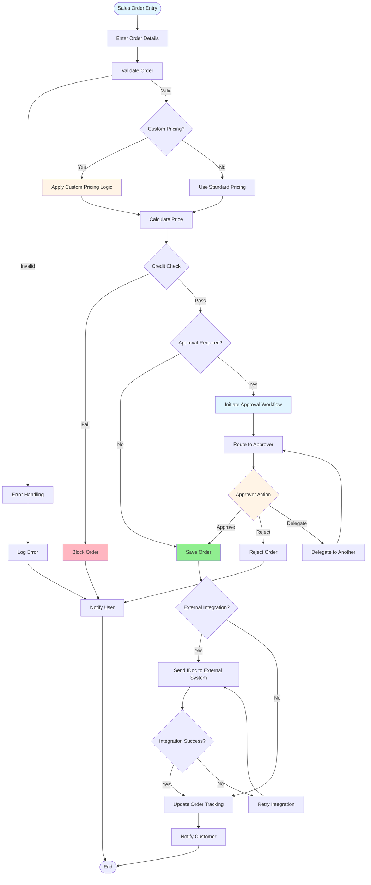
```mermaid
flowchart TD
    Start([Sales Order Entry]) --> EnterOrder[Enter Order Details]
    EnterOrder --> ValidateOrder[Validate Order]
    
    ValidateOrder -->|Invalid| Error[Error Handling]
    ValidateOrder -->|Valid| CheckPricing{Custom Pricing?}
    
    CheckPricing -->|Yes| ApplyCustomPricing[Apply Custom Pricing Logic]
    CheckPricing -->|No| UseStandardPricing[Use Standard Pricing]
    
    ApplyCustomPricing --> CalculatePrice[Calculate Price]
    UseStandardPricing --> CalculatePrice
    
    CalculatePrice --> CheckCredit{Credit Check}
    CheckCredit -->|Fail| BlockOrder[Block Order]
    CheckCredit -->|Pass| CheckApproval{Approval Required?}
    
    BlockOrder --> NotifyUser[Notify User]
    NotifyUser --> End([End])
    
    CheckApproval -->|No| SaveOrder[Save Order]
    CheckApproval -->|Yes| InitiateWorkflow[Initiate Approval Workflow]
    
    InitiateWorkflow --> RouteApprover[Route to Approver]
    RouteApprover --> ApproverAction{Approver Action}
    
    ApproverAction -->|Approve| SaveOrder
    ApproverAction -->|Reject| RejectOrder[Reject Order]
    ApproverAction -->|Delegate| DelegateApproval[Delegate to Another]
    
    DelegateApproval --> RouteApprover
    RejectOrder --> NotifyUser
    
    SaveOrder --> IntegrateExternal{External Integration?}
    IntegrateExternal -->|Yes| SendIDoc[Send IDoc to External System]
    IntegrateExternal -->|No| UpdateTracking[Update Order Tracking]
    
    SendIDoc --> ConfirmIntegration{Integration Success?}
    ConfirmIntegration -->|Yes| UpdateTracking
    ConfirmIntegration -->|No| RetryIntegration[Retry Integration]
    RetryIntegration --> SendIDoc
    
    UpdateTracking --> NotifyCustomer[Notify Customer]
    NotifyCustomer --> End
    
    Error --> LogError[Log Error]
    LogError --> NotifyUser
    
    style Start fill:#e1f5ff
    style ApplyCustomPricing fill:#fff4e6
    style InitiateWorkflow fill:#e1f5ff
    style ApproverAction fill:#fff4e6
    style SaveOrder fill:#90EE90
    style BlockOrder fill:#FFB6C1
```

---

### Sequence Diagram - Order Processing with Approval

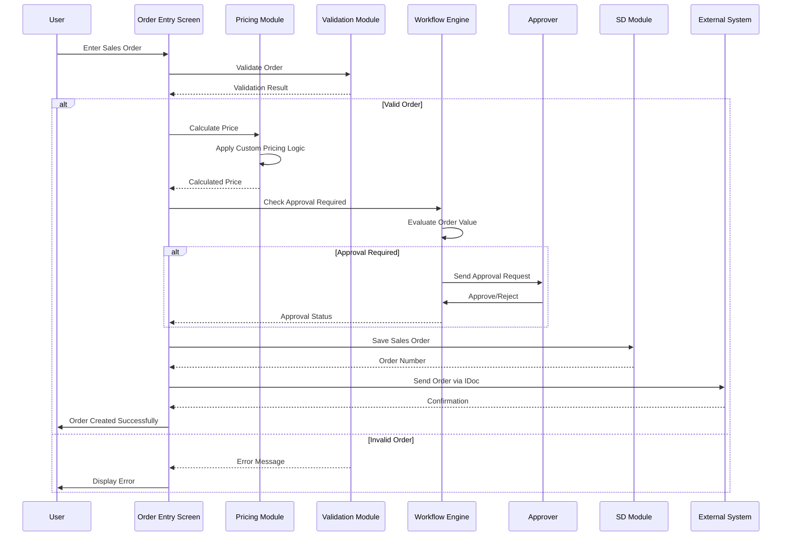
```mermaid
sequenceDiagram
    participant User
    participant OrderEntry as Order Entry Screen
    participant Pricing as Pricing Module
    participant Validation as Validation Module
    participant Workflow as Workflow Engine
    participant Approver
    participant SD as SD Module
    participant External as External System
    
    User->>OrderEntry: Enter Sales Order
    OrderEntry->>Validation: Validate Order
    Validation-->>OrderEntry: Validation Result
    
    alt Valid Order
        OrderEntry->>Pricing: Calculate Price
        Pricing->>Pricing: Apply Custom Pricing Logic
        Pricing-->>OrderEntry: Calculated Price
        
        OrderEntry->>Workflow: Check Approval Required
        Workflow->>Workflow: Evaluate Order Value
        
        alt Approval Required
            Workflow->>Approver: Send Approval Request
            Approver->>Workflow: Approve/Reject
            Workflow-->>OrderEntry: Approval Status
        end
        
        OrderEntry->>SD: Save Sales Order
        SD-->>OrderEntry: Order Number
        
        OrderEntry->>External: Send Order via IDoc
        External-->>OrderEntry: Confirmation
        
        OrderEntry->>User: Order Created Successfully
    else Invalid Order
        Validation-->>OrderEntry: Error Message
        OrderEntry->>User: Display Error
    end
```

---

### Error Handling Flow

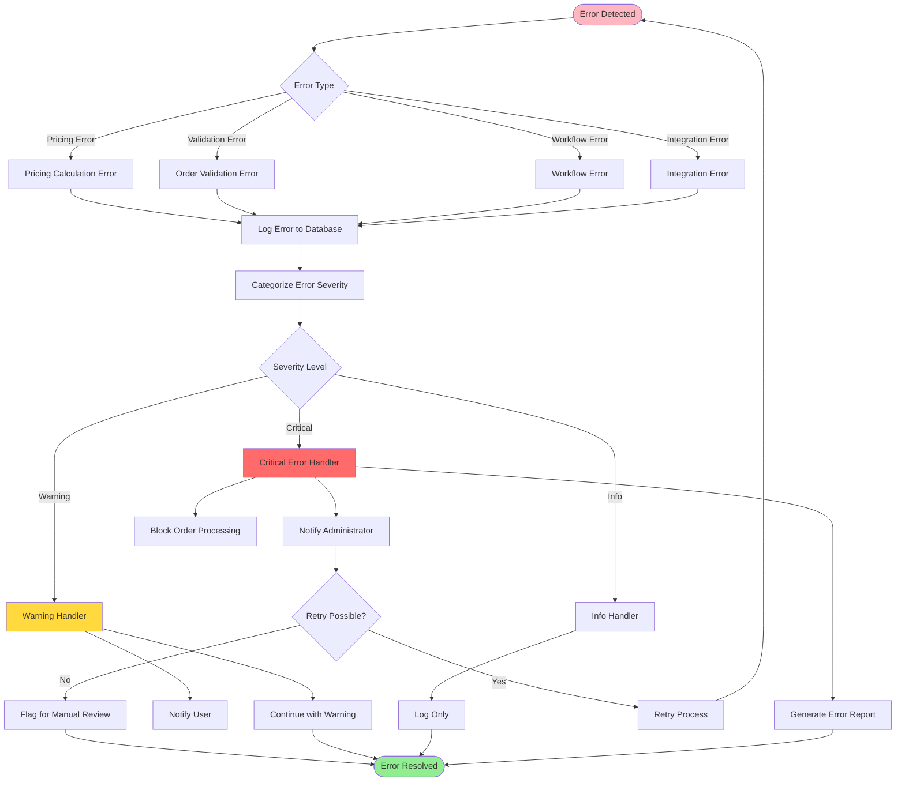
```mermaid
flowchart TD
    Start([Error Detected]) --> Identify{Error Type}
    
    Identify -->|Pricing Error| PricingError[Pricing Calculation Error]
    Identify -->|Validation Error| ValidationError[Order Validation Error]
    Identify -->|Workflow Error| WorkflowError[Workflow Error]
    Identify -->|Integration Error| IntegrationError[Integration Error]
    
    PricingError --> LogError[Log Error to Database]
    ValidationError --> LogError
    WorkflowError --> LogError
    IntegrationError --> LogError
    
    LogError --> Categorize[Categorize Error Severity]
    Categorize --> Severity{Severity Level}
    
    Severity -->|Critical| Critical[Critical Error Handler]
    Severity -->|Warning| Warning[Warning Handler]
    Severity -->|Info| Info[Info Handler]
    
    Critical --> NotifyAdmin[Notify Administrator]
    Critical --> BlockProcess[Block Order Processing]
    Critical --> GenerateReport[Generate Error Report]
    
    Warning --> NotifyUser[Notify User]
    Warning --> ContinueProcess[Continue with Warning]
    
    Info --> LogOnly[Log Only]
    
    NotifyAdmin --> Retry{Retry Possible?}
    Retry -->|Yes| RetryProcess[Retry Process]
    Retry -->|No| ManualReview[Flag for Manual Review]
    
    RetryProcess --> Start
    ManualReview --> End([Error Resolved])
    ContinueProcess --> End
    LogOnly --> End
    GenerateReport --> End
    
    style Start fill:#FFB6C1
    style Critical fill:#FF6B6B
    style Warning fill:#FFD93D
    style End fill:#90EE90
```

---

### Technical Design

#### Component 1: Custom Pricing Module
- **Purpose**: Implement custom pricing logic beyond standard SAP pricing
- **Functionality**:
  - Volume-based discount calculation
  - Customer-specific pricing rules
  - Product group pricing
  - Promotional pricing
  - Price override with authorization
- **Integration Points**: SD Pricing Module, Custom pricing tables, External pricing engine

#### Component 2: Approval Workflow Engine
- **Purpose**: Automate approval workflows for sales orders
- **Functionality**:
  - Multi-level approval routing
  - Approval rule configuration
  - Approval history tracking
  - Notification management
  - Escalation handling
- **Integration Points**: SAP Workflow, SD Module, Custom workflow tables

#### Component 3: Order Validation Module
- **Purpose**: Validate sales orders with custom business rules
- **Functionality**:
  - Custom validation rules
  - Material availability check
  - Credit limit validation
  - Delivery date validation
  - Business rule validation
- **Integration Points**: SD Module, MM Module, FI Module

#### Component 4: Integration Module
- **Purpose**: Integrate with external systems
- **Functionality**:
  - RFC communication
  - IDoc processing
  - External CRM integration
  - E-commerce platform integration
  - Error handling and retry logic
- **Integration Points**: External systems, SAP IDoc framework, RFC framework

#### Component 5: Order Tracking Module
- **Purpose**: Track order status and history
- **Functionality**:
  - Real-time status tracking
  - Order history maintenance
  - Audit trail
  - Status notifications
- **Integration Points**: SD Module, Custom tracking tables

---

### Testing Strategy

#### Unit Testing
- Custom pricing logic calculations
- Approval workflow routing logic
- Order validation rules
- Integration module communication
- Tracking module status updates

#### Integration Testing
- End-to-end order processing
- Pricing integration with SD
- Workflow integration
- External system integration
- Order tracking integration

#### User Acceptance Testing
- Order entry with custom pricing
- Approval workflow execution
- Order validation scenarios
- External system integration
- Order tracking and reporting

#### Performance Testing
- Order processing time < 30 seconds
- Support 500+ orders per day
- Handle 100+ concurrent users
- Fast approval workflow processing
- Efficient external integration

---

### Documentation Requirements

#### Technical Documentation
- System architecture document
- Component design specifications
- Integration point documentation
- Workflow configuration guide
- Error handling documentation

#### User Documentation
- Order entry guide with custom pricing
- Approval workflow user guide
- Order tracking guide
- Configuration guide
- Troubleshooting guide

---

### Presentation Points

1. **Business Problem**: Manual approval processes, limited pricing flexibility, lack of external integration
2. **Solution**: Enhanced sales order processing with custom pricing, automated workflows, and external integration
3. **Key Features**: Custom pricing logic, automated approval workflows, external system integration, order tracking
4. **Technical Highlights**: BADI implementation, Workflow integration, RFC/IDoc integration
5. **Business Impact**: Reduced order processing time, automated approvals, improved pricing flexibility

---

### Project Phases Breakdown

#### Phase 1: Project Management (Weeks 1-4)
- Requirements gathering and analysis
- Business process documentation
- System design and architecture
- Workflow design
- Design approval

#### Phase 2: Development (Weeks 5-8)
- Custom pricing module development
- Approval workflow development
- Integration module development
- Order tracking module development
- Unit testing

#### Phase 3: Testing (Weeks 9-10)
- Integration testing
- User acceptance testing
- Bug fixes and retesting
- Performance testing

#### Phase 4: Documentation (Week 11)
- Technical documentation
- User documentation
- Demo preparation

#### Phase 5: Presentation (Week 12)
- Presentation preparation
- Project presentation

---

## Example 3: Financial Reporting Dashboard

### Project Overview

**Project Name**: Financial Reporting Dashboard with Real-Time Analytics and Automated Report Distribution

**Objective**: Develop a comprehensive financial reporting dashboard that provides real-time financial analytics, automated report generation and distribution, and interactive data visualization for financial decision-making.

**Business Value**:
- Real-time financial visibility
- Automated report generation and distribution
- Improved financial decision-making
- Reduced manual reporting effort
- Enhanced data visualization

**Project Duration**: 3 Months (12 Weeks)

---

### Business Requirements

#### Functional Requirements

1. **Financial Data Extraction**
   - Extract data from FI module
   - Extract data from CO module
   - Support multiple company codes
   - Handle multiple currencies
   - Historical data extraction

2. **Dashboard Visualization**
   - Real-time financial metrics
   - Interactive charts and graphs
   - Drill-down capabilities
   - Customizable views
   - Trend analysis

3. **Automated Report Generation**
   - Scheduled report generation
   - Multiple report formats (PDF, Excel)
   - Custom report templates
   - Report scheduling
   - Report versioning

4. **Report Distribution**
   - Automated email distribution
   - Role-based distribution
   - Scheduled distribution
   - Distribution tracking
   - Archive management

5. **Financial Analytics**
   - Profit & Loss analysis
   - Balance Sheet analysis
   - Cash flow analysis
   - Budget vs Actual comparison
   - Variance analysis

6. **Integration**
   - FI module integration
   - CO module integration
   - BW integration (optional)
   - External system integration

#### Non-Functional Requirements

1. **Performance**
   - Dashboard load time < 10 seconds
   - Report generation < 60 seconds
   - Support 200+ concurrent users
   - Handle large data volumes

2. **Reliability**
   - 99% uptime availability
   - Data accuracy validation
   - Error handling and recovery
   - Audit trail

3. **Usability**
   - User-friendly interface
   - Intuitive navigation
   - Responsive design
   - Mobile-friendly (optional)

4. **Security**
   - Authorization checks
   - Role-based access control
   - Secure data access
   - Audit logging

---

### 3-Month Project Timeline

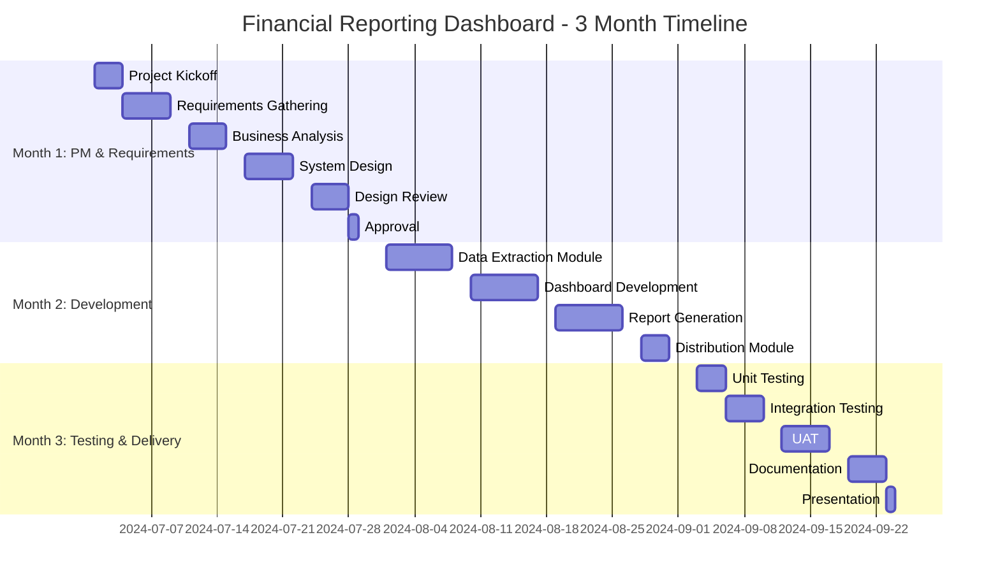
```mermaid
gantt
    title Financial Reporting Dashboard - 3 Month Timeline
    dateFormat YYYY-MM-DD
    section Month 1: PM & Requirements
    Project Kickoff           :2024-07-01, 3d
    Requirements Gathering    :2024-07-04, 5d
    Business Analysis         :2024-07-11, 4d
    System Design             :2024-07-17, 5d
    Design Review            :2024-07-24, 4d
    Approval                 :2024-07-28, 1d
    
    section Month 2: Development
    Data Extraction Module   :2024-08-01, 7d
    Dashboard Development    :2024-08-10, 7d
    Report Generation        :2024-08-19, 7d
    Distribution Module      :2024-08-28, 3d
    
    section Month 3: Testing & Delivery
    Unit Testing             :2024-09-03, 3d
    Integration Testing      :2024-09-06, 4d
    UAT                      :2024-09-12, 5d
    Documentation            :2024-09-19, 4d
    Presentation             :2024-09-23, 1d
```

#### Week-by-Week Breakdown

**Month 1: Project Management & Requirements**
- **Week 1**: Project kickoff, requirements gathering
- **Week 2**: Business analysis, current reporting analysis
- **Week 3**: System design, dashboard design
- **Week 4**: Design review, approval

**Month 2: Development**
- **Week 5**: Data extraction module development
- **Week 6**: Dashboard development
- **Week 7**: Report generation module development
- **Week 8**: Distribution module, unit testing

**Month 3: Testing, Documentation & Presentation**
- **Week 9**: Integration testing, UAT preparation
- **Week 10**: User acceptance testing, bug fixes
- **Week 11**: Documentation completion
- **Week 12**: Presentation preparation and delivery

---

### System Architecture

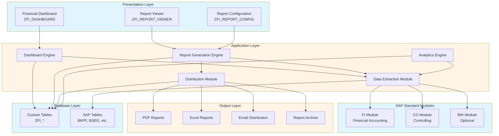
```mermaid
graph TB
    subgraph Presentation[Presentation Layer]
        A[Financial Dashboard<br/>ZFI_DASHBOARD]
        B[Report Viewer<br/>ZFI_REPORT_VIEWER]
        C[Report Configuration<br/>ZFI_REPORT_CONFIG]
    end
    
    subgraph Application[Application Layer]
        D[Data Extraction Module]
        E[Dashboard Engine]
        F[Report Generation Engine]
        G[Distribution Module]
        H[Analytics Engine]
    end
    
    subgraph SAP[SAP Standard Modules]
        I[FI Module<br/>Financial Accounting]
        J[CO Module<br/>Controlling]
        K[BW Module<br/>Optional]
    end
    
    subgraph Output[Output Layer]
        L[PDF Reports]
        M[Excel Reports]
        N[Email Distribution]
        O[Report Archive]
    end
    
    subgraph Database[Database Layer]
        P[Custom Tables<br/>ZFI_*]
        Q[SAP Tables<br/>BKPF, BSEG, etc.]
    end
    
    A --> E
    B --> F
    C --> F
    
    E --> D
    F --> D
    H --> D
    
    D --> I
    D --> J
    D --> K
    
    F --> G
    G --> L
    G --> M
    G --> N
    G --> O
    
    D --> Q
    E --> P
    F --> P
    G --> P
    H --> P
    
    style Presentation fill:#e1f5ff
    style Application fill:#fff4e6
    style SAP fill:#e1f5ff
    style Output fill:#fff4e6
    style Database fill:#e1f5ff
```

---

### Complete Process Flow

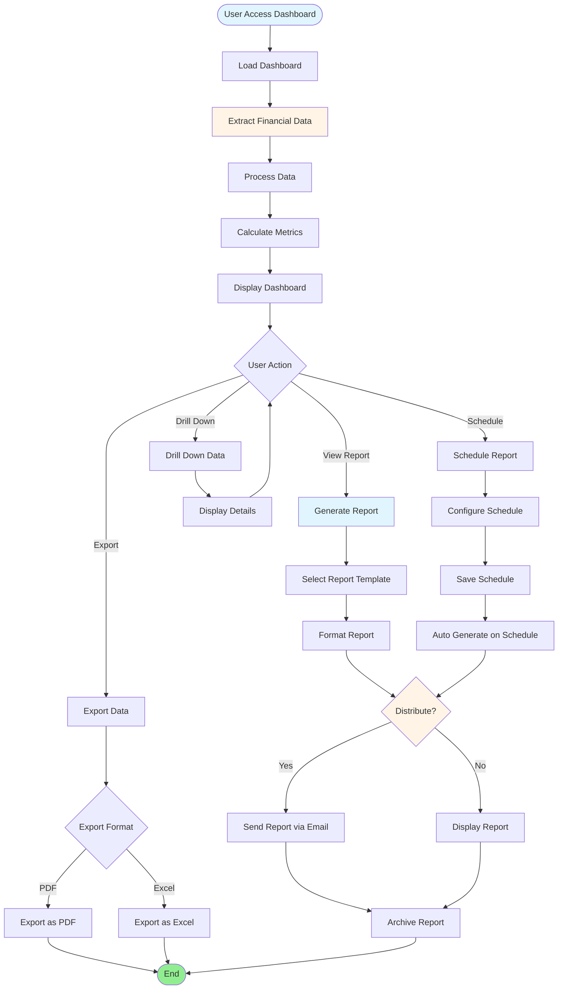
```mermaid
flowchart TD
    Start([User Access Dashboard]) --> LoadDashboard[Load Dashboard]
    LoadDashboard --> ExtractData[Extract Financial Data]
    
    ExtractData --> ProcessData[Process Data]
    ProcessData --> CalculateMetrics[Calculate Metrics]
    
    CalculateMetrics --> DisplayDashboard[Display Dashboard]
    DisplayDashboard --> UserAction{User Action}
    
    UserAction -->|View Report| GenerateReport[Generate Report]
    UserAction -->|Drill Down| DrillDown[Drill Down Data]
    UserAction -->|Export| ExportData[Export Data]
    UserAction -->|Schedule| ScheduleReport[Schedule Report]
    
    DrillDown --> DisplayDetails[Display Details]
    DisplayDetails --> UserAction
    
    GenerateReport --> SelectTemplate[Select Report Template]
    SelectTemplate --> FormatReport[Format Report]
    FormatReport --> DistributeReport{Distribute?}
    
    DistributeReport -->|Yes| SendReport[Send Report via Email]
    DistributeReport -->|No| DisplayReport[Display Report]
    
    SendReport --> ArchiveReport[Archive Report]
    DisplayReport --> ArchiveReport
    
    ScheduleReport --> ConfigureSchedule[Configure Schedule]
    ConfigureSchedule --> SaveSchedule[Save Schedule]
    SaveSchedule --> AutoGenerate[Auto Generate on Schedule]
    AutoGenerate --> DistributeReport
    
    ExportData --> ExportFormat{Export Format}
    ExportFormat -->|PDF| ExportPDF[Export as PDF]
    ExportFormat -->|Excel| ExportExcel[Export as Excel]
    
    ExportPDF --> End([End])
    ExportExcel --> End
    ArchiveReport --> End
    
    style Start fill:#e1f5ff
    style ExtractData fill:#fff4e6
    style GenerateReport fill:#e1f5ff
    style DistributeReport fill:#fff4e6
    style End fill:#90EE90
```

---

### Technical Design

#### Component 1: Data Extraction Module
- **Purpose**: Extract financial data from SAP modules
- **Functionality**:
  - FI data extraction
  - CO data extraction
  - Multi-company code support
  - Multi-currency handling
  - Historical data extraction
- **Integration Points**: FI Module, CO Module, BW Module (optional)

#### Component 2: Dashboard Engine
- **Purpose**: Generate and display financial dashboard
- **Functionality**:
  - Real-time metric calculation
  - Chart and graph generation
  - Drill-down capabilities
  - Customizable views
  - Interactive visualization
- **Integration Points**: Data Extraction Module, Analytics Engine

#### Component 3: Report Generation Engine
- **Purpose**: Generate financial reports
- **Functionality**:
  - Report template management
  - Report generation
  - Multiple format support (PDF, Excel)
  - Report scheduling
  - Report versioning
- **Integration Points**: Data Extraction Module, Distribution Module

#### Component 4: Distribution Module
- **Purpose**: Distribute reports automatically
- **Functionality**:
  - Email distribution
  - Role-based distribution
  - Scheduled distribution
  - Distribution tracking
  - Archive management
- **Integration Points**: Report Generation Engine, Email system

#### Component 5: Analytics Engine
- **Purpose**: Perform financial analytics
- **Functionality**:
  - Profit & Loss analysis
  - Balance Sheet analysis
  - Cash flow analysis
  - Budget vs Actual comparison
  - Variance analysis
- **Integration Points**: Data Extraction Module, Dashboard Engine

---

### Testing Strategy

#### Unit Testing
- Data extraction logic
- Metric calculations
- Report generation
- Distribution logic
- Analytics calculations

#### Integration Testing
- End-to-end dashboard flow
- Report generation and distribution
- FI/CO integration
- Email distribution
- Archive management

#### User Acceptance Testing
- Dashboard usability
- Report generation scenarios
- Distribution scenarios
- Analytics accuracy
- Performance validation

#### Performance Testing
- Dashboard load time < 10 seconds
- Report generation < 60 seconds
- Support 200+ concurrent users
- Handle large data volumes efficiently

---

### Documentation Requirements

#### Technical Documentation
- System architecture document
- Data extraction specifications
- Dashboard design documentation
- Report template documentation
- Integration documentation

#### User Documentation
- Dashboard user guide
- Report generation guide
- Report scheduling guide
- Distribution configuration guide
- Troubleshooting guide

---

### Presentation Points

1. **Business Problem**: Manual financial reporting, lack of real-time visibility, time-consuming report generation
2. **Solution**: Automated financial reporting dashboard with real-time analytics
3. **Key Features**: Real-time dashboard, automated report generation, scheduled distribution, financial analytics
4. **Technical Highlights**: Data extraction from FI/CO, dashboard visualization, automated distribution
5. **Business Impact**: Real-time financial visibility, reduced reporting time, improved decision-making

---

### Project Phases Breakdown

#### Phase 1: Project Management (Weeks 1-4)
- Requirements gathering
- Business analysis
- System design
- Dashboard design
- Design approval

#### Phase 2: Development (Weeks 5-8)
- Data extraction module development
- Dashboard development
- Report generation development
- Distribution module development
- Unit testing

#### Phase 3: Testing (Weeks 9-10)
- Integration testing
- User acceptance testing
- Bug fixes
- Performance testing

#### Phase 4: Documentation (Week 11)
- Technical documentation
- User documentation
- Demo preparation

#### Phase 5: Presentation (Week 12)
- Presentation preparation
- Project presentation

---

## Example 4: Employee Self-Service Portal

### Project Overview

**Project Name**: Employee Self-Service Portal for Leave Requests, Timesheet Entry, and Expense Reporting

**Objective**: Develop a comprehensive employee self-service portal that enables employees to manage leave requests, enter timesheets, submit expense reports, and update personal information through a user-friendly web interface integrated with SAP HR module.

**Business Value**:
- Reduce HR administrative workload
- Improve employee experience
- Faster leave and expense processing
- Real-time timesheet entry
- Self-service capabilities

**Project Duration**: 3 Months (12 Weeks)

---

### Business Requirements

#### Functional Requirements

1. **Leave Request Management**
   - Submit leave requests
   - View leave balance
   - Track leave status
   - Manager approval workflow
   - Leave calendar view

2. **Timesheet Entry**
   - Daily timesheet entry
   - Project time tracking
   - Overtime entry
   - Timesheet approval workflow
   - Timesheet history

3. **Expense Reporting**
   - Submit expense reports
   - Attach receipts
   - Expense categorization
   - Approval workflow
   - Expense history

4. **Personal Information Management**
   - Update personal information
   - Update bank details
   - Update emergency contacts
   - View payslips
   - Download documents

5. **Workflow Integration**
   - Manager approval workflows
   - Multi-level approvals
   - Notification system
   - Approval history

6. **Integration with HR Module**
   - HR master data integration
   - Payroll integration
   - Time management integration
   - Organizational structure integration

#### Non-Functional Requirements

1. **Performance**
   - Page load time < 5 seconds
   - Support 500+ concurrent users
   - Fast workflow processing
   - Efficient data retrieval

2. **Reliability**
   - 99% uptime availability
   - Data consistency checks
   - Error handling and recovery
   - Audit trail

3. **Usability**
   - User-friendly web interface
   - Mobile-responsive design
   - Intuitive navigation
   - Clear instructions

4. **Security**
   - Employee authentication
   - Role-based access control
   - Secure data transmission
   - Audit logging

---

### 3-Month Project Timeline

```mermaid
gantt
    title Employee Self-Service Portal - 3 Month Timeline
    dateFormat YYYY-MM-DD
    section Month 1: PM & Requirements
    Project Kickoff           :2024-10-01, 3d
    Requirements Gathering    :2024-10-04, 5d
    Business Analysis         :2024-10-11, 4d
    System Design             :2024-10-17, 5d
    Design Review            :2024-10-24, 4d
    Approval                 :2024-10-28, 1d
    
    section Month 2: Development
    Leave Module Dev         :2024-11-01, 7d
    Timesheet Module Dev     :2024-11-10, 7d
    Expense Module Dev       :2024-11-19, 7d
    Workflow Integration     :2024-11-28, 3d
    
    section Month 3: Testing & Delivery
    Unit Testing             :2024-12-03, 3d
    Integration Testing      :2024-12-06, 4d
    UAT                      :2024-12-12, 5d
    Documentation            :2024-12-19, 4d
    Presentation             :2024-12-23, 1d
```

#### Week-by-Week Breakdown

**Month 1: Project Management & Requirements**
- **Week 1**: Project kickoff, requirements gathering
- **Week 2**: Business analysis, HR process analysis
- **Week 3**: System design, UI/UX design
- **Week 4**: Design review, approval

**Month 2: Development**
- **Week 5**: Leave management module development
- **Week 6**: Timesheet module development
- **Week 7**: Expense reporting module development
- **Week 8**: Workflow integration, unit testing

**Month 3: Testing, Documentation & Presentation**
- **Week 9**: Integration testing, UAT preparation
- **Week 10**: User acceptance testing, bug fixes
- **Week 11**: Documentation completion
- **Week 12**: Presentation preparation and delivery

---

### System Architecture

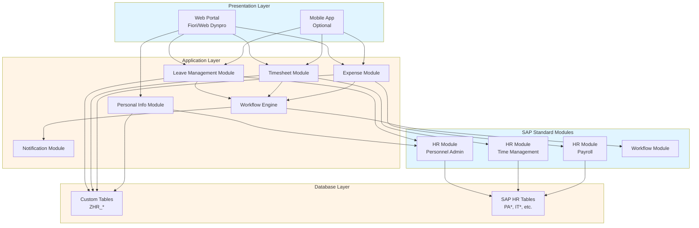
```mermaid
graph TB
    subgraph Presentation[Presentation Layer]
        A[Web Portal<br/>Fiori/Web Dynpro]
        B[Mobile App<br/>Optional]
    end
    
    subgraph Application[Application Layer]
        C[Leave Management Module]
        D[Timesheet Module]
        E[Expense Module]
        F[Personal Info Module]
        G[Workflow Engine]
        H[Notification Module]
    end
    
    subgraph SAP[SAP Standard Modules]
        I[HR Module<br/>Personnel Admin]
        J[HR Module<br/>Time Management]
        K[HR Module<br/>Payroll]
        L[Workflow Module]
    end
    
    subgraph Database[Database Layer]
        M[Custom Tables<br/>ZHR_*]
        N[SAP HR Tables<br/>PA*, IT*, etc.]
    end
    
    A --> C
    A --> D
    A --> E
    A --> F
    B --> C
    B --> D
    B --> E
    
    C --> G
    D --> G
    E --> G
    F --> I
    
    G --> L
    G --> H
    
    C --> I
    D --> J
    E --> K
    
    C --> M
    D --> M
    E --> M
    F --> M
    
    I --> N
    J --> N
    K --> N
    
    style Presentation fill:#e1f5ff
    style Application fill:#fff4e6
    style SAP fill:#e1f5ff
    style Database fill:#fff4e6
```

---

### Complete Process Flow - Leave Request

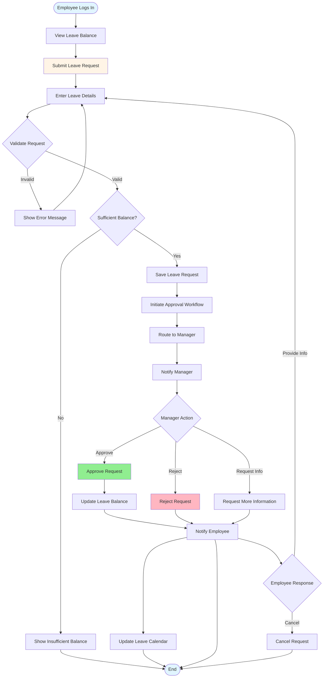
```mermaid
flowchart TD
    Start([Employee Logs In]) --> ViewBalance[View Leave Balance]
    ViewBalance --> SubmitRequest[Submit Leave Request]
    
    SubmitRequest --> EnterDetails[Enter Leave Details]
    EnterDetails --> ValidateRequest{Validate Request}
    
    ValidateRequest -->|Invalid| ShowError[Show Error Message]
    ShowError --> EnterDetails
    
    ValidateRequest -->|Valid| CheckBalance{Sufficient Balance?}
    CheckBalance -->|No| InsufficientBalance[Show Insufficient Balance]
    InsufficientBalance --> End([End])
    
    CheckBalance -->|Yes| SaveRequest[Save Leave Request]
    SaveRequest --> InitiateWorkflow[Initiate Approval Workflow]
    
    InitiateWorkflow --> RouteManager[Route to Manager]
    RouteManager --> NotifyManager[Notify Manager]
    
    NotifyManager --> ManagerAction{Manager Action}
    
    ManagerAction -->|Approve| ApproveRequest[Approve Request]
    ManagerAction -->|Reject| RejectRequest[Reject Request]
    ManagerAction -->|Request Info| RequestInfo[Request More Information]
    
    ApproveRequest --> UpdateBalance[Update Leave Balance]
    UpdateBalance --> NotifyEmployee[Notify Employee]
    NotifyEmployee --> UpdateCalendar[Update Leave Calendar]
    UpdateCalendar --> End
    
    RejectRequest --> NotifyEmployee
    NotifyEmployee --> End
    
    RequestInfo --> NotifyEmployee
    NotifyEmployee --> EmployeeResponse{Employee Response}
    EmployeeResponse -->|Provide Info| EnterDetails
    EmployeeResponse -->|Cancel| CancelRequest[Cancel Request]
    CancelRequest --> End
    
    style Start fill:#e1f5ff
    style SubmitRequest fill:#fff4e6
    style ApproveRequest fill:#90EE90
    style RejectRequest fill:#FFB6C1
    style End fill:#e1f5ff
```

---

### Technical Design

#### Component 1: Leave Management Module
- **Purpose**: Manage employee leave requests
- **Functionality**:
  - Leave request submission
  - Leave balance display
  - Leave status tracking
  - Manager approval workflow
  - Leave calendar integration
- **Integration Points**: HR Module, Workflow Module

#### Component 2: Timesheet Module
- **Purpose**: Enable timesheet entry and tracking
- **Functionality**:
  - Daily timesheet entry
  - Project time tracking
  - Overtime entry
  - Timesheet approval workflow
  - Timesheet history
- **Integration Points**: HR Time Management, Workflow Module

#### Component 3: Expense Module
- **Purpose**: Manage expense reporting
- **Functionality**:
  - Expense report submission
  - Receipt attachment
  - Expense categorization
  - Approval workflow
  - Expense history
- **Integration Points**: HR Module, Workflow Module

#### Component 4: Personal Information Module
- **Purpose**: Manage personal information
- **Functionality**:
  - Update personal information
  - Update bank details
  - Update emergency contacts
  - View payslips
  - Download documents
- **Integration Points**: HR Module

#### Component 5: Workflow Engine
- **Purpose**: Handle approval workflows
- **Functionality**:
  - Multi-level approval routing
  - Notification management
  - Approval history tracking
  - Escalation handling
- **Integration Points**: SAP Workflow, HR Module

---

### Testing Strategy

#### Unit Testing
- Leave request processing
- Timesheet entry validation
- Expense report processing
- Workflow routing logic
- Data validation

#### Integration Testing
- End-to-end leave request flow
- Timesheet submission and approval
- Expense report submission and approval
- HR module integration
- Workflow integration

#### User Acceptance Testing
- Employee portal usability
- Manager approval workflows
- Mobile responsiveness
- Performance validation
- Security validation

#### Performance Testing
- Page load time < 5 seconds
- Support 500+ concurrent users
- Fast workflow processing
- Efficient data retrieval

---

### Documentation Requirements

#### Technical Documentation
- System architecture document
- Module design specifications
- Workflow configuration guide
- Integration documentation
- Security documentation

#### User Documentation
- Employee user guide
- Manager approval guide
- Mobile app guide (if applicable)
- Troubleshooting guide
- FAQ document

---

### Presentation Points

1. **Business Problem**: Manual HR processes, employee dependency on HR team, slow processing times
2. **Solution**: Self-service portal for employees to manage their own HR transactions
3. **Key Features**: Leave management, timesheet entry, expense reporting, personal information management
4. **Technical Highlights**: Web portal development, workflow integration, HR module integration
5. **Business Impact**: Reduced HR workload, improved employee experience, faster processing

---

### Project Phases Breakdown

#### Phase 1: Project Management (Weeks 1-4)
- Requirements gathering
- HR process analysis
- System design
- UI/UX design
- Design approval

#### Phase 2: Development (Weeks 5-8)
- Leave module development
- Timesheet module development
- Expense module development
- Workflow integration
- Unit testing

#### Phase 3: Testing (Weeks 9-10)
- Integration testing
- User acceptance testing
- Bug fixes
- Performance testing

#### Phase 4: Documentation (Week 11)
- Technical documentation
- User documentation
- Demo preparation

#### Phase 5: Presentation (Week 12)
- Presentation preparation
- Project presentation

---

## Example 5: Material Requirements Planning Enhancement

### Project Overview

**Project Name**: Material Requirements Planning (MRP) Enhancement with Automated Procurement and Production Planning

**Objective**: Enhance standard SAP PP MRP functionality with automated procurement proposals, intelligent production planning, supplier integration, and comprehensive planning analytics to optimize material requirements and reduce inventory costs.

**Business Value**:
- Optimize material requirements planning
- Reduce inventory carrying costs
- Improve production planning accuracy
- Automate procurement processes
- Enhance supplier collaboration

**Project Duration**: 3 Months (12 Weeks)

---

### Business Requirements

#### Functional Requirements

1. **Enhanced MRP Logic**
   - Custom MRP calculation logic
   - Safety stock optimization
   - Lead time optimization
   - Demand forecasting integration
   - Multi-level BOM explosion

2. **Automated Procurement Proposals**
   - Automatic purchase requisition creation
   - Supplier selection logic
   - Price comparison
   - Automated approval workflows
   - Purchase order generation

3. **Production Planning Enhancement**
   - Production order optimization
   - Capacity planning integration
   - Work center optimization
   - Production scheduling
   - Material availability check

4. **Supplier Integration**
   - Supplier portal integration
   - Automated RFQ generation
   - Supplier response tracking
   - Delivery schedule integration
   - Supplier performance tracking

5. **Planning Analytics**
   - MRP run analysis
   - Inventory optimization reports
   - Procurement proposal analysis
   - Production planning reports
   - Supplier performance reports

6. **Integration**
   - PP module integration
   - MM module integration
   - SD module integration (demand)
   - External supplier systems

#### Non-Functional Requirements

1. **Performance**
   - MRP run time < 2 hours for 10,000 materials
   - Support 100+ concurrent users
   - Fast proposal generation
   - Efficient data processing

2. **Reliability**
   - 99% uptime availability
   - Data accuracy validation
   - Error handling and recovery
   - Audit trail

3. **Usability**
   - User-friendly interface
   - Intuitive planning screens
   - Clear proposal display
   - Responsive design

4. **Security**
   - Authorization checks
   - Role-based access control
   - Secure supplier integration
   - Audit logging

---

### 3-Month Project Timeline

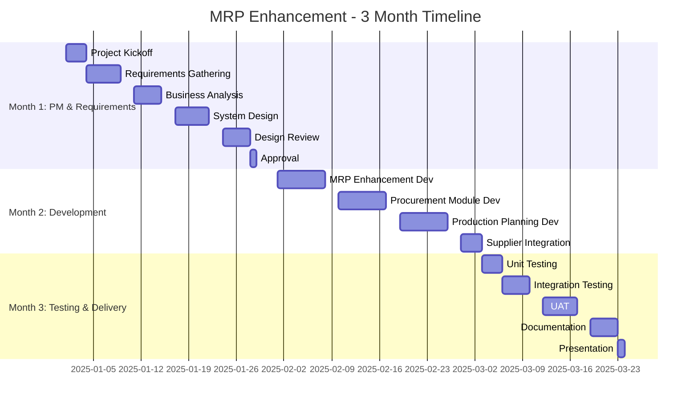
```mermaid
gantt
    title MRP Enhancement - 3 Month Timeline
    dateFormat YYYY-MM-DD
    section Month 1: PM & Requirements
    Project Kickoff           :2025-01-01, 3d
    Requirements Gathering    :2025-01-04, 5d
    Business Analysis         :2025-01-11, 4d
    System Design             :2025-01-17, 5d
    Design Review            :2025-01-24, 4d
    Approval                 :2025-01-28, 1d
    
    section Month 2: Development
    MRP Enhancement Dev      :2025-02-01, 7d
    Procurement Module Dev   :2025-02-10, 7d
    Production Planning Dev  :2025-02-19, 7d
    Supplier Integration     :2025-02-28, 3d
    
    section Month 3: Testing & Delivery
    Unit Testing             :2025-03-03, 3d
    Integration Testing      :2025-03-06, 4d
    UAT                      :2025-03-12, 5d
    Documentation            :2025-03-19, 4d
    Presentation             :2025-03-23, 1d
```

#### Week-by-Week Breakdown

**Month 1: Project Management & Requirements**
- **Week 1**: Project kickoff, requirements gathering
- **Week 2**: Business analysis, MRP process analysis
- **Week 3**: System design, enhancement logic design
- **Week 4**: Design review, approval

**Month 2: Development**
- **Week 5**: MRP enhancement development
- **Week 6**: Procurement module development
- **Week 7**: Production planning enhancement development
- **Week 8**: Supplier integration, unit testing

**Month 3: Testing, Documentation & Presentation**
- **Week 9**: Integration testing, UAT preparation
- **Week 10**: User acceptance testing, bug fixes
- **Week 11**: Documentation completion
- **Week 12**: Presentation preparation and delivery

---

### System Architecture

```mermaid
graph TB
    subgraph Presentation[Presentation Layer]
        A[MRP Planning Screen<br/>MD01 Enhanced]
        B[Procurement Proposal<br/>ZMRP_PROPOSAL]
        C[Production Planning<br/>ZMRP_PRODUCTION]
        D[Planning Analytics<br/>ZMRP_ANALYTICS]
    end
    
    subgraph Application[Application Layer]
        E[Enhanced MRP Engine]
        F[Procurement Proposal Generator]
        G[Production Planner]
        H[Supplier Integration Module]
        I[Analytics Module]
    end
    
    subgraph SAP[SAP Standard Modules]
        J[PP Module<br/>MRP]
        K[MM Module<br/>Procurement]
        L[PP Module<br/>Production]
        M[SD Module<br/>Demand]
    end
    
    subgraph External[External Systems]
        N[Supplier Portal]
        O[Demand Forecast System]
    end
    
    subgraph Database[Database Layer]
        P[Custom Tables<br/>ZMRP_*]
        Q[SAP Tables<br/>MD*, MRP*, etc.]
    end
    
    A --> E
    B --> F
    C --> G
    D --> I
    
    E --> F
    E --> G
    E --> H
    
    F --> K
    G --> L
    H --> N
    E --> M
    E --> O
    
    E --> Q
    F --> P
    G --> P
    H --> P
    I --> P
    
    style Presentation fill:#e1f5ff
    style Application fill:#fff4e6
    style SAP fill:#e1f5ff
    style External fill:#fff4e6
    style Database fill:#e1f5ff
```

---

### Complete Process Flow

```mermaid
flowchart TD
    Start([MRP Run Triggered]) --> CollectDemand[Collect Demand Data]
    CollectDemand --> SalesOrders[Sales Orders]
    CollectDemand --> Forecast[Forecast Data]
    CollectDemand --> Reservations[Reservations]
    
    SalesOrders --> CalculateMRP[Calculate MRP Requirements]
    Forecast --> CalculateMRP
    Reservations --> CalculateMRP
    
    CalculateMRP --> CheckStock{Stock Available?}
    CheckStock -->|Yes| CheckSafety{Safety Stock OK?}
    CheckStock -->|No| CalculateNetReq[Calculate Net Requirements]
    
    CheckSafety -->|Yes| NoAction[No Action Required]
    CheckSafety -->|No| CalculateNetReq
    
    CalculateNetReq --> DetermineSource{Source Type}
    
    DetermineSource -->|Purchase| GeneratePR[Generate Purchase Requisition]
    DetermineSource -->|Produce| GeneratePO[Generate Production Order]
    DetermineSource -->|Transfer| GenerateTR[Generate Transfer Requisition]
    
    GeneratePR --> EvaluateSupplier{Evaluate Suppliers}
    EvaluateSupplier --> SelectSupplier[Select Best Supplier]
    SelectSupplier --> CreatePO[Create Purchase Order]
    CreatePO --> NotifySupplier[Notify Supplier]
    
    GeneratePO --> CheckCapacity{Check Capacity}
    CheckCapacity -->|Available| ScheduleProduction[Schedule Production]
    CheckCapacity -->|Not Available| AdjustSchedule[Adjust Schedule]
    AdjustSchedule --> ScheduleProduction
    
    GenerateTR --> CreateTR[Create Transfer Order]
    
    ScheduleProduction --> UpdatePlan[Update Production Plan]
    CreatePO --> UpdatePlan
    CreateTR --> UpdatePlan
    
    UpdatePlan --> GenerateReport[Generate Planning Report]
    GenerateReport --> End([End])
    
    NoAction --> End
    
    style Start fill:#e1f5ff
    style CalculateMRP fill:#fff4e6
    style GeneratePR fill:#e1f5ff
    style GeneratePO fill:#fff4e6
    style End fill:#90EE90
```

---

### Technical Design

#### Component 1: Enhanced MRP Engine
- **Purpose**: Enhance standard MRP with custom logic
- **Functionality**:
  - Custom MRP calculation
  - Safety stock optimization
  - Lead time optimization
  - Demand forecasting integration
  - Multi-level BOM explosion
- **Integration Points**: PP MRP Module, SD Module, Custom tables

#### Component 2: Procurement Proposal Generator
- **Purpose**: Automate procurement proposal generation
- **Functionality**:
  - Automatic PR creation
  - Supplier selection logic
  - Price comparison
  - Automated approval workflows
  - PO generation
- **Integration Points**: MM Module, Supplier Integration Module

#### Component 3: Production Planner
- **Purpose**: Enhance production planning
- **Functionality**:
  - Production order optimization
  - Capacity planning integration
  - Work center optimization
  - Production scheduling
  - Material availability check
- **Integration Points**: PP Module, Capacity Planning

#### Component 4: Supplier Integration Module
- **Purpose**: Integrate with suppliers
- **Functionality**:
  - Supplier portal integration
  - RFQ generation
  - Supplier response tracking
  - Delivery schedule integration
  - Supplier performance tracking
- **Integration Points**: External Supplier Systems, MM Module

#### Component 5: Analytics Module
- **Purpose**: Provide planning analytics
- **Functionality**:
  - MRP run analysis
  - Inventory optimization reports
  - Procurement proposal analysis
  - Production planning reports
  - Supplier performance reports
- **Integration Points**: All planning modules

---

### Testing Strategy

#### Unit Testing
- MRP calculation logic
- Procurement proposal generation
- Production planning logic
- Supplier integration
- Analytics calculations

#### Integration Testing
- End-to-end MRP run
- Procurement proposal to PO flow
- Production planning integration
- Supplier integration
- Module integration

#### User Acceptance Testing
- MRP run execution
- Procurement proposal review
- Production planning scenarios
- Supplier integration scenarios
- Analytics accuracy

#### Performance Testing
- MRP run time < 2 hours for 10,000 materials
- Support 100+ concurrent users
- Fast proposal generation
- Efficient data processing

---

### Documentation Requirements

#### Technical Documentation
- System architecture document
- MRP enhancement logic documentation
- Procurement module specifications
- Production planning specifications
- Supplier integration documentation

#### User Documentation
- MRP run guide
- Procurement proposal guide
- Production planning guide
- Supplier portal guide
- Analytics guide

---

### Presentation Points

1. **Business Problem**: Manual MRP processes, suboptimal inventory levels, inefficient procurement
2. **Solution**: Enhanced MRP with automated procurement and production planning
3. **Key Features**: Enhanced MRP logic, automated procurement, production planning, supplier integration
4. **Technical Highlights**: MRP enhancement, procurement automation, supplier integration
5. **Business Impact**: Optimized inventory, reduced costs, improved planning accuracy

---

### Project Phases Breakdown

#### Phase 1: Project Management (Weeks 1-4)
- Requirements gathering
- MRP process analysis
- System design
- Enhancement logic design
- Design approval

#### Phase 2: Development (Weeks 5-8)
- MRP enhancement development
- Procurement module development
- Production planning development
- Supplier integration
- Unit testing

#### Phase 3: Testing (Weeks 9-10)
- Integration testing
- User acceptance testing
- Bug fixes
- Performance testing

#### Phase 4: Documentation (Week 11)
- Technical documentation
- User documentation
- Demo preparation

#### Phase 5: Presentation (Week 12)
- Presentation preparation
- Project presentation

---

## Example 6: Vendor Management System

### Project Overview

**Project Name**: Vendor Management System with Performance Tracking and Automated Evaluation

**Objective**: Develop a comprehensive vendor management system that enhances vendor master data management, tracks vendor performance metrics, automates vendor evaluation processes, and provides vendor analytics for strategic procurement decisions.

**Business Value**:
- Centralized vendor management
- Vendor performance tracking
- Automated vendor evaluation
- Strategic vendor selection
- Improved supplier relationships

**Project Duration**: 3 Months (12 Weeks)

---

### Business Requirements

#### Functional Requirements

1. **Vendor Master Data Enhancement**
   - Extended vendor information
   - Vendor classification
   - Vendor risk assessment
   - Vendor certification tracking
   - Vendor contact management

2. **Vendor Performance Tracking**
   - On-time delivery tracking
   - Quality performance tracking
   - Price performance tracking
   - Service level tracking
   - Overall vendor score calculation

3. **Automated Vendor Evaluation**
   - Performance score calculation
   - Automated evaluation reports
   - Vendor ranking
   - Vendor approval/rejection workflow
   - Evaluation history

4. **Vendor Analytics**
   - Vendor performance dashboards
   - Vendor comparison reports
   - Vendor risk analysis
   - Spend analysis by vendor
   - Vendor trend analysis

5. **Integration**
   - MM module integration
   - FI module integration
   - QM module integration (quality)
   - External vendor systems

6. **Vendor Portal (Optional)**
   - Vendor self-registration
   - Vendor performance visibility
   - Document sharing
   - Communication portal

#### Non-Functional Requirements

1. **Performance**
   - Support 1000+ vendors
   - Fast performance calculation
   - Support 50+ concurrent users
   - Efficient data processing

2. **Reliability**
   - 99% uptime availability
   - Data accuracy validation
   - Error handling and recovery
   - Audit trail

3. **Usability**
   - User-friendly interface
   - Intuitive vendor management screens
   - Clear performance indicators
   - Responsive design

4. **Security**
   - Authorization checks
   - Role-based access control
   - Secure vendor data access
   - Audit logging

---

### 3-Month Project Timeline

```mermaid
gantt
    title Vendor Management System - 3 Month Timeline
    dateFormat YYYY-MM-DD
    section Month 1: PM & Requirements
    Project Kickoff           :2025-04-01, 3d
    Requirements Gathering    :2025-04-04, 5d
    Business Analysis         :2025-04-11, 4d
    System Design             :2025-04-17, 5d
    Design Review            :2025-04-24, 4d
    Approval                 :2025-04-28, 1d
    
    section Month 2: Development
    Vendor Master Enhancement :2025-05-01, 7d
    Performance Tracking Dev  :2025-05-10, 7d
    Evaluation Module Dev     :2025-05-19, 7d
    Analytics Module Dev      :2025-05-28, 3d
    
    section Month 3: Testing & Delivery
    Unit Testing             :2025-06-03, 3d
    Integration Testing      :2025-06-06, 4d
    UAT                      :2025-06-12, 5d
    Documentation            :2025-06-19, 4d
    Presentation             :2025-06-23, 1d
```

#### Week-by-Week Breakdown

**Month 1: Project Management & Requirements**
- **Week 1**: Project kickoff, requirements gathering
- **Week 2**: Business analysis, vendor management process analysis
- **Week 3**: System design, performance metrics design
- **Week 4**: Design review, approval

**Month 2: Development**
- **Week 5**: Vendor master enhancement development
- **Week 6**: Performance tracking module development
- **Week 7**: Evaluation module development
- **Week 8**: Analytics module development, unit testing

**Month 3: Testing, Documentation & Presentation**
- **Week 9**: Integration testing, UAT preparation
- **Week 10**: User acceptance testing, bug fixes
- **Week 11**: Documentation completion
- **Week 12**: Presentation preparation and delivery

---

### System Architecture

```mermaid
graph TB
    subgraph Presentation[Presentation Layer]
        A[Vendor Management Screen<br/>ZVENDOR_MAIN]
        B[Performance Dashboard<br/>ZVENDOR_PERF]
        C[Evaluation Screen<br/>ZVENDOR_EVAL]
        D[Analytics Screen<br/>ZVENDOR_ANALYTICS]
    end
    
    subgraph Application[Application Layer]
        E[Vendor Master Module]
        F[Performance Tracking Module]
        G[Evaluation Engine]
        H[Analytics Engine]
        I[Integration Module]
    end
    
    subgraph SAP[SAP Standard Modules]
        J[MM Module<br/>Vendor Master]
        K[MM Module<br/>Purchase Orders]
        L[FI Module<br/>Invoices]
        M[QM Module<br/>Quality]
    end
    
    subgraph Database[Database Layer]
        N[Custom Tables<br/>ZVENDOR_*]
        O[SAP Tables<br/>LFA1, EKKO, EKPO, etc.]
    end
    
    A --> E
    B --> F
    C --> G
    D --> H
    
    E --> I
    F --> I
    G --> I
    H --> I
    
    I --> J
    I --> K
    I --> L
    I --> M
    
    E --> N
    F --> N
    G --> N
    H --> N
    
    I --> O
    N --> O
    
    style Presentation fill:#e1f5ff
    style Application fill:#fff4e6
    style SAP fill:#e1f5ff
    style Database fill:#fff4e6
```

---

### Complete Process Flow

```mermaid
flowchart TD
    Start([Vendor Transaction]) --> IdentifyTransaction{Transaction Type}
    
    IdentifyTransaction -->|Purchase Order| ProcessPO[Process Purchase Order]
    IdentifyTransaction -->|Goods Receipt| ProcessGR[Process Goods Receipt]
    IdentifyTransaction -->|Invoice| ProcessInvoice[Process Invoice]
    IdentifyTransaction -->|Quality Check| ProcessQuality[Process Quality Check]
    
    ProcessPO --> ExtractData[Extract Vendor Data]
    ProcessGR --> ExtractData
    ProcessInvoice --> ExtractData
    ProcessQuality --> ExtractData
    
    ExtractData --> UpdatePerformance[Update Performance Metrics]
    
    UpdatePerformance --> CalculateDelivery[Calculate On-Time Delivery]
    UpdatePerformance --> CalculateQuality[Calculate Quality Score]
    UpdatePerformance --> CalculatePrice[Calculate Price Performance]
    UpdatePerformance --> CalculateService[Calculate Service Level]
    
    CalculateDelivery --> AggregateMetrics[Aggregate Performance Metrics]
    CalculateQuality --> AggregateMetrics
    CalculatePrice --> AggregateMetrics
    CalculateService --> AggregateMetrics
    
    AggregateMetrics --> CalculateScore[Calculate Overall Vendor Score]
    CalculateScore --> UpdateVendorRecord[Update Vendor Record]
    
    UpdateVendorRecord --> CheckEvaluation{Evaluation Due?}
    CheckEvaluation -->|Yes| RunEvaluation[Run Automated Evaluation]
    CheckEvaluation -->|No| UpdateDashboard[Update Dashboard]
    
    RunEvaluation --> GenerateReport[Generate Evaluation Report]
    GenerateReport --> RankVendors[Rank Vendors]
    RankVendors --> ApprovalWorkflow{Approval Required?}
    
    ApprovalWorkflow -->|Yes| RouteApproval[Route for Approval]
    ApprovalWorkflow -->|No| UpdateStatus[Update Vendor Status]
    
    RouteApproval --> ApproverAction{Approver Action}
    ApproverAction -->|Approve| UpdateStatus
    ApproverAction -->|Reject| RejectVendor[Reject Vendor]
    
    UpdateStatus --> UpdateDashboard
    UpdateDashboard --> NotifyStakeholders[Notify Stakeholders]
    NotifyStakeholders --> End([End])
    
    RejectVendor --> NotifyVendor[Notify Vendor]
    NotifyVendor --> End
    
    style Start fill:#e1f5ff
    style UpdatePerformance fill:#fff4e6
    style CalculateScore fill:#e1f5ff
    style RunEvaluation fill:#fff4e6
    style UpdateStatus fill:#90EE90
    style RejectVendor fill:#FFB6C1
```

---

### Technical Design

#### Component 1: Vendor Master Module
- **Purpose**: Enhance vendor master data management
- **Functionality**:
  - Extended vendor information
  - Vendor classification
  - Vendor risk assessment
  - Certification tracking
  - Contact management
- **Integration Points**: MM Vendor Master, Custom tables

#### Component 2: Performance Tracking Module
- **Purpose**: Track vendor performance metrics
- **Functionality**:
  - On-time delivery tracking
  - Quality performance tracking
  - Price performance tracking
  - Service level tracking
  - Score calculation
- **Integration Points**: MM Module, FI Module, QM Module

#### Component 3: Evaluation Engine
- **Purpose**: Automate vendor evaluation
- **Functionality**:
  - Performance score calculation
  - Automated evaluation reports
  - Vendor ranking
  - Approval workflow
  - Evaluation history
- **Integration Points**: Performance Tracking Module, Workflow Module

#### Component 4: Analytics Engine
- **Purpose**: Provide vendor analytics
- **Functionality**:
  - Performance dashboards
  - Vendor comparison reports
  - Risk analysis
  - Spend analysis
  - Trend analysis
- **Integration Points**: All vendor modules, Reporting framework

#### Component 5: Integration Module
- **Purpose**: Integrate with SAP modules
- **Functionality**:
  - MM module integration
  - FI module integration
  - QM module integration
  - Data extraction and transformation
- **Integration Points**: MM, FI, QM modules

---

### Testing Strategy

#### Unit Testing
- Vendor master enhancement
- Performance metric calculations
- Evaluation logic
- Analytics calculations
- Integration logic

#### Integration Testing
- End-to-end vendor management flow
- Performance tracking integration
- Evaluation workflow integration
- MM/FI/QM integration
- Analytics integration

#### User Acceptance Testing
- Vendor management scenarios
- Performance tracking scenarios
- Evaluation scenarios
- Analytics scenarios
- Integration scenarios

#### Performance Testing
- Support 1000+ vendors
- Fast performance calculation
- Support 50+ concurrent users
- Efficient data processing

---

### Documentation Requirements

#### Technical Documentation
- System architecture document
- Vendor master enhancement specifications
- Performance tracking specifications
- Evaluation engine documentation
- Integration documentation

#### User Documentation
- Vendor management guide
- Performance tracking guide
- Evaluation guide
- Analytics guide
- Troubleshooting guide

---

### Presentation Points

1. **Business Problem**: Lack of vendor performance visibility, manual vendor evaluation, inefficient vendor selection
2. **Solution**: Comprehensive vendor management system with performance tracking and automated evaluation
3. **Key Features**: Vendor master enhancement, performance tracking, automated evaluation, vendor analytics
4. **Technical Highlights**: Vendor data enhancement, performance metrics, evaluation automation
5. **Business Impact**: Better vendor selection, improved supplier relationships, strategic procurement decisions

---

### Project Phases Breakdown

#### Phase 1: Project Management (Weeks 1-4)
- Requirements gathering
- Vendor management process analysis
- System design
- Performance metrics design
- Design approval

#### Phase 2: Development (Weeks 5-8)
- Vendor master enhancement development
- Performance tracking module development
- Evaluation module development
- Analytics module development
- Unit testing

#### Phase 3: Testing (Weeks 9-10)
- Integration testing
- User acceptance testing
- Bug fixes
- Performance testing

#### Phase 4: Documentation (Week 11)
- Technical documentation
- User documentation
- Demo preparation

#### Phase 5: Presentation (Week 12)
- Presentation preparation
- Project presentation

---

## Related Guides

- [SAP Capstone Project Guide](./SAP_CAPSTONE_PROJECT_GUIDE.md) - Main guide for capstone projects
- [SAP MM Guide](./SAP_MM_GUIDE.md) - Materials Management module reference
- [SAP SD Guide](./SAP_SD_GUIDE.md) - Sales & Distribution module reference
- [SAP FI Guide](./SAP_FI_GUIDE.md) - Financial Accounting module reference
- [SAP PP Guide](./SAP_PP_GUIDE.md) - Production Planning module reference
- [SAP HR Guide](./SAP_HR_GUIDE.md) - Human Resources module reference
- [SAP ABAP Programming Guide](./SAP_ABAP_PROGRAMMING_GUIDE.md) - ABAP development reference
- [SAP ERP Fundamentals Guide](./SAP_ERP_FUNDAMENTALS_GUIDE.md) - SAP ERP basics
- [SAP Reporting & Analytics Guide](./SAP_REPORTING_ANALYTICS_GUIDE.md) - Reporting techniques
- [SAP Integration Guide](./SAP_INTEGRATION_GUIDE.md) - Integration patterns
- [SAP Workflow Guide](./SAP_WORKFLOW_GUIDE.md) - Workflow development

---

**Last Updated**: 2024

- [SAP Capstone Project Guide](./SAP_CAPSTONE_PROJECT_GUIDE.md) - Main guide for capstone projects
- [SAP MM Guide](./SAP_MM_GUIDE.md) - Materials Management module reference
- [SAP ABAP Programming Guide](./SAP_ABAP_PROGRAMMING_GUIDE.md) - ABAP development reference
- [SAP ERP Fundamentals Guide](./SAP_ERP_FUNDAMENTALS_GUIDE.md) - SAP ERP basics
- [SAP Reporting & Analytics Guide](./SAP_REPORTING_ANALYTICS_GUIDE.md) - Reporting techniques
- [SAP Integration Guide](./SAP_INTEGRATION_GUIDE.md) - Integration patterns

---

**Last Updated**: 2024

