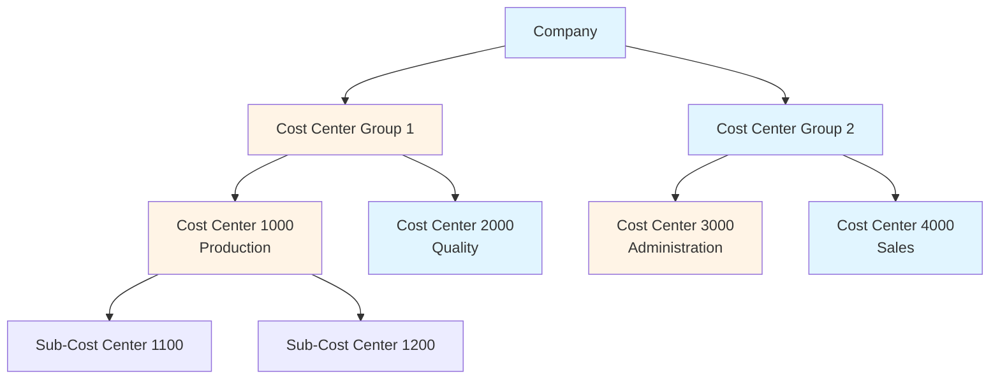
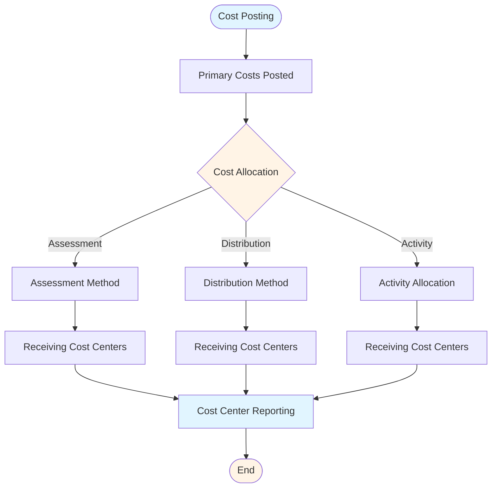
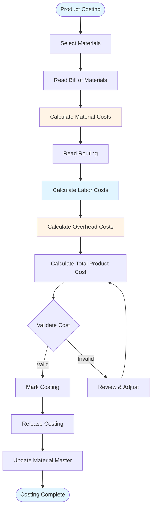
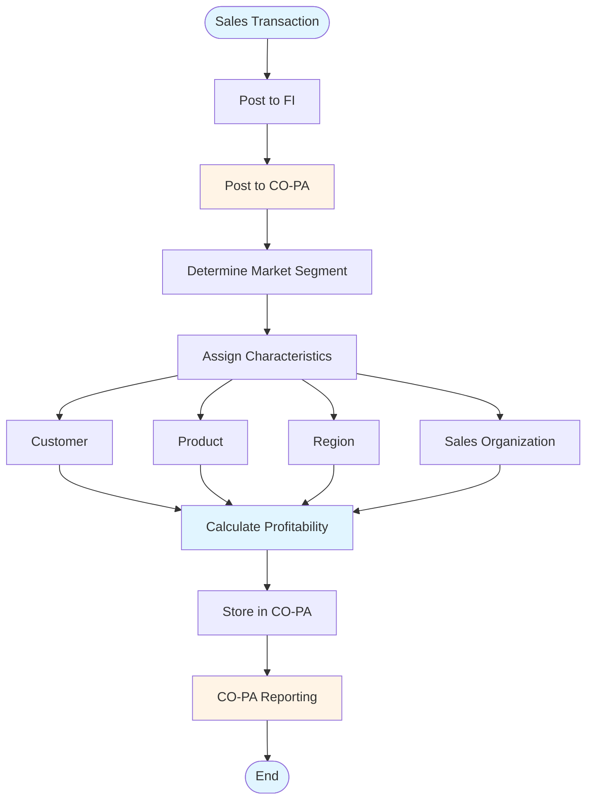

# SAP CO (Controlling) Guide - Comprehensive

## Table of Contents
1. [Introduction](#introduction)
2. [CO Module Overview](#co-module-overview)
3. [Cost Center Accounting](#cost-center-accounting)
4. [Profit Center Accounting](#profit-center-accounting)
5. [Product Costing](#product-costing)
6. [Profitability Analysis](#profitability-analysis)
7. [Internal Orders](#internal-orders)
8. [Cost Allocation](#cost-allocation)
9. [Period-End Closing](#period-end-closing)
10. [Reporting and Analysis](#reporting-and-analysis)
11. [Integration with FI](#integration-with-fi)
12. [Best Practices](#best-practices)
13. [Common Pitfalls](#common-pitfalls)
14. [Real-World Examples](#real-world-examples)
15. [Summary](#summary)

---

## Introduction

SAP CO (Controlling) provides cost accounting and management accounting capabilities. This guide covers Cost Center Accounting, Profit Center Accounting, Product Costing, and Profitability Analysis.

### Key Learning Objectives
- Understand CO module structure
- Master Cost Center Accounting
- Handle Profit Center Accounting
- Process Product Costing
- Perform Profitability Analysis
- Execute period-end closing

---

## CO Module Overview

**SAP CO** manages internal cost accounting and provides management reporting.

### Key Components
1. **Cost Center Accounting**: Cost management by cost center
2. **Profit Center Accounting**: Profitability by profit center
3. **Product Costing**: Product cost calculation
4. **Profitability Analysis (CO-PA)**: Market segment analysis
5. **Internal Orders**: Project cost tracking

---

## Cost Center Accounting

### Cost Center Hierarchy

### Cost Center Master Data

**Transaction**: **KS01** (Create), **KS02** (Change), **KS03** (Display)

**Key Fields**:
- Cost Center Number
- Description
- Cost Center Category
- Responsible Person
- Hierarchy

### Cost Element Accounting

**Cost Elements**:
- **Primary Costs**: External costs (expenses)
- **Secondary Costs**: Internal costs (allocations)

### Cost Allocation Flow

**Methods**:
- **Assessment**: Allocate costs
- **Distribution**: Distribute costs
- **Activity Allocation**: Allocate activities

**Transaction**: **KB11N** (Enter Activity Allocation), **KB21N** (Enter Assessment)

---

## Profit Center Accounting

### Profit Center Master Data

**Transaction**: **KE51** (Create), **KE52** (Change), **KE53** (Display)

**Purpose**: Track profitability by profit center

### Profit Center Reporting

**Transaction**: **KE5Z** (Profit Center Reports)

---

## Product Costing

### Product Costing Flow

### Cost Components

1. **Material Costs**: Raw materials
2. **Labor Costs**: Direct labor
3. **Overhead Costs**: Manufacturing overhead

### Costing Run

**Transaction**: **CK40N** (Costing Run)

**Process**:
1. Select materials
2. Execute costing
3. Mark and release

---

## Profitability Analysis

### CO-PA Process Flow

### Characteristics

**Market Segments**:
- Customer
- Product
- Region
- Sales Organization

### CO-PA Reporting

**Transaction**: **KE30** (Profitability Analysis)

---

## Integration with FI

CO integrates with FI for cost and revenue postings.

**Process**: FI postings → CO postings → Cost allocation → Reporting

---

## Best Practices

1. **Cost Centers**: Proper cost center structure
2. **Allocation**: Accurate cost allocation
3. **Reporting**: Regular reporting
4. **Closing**: Proper period-end closing

---

## Summary

CO provides cost accounting and management reporting capabilities integrated with FI.

---

**Related Guides**:
- [SAP FI Guide](./SAP_FI_GUIDE.md)
- [SAP ERP Fundamentals Guide](./SAP_ERP_FUNDAMENTALS_GUIDE.md)

