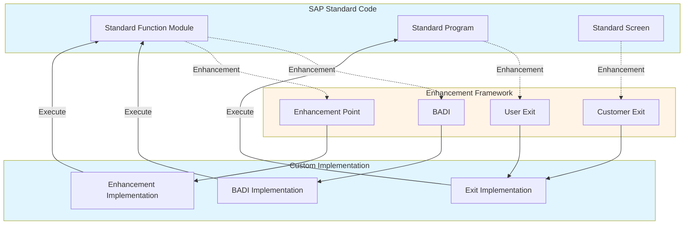
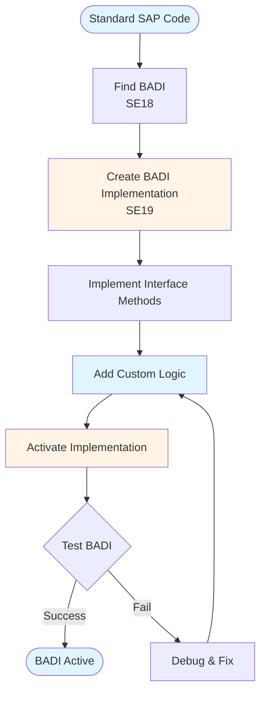

# SAP Customization & Enhancement Guide - Comprehensive

## Table of Contents
1. [Introduction](#introduction)
2. [Customization Overview](#customization-overview)
3. [Enhancement Framework](#enhancement-framework)
4. [BADIs](#badis)
5. [User Exits](#user-exits)
6. [Customer Exits](#customer-exits)
7. [Enhancement Points](#enhancement-points)
8. [Custom Fields](#custom-fields)
9. [Custom Development](#custom-development)
10. [Modification Guidelines](#modification-guidelines)
11. [Best Practices](#best-practices)
12. [Summary](#summary)

---

## Introduction

SAP Customization & Enhancement allows customizing SAP without modifying standard code.

### Key Learning Objectives
- Understand enhancement framework
- Implement BADIs
- Use User Exits
- Add custom fields

---

## Customization Overview

**SAP Customization** allows adapting SAP to business needs.

### Methods
1. **Configuration**: Customizing (SPRO)
2. **Enhancements**: Enhancement framework
3. **Custom Development**: Custom programs

---

## Enhancement Framework

### Enhancement Framework Architecture



### Enhancement Types

1. **BADIs**: Business Add-Ins
2. **User Exits**: Standard exits
3. **Customer Exits**: Customer-specific exits
4. **Enhancement Points**: Modern enhancement points

---

## BADIs

### BADI Implementation Flow



### BADI Implementation

```abap
CLASS z_badi_impl DEFINITION.
  PUBLIC SECTION.
    INTERFACES: if_ex_badi_interface.
ENDCLASS.

CLASS z_badi_impl IMPLEMENTATION.
  METHOD if_ex_badi_interface~method.
    " Custom logic
  ENDMETHOD.
ENDCLASS.
```

**Transaction**: **SE18** (BADI Definition), **SE19** (BADI Implementation)

---

## User Exits

### Finding User Exits

**Transaction**: **SMOD**

**Process**:
1. Search by function module
2. Implement in CMOD
3. Activate

---

## Customer Exits

### Customer Exit Implementation

**Transaction**: **CMOD**

**Process**:
1. Create project
2. Assign exits
3. Implement
4. Activate

---

## Enhancement Points

### Enhancement Point Implementation

```abap
ENHANCEMENT-POINT z_enhancement_point.
  " Custom code
END-ENHANCEMENT-POINT.
```

---

## Custom Fields

### Append Structures

**Transaction**: **SE11**

**Process**:
1. Create append structure
2. Add fields
3. Activate

---

## Best Practices

1. **Use Enhancements**: Don't modify standard
2. **Document**: Document all enhancements
3. **Test**: Test thoroughly

---

## Summary

SAP Customization & Enhancement allows customizing SAP using enhancements and custom development.

---

**Related Guides**:
- [SAP ABAP Programming Guide](./SAP_ABAP_PROGRAMMING_GUIDE.md)


