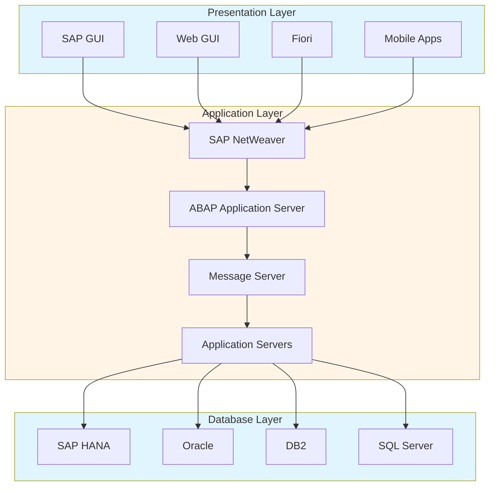
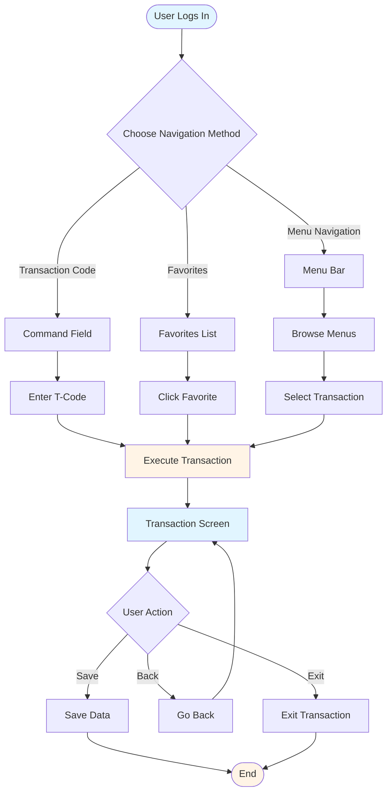
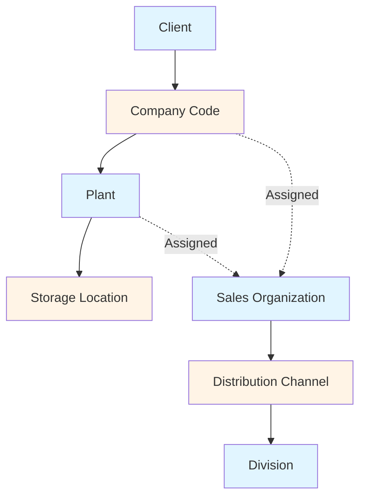
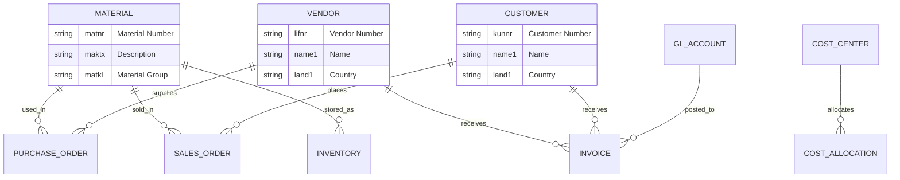
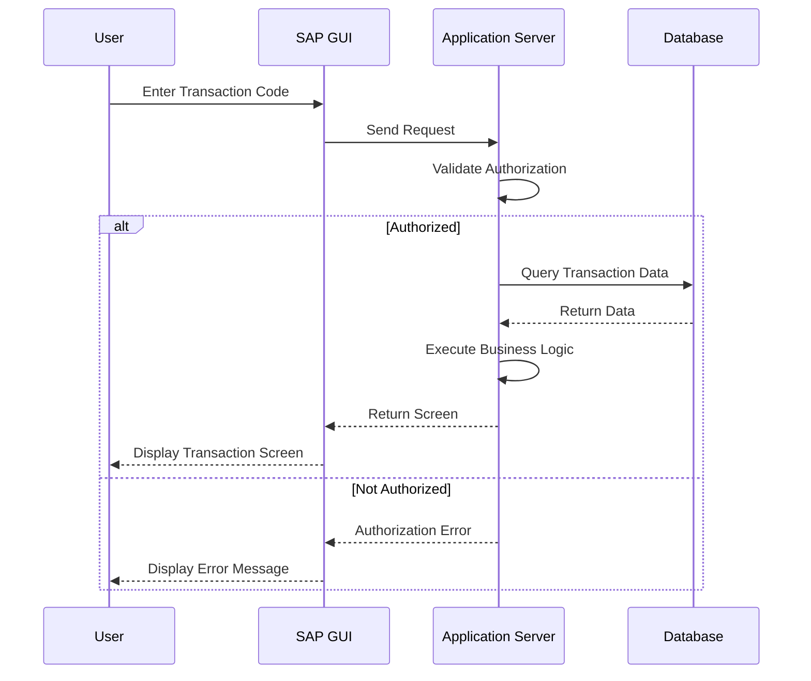
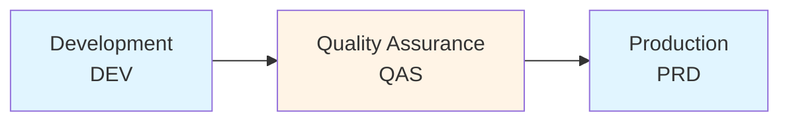
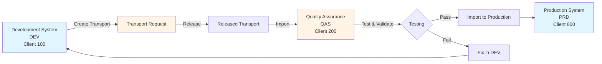

# SAP ERP Fundamentals Guide - Comprehensive

## Table of Contents
1. [Introduction](#introduction)
2. [What is SAP ERP?](#what-is-sap-erp)
3. [SAP ERP Evolution](#sap-erp-evolution)
4. [SAP Architecture](#sap-architecture)
5. [SAP Navigation](#sap-navigation)
6. [Core Organizational Structures](#core-organizational-structures)
7. [Master Data Fundamentals](#master-data-fundamentals)
8. [Transaction Codes](#transaction-codes)
9. [Basic Reporting Concepts](#basic-reporting-concepts)
10. [System Landscape](#system-landscape)
11. [Best Practices](#best-practices)
12. [Common Pitfalls](#common-pitfalls)
13. [Real-World Examples](#real-world-examples)
14. [Templates & Checklists](#templates--checklists)
15. [Tools & Software](#tools--software)
16. [Resources](#resources)
17. [Summary](#summary)

---

## Introduction

SAP ERP (Enterprise Resource Planning) is one of the world's leading enterprise software solutions. This guide provides a comprehensive foundation for understanding SAP ERP, its architecture, navigation, core concepts, and how to work with the system.

### Who This Guide Is For
- SAP beginners learning the basics
- End users new to SAP
- Developers starting SAP development
- Functional consultants learning SAP
- Students preparing for SAP capstone projects

### Key Learning Objectives
- Understand what SAP ERP is and its history
- Learn SAP architecture and components
- Master SAP navigation and user interface
- Understand core organizational structures
- Learn master data concepts
- Use transaction codes effectively
- Understand system landscape

---

## What is SAP ERP?

### Definition

**SAP ERP** (Enterprise Resource Planning) is an integrated software solution that helps organizations manage and automate core business processes across finance, human resources, procurement, sales, manufacturing, and more.

### SAP Company Overview

- **Founded**: 1972 by five former IBM employees in Germany
- **Headquarters**: Walldorf, Germany
- **Full Name**: Systems, Applications & Products in Data Processing
- **Market Position**: World's largest enterprise software company
- **Customers**: Over 400,000 customers worldwide
- **Employees**: 100,000+ employees globally

### What SAP ERP Does

SAP ERP integrates business processes:
- **Finance**: Financial accounting, controlling, treasury
- **Human Resources**: Personnel, payroll, time management
- **Logistics**: Materials management, sales, production
- **Cross-Functional**: Reporting, analytics, workflow

### Key Benefits

1. **Integration**: All modules integrated, data flows seamlessly
2. **Standardization**: Industry best practices built-in
3. **Real-Time**: Real-time data processing and reporting
4. **Scalability**: Handles small to large enterprises
5. **Global**: Multi-language, multi-currency support
6. **Flexibility**: Customizable to business needs

---

## SAP ERP Evolution

### SAP R/1 (1972-1979)

**Characteristics**:
- First generation SAP system
- Real-time processing
- Financial accounting focus
- Mainframe-based

**Key Features**:
- Financial accounting module
- Real-time data processing
- German market focus

### SAP R/2 (1979-1992)

**Characteristics**:
- Mainframe architecture
- Multi-currency support
- Multi-language support
- International expansion

**Key Features**:
- Multiple modules
- International capabilities
- Large enterprise focus

### SAP R/3 (1992-2004)

**Characteristics**:
- Client-server architecture
- Three-tier architecture
- Graphical user interface (GUI)
- Most widely used version

**Architecture**:
```
Presentation Layer (GUI)
    ↓
Application Layer (Application Server)
    ↓
Database Layer (Database Server)
```

**Key Features**:
- Modular design
- Windows-based GUI
- Standard business processes
- Wide module coverage

### SAP ERP (2004-2011)

**Characteristics**:
- Renamed from R/3
- Enhanced functionality
- Better integration
- Web-based interfaces

**Key Features**:
- Enhanced modules
- Web Dynpro
- Better reporting
- Improved user experience

### SAP S/4HANA (2015-Present)

**Characteristics**:
- Next-generation ERP
- In-memory database (HANA)
- Simplified data model
- Real-time analytics
- Cloud-ready
- Modern user experience (Fiori)

**Key Features**:
- Simplified data model
- Real-time processing
- Fiori user interface
- Embedded analytics
- Cloud deployment option

---

## SAP Architecture

### Three-Tier Architecture



### Architecture Components

#### 1. Presentation Layer
**Purpose**: User interface

**Components**:
- **SAP GUI**: Traditional Windows-based interface
- **Web GUI**: Browser-based interface
- **Fiori**: Modern web-based apps
- **Mobile**: Mobile applications

**Functions**:
- Display screens
- User input
- Data presentation
- User interaction

#### 2. Application Layer
**Purpose**: Business logic and processing

**Components**:
- **SAP NetWeaver**: Application platform
- **ABAP Application Server**: ABAP runtime
- **Application Servers**: Process requests
- **Message Server**: Load balancing

**Functions**:
- Execute business logic
- Process transactions
- Handle requests
- Manage sessions

#### 3. Database Layer
**Purpose**: Data storage

**Components**:
- **Database**: SAP HANA, Oracle, DB2, SQL Server, etc.
- **Database Management System**: DBMS
- **Data Dictionary**: Metadata repository

**Functions**:
- Store data
- Retrieve data
- Data integrity
- Backup and recovery

### SAP NetWeaver

**Definition**: SAP's technology platform

**Components**:
- **ABAP Stack**: ABAP applications
- **Java Stack**: Java applications
- **Integration**: Integration capabilities
- **Portal**: Enterprise portal

**Functions**:
- Application platform
- Integration platform
- Development platform
- Runtime environment

---

## SAP Navigation

### SAP GUI (Graphical User Interface)

#### Logging On

**Steps**:
1. Launch SAP GUI
2. Enter system connection details
3. Enter user ID and password
4. Select client
5. Click Log On

**Connection Details**:
- Application Server: Server name or IP
- System Number: System instance number
- Client: Client number (usually 100, 200, 800)

#### SAP GUI Layout

**Standard Elements**:
- **Menu Bar**: Top menu (System, Edit, Goto, etc.)
- **Standard Toolbar**: Common functions (Save, Back, Exit, etc.)
- **Application Toolbar**: Context-specific functions
- **Command Field**: Enter transaction codes
- **Status Bar**: System messages and information

#### Navigation Methods

**1. Menu Navigation**:
- Use menu bar
- Navigate through menus
- Find transactions

**2. Transaction Codes**:
- Direct entry in command field
- Fast access
- Most efficient method

**3. Favorites**:
- Save frequently used transactions
- Quick access
- Personal customization

### Navigation Flow



### Fiori User Interface

**Overview**: Modern, role-based user interface

**Characteristics**:
- Web-based
- Responsive design
- Role-based apps
- Intuitive interface
- Mobile-friendly

**Access**:
- Web browser
- Fiori Launchpad
- Role-based tiles
- Personalization

### Common Navigation Actions

**Transaction Codes**:
- **/n**: End current transaction
- **/o**: Open new session
- **/i**: Close current session
- **/nxxx**: Go to transaction code xxx
- **/oxxx**: Open transaction xxx in new session

**Keyboard Shortcuts**:
- **F1**: Help
- **F4**: Value help (dropdown)
- **Enter**: Confirm/Continue
- **Esc**: Cancel/Go back
- **Ctrl+S**: Save
- **Ctrl+F**: Find

---

## Core Organizational Structures

### Overview

Organizational structures define how business is organized in SAP.

### Key Organizational Units

#### 1. Client (Mandant)

**Definition**: Highest organizational unit, independent business entity

**Characteristics**:
- Completely independent
- Separate data
- Separate users
- Usually: 100 (Development), 200 (QA), 800 (Production)

**Transaction**: Not directly maintained (BASIS level)

#### 2. Company Code

**Definition**: Smallest organizational unit for which complete financial statements can be created

**Characteristics**:
- Legal entity
- Independent accounting
- Financial statements
- Required for FI module

**Transaction**: **SPRO** → Enterprise Structure → Definition → Financial Accounting → Edit, Copy, Delete, Check Company Code

**Example**: 
- Company Code: 1000 (Head Office)
- Company Code: 2000 (Subsidiary)

#### 3. Plant

**Definition**: Organizational unit for manufacturing, procurement, or planning

**Characteristics**:
- Manufacturing location
- Warehouse location
- Procurement location
- Required for MM, PP modules

**Transaction**: **SPRO** → Enterprise Structure → Definition → Logistics General → Define, Copy, Delete, Check Plant

**Example**:
- Plant: 1000 (Main Factory)
- Plant: 2000 (Warehouse)

#### 4. Storage Location

**Definition**: Organizational unit within a plant where materials are stored

**Characteristics**:
- Physical location
- Inventory management
- Belongs to one plant
- Required for inventory

**Transaction**: **SPRO** → Enterprise Structure → Definition → Materials Management → Maintain Storage Location

**Example**:
- Storage Location: 0001 (Raw Materials)
- Storage Location: 0002 (Finished Goods)

#### 5. Sales Organization

**Definition**: Organizational unit responsible for sales and distribution

**Characteristics**:
- Sales responsibility
- Legal entity
- Pricing
- Required for SD module

**Transaction**: **SPRO** → Enterprise Structure → Definition → Sales and Distribution → Maintain Sales Organization

#### 6. Distribution Channel

**Definition**: Channel through which products reach customers

**Characteristics**:
- Sales channel
- Examples: Retail, Wholesale, Online
- Pricing can vary
- Required for SD

**Transaction**: **SPRO** → Enterprise Structure → Definition → Sales and Distribution → Maintain Distribution Channel

#### 7. Division

**Definition**: Product line or business area

**Characteristics**:
- Product grouping
- Business area
- Product-specific
- Optional in SD

**Transaction**: **SPRO** → Enterprise Structure → Definition → Sales and Distribution → Maintain Division

### Organizational Structure Hierarchy



### Assignment Relationships

**Key Assignments**:
- Company Code → Plant
- Plant → Storage Location
- Sales Organization → Company Code
- Sales Organization → Plant
- Sales Organization → Distribution Channel → Division

**Transaction**: **SPRO** → Enterprise Structure → Assignment

---

## Master Data Fundamentals

### Overview

Master data is core business data that remains relatively stable over time.

### Master Data Relationships



### Types of Master Data

#### 1. Material Master

**Definition**: Central repository for material information

**Key Data**:
- Material number
- Description
- Material type
- Base unit of measure
- Material group
- Purchasing data
- Sales data
- Accounting data
- Warehouse data

**Transaction**: **MM01** (Create), **MM02** (Change), **MM03** (Display)

**Views**:
- Basic Data
- Purchasing
- Sales
- Accounting
- Warehouse Management
- Production

#### 2. Vendor Master

**Definition**: Information about suppliers/vendors

**Key Data**:
- Vendor number
- Name and address
- Payment terms
- Bank details
- Tax information
- Purchasing organization data

**Transaction**: **XK01** (Create), **XK02** (Change), **XK03** (Display)

**Account Groups**:
- General vendor
- One-time vendor
- Intercompany vendor

#### 3. Customer Master

**Definition**: Information about customers

**Key Data**:
- Customer number
- Name and address
- Payment terms
- Credit limit
- Sales area data
- Shipping data

**Transaction**: **XD01** (Create), **XD02** (Change), **XD03** (Display)

**Account Groups**:
- Sold-to party
- Ship-to party
- Bill-to party
- Payer

#### 4. General Ledger Account

**Definition**: Chart of accounts and G/L accounts

**Key Data**:
- Account number
- Account description
- Account type (Balance Sheet, P&L)
- Account group
- Reconciliation account

**Transaction**: **FS00** (Create/Change), **FSP0** (Display)

#### 5. Cost Center

**Definition**: Organizational unit for cost management

**Key Data**:
- Cost center number
- Description
- Cost center category
- Responsible person
- Hierarchy

**Transaction**: **KS01** (Create), **KS02** (Change), **KS03** (Display)

### Master Data Best Practices

1. **Data Quality**: Accurate, complete data
2. **Standardization**: Consistent formats
3. **Maintenance**: Regular updates
4. **Authorization**: Controlled access
5. **Documentation**: Clear descriptions

---

## Transaction Codes

### Overview

Transaction codes are shortcuts to access SAP functions.

### Transaction Code Format

**Format**: Usually 4 characters (e.g., **FB01**, **ME21N**)

**Types**:
- **Standard**: SAP-delivered (e.g., **FB01**)
- **Custom**: User-defined (starts with Z or Y, e.g., **ZINV01**)

### Transaction Code Access Flow



### Common Transaction Codes by Module

#### Financial Accounting (FI)

- **FB01**: Post Document
- **FB02**: Change Document
- **FB03**: Display Document
- **FBL1N**: Vendor Line Items
- **FBL5N**: Customer Line Items
- **FS00**: Edit G/L Account
- **F-02**: Post General Document
- **F-43**: Post Vendor Invoice
- **F-28**: Post Incoming Payment
- **F-32**: Post Outgoing Payment

#### Materials Management (MM)

- **MM01**: Create Material
- **MM02**: Change Material
- **MM03**: Display Material
- **ME21N**: Create Purchase Order
- **ME22N**: Change Purchase Order
- **ME23N**: Display Purchase Order
- **MIGO**: Goods Receipt
- **MIRO**: Invoice Verification
- **MB51**: Material Document List

#### Sales & Distribution (SD)

- **VA01**: Create Sales Order
- **VA02**: Change Sales Order
- **VA03**: Display Sales Order
- **VL01N**: Create Outbound Delivery
- **VF01**: Create Billing Document
- **VD01**: Create Customer
- **VD02**: Change Customer
- **VD03**: Display Customer

#### Controlling (CO)

- **KS01**: Create Cost Center
- **KS02**: Change Cost Center
- **KS03**: Display Cost Center
- **KB11N**: Enter Activity Allocation
- **KB21N**: Enter Assessment
- **KSB1**: Cost Center Reports

#### ABAP Development

- **SE11**: Data Dictionary
- **SE80**: Object Navigator
- **SE38**: ABAP Editor
- **SE37**: Function Builder
- **SE16**: Data Browser
- **SE93**: Maintain Transaction Codes

### Finding Transaction Codes

**Methods**:
1. **Menu Path**: Right-click menu item → Technical Information
2. **Help**: F1 → Technical Information
3. **Search**: Use search function
4. **Documentation**: SAP Help Portal

---

## Basic Reporting Concepts

### Overview

SAP provides various ways to extract and view data.

### Report Types

#### 1. Standard Reports
- SAP-delivered reports
- Pre-configured
- Module-specific
- Examples: Financial statements, material reports

#### 2. List Reports
- Simple data lists
- Basic formatting
- Export capabilities
- Examples: Material list, vendor list

#### 3. ALV Reports
- Advanced List Viewer
- Grid format
- Sorting, filtering
- Export to Excel
- Examples: Custom reports

#### 4. Query Reports
- User-friendly queries
- Drag-and-drop
- No programming
- Examples: Ad-hoc queries

### Common Reporting Transactions

- **SE16**: Data Browser (view table data)
- **SE16N**: Enhanced Data Browser
- **MB51**: Material Document List
- **FBL1N**: Vendor Line Items
- **FBL5N**: Customer Line Items
- **ME2N**: Purchase Order List
- **VA05**: Sales Order List

### Report Execution

**Steps**:
1. Enter transaction code
2. Enter selection criteria
3. Execute (F8)
4. View results
5. Export if needed

---

## System Landscape

### Overview

SAP systems are typically organized in a three-system landscape.

### Three-System Landscape



#### 1. Development System (DEV)

**Purpose**: Development and customization

**Characteristics**:
- Client: Usually 100
- Development work
- Testing new developments
- Not for end users
- Changes made here

**Activities**:
- ABAP development
- Customization
- Configuration
- Unit testing

#### 2. Quality Assurance System (QAS)

**Purpose**: Testing and validation

**Characteristics**:
- Client: Usually 200
- Testing environment
- Copy of production data
- User acceptance testing
- Quality checks

**Activities**:
- Integration testing
- User acceptance testing
- Training
- Validation

#### 3. Production System (PRD)

**Purpose**: Live business operations

**Characteristics**:
- Client: Usually 800
- Live data
- End users
- Critical system
- Restricted access

**Activities**:
- Daily operations
- Business transactions
- Reporting
- No development

### Transport System

**Purpose**: Move changes between systems

**Process**:
```
DEV → QAS → PRD
```

**Transport Flow**:



**Components**:
- **Transport Request**: Container for changes
- **Transport Organizer**: Manage transports
- **TMS**: Transport Management System

**Transaction**: **SE09** (Transport Organizer), **SE10** (Customizing Organizer)

### System Landscape Best Practices

1. **Never Develop in Production**: Always use DEV
2. **Test Thoroughly**: Use QAS before PRD
3. **Transport Management**: Proper transport process
4. **Backup**: Regular backups
5. **Documentation**: Document all changes

---

## Best Practices

### SAP ERP Best Practices

1. **Learn Navigation**: Master SAP GUI and transaction codes
2. **Understand Structure**: Know organizational units
3. **Master Data Quality**: Maintain accurate master data
4. **Use Help**: F1 for help, F4 for value help
5. **Follow Processes**: Use standard SAP processes
6. **Document**: Document customizations
7. **Security**: Follow security guidelines

### Navigation Best Practices

1. **Transaction Codes**: Learn and use transaction codes
2. **Favorites**: Save frequently used transactions
3. **Keyboard Shortcuts**: Use shortcuts for efficiency
4. **Multiple Sessions**: Use /o for multiple sessions
5. **Search**: Use search function

### Data Entry Best Practices

1. **Value Help**: Use F4 for valid values
2. **Validation**: Check data before saving
3. **Required Fields**: Fill all required fields
4. **Consistency**: Use consistent formats
5. **Review**: Review before posting

---

## Common Pitfalls

### SAP ERP Pitfalls

1. **Wrong Client**: Working in wrong client
2. **Wrong Transaction**: Using wrong transaction code
3. **Missing Authorization**: No authorization for transaction
4. **Data Entry Errors**: Incorrect data entry
5. **Not Saving**: Forgetting to save
6. **Wrong Organizational Unit**: Using wrong company code/plant
7. **No Backup**: Not backing up before changes

### Navigation Pitfalls

1. **Lost in Menus**: Not knowing where to go
2. **Wrong Transaction**: Similar transaction codes
3. **Session Management**: Too many sessions open
4. **Not Using Help**: Not using F1 help
5. **No Favorites**: Not organizing favorites

---

## Real-World Examples

### Example 1: First Time Login

**Scenario**: New user logging into SAP

**Steps**:
1. Launch SAP GUI
2. Enter connection details
3. Enter user ID and password
4. Select client 800 (Production)
5. Click Log On
6. See SAP Easy Access screen

**Learning**: Basic login process

### Example 2: Finding Transaction

**Scenario**: Need to create purchase order

**Methods**:
1. Menu: Logistics → Materials Management → Purchasing → Purchase Order → Create
2. Transaction Code: **ME21N** (fastest)
3. Search: Search for "purchase order"

**Learning**: Multiple ways to access functions

### Example 3: Organizational Structure

**Scenario**: Understanding company structure

**Example**:
- Client: 800
- Company Code: 1000 (Head Office)
- Plant: 1000 (Main Factory)
- Storage Location: 0001 (Raw Materials)

**Learning**: How organizational units relate

---

## Templates & Checklists

### SAP Navigation Checklist

- [ ] SAP GUI installed
- [ ] Connection configured
- [ ] User ID and password received
- [ ] Client number known
- [ ] Successfully logged in
- [ ] Understand GUI layout
- [ ] Know how to enter transaction codes
- [ ] Know keyboard shortcuts
- [ ] Can navigate menus
- [ ] Can use F1 help

### Master Data Checklist

- [ ] Understand material master
- [ ] Understand vendor master
- [ ] Understand customer master
- [ ] Know relevant transaction codes
- [ ] Understand master data views
- [ ] Know how to create master data
- [ ] Know how to change master data
- [ ] Know how to display master data

### Organizational Structure Checklist

- [ ] Understand client concept
- [ ] Understand company code
- [ ] Understand plant
- [ ] Understand storage location
- [ ] Understand sales organization
- [ ] Know assignment relationships
- [ ] Know relevant transaction codes

---

## Tools & Software

### SAP GUI

**Versions**:
- **SAP GUI for Windows**: Traditional Windows client
- **SAP GUI for Java**: Cross-platform
- **SAP GUI for HTML**: Browser-based

**Installation**: Download from SAP Support Portal

### Fiori Launchpad

**Access**: Web browser
**URL**: https://[server]:[port]/sap/bc/ui2/nwbc

### SAP Logon

**Purpose**: Manage SAP system connections
**Features**: 
- Save connections
- Multiple systems
- Easy switching

---

## Resources

### Official SAP Resources

1. **SAP Help Portal**: https://help.sap.com
2. **SAP Community**: https://community.sap.com
3. **SAP Learning Hub**: Official training
4. **openSAP**: Free online courses

### Books

1. "SAP ERP: A Complete Guide"
2. "SAP Navigation Made Easy"
3. "SAP ERP Financials"

### Online Courses

1. **openSAP**: Free SAP courses
2. **Udemy**: SAP courses
3. **Coursera**: SAP courses
4. **LinkedIn Learning**: SAP training

---

## Summary

### Key Takeaways

1. **SAP ERP**: Integrated enterprise software
2. **Architecture**: Three-tier (Presentation, Application, Database)
3. **Navigation**: SAP GUI, Fiori, transaction codes
4. **Organizational Structure**: Client, Company Code, Plant, etc.
5. **Master Data**: Core business data (Material, Vendor, Customer)
6. **Transaction Codes**: Shortcuts to SAP functions
7. **System Landscape**: DEV → QAS → PRD

### Final Recommendations

1. **Practice Navigation**: Use SAP system regularly
2. **Learn Transaction Codes**: Memorize common ones
3. **Understand Structure**: Know organizational units
4. **Use Help**: F1 and F4 are your friends
5. **Follow Processes**: Use standard SAP processes
6. **Practice**: Hands-on practice is essential
7. **Stay Updated**: Learn new SAP features

Remember: SAP ERP is a powerful system. Master the fundamentals first, then build on that foundation. Practice regularly and use the help system.

---

**Last Updated**: 2024

**Related Guides**:
- [SAP ABAP Programming Guide](./SAP_ABAP_PROGRAMMING_GUIDE.md)
- [SAP FI Guide](./SAP_FI_GUIDE.md)
- [SAP MM Guide](./SAP_MM_GUIDE.md)


