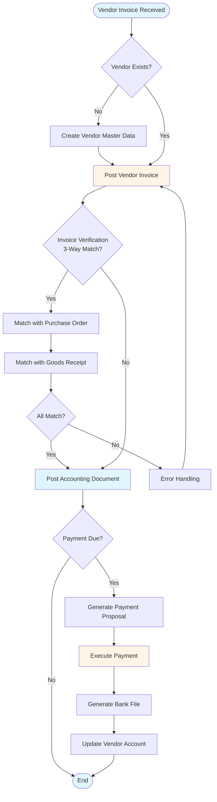
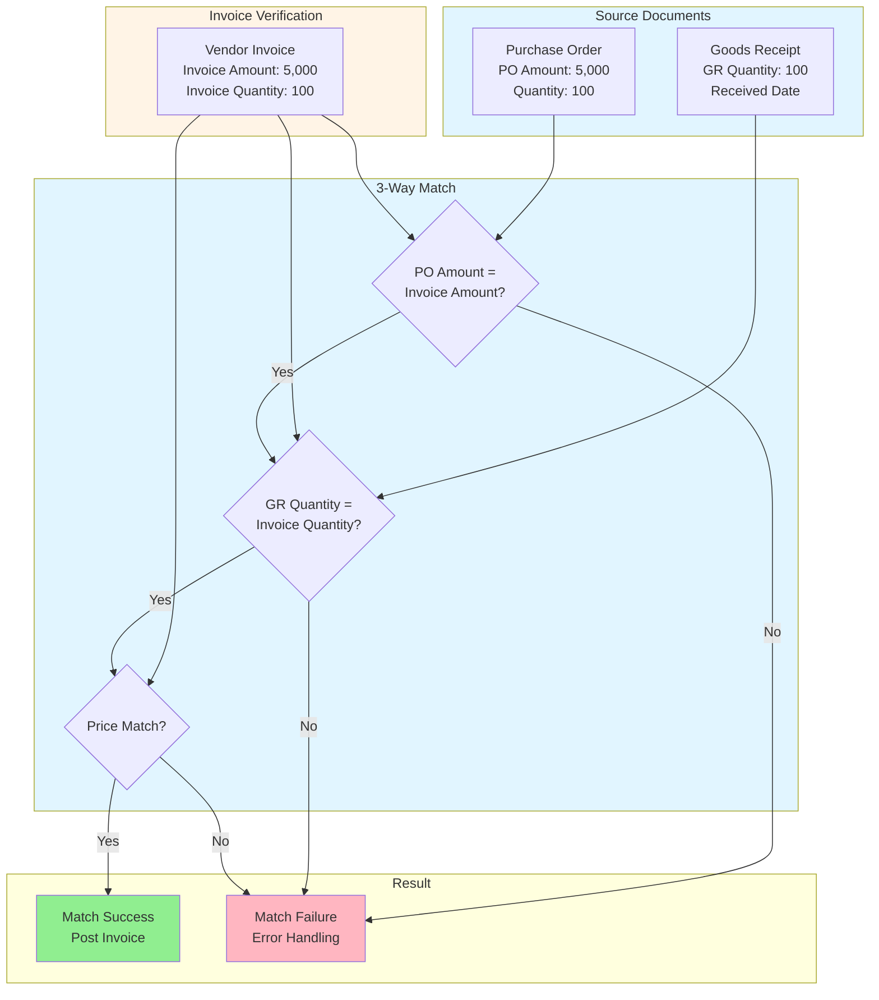
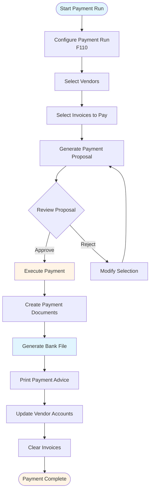
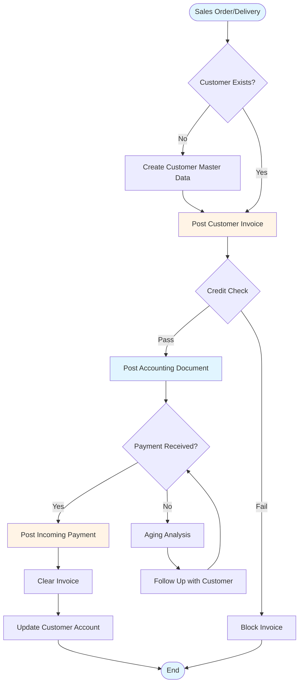
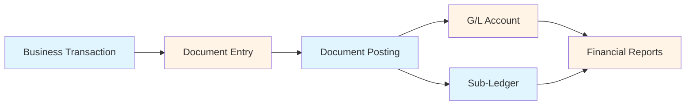
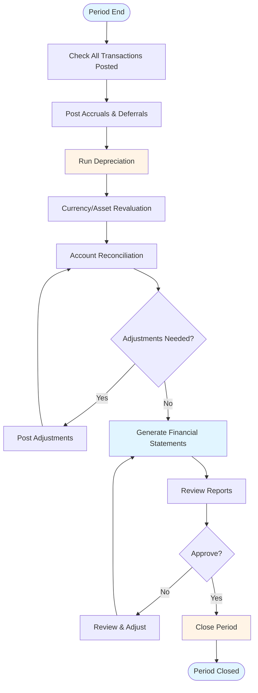
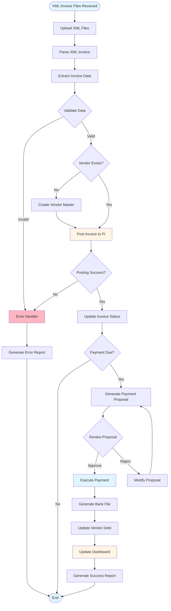

# SAP FI (Financial Accounting) Guide - Comprehensive

## Table of Contents
1. [Introduction](#introduction)
2. [FI Module Overview](#fi-module-overview)
3. [Organizational Structure](#organizational-structure)
4. [General Ledger Accounting](#general-ledger-accounting)
5. [Accounts Payable](#accounts-payable)
6. [Accounts Receivable](#accounts-receivable)
7. [Asset Accounting](#asset-accounting)
8. [Bank Accounting](#bank-accounting)
9. [Financial Reporting](#financial-reporting)
10. [Document Posting](#document-posting)
11. [Period-End Closing](#period-end-closing)
12. [Integration with Other Modules](#integration-with-other-modules)
13. [Best Practices](#best-practices)
14. [Common Pitfalls](#common-pitfalls)
15. [Real-World Examples](#real-world-examples)
16. [Templates & Checklists](#templates--checklists)
17. [Tools & Software](#tools--software)
18. [Resources](#resources)
19. [Summary](#summary)

---

## Introduction

SAP FI (Financial Accounting) is the core module for financial management in SAP ERP. This guide covers all aspects of FI, including General Ledger, Accounts Payable, Accounts Receivable, Asset Accounting, and financial reporting.

### Who This Guide Is For
- FI consultants
- Financial accountants
- SAP end users
- Students learning SAP FI
- Developers working with FI

### Key Learning Objectives
- Understand FI module structure
- Master General Ledger accounting
- Handle Accounts Payable processes
- Manage Accounts Receivable
- Process Asset Accounting
- Generate financial reports
- Perform period-end closing

---

## FI Module Overview

### Definition

**SAP FI** (Financial Accounting) manages financial transactions and provides real-time financial reporting for organizations.

### Key Components

1. **General Ledger (GL)**: Core accounting
2. **Accounts Payable (AP)**: Vendor management
3. **Accounts Receivable (AR)**: Customer management
4. **Asset Accounting (AA)**: Fixed assets
5. **Bank Accounting**: Bank reconciliation
6. **Special Purpose Ledger**: Additional reporting

### FI Characteristics

- **Real-Time**: Real-time posting
- **Integrated**: Integrated with all modules
- **Compliant**: Meets accounting standards
- **Comprehensive**: Complete financial management

---

## Organizational Structure

### Company Code

**Definition**: Smallest organizational unit for which complete financial statements can be created

**Characteristics**:
- Legal entity
- Independent accounting
- Financial statements
- Required for FI

**Transaction**: **SPRO** → Enterprise Structure → Definition → Financial Accounting → Edit, Copy, Delete, Check Company Code

### Chart of Accounts

**Definition**: List of all G/L accounts

**Types**:
- **Operative Chart of Accounts**: Used for daily operations
- **Country Chart of Accounts**: Country-specific
- **Group Chart of Accounts**: Consolidated reporting

**Transaction**: **SPRO** → Financial Accounting → General Ledger Accounting → Master Data → G/L Accounts → Preparations → Edit Chart of Accounts List

### Fiscal Year Variant

**Definition**: Defines fiscal year structure

**Types**:
- **Calendar Year**: January to December
- **Fiscal Year**: Custom period (e.g., April to March)

**Transaction**: **SPRO** → Financial Accounting → Financial Accounting Global Settings → Fiscal Year → Maintain Fiscal Year Variant

---

## General Ledger Accounting

### Overview

General Ledger (GL) is the core of financial accounting, recording all financial transactions.

### G/L Account Master Data

#### Account Types

1. **Balance Sheet Accounts**
   - Assets
   - Liabilities
   - Equity

2. **Profit & Loss Accounts**
   - Revenue
   - Expenses

#### Creating G/L Account

**Transaction**: **FS00** (Create/Change), **FSP0** (Display)

**Key Fields**:
- Account Number
- Account Description
- Account Type
- Account Group
- Reconciliation Account (for sub-ledgers)

**Example**:
```
Account: 100000 (Cash)
Type: Balance Sheet
Group: Assets
```

### Document Posting

#### Posting General Document

**Transaction**: **FB01** (Post Document), **F-02** (Post General Document)

**Key Fields**:
- Document Date
- Posting Date
- Document Type
- Company Code
- G/L Account
- Amount
- Debit/Credit

**Example**:
```
Document: 1900000001
Date: 2024-01-15
Account: 100000 (Cash) - Debit 1000
Account: 400000 (Revenue) - Credit 1000
```

### Document Types

**Common Types**:
- **SA**: General Document
- **DR**: Customer Invoice
- **KR**: Vendor Invoice
- **AB**: Transfer Posting
- **DA**: Depreciation

**Transaction**: **SPRO** → Financial Accounting → Financial Accounting Global Settings → Document → Document Types → Define Document Types

---

## Accounts Payable

### Overview

Accounts Payable (AP) manages vendor invoices and payments.

### Accounts Payable Process Flow



### Vendor Master Data

#### Vendor Account Groups

**Types**:
- **KRED**: General Vendor
- **KRED**: One-Time Vendor
- **KRED**: Intercompany Vendor

**Transaction**: **SPRO** → Financial Accounting → Accounts Payable → Vendor Accounts → Master Data → Preparations for Creating Vendor Master Data → Define Account Groups with Screen Layout

#### Creating Vendor

**Transaction**: **XK01** (Create), **XK02** (Change), **XK03** (Display)

**Key Data**:
- Vendor Number
- Name and Address
- Payment Terms
- Bank Details
- Tax Information

**Example**:
```
Vendor: 100001
Name: ABC Suppliers Ltd.
Payment Terms: Z001 (Net 30)
```

### Vendor Invoice Processing

#### Post Vendor Invoice

**Transaction**: **FB60** (Enter Vendor Invoice), **F-43** (Post Vendor Invoice)

**Process**:
1. Enter invoice number
2. Enter vendor number
3. Enter invoice amount
4. Enter G/L account (expense account)
5. Post document

**Example**:
```
Invoice: INV-2024-001
Vendor: 100001
Amount: 5,000
Account: 600000 (Office Supplies Expense)
```

### Invoice Verification (3-Way Match)

**3-Way Match Process**:



**Process**:
1. **Purchase Order**: Created in MM
2. **Goods Receipt**: Material received
3. **Invoice Verification**: Invoice matches PO and GR

**Transaction**: **MIRO** (Invoice Verification)

**Matching**:
- Invoice amount vs PO amount
- Invoice quantity vs GR quantity
- Price verification

### Payment Processing

#### Manual Payment

**Transaction**: **F-53** (Post Outgoing Payment), **F-58** (Post Incoming Payment)

**Process**:
1. Select vendor
2. Select invoices to pay
3. Enter payment method
4. Enter bank account
5. Post payment

**Example**:
```
Payment: 1000001
Vendor: 100001
Invoices: INV-2024-001 (5,000)
Payment Method: Check
Bank Account: 100000 (Cash)
```

#### Automatic Payment Program

**Payment Processing Flow**:



**Transaction**: **F110** (Automatic Payment Program)

**Process**:
1. Configure payment run
2. Select vendors
3. Select invoices
4. Generate payment proposal
5. Execute payment

**Features**:
- Batch processing
- Multiple payment methods
- Bank file generation
- Payment advice printing

### Vendor Line Items

**Transaction**: **FBL1N** (Vendor Line Items)

**Features**:
- View all vendor transactions
- Open items
- Cleared items
- Aging analysis

---

## Accounts Receivable

### Overview

Accounts Receivable (AR) manages customer invoices and collections.

### Accounts Receivable Process Flow



### Customer Master Data

#### Customer Account Groups

**Types**:
- **KUNA**: General Customer
- **KUNA**: One-Time Customer
- **KUNA**: Intercompany Customer

**Transaction**: **SPRO** → Financial Accounting → Accounts Receivable → Customer Accounts → Master Data → Preparations for Creating Customer Master Data → Define Account Groups with Screen Layout

#### Creating Customer

**Transaction**: **XD01** (Create), **XD02** (Change), **XD03** (Display)

**Key Data**:
- Customer Number
- Name and Address
- Payment Terms
- Credit Limit
- Tax Information

### Customer Invoice Processing

#### Post Customer Invoice

**Transaction**: **FB70** (Enter Customer Invoice), **F-22** (Post Customer Invoice)

**Process**:
1. Enter invoice number
2. Enter customer number
3. Enter invoice amount
4. Enter G/L account (revenue account)
5. Post document

**Example**:
```
Invoice: INV-2024-002
Customer: 200001
Amount: 10,000
Account: 400000 (Sales Revenue)
```

### Payment Processing

#### Post Incoming Payment

**Transaction**: **F-28** (Post Incoming Payment)

**Process**:
1. Select customer
2. Select invoices to clear
3. Enter payment amount
4. Enter bank account
5. Post payment

**Example**:
```
Payment: 2000001
Customer: 200001
Invoices: INV-2024-002 (10,000)
Payment Method: Bank Transfer
Bank Account: 100000 (Cash)
```

### Customer Line Items

**Transaction**: **FBL5N** (Customer Line Items)

**Features**:
- View all customer transactions
- Open items
- Cleared items
- Aging analysis

---

## Asset Accounting

### Overview

Asset Accounting (AA) manages fixed assets and depreciation.

### Asset Master Data

#### Asset Classes

**Types**:
- **1000**: Land
- **2000**: Buildings
- **3000**: Machinery
- **4000**: Vehicles
- **5000**: IT Equipment

**Transaction**: **SPRO** → Financial Accounting → Asset Accounting → Organizational Structures → Asset Classes → Specify Asset Classes

#### Creating Asset

**Transaction**: **AS01** (Create), **AS02** (Change), **AS03** (Display)

**Key Data**:
- Asset Number
- Description
- Asset Class
- Cost Center
- Acquisition Date
- Acquisition Value

**Example**:
```
Asset: 1000001
Description: Office Building
Class: 2000 (Buildings)
Value: 1,000,000
```

### Asset Acquisition

#### Post Asset Acquisition

**Transaction**: **ABZON** (Post Asset Acquisition)

**Process**:
1. Enter asset number
2. Enter acquisition value
3. Enter vendor (if purchased)
4. Post document

**Example**:
```
Asset: 1000001
Acquisition Value: 1,000,000
Vendor: 100001
```

### Depreciation

#### Depreciation Methods

**Types**:
- **Straight-Line**: Equal depreciation each year
- **Declining Balance**: Higher depreciation in early years
- **Units of Production**: Based on usage

**Transaction**: **SPRO** → Financial Accounting → Asset Accounting → Depreciation → Valuation Methods → Depreciation Key → Maintain Depreciation Key

#### Depreciation Run

**Transaction**: **AFAB** (Depreciation Run)

**Process**:
1. Select company code
2. Select fiscal year
3. Select period
4. Execute depreciation
5. Review results

**Example**:
```
Company Code: 1000
Fiscal Year: 2024
Period: 01
Depreciation: 8,333 (1,000,000 / 120 months)
```

---

## Bank Accounting

### Overview

Bank Accounting manages bank accounts and bank reconciliation.

### Bank Master Data

#### Bank Account

**Transaction**: **FI12** (Create Bank Account)

**Key Data**:
- Bank Account Number
- Bank Key
- Account Number
- Account Holder
- Currency

**Example**:
```
Bank Account: 100000
Bank: 1001
Account Number: 123456789
Currency: USD
```

### Bank Reconciliation

#### Bank Statement

**Transaction**: **FF67** (Enter Bank Statement)

**Process**:
1. Enter bank statement
2. Match with open items
3. Clear items
4. Post differences

**Example**:
```
Bank Statement: 2024-01-15
Opening Balance: 50,000
Deposits: 10,000
Withdrawals: 5,000
Closing Balance: 55,000
```

---

## Financial Reporting

### Overview

Financial reporting generates financial statements and reports.

### Financial Statements

#### Balance Sheet

**Transaction**: **S_ALR_87012284** (Balance Sheet)

**Components**:
- Assets
- Liabilities
- Equity

#### Profit & Loss Statement

**Transaction**: **S_ALR_87012285** (Profit & Loss)

**Components**:
- Revenue
- Expenses
- Net Income

### Standard Reports

**Common Reports**:
- **FBL1N**: Vendor Line Items
- **FBL5N**: Customer Line Items
- **FS10N**: G/L Account Balances
- **S_ALR_87012284**: Balance Sheet
- **S_ALR_87012285**: Profit & Loss

---

## Document Posting

### Document Flow



### Document Types

**Common Types**:
- **SA**: General Document
- **DR**: Customer Invoice
- **KR**: Vendor Invoice
- **AB**: Transfer Posting
- **DA**: Depreciation

### Document Number Ranges

**Transaction**: **SPRO** → Financial Accounting → Financial Accounting Global Settings → Document → Document Number Ranges → Define Document Number Ranges

---

## Period-End Closing

### Overview

Period-end closing activities prepare financial statements.

### Period-End Closing Process Flow



### Closing Activities

#### 1. Accruals and Deferrals
- Accrue expenses
- Defer revenue
- Adjust entries

#### 2. Depreciation
- Run depreciation
- Post depreciation

#### 3. Revaluation
- Currency revaluation
- Asset revaluation

#### 4. Financial Statements
- Generate balance sheet
- Generate P&L statement
- Review reports

### Closing Checklist

- [ ] All transactions posted
- [ ] Accruals posted
- [ ] Depreciation run
- [ ] Revaluation completed
- [ ] Financial statements generated
- [ ] Reports reviewed
- [ ] Period closed

---

## Integration with Other Modules

### MM Integration

**Process**:
- Purchase Order → Goods Receipt → Invoice Verification → AP

**Transactions**:
- **ME21N**: Create Purchase Order
- **MIGO**: Goods Receipt
- **MIRO**: Invoice Verification

### SD Integration

**Process**:
- Sales Order → Delivery → Billing → AR

**Transactions**:
- **VA01**: Create Sales Order
- **VL01N**: Create Delivery
- **VF01**: Create Billing Document

### CO Integration

**Process**:
- FI postings → CO postings
- Cost allocation
- Profitability analysis

---

## Best Practices

### FI Best Practices

1. **Master Data**: Maintain accurate master data
2. **Documentation**: Document all transactions
3. **Authorization**: Control access
4. **Reconciliation**: Regular reconciliation
5. **Reporting**: Timely reporting
6. **Closing**: Proper period-end closing

---

## Common Pitfalls

### FI Pitfalls

1. **Wrong Company Code**: Posting to wrong company code
2. **Wrong Account**: Using wrong G/L account
3. **Missing Documents**: Not posting all transactions
4. **No Reconciliation**: Not reconciling accounts
5. **Late Closing**: Delayed period-end closing

---

## Real-World Examples

### Example 1: Vendor Invoice Processing

**Scenario**: Post vendor invoice for office supplies

**Steps**:
1. **FB60**: Enter vendor invoice
   - Vendor: 100001
   - Amount: 5,000
   - Account: 600000 (Office Supplies)
2. Post document
3. **FBL1N**: View vendor line items
4. Verify posting

### Example 2: Account Payable Automation

**Scenario**: Automate invoice processing from XML

**Account Payable Automation - Complete Process Flow**:



**Process**:
1. Receive XML invoice
2. Parse XML file
3. Extract invoice data
4. Validate data
5. Post invoice automatically
6. Generate payment proposal
7. Execute payment

**ABAP Code Example**:
```abap
" Parse XML invoice
DATA: lv_xml TYPE string,
      lo_reader TYPE REF TO if_sxml_reader.

" Extract invoice data
DATA: lv_vendor TYPE lifnr,
      lv_amount TYPE dmbtr,
      lv_invoice_date TYPE budat.

" Post invoice
CALL FUNCTION 'BAPI_ACC_DOCUMENT_POST'
  EXPORTING
    documentheader = ls_header
  IMPORTING
    obj_key = lv_obj_key.

" Generate payment proposal
CALL FUNCTION 'F110_PROPOSAL'
  EXPORTING
    companycode = lv_company_code.
```

---

## Templates & Checklists

### Vendor Invoice Checklist

- [ ] Invoice received
- [ ] Vendor verified
- [ ] Amount verified
- [ ] G/L account selected
- [ ] Document posted
- [ ] Payment scheduled

### Period-End Closing Checklist

- [ ] All transactions posted
- [ ] Accruals posted
- [ ] Depreciation run
- [ ] Revaluation completed
- [ ] Financial statements generated
- [ ] Reports reviewed
- [ ] Period closed

---

## Tools & Software

### SAP Transactions

- **FB01**: Post Document
- **FB60**: Vendor Invoice
- **FB70**: Customer Invoice
- **FBL1N**: Vendor Line Items
- **FBL5N**: Customer Line Items
- **FS10N**: G/L Account Balances

---

## Resources

### Books

1. "SAP FI Financial Accounting"
2. "SAP Accounts Payable"
3. "SAP Financial Reporting"

### Online Resources

1. **SAP Help Portal**: FI documentation
2. **SAP Community**: FI forums
3. **openSAP**: Free FI courses

---

## Summary

### Key Takeaways

1. **FI Module**: Core financial accounting
2. **General Ledger**: Central accounting
3. **Accounts Payable**: Vendor management
4. **Accounts Receivable**: Customer management
5. **Asset Accounting**: Fixed assets
6. **Financial Reporting**: Generate reports
7. **Period-End Closing**: Close periods properly

### Final Recommendations

1. **Master Data**: Maintain accurate master data
2. **Processes**: Follow standard processes
3. **Reconciliation**: Regular reconciliation
4. **Reporting**: Timely reporting
5. **Closing**: Proper closing procedures

---

**Last Updated**: 2024

**Related Guides**:
- [SAP ERP Fundamentals Guide](./SAP_ERP_FUNDAMENTALS_GUIDE.md)
- [SAP CO Guide](./SAP_CO_GUIDE.md)
- [SAP Integration Guide](./SAP_INTEGRATION_GUIDE.md)
- [SAP Capstone Project Guide](./SAP_CAPSTONE_PROJECT_GUIDE.md)


