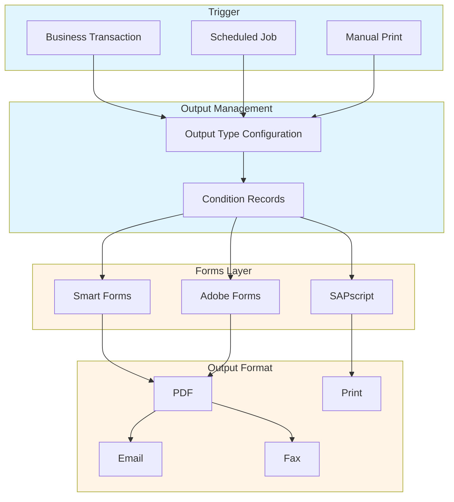
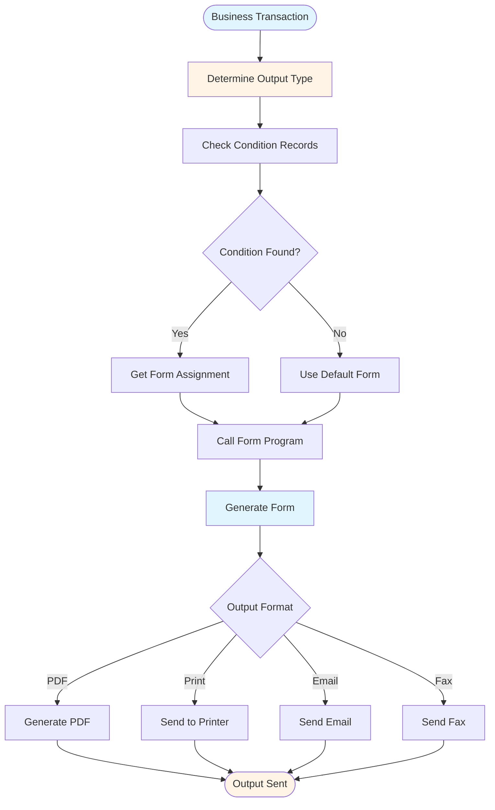

# SAP Forms Guide - Comprehensive

## Table of Contents
1. [Introduction](#introduction)
2. [Forms Overview](#forms-overview)
3. [Smart Forms](#smart-forms)
4. [Adobe Forms](#adobe-forms)
5. [Output Management](#output-management)
6. [Form Design](#form-design)
7. [Print Programs](#print-programs)
8. [PDF Generation](#pdf-generation)
9. [Best Practices](#best-practices)
10. [Summary](#summary)

---

## Introduction

SAP Forms provides tools for creating and managing business forms and documents.

### Key Learning Objectives
- Understand form types
- Create Smart Forms
- Develop Adobe Forms
- Manage output

---

## Forms Overview

**SAP Forms** provides form creation and management.

### Forms Architecture



### Form Types
1. **Smart Forms**: SAP form tool
2. **Adobe Forms**: Adobe-based forms
3. **SAPscript**: Legacy forms

---

## Smart Forms

### Creating Smart Forms

**Transaction**: **SMARTFORMS** (Smart Forms)

**Components**:
- **Pages**: Form pages
- **Windows**: Text windows
- **Tables**: Data tables
- **Graphics**: Images

---

## Adobe Forms

### Creating Adobe Forms

**Transaction**: **SFP** (Adobe Forms)

**Process**:
1. Create form interface
2. Design form
3. Activate form
4. Assign to output type

---

## Output Management

### Output Management Flow



### Output Configuration

**Transaction**: **SPRO** → Sales and Distribution → Basic Functions → Output Control

**Process**:
1. Define output types
2. Assign forms
3. Configure conditions

---

## Print Programs

### Print Program Development

```abap
" Call Smart Form
CALL FUNCTION 'SSF_FUNCTION_MODULE_NAME'
  EXPORTING
    formname = 'Z_INVOICE_FORM'
  IMPORTING
    fm_name = lv_fm_name.

CALL FUNCTION lv_fm_name
  EXPORTING
    is_header = ls_header
    it_items = lt_items.
```

---

## Best Practices

1. **Design**: User-friendly design
2. **Performance**: Optimize forms
3. **Testing**: Test thoroughly

---

## Summary

SAP Forms provides tools for creating Smart Forms and Adobe Forms for business documents.

---

**Related Guides**:
- [SAP ABAP Programming Guide](./SAP_ABAP_PROGRAMMING_GUIDE.md)


