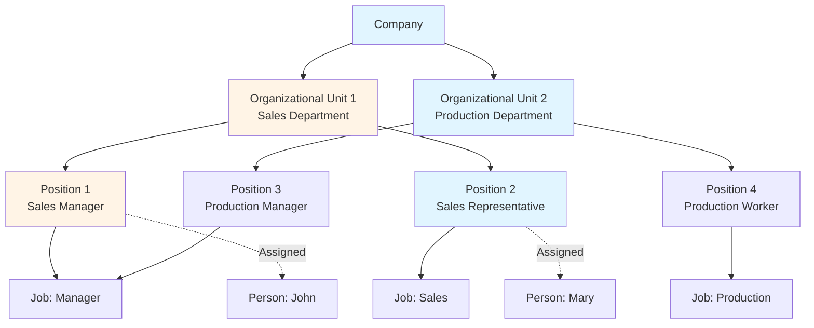
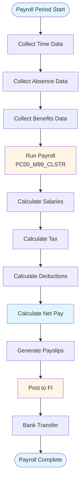
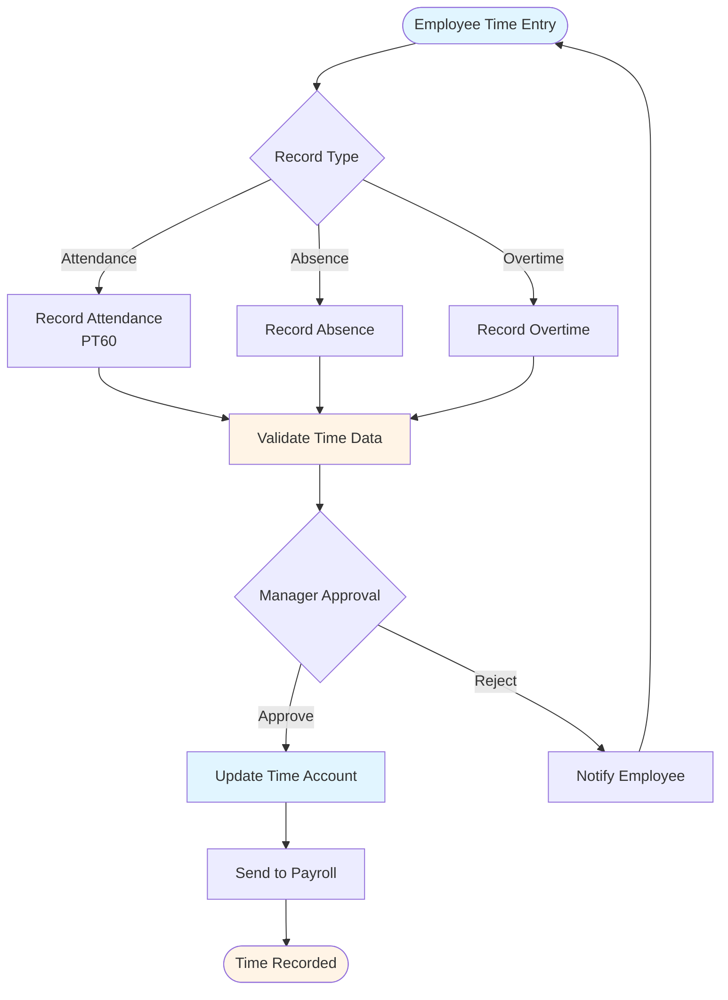

# SAP HR (Human Resources) Guide - Comprehensive

## Table of Contents
1. [Introduction](#introduction)
2. [HR Module Overview](#hr-module-overview)
3. [Organizational Management](#organizational-management)
4. [Personnel Administration](#personnel-administration)
5. [Payroll](#payroll)
6. [Time Management](#time-management)
7. [Recruitment](#recruitment)
8. [Training and Development](#training-and-development)
9. [Employee Self-Service](#employee-self-service)
10. [HR Reporting](#hr-reporting)
11. [Best Practices](#best-practices)
12. [Summary](#summary)

---

## Introduction

SAP HR manages human resources processes including personnel, payroll, and time management.

### Key Learning Objectives
- Understand HR module structure
- Master personnel administration
- Handle payroll processing
- Manage time records

---

## HR Module Overview

**SAP HR** manages human resources processes.

### Key Components
1. **Organizational Management**: Organizational structure
2. **Personnel Administration**: Employee data
3. **Payroll**: Salary processing
4. **Time Management**: Time recording
5. **Recruitment**: Hiring process

---

## Organizational Management

### Organizational Structure

**Transaction**: **PPOME** (Maintain Organizational Structure)

**Components**:
- Organizational Units
- Positions
- Jobs
- Persons

---

## Personnel Administration

### Employee Master Data

**Transaction**: **PA30** (Maintain HR Master Data)

**Key Data**:
- Personal Data
- Address
- Bank Details
- Tax Information

---

## Payroll

### Payroll Process Flow

### Payroll Run

**Transaction**: **PC00_M99_CLSTR** (Payroll)

**Process**:
1. Run payroll
2. Calculate salaries
3. Generate payslips
4. Post to FI

---

## Time Management

### Time Management Flow

### Time Recording

**Transaction**: **PT60** (Time Entry)

**Types**:
- Attendance
- Absence
- Overtime

---

## Recruitment

### Job Posting

**Transaction**: **PB00** (Recruitment)

**Process**:
1. Create job posting
2. Receive applications
3. Process applications
4. Hire candidate

---

## Best Practices

1. **Data Quality**: Accurate employee data
2. **Payroll**: Timely payroll processing
3. **Compliance**: Legal compliance

---

## Summary

HR manages human resources processes including personnel, payroll, and time management.

---

**Related Guides**:
- [SAP ERP Fundamentals Guide](./SAP_ERP_FUNDAMENTALS_GUIDE.md)

