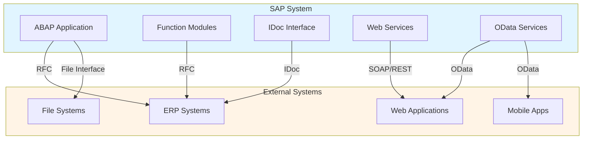
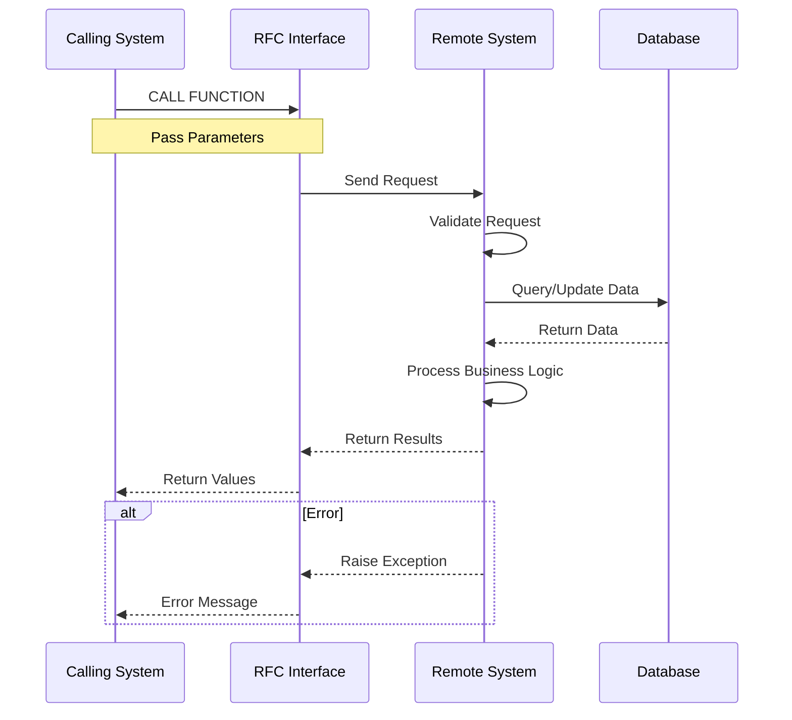
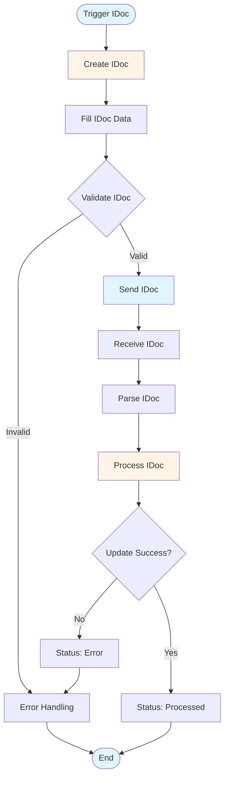
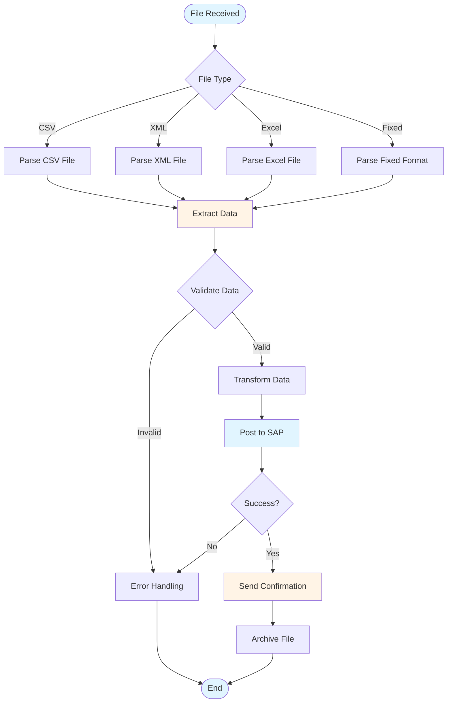

# SAP Integration Guide - Comprehensive

## Table of Contents
1. [Introduction](#introduction)
2. [Integration Overview](#integration-overview)
3. [RFC (Remote Function Call)](#rfc-remote-function-call)
4. [IDoc (Intermediate Document)](#idoc-intermediate-document)
5. [Web Services](#web-services)
6. [OData Services](#odata-services)
7. [REST APIs](#rest-apis)
8. [EDI Integration](#edi-integration)
9. [File Interfaces](#file-interfaces)
10. [Integration Patterns](#integration-patterns)
11. [Best Practices](#best-practices)
12. [Real-World Examples](#real-world-examples)
13. [Summary](#summary)

---

## Introduction

SAP Integration enables SAP systems to communicate with external systems and applications.

### Key Learning Objectives
- Understand integration methods
- Master RFC programming
- Handle IDoc processing
- Use Web Services and OData
- Implement file interfaces

---

## Integration Overview

**SAP Integration** connects SAP with external systems.

### Integration Architecture Overview



### Integration Methods
1. **RFC**: Remote Function Call
2. **IDoc**: Intermediate Document
3. **Web Services**: SOAP/REST
4. **OData**: OData services
5. **File Interfaces**: File-based integration

---

## RFC (Remote Function Call)

### RFC Overview

**RFC** enables function calls between SAP systems or SAP and external systems.

### Creating RFC Function Module

```abap
FUNCTION z_rfc_function.
  " Importing parameters
  IMPORTING
    iv_input TYPE string.
  
  " Exporting parameters
  EXPORTING
    ev_output TYPE string.
  
  " Tables parameters
  TABLES
    it_data TYPE ztt_data.
  
ENDFUNCTION.
```

### RFC Call Sequence



### Calling RFC

```abap
CALL FUNCTION 'Z_RFC_FUNCTION'
  DESTINATION 'REMOTE_SYSTEM'
  EXPORTING
    iv_input = lv_input
  IMPORTING
    ev_output = lv_output
  TABLES
    it_data = lt_data.
```

**Transaction**: **SE37** (Function Builder), **SM59** (RFC Destinations)

---

## IDoc (Intermediate Document)

### IDoc Overview

**IDoc** is SAP's standard format for electronic data interchange.

### IDoc Structure

**Components**:
- **Control Record**: IDoc header
- **Data Records**: IDoc segments
- **Status Records**: Processing status

### IDoc Processing Flow



### Processing IDoc

**Transaction**: **WE02** (IDoc List), **WE05** (IDoc Display)

**Process**:
1. Create IDoc
2. Send IDoc
3. Receive IDoc
4. Process IDoc

---

## Web Services

### SOAP Web Services

**Creating Web Service**:
1. Create function module
2. Create service definition
3. Activate service
4. Test service

**Transaction**: **SOAMANAGER** (Web Service Administration)

---

## OData Services

### OData Overview

**OData** provides RESTful API for SAP data.

### Creating OData Service

**Transaction**: **SEGW** (Gateway Service Builder)

**Process**:
1. Create service
2. Define entity sets
3. Implement methods
4. Activate service

---

## REST APIs

### REST API Overview

**REST APIs** provide HTTP-based integration.

**Methods**:
- GET: Read data
- POST: Create data
- PUT: Update data
- DELETE: Delete data

---

## EDI Integration

### EDI Overview

**EDI** (Electronic Data Interchange) enables electronic document exchange.

**Process**:
1. Receive EDI document
2. Convert to IDoc
3. Process in SAP
4. Send response

---

## File Interfaces

### File Interface Processing Flow



### File-Based Integration

**Types**:
- **CSV**: Comma-separated values
- **XML**: XML files
- **Excel**: Excel files
- **Fixed Format**: Fixed-width files

### Processing Files

```abap
" Read CSV file
OPEN DATASET lv_filename FOR INPUT IN TEXT MODE.
DO.
  READ DATASET lv_filename INTO lv_line.
  IF sy-subrc <> 0.
    EXIT.
  ENDIF.
  " Process line
ENDDO.
CLOSE DATASET lv_filename.
```

---

## Integration Patterns

### Common Patterns

1. **Synchronous**: Real-time integration
2. **Asynchronous**: Message-based integration
3. **Batch**: Scheduled batch processing
4. **Event-Driven**: Event-based integration

---

## Best Practices

1. **Error Handling**: Proper error handling
2. **Logging**: Comprehensive logging
3. **Security**: Secure integration
4. **Performance**: Optimize performance
5. **Monitoring**: Monitor integrations

---

## Real-World Examples

### Example: XML Invoice Processing

**Scenario**: Process XML invoices from external system

**Process**:
1. Receive XML file
2. Parse XML
3. Extract invoice data
4. Post invoice in SAP
5. Send confirmation

**ABAP Code**:
```abap
" Parse XML invoice
DATA: lo_reader TYPE REF TO if_sxml_reader,
      lv_xml TYPE string.

" Extract data
DATA: lv_vendor TYPE lifnr,
      lv_amount TYPE dmbtr.

" Post invoice
CALL FUNCTION 'BAPI_ACC_DOCUMENT_POST'
  EXPORTING
    documentheader = ls_header
  IMPORTING
    obj_key = lv_obj_key.
```

---

## Summary

SAP Integration enables SAP to communicate with external systems using RFC, IDoc, Web Services, OData, and file interfaces.

---

**Related Guides**:
- [SAP ABAP Programming Guide](./SAP_ABAP_PROGRAMMING_GUIDE.md)
- [SAP FI Guide](./SAP_FI_GUIDE.md)


