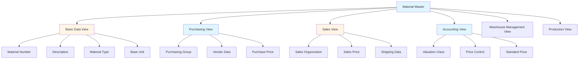
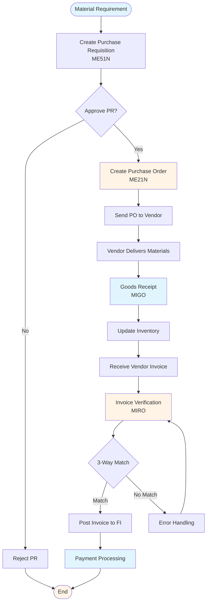
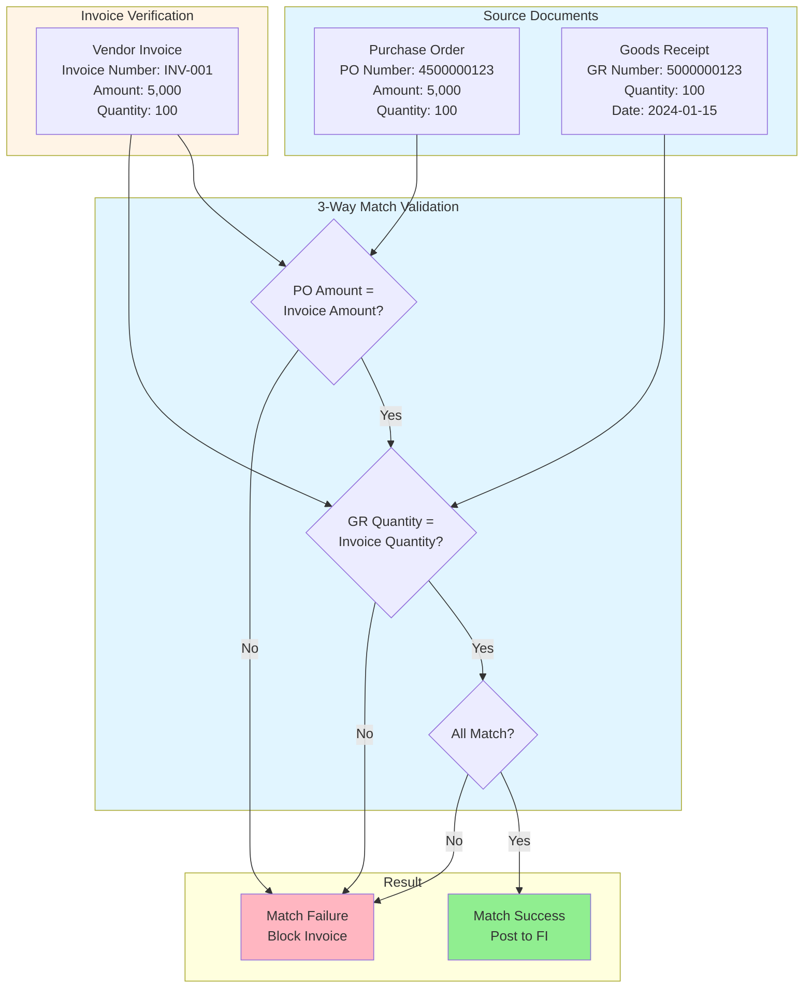

# SAP MM (Materials Management) Guide - Comprehensive

## Table of Contents
1. [Introduction](#introduction)
2. [MM Module Overview](#mm-module-overview)
3. [Material Master](#material-master)
4. [Vendor Master](#vendor-master)
5. [Procurement Process](#procurement-process)
6. [Purchase Requisition](#purchase-requisition)
7. [Purchase Order](#purchase-order)
8. [Goods Receipt](#goods-receipt)
9. [Invoice Verification](#invoice-verification)
10. [Inventory Management](#inventory-management)
11. [Material Valuation](#material-valuation)
12. [Physical Inventory](#physical-inventory)
13. [Integration with Other Modules](#integration-with-other-modules)
14. [Best Practices](#best-practices)
15. [Summary](#summary)

---

## Introduction

SAP MM (Materials Management) handles procurement, inventory management, and material master data.

### Key Learning Objectives
- Master Material Master data
- Handle procurement process
- Process Purchase Orders
- Manage inventory
- Perform invoice verification

---

## MM Module Overview

**SAP MM** manages materials, procurement, and inventory.

### Key Components
1. **Material Master**: Material data
2. **Vendor Master**: Supplier data
3. **Procurement**: Purchasing process
4. **Inventory Management**: Stock management
5. **Invoice Verification**: Invoice processing

---

## Material Master

### Material Master Data Structure



### Creating Material

**Transaction**: **MM01** (Create), **MM02** (Change), **MM03** (Display)

**Key Views**:
- Basic Data
- Purchasing
- Sales
- Accounting
- Warehouse Management

**Example**:
```
Material: MAT-001
Description: Office Chair
Material Type: FERT (Finished Product)
Base Unit: EA (Each)
```

---

## Vendor Master

### Creating Vendor

**Transaction**: **XK01** (Create), **XK02** (Change), **XK03** (Display)

**Key Data**:
- Vendor Number
- Name and Address
- Payment Terms
- Purchasing Organization Data

---

## Procurement Process

### Complete Procurement Process Flow



---

## Purchase Requisition

**Transaction**: **ME51N** (Create), **ME52N** (Change), **ME53N** (Display)

**Purpose**: Internal request for materials

---

## Purchase Order

**Transaction**: **ME21N** (Create), **ME22N** (Change), **ME23N** (Display)

**Key Fields**:
- Vendor
- Material
- Quantity
- Price
- Delivery Date

**Example**:
```
PO: 4500000123
Vendor: 100001
Material: MAT-001
Quantity: 100
Price: 50.00
```

---

## Goods Receipt

**Transaction**: **MIGO** (Goods Movement)

**Process**:
1. Enter Purchase Order
2. Enter quantity received
3. Post goods receipt
4. Update inventory

---

## Invoice Verification

**Transaction**: **MIRO** (Invoice Verification)

**3-Way Match Diagram**:



**3-Way Match**:
1. Purchase Order
2. Goods Receipt
3. Invoice

**Process**:
1. Enter invoice
2. Match with PO and GR
3. Post invoice
4. Create accounting document

---

## Inventory Management

### Goods Movements

**Types**:
- **101**: Goods Receipt
- **102**: Goods Issue
- **201**: Goods Receipt for Production Order
- **261**: Goods Issue for Production Order

**Transaction**: **MIGO** (Goods Movement)

---

## Material Valuation

### Valuation Methods

**Types**:
- **Standard Price**: Fixed price
- **Moving Average Price**: Average price
- **FIFO**: First In First Out
- **LIFO**: Last In First Out

---

## Physical Inventory

**Transaction**: **MI01** (Create Physical Inventory Document)

**Process**:
1. Create inventory document
2. Count materials
3. Enter count results
4. Post differences

---

## Integration with Other Modules

### FI Integration
- Invoice posting → FI
- Payment → FI

### SD Integration
- Material availability → SD
- Sales order → Material requirement

### PP Integration
- Production order → Material issue
- Material receipt → Production order

---

## Best Practices

1. **Master Data**: Accurate material master
2. **Procurement**: Follow procurement process
3. **Inventory**: Regular inventory checks
4. **Valuation**: Proper valuation methods

---

## Summary

MM manages materials, procurement, and inventory integrated with FI, SD, and PP.

---

**Related Guides**:
- [SAP FI Guide](./SAP_FI_GUIDE.md)
- [SAP SD Guide](./SAP_SD_GUIDE.md)
- [SAP PP Guide](./SAP_PP_GUIDE.md)


