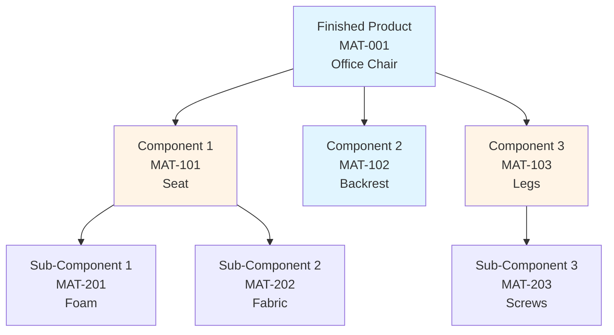
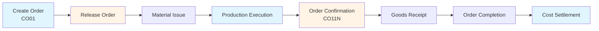
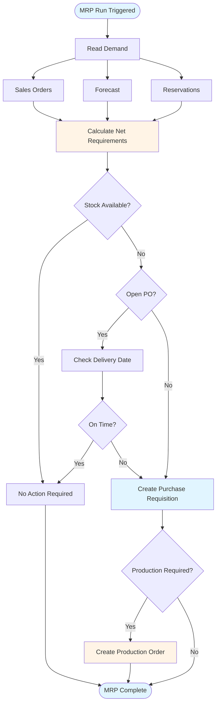

# SAP PP (Production Planning) Guide - Comprehensive

## Table of Contents
1. [Introduction](#introduction)
2. [PP Module Overview](#pp-module-overview)
3. [Master Data](#master-data)
4. [Material Requirements Planning](#material-requirements-planning)
5. [Production Orders](#production-orders)
6. [Capacity Planning](#capacity-planning)
7. [Shop Floor Control](#shop-floor-control)
8. [Production Reporting](#production-reporting)
9. [Integration with Other Modules](#integration-with-other-modules)
10. [Best Practices](#best-practices)
11. [Summary](#summary)

---

## Introduction

SAP PP (Production Planning) manages production planning and execution.

### Key Learning Objectives
- Understand production planning
- Master MRP
- Handle production orders
- Manage capacity

---

## PP Module Overview

**SAP PP** manages production planning and execution.

### Key Components
1. **Master Data**: BOM, Work Centers, Routings
2. **MRP**: Material Requirements Planning
3. **Production Orders**: Production execution
4. **Capacity Planning**: Resource planning

---

## Master Data

### Bill of Materials (BOM) Structure

### Bill of Materials (BOM)

**Transaction**: **CS01** (Create), **CS02** (Change), **CS03** (Display)

**Purpose**: List of components for finished product

### Work Centers

**Transaction**: **CR01** (Create), **CR02** (Change), **CR03** (Display)

**Purpose**: Production resources

### Routings

**Transaction**: **CA01** (Create), **CA02** (Change), **CA03** (Display)

**Purpose**: Production steps and operations

### Production Order Lifecycle

---

## Material Requirements Planning

### MRP Process Flow

### MRP Run

**Transaction**: **MD01** (MRP Run)

**Process**:
1. Calculate material requirements
2. Generate purchase requisitions
3. Generate production orders

---

## Production Orders

### Create Production Order

**Transaction**: **CO01** (Create), **CO02** (Change), **CO03** (Display)

**Process**:
1. Create order
2. Release order
3. Execute production
4. Confirm order
5. Complete order

---

## Capacity Planning

### Capacity Evaluation

**Transaction**: **CM01** (Capacity Evaluation)

**Purpose**: Check resource availability

---

## Shop Floor Control

### Order Confirmation

**Transaction**: **CO11N** (Enter Confirmation)

**Process**:
1. Confirm operations
2. Post material consumption
3. Post activity

---

## Integration with Other Modules

### MM Integration
- Material requirements
- Material issue

### FI/CO Integration
- Production costs
- Cost allocation

---

## Best Practices

1. **Master Data**: Accurate BOM and routings
2. **MRP**: Regular MRP runs
3. **Orders**: Proper order management

---

## Summary

PP manages production planning and execution integrated with MM and CO.

---

**Related Guides**:
- [SAP MM Guide](./SAP_MM_GUIDE.md)
- [SAP CO Guide](./SAP_CO_GUIDE.md)

