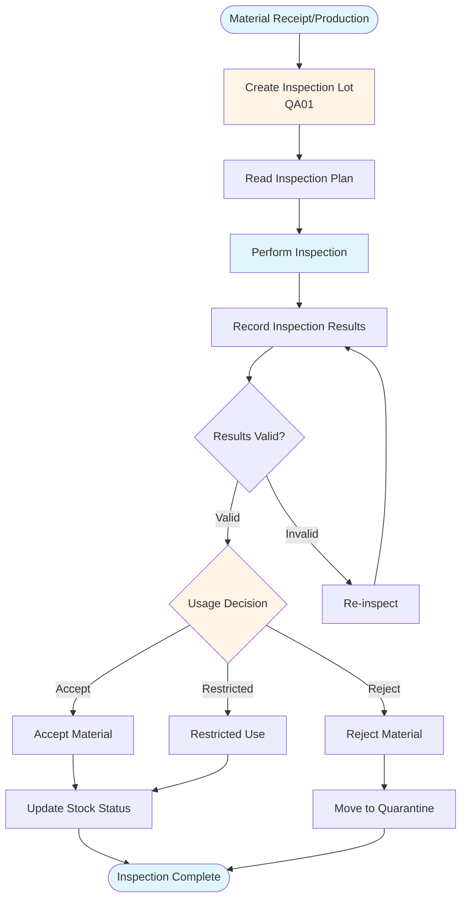

# SAP QM (Quality Management) Guide - Comprehensive

## Table of Contents
1. [Introduction](#introduction)
2. [QM Module Overview](#qm-module-overview)
3. [Quality Planning](#quality-planning)
4. [Quality Inspection](#quality-inspection)
5. [Quality Certificates](#quality-certificates)
6. [Quality Control](#quality-control)
7. [Quality Notifications](#quality-notifications)
8. [Quality Reporting](#quality-reporting)
9. [Integration with PP and MM](#integration-with-pp-and-mm)
10. [Best Practices](#best-practices)
11. [Summary](#summary)

---

## Introduction

SAP QM (Quality Management) manages quality processes including inspection, certificates, and quality control.

### Key Learning Objectives
- Understand quality planning
- Master quality inspection
- Handle quality certificates
- Process quality notifications

---

## QM Module Overview

**SAP QM** manages quality processes.

### Key Components
1. **Quality Planning**: Inspection planning
2. **Quality Inspection**: Material inspection
3. **Quality Certificates**: Certificate management
4. **Quality Control**: Quality control processes

---

## Quality Planning

### Inspection Planning

**Transaction**: **QP01** (Create), **QP02** (Change), **QP03** (Display)

**Purpose**: Define inspection procedures

---

## Quality Inspection

### Quality Inspection Process Flow

### Inspection Lot

**Transaction**: **QA01** (Create Inspection Lot)

**Process**:
1. Create inspection lot
2. Perform inspection
3. Record results
4. Usage decision

---

## Quality Certificates

### Certificate Management

**Transaction**: **QC51** (Create Certificate)

**Purpose**: Manage quality certificates

---

## Quality Notifications

### Quality Notification

**Transaction**: **QM01** (Create), **QM02** (Change), **QM03** (Display)

**Types**:
- **Q1**: Complaint
- **Q2**: Notification of Defect
- **Q3**: Customer Complaint

---

## Integration with PP and MM

QM integrates with PP and MM for quality inspection during production and procurement.

---

## Best Practices

1. **Planning**: Proper inspection planning
2. **Inspection**: Thorough inspection
3. **Documentation**: Complete documentation

---

## Summary

QM manages quality processes integrated with PP and MM.

---

**Related Guides**:
- [SAP PP Guide](./SAP_PP_GUIDE.md)
- [SAP MM Guide](./SAP_MM_GUIDE.md)

