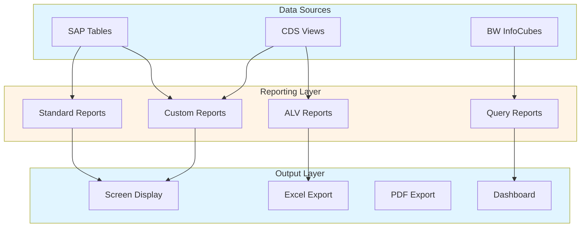
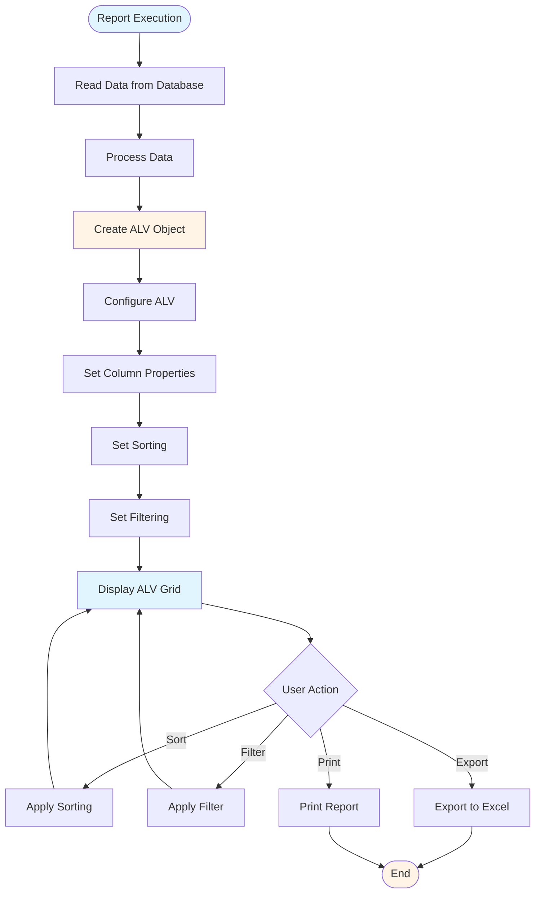
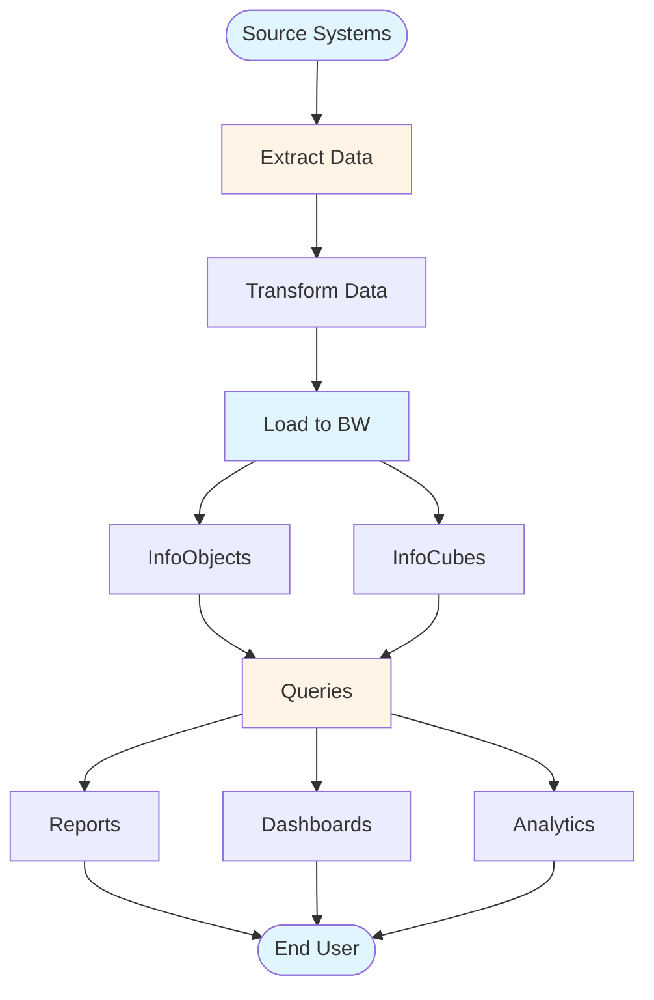

# SAP Reporting & Analytics Guide - Comprehensive

## Table of Contents
1. [Introduction](#introduction)
2. [Reporting Overview](#reporting-overview)
3. [Standard SAP Reports](#standard-sap-reports)
4. [Custom Report Development](#custom-report-development)
5. [ALV Reports](#alv-reports)
6. [BW Concepts](#bw-concepts)
7. [Analytics Tools](#analytics-tools)
8. [Dashboard Creation](#dashboard-creation)
9. [Query Development](#query-development)
10. [Data Extraction](#data-extraction)
11. [Best Practices](#best-practices)
12. [Summary](#summary)

---

## Introduction

SAP Reporting & Analytics provides various methods to extract, analyze, and present data.

### Key Learning Objectives
- Understand reporting options
- Develop custom reports
- Create ALV reports
- Use analytics tools

---

## Reporting Overview

**SAP Reporting** provides multiple ways to extract and present data.

### Reporting Architecture



### Report Types
1. **Standard Reports**: SAP-delivered
2. **Custom Reports**: User-developed
3. **ALV Reports**: Advanced List Viewer
4. **Query Reports**: User-friendly queries

---

## Standard SAP Reports

### Common Reports

**FI Reports**:
- **FBL1N**: Vendor Line Items
- **FBL5N**: Customer Line Items
- **FS10N**: G/L Account Balances

**MM Reports**:
- **MB51**: Material Document List
- **ME2N**: Purchase Order List

**SD Reports**:
- **VA05**: Sales Order List
- **VL06O**: Delivery List

---

## Custom Report Development

### Report Structure

```abap
REPORT z_custom_report.

DATA: lt_data TYPE TABLE OF mara.

SELECT-OPTIONS: s_matnr FOR lt_data-matnr.

START-OF-SELECTION.
  SELECT * FROM mara
    INTO TABLE lt_data
    WHERE matnr IN s_matnr.
  
  LOOP AT lt_data INTO DATA(ls_data).
    WRITE: / ls_data-matnr, ls_data-maktx.
  ENDLOOP.
```

---

## ALV Reports

### ALV Report Flow



### ALV Grid

```abap
DATA: lo_alv TYPE REF TO cl_salv_table.

cl_salv_table=>factory(
  IMPORTING r_salv_table = lo_alv
  CHANGING t_table = lt_data ).

lo_alv->display( ).
```

**Features**:
- Grid format
- Sorting
- Filtering
- Export to Excel

---

## BW Concepts

### BW Data Flow



### Business Warehouse

**SAP BW** provides data warehousing and analytics.

**Components**:
- **InfoObjects**: Data elements
- **InfoCubes**: Data storage
- **Queries**: Data retrieval

---

## Analytics Tools

### SAP Analytics Cloud

**Features**:
- Cloud-based analytics
- Dashboards
- Planning
- Predictive analytics

---

## Best Practices

1. **Performance**: Optimize queries
2. **User-Friendly**: Clear reports
3. **Documentation**: Document reports

---

## Summary

SAP Reporting & Analytics provides various methods to extract, analyze, and present data.

---

**Related Guides**:
- [SAP ABAP Programming Guide](./SAP_ABAP_PROGRAMMING_GUIDE.md)


