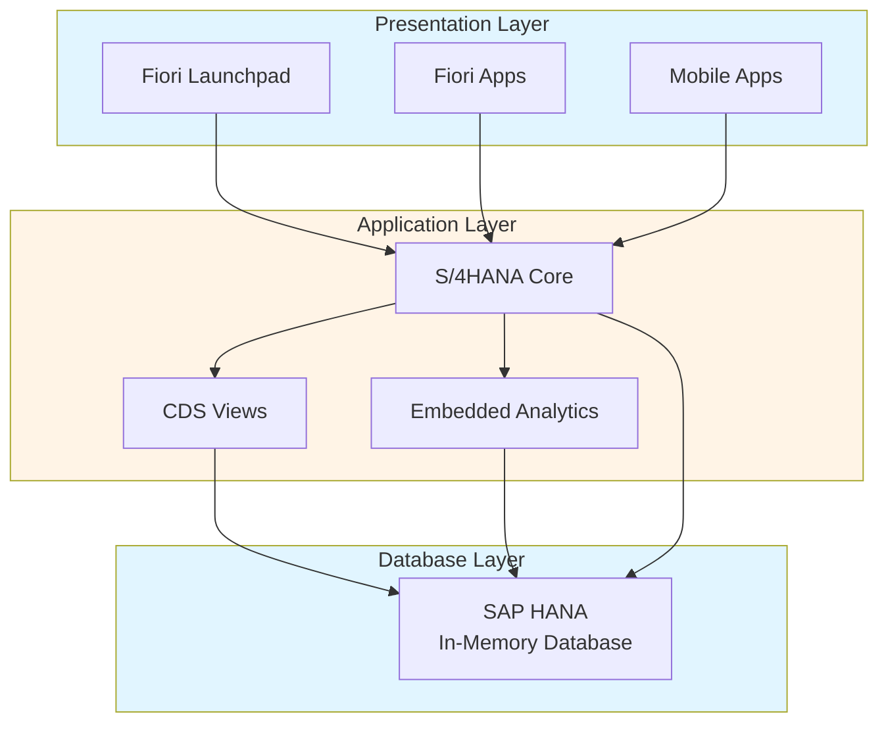
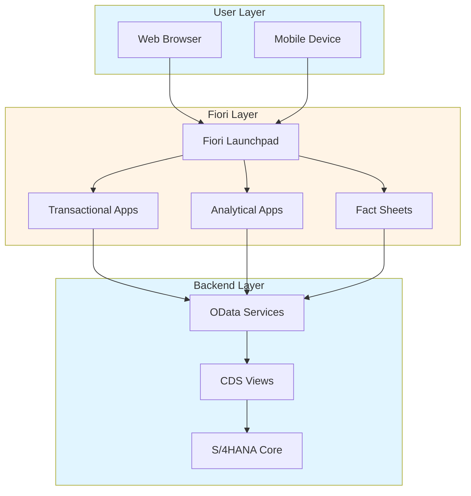
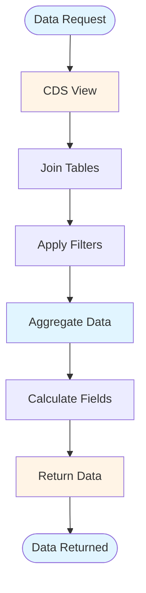
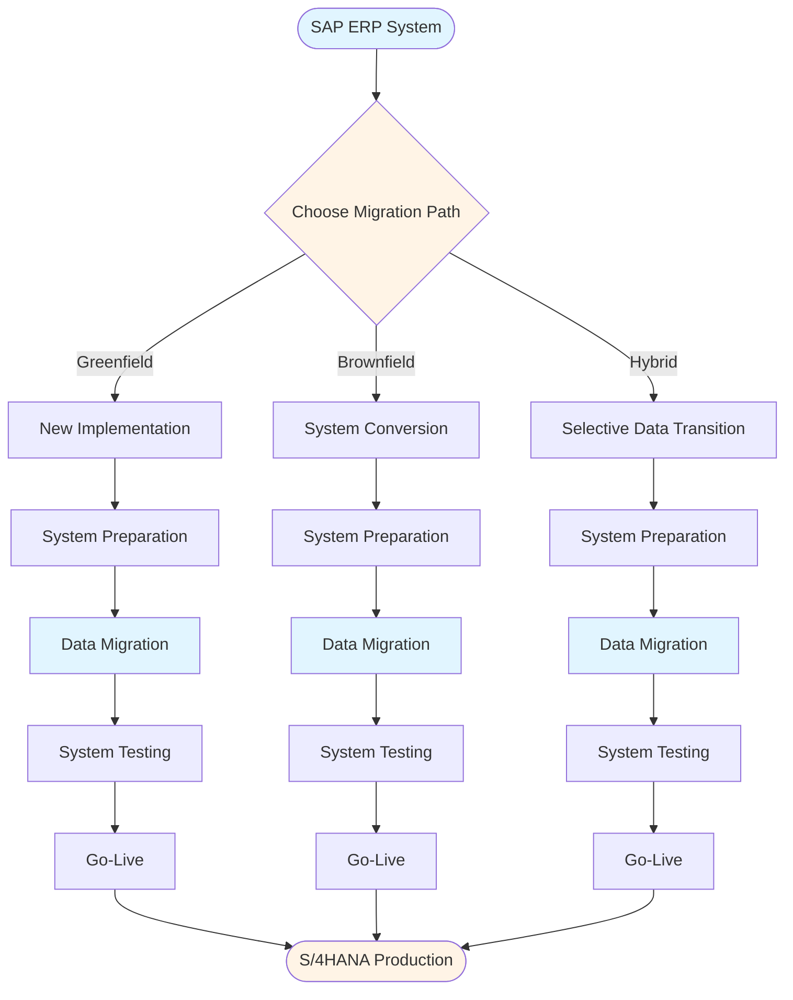

# SAP S/4HANA Guide - Comprehensive

## Table of Contents
1. [Introduction](#introduction)
2. [S/4HANA Overview](#s4hana-overview)
3. [Key Differences from SAP ERP](#key-differences-from-sap-erp)
4. [Fiori User Experience](#fiori-user-experience)
5. [CDS Views](#cds-views)
6. [Embedded Analytics](#embedded-analytics)
7. [Migration Considerations](#migration-considerations)
8. [Simplification Items](#simplification-items)
9. [New Features](#new-features)
10. [Best Practices](#best-practices)
11. [Summary](#summary)

---

## Introduction

SAP S/4HANA is the next-generation ERP suite built on SAP HANA in-memory database.

### Key Learning Objectives
- Understand S/4HANA architecture
- Learn Fiori applications
- Master CDS Views
- Understand migration path

---

## S/4HANA Overview

**SAP S/4HANA** is the next-generation ERP built on HANA.

### S/4HANA Architecture



### Key Characteristics
- **In-Memory Database**: SAP HANA
- **Simplified Data Model**: Reduced tables
- **Real-Time Analytics**: Embedded analytics
- **Modern UI**: Fiori user interface
- **Cloud-Ready**: Cloud deployment option

---

## Key Differences from SAP ERP

### Data Model Simplification

**SAP ERP**: Multiple tables
**S/4HANA**: Simplified tables

### Real-Time Processing

**SAP ERP**: Batch processing
**S/4HANA**: Real-time processing

### User Interface

**SAP ERP**: SAP GUI
**S/4HANA**: Fiori

---

## Fiori User Experience

### Fiori Architecture



### Fiori Apps

**Types**:
- **Transactional Apps**: Business transactions
- **Analytical Apps**: Reports and analytics
- **Fact Sheets**: Master data display

### Fiori Launchpad

**Access**: Web browser
**Features**: Role-based tiles, personalization

---

## CDS Views

### CDS View Data Flow



### Core Data Services

**CDS Views** provide data modeling in S/4HANA.

**Example**:
```abap
@AbapCatalog.viewEnhancementCategory: [#NONE]
@AccessControl.authorizationCheck: #CHECK
@EndUserText.label: 'Material View'
define view Z_MATERIAL_VIEW as select from mara
{
  key matnr as MaterialNumber,
      maktx as MaterialDescription,
      matkl as MaterialGroup
}
```

---

## Embedded Analytics

### Embedded Analytics Overview

**Features**:
- Real-time reporting
- Embedded in transactions
- CDS-based analytics

---

## Migration Considerations

### Migration Path

**S/4HANA Migration Path**:



**Options**:
1. **New Implementation**: Greenfield
2. **System Conversion**: Brownfield
3. **Selective Data Transition**: Hybrid

### Migration Steps

1. **Preparation**: System preparation
2. **Data Migration**: Data migration
3. **Testing**: System testing
4. **Go-Live**: Production go-live

---

## Simplification Items

### Simplification Overview

**Simplification Items**: Changes from SAP ERP to S/4HANA

**Types**:
- **Removed Functions**: No longer available
- **Changed Functions**: Modified behavior
- **New Functions**: New capabilities

---

## Best Practices

1. **Planning**: Proper migration planning
2. **Testing**: Thorough testing
3. **Training**: User training
4. **Support**: Post-go-live support

---

## Summary

S/4HANA is the next-generation ERP with simplified data model, real-time processing, and modern Fiori interface.

---

**Related Guides**:
- [SAP ERP Fundamentals Guide](./SAP_ERP_FUNDAMENTALS_GUIDE.md)
- [SAP Reporting & Analytics Guide](./SAP_REPORTING_ANALYTICS_GUIDE.md)


