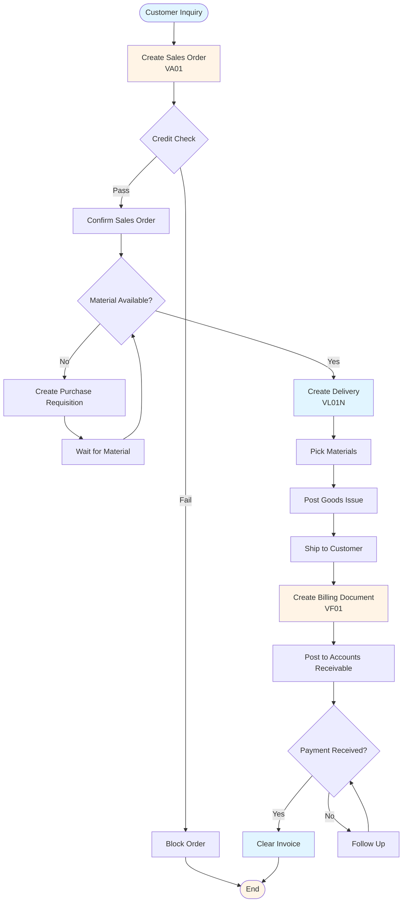
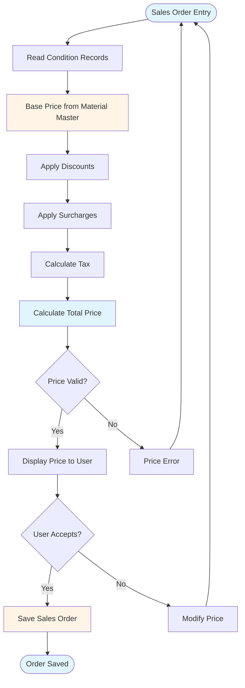

# SAP SD (Sales & Distribution) Guide - Comprehensive

## Table of Contents
1. [Introduction](#introduction)
2. [SD Module Overview](#sd-module-overview)
3. [Customer Master](#customer-master)
4. [Sales Document Types](#sales-document-types)
5. [Sales Order Processing](#sales-order-processing)
6. [Pricing](#pricing)
7. [Delivery Processing](#delivery-processing)
8. [Shipping](#shipping)
9. [Billing](#billing)
10. [Credit Management](#credit-management)
11. [Sales Reporting](#sales-reporting)
12. [Integration with Other Modules](#integration-with-other-modules)
13. [Best Practices](#best-practices)
14. [Summary](#summary)

---

## Introduction

SAP SD (Sales & Distribution) manages sales processes from order to delivery and billing.

### Key Learning Objectives
- Master customer master data
- Process sales orders
- Handle pricing
- Process deliveries
- Generate billing documents

---

## SD Module Overview

**SAP SD** manages sales and distribution processes.

### Key Components
1. **Customer Master**: Customer data
2. **Sales Orders**: Order processing
3. **Pricing**: Price determination
4. **Delivery**: Delivery processing
5. **Billing**: Invoice generation

---

## Customer Master

### Creating Customer

**Transaction**: **VD01** (Create), **VD02** (Change), **VD03** (Display)

**Key Data**:
- Customer Number
- Name and Address
- Payment Terms
- Credit Limit
- Sales Area Data

---

## Sales Document Types

### Common Types

- **OR**: Standard Order
- **CR**: Credit Memo Request
- **DR**: Debit Memo Request
- **RE**: Returns

---

## Sales Order Processing

### Order to Cash Flow



### Create Sales Order

**Transaction**: **VA01** (Create), **VA02** (Change), **VA03** (Display)

**Key Fields**:
- Customer
- Material
- Quantity
- Price
- Delivery Date

**Example**:
```
Sales Order: 100001
Customer: 200001
Material: MAT-001
Quantity: 50
Price: 100.00
```

---

## Pricing

### Pricing Determination Flow



### Pricing Procedure

**Components**:
- **Base Price**: Material price
- **Discounts**: Price reductions
- **Surcharges**: Additional charges
- **Taxes**: Tax calculation

**Transaction**: **SPRO** → Sales and Distribution → Basic Functions → Pricing → Maintain Pricing Procedure

---

## Delivery Processing

### Create Delivery

**Transaction**: **VL01N** (Create), **VL02N** (Change), **VL03N** (Display)

**Process**:
1. Create delivery from sales order
2. Pick materials
3. Post goods issue
4. Update inventory

---

## Shipping

### Shipping Process

1. Create delivery
2. Pick materials
3. Pack materials
4. Ship materials
5. Post goods issue

---

## Billing

### Create Billing Document

**Transaction**: **VF01** (Create), **VF02** (Change), **VF03** (Display)

**Process**:
1. Create billing document from delivery
2. Generate invoice
3. Post to FI
4. Update customer account

---

## Credit Management

### Credit Check

**Transaction**: **FD32** (Credit Management)

**Process**:
1. Set credit limit
2. Check credit during order
3. Block orders if exceeded

---

## Sales Reporting

**Common Reports**:
- **VA05**: Sales Order List
- **VL06O**: Delivery List
- **VF05**: Billing Document List

---

## Integration with Other Modules

### MM Integration
- Material availability
- Goods issue

### FI Integration
- Billing → AR
- Revenue posting

---

## Best Practices

1. **Customer Data**: Accurate customer master
2. **Pricing**: Proper pricing configuration
3. **Delivery**: Timely delivery processing
4. **Billing**: Accurate billing

---

## Summary

SD manages sales processes from order to delivery and billing, integrated with MM and FI.

---

**Related Guides**:
- [SAP MM Guide](./SAP_MM_GUIDE.md)
- [SAP FI Guide](./SAP_FI_GUIDE.md)


