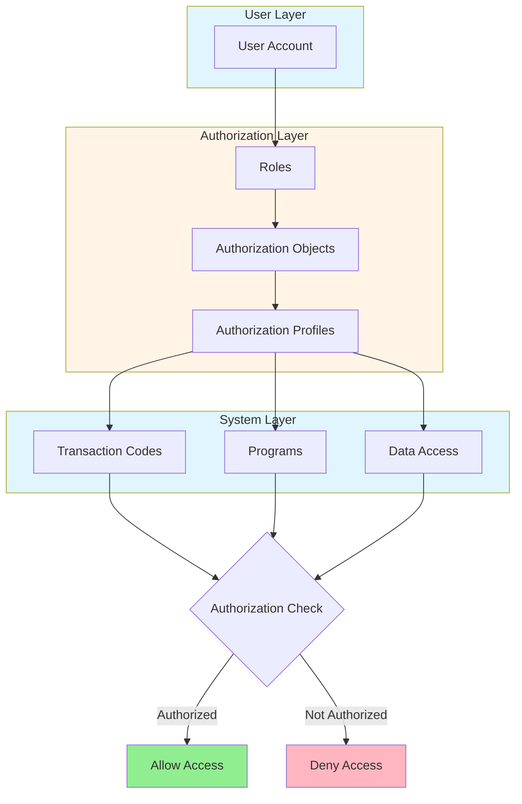
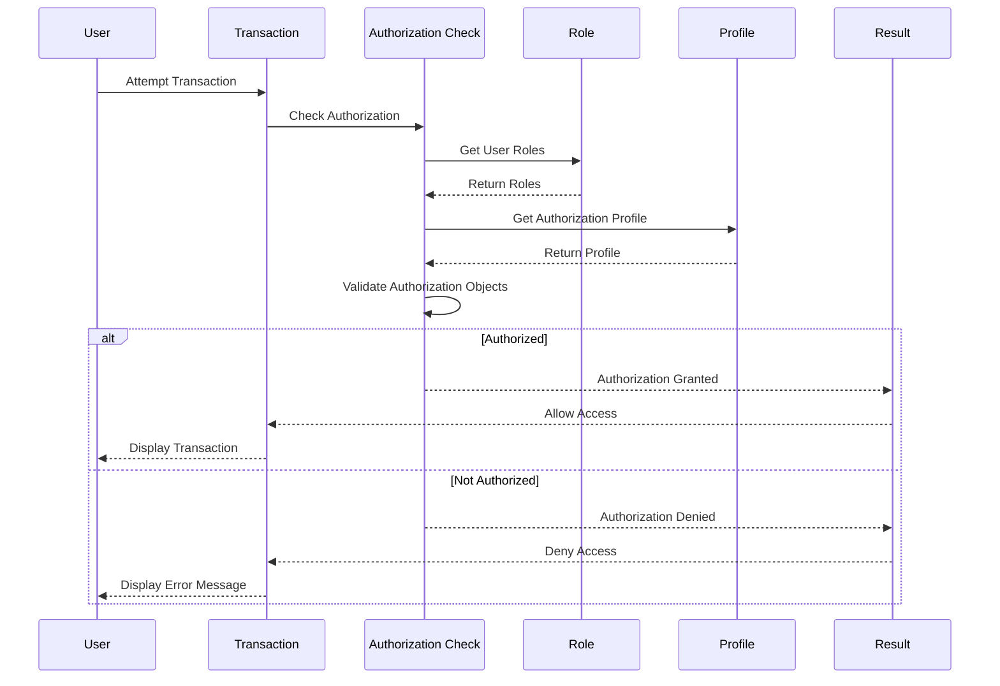
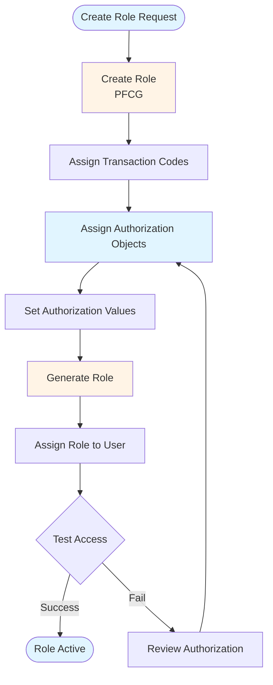

# SAP Security & Authorization Guide - Comprehensive

## Table of Contents
1. [Introduction](#introduction)
2. [Security Overview](#security-overview)
3. [Authorization Concept](#authorization-concept)
4. [Authorization Objects](#authorization-objects)
5. [Role Design](#role-design)
6. [User Management](#user-management)
7. [Security Best Practices](#security-best-practices)
8. [Audit Trails](#audit-trails)
9. [Compliance](#compliance)
10. [Summary](#summary)

---

## Introduction

SAP Security & Authorization manages user access and system security.

### Key Learning Objectives
- Understand authorization concept
- Design roles
- Manage users
- Ensure security

---

## Security Overview

**SAP Security** ensures proper access control.

### Security Architecture

### Key Components
1. **Users**: User accounts
2. **Roles**: Authorization roles
3. **Authorizations**: Permission objects
4. **Profiles**: Authorization profiles

---

## Authorization Concept

### Authorization Check Flow

---

## Authorization Objects

### Common Objects

- **F_BKPF_BUK**: Company Code
- **M_MATE_WRK**: Material
- **F_FB02**: Post Document

---

## Role Design

### Role Assignment Flow

### Creating Role

**Transaction**: **PFCG** (Role Maintenance)

**Process**:
1. Create role
2. Assign transactions
3. Assign authorizations
4. Generate role

---

## User Management

### User Maintenance

**Transaction**: **SU01** (User Maintenance)

**Key Fields**:
- User ID
- Password
- Roles
- Authorizations

---

## Best Practices

1. **Least Privilege**: Minimum required access
2. **Segregation**: Separate duties
3. **Review**: Regular review
4. **Audit**: Regular audits

---

## Summary

SAP Security & Authorization ensures proper access control and system security.

---

**Related Guides**:
- [SAP BASIS Administration Guide](./SAP_BASIS_ADMINISTRATION_GUIDE.md)

