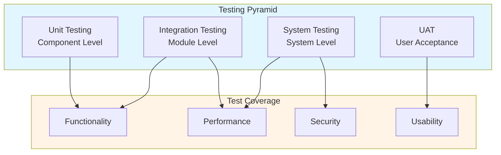
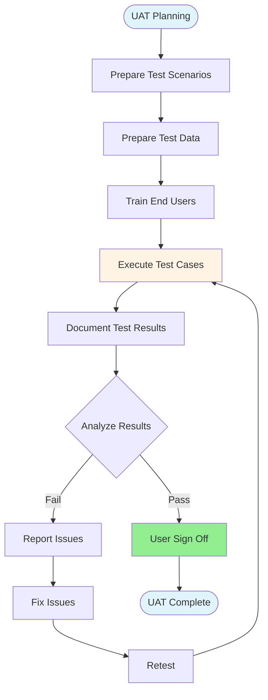

# SAP Testing Guide - Comprehensive

## Table of Contents
1. [Introduction](#introduction)
2. [Testing Overview](#testing-overview)
3. [Testing Strategies](#testing-strategies)
4. [Unit Testing](#unit-testing)
5. [Integration Testing](#integration-testing)
6. [User Acceptance Testing](#user-acceptance-testing)
7. [Test Data Management](#test-data-management)
8. [Test Automation](#test-automation)
9. [Quality Assurance](#quality-assurance)
10. [Best Practices](#best-practices)
11. [Summary](#summary)

---

## Introduction

SAP Testing ensures quality and reliability of SAP implementations and customizations.

### Key Learning Objectives
- Understand testing types
- Perform unit testing
- Execute integration testing
- Conduct UAT

---

## Testing Overview

**SAP Testing** validates SAP functionality and customizations.

### Testing Strategy Overview



### Testing Types
1. **Unit Testing**: Component testing
2. **Integration Testing**: Module integration
3. **UAT**: User acceptance testing
4. **Performance Testing**: Performance validation

---

## Testing Strategies

### Test Planning

**Components**:
- Test scope
- Test cases
- Test data
- Test environment

---

## Unit Testing

### ABAP Unit Testing

```abap
CLASS ltc_test DEFINITION FOR TESTING.
  PRIVATE SECTION.
    METHODS: test_method FOR TESTING.
ENDCLASS.

CLASS ltc_test IMPLEMENTATION.
  METHOD test_method.
    " Test logic
    cl_abap_unit_assert=>assert_equals(
      exp = 'Expected'
      act = lv_actual ).
  ENDMETHOD.
ENDCLASS.
```

---

## Integration Testing

### Integration Test Scenarios

**Types**:
- **Module Integration**: Between modules
- **Interface Testing**: External interfaces
- **End-to-End**: Complete processes

---

## User Acceptance Testing

### UAT Process Flow



### UAT Process

**Steps**:
1. Prepare test scenarios
2. Execute tests
3. Document results
4. Sign off

---

## Test Data Management

### Test Data

**Requirements**:
- Realistic data
- Complete data sets
- Isolated test data

---

## Best Practices

1. **Planning**: Proper test planning
2. **Coverage**: Complete test coverage
3. **Documentation**: Document tests
4. **Automation**: Automate where possible

---

## Summary

SAP Testing ensures quality through unit, integration, and UAT testing.

---

**Related Guides**:
- [SAP ABAP Programming Guide](./SAP_ABAP_PROGRAMMING_GUIDE.md)


