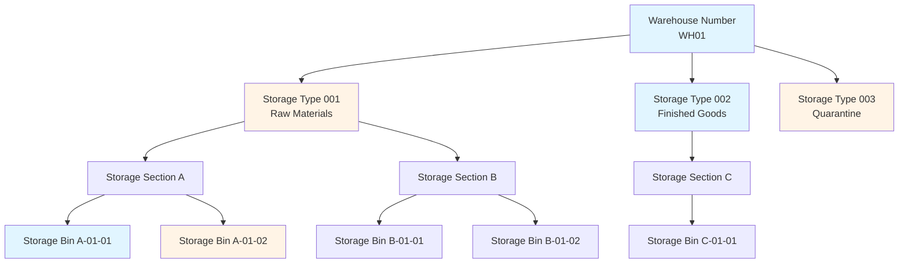
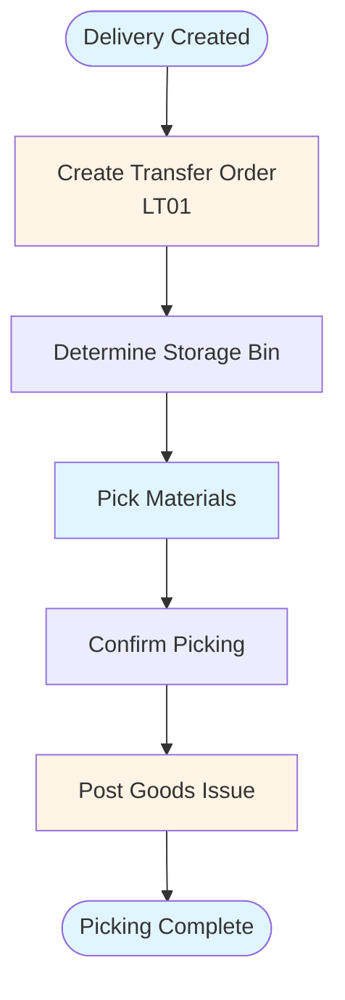
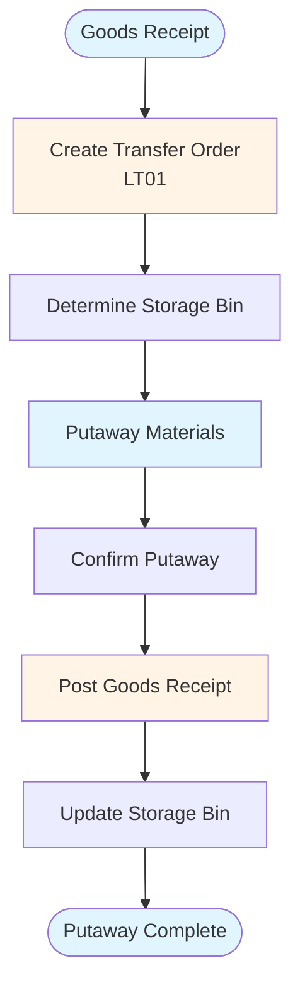

# SAP WM (Warehouse Management) Guide - Comprehensive

## Table of Contents
1. [Introduction](#introduction)
2. [WM Module Overview](#wm-module-overview)
3. [Warehouse Structure](#warehouse-structure)
4. [Storage Bins](#storage-bins)
5. [Warehouse Movements](#warehouse-movements)
6. [Picking and Putaway](#picking-and-putaway)
7. [Inventory Management](#inventory-management)
8. [Warehouse Orders](#warehouse-orders)
9. [Physical Inventory](#physical-inventory)
10. [Integration with MM](#integration-with-mm)
11. [Best Practices](#best-practices)
12. [Summary](#summary)

---

## Introduction

SAP WM (Warehouse Management) manages warehouse operations including storage, picking, and putaway.

### Key Learning Objectives
- Understand warehouse structure
- Master storage bin management
- Handle warehouse movements
- Process picking and putaway

---

## WM Module Overview

**SAP WM** manages warehouse operations.

### Key Components
1. **Warehouse Structure**: Warehouse organization
2. **Storage Bins**: Storage locations
3. **Movements**: Material movements
4. **Picking**: Material picking
5. **Putaway**: Material storage

---

## Warehouse Structure

### Warehouse Structure Diagram

### Warehouse Number

**Transaction**: **SPRO** → Enterprise Structure → Definition → Logistics Execution → Define, Copy, Delete, Check Warehouse Number

**Purpose**: Define warehouse structure

---

## Storage Bins

### Storage Bin Master Data

**Transaction**: **LS01N** (Create), **LS02N** (Change), **LS03N** (Display)

**Key Fields**:
- Storage Bin Number
- Storage Type
- Aisle
- Rack
- Shelf

---

## Warehouse Movements

### Transfer Orders

**Transaction**: **LT01** (Create), **LT02** (Change), **LT03** (Display)

**Types**:
- **201**: Goods Receipt
- **202**: Goods Issue
- **311**: Transfer

---

## Picking and Putaway

### Picking Process Flow

### Putaway Process Flow

### Picking Process

1. Create transfer order
2. Confirm picking
3. Post goods issue

### Putaway Process

1. Create transfer order
2. Confirm putaway
3. Post goods receipt

---

## Integration with MM

WM integrates with MM for material movements and inventory management.

---

## Best Practices

1. **Structure**: Proper warehouse structure
2. **Bins**: Accurate storage bin data
3. **Movements**: Timely movement processing

---

## Summary

WM manages warehouse operations integrated with MM.

---

**Related Guides**:
- [SAP MM Guide](./SAP_MM_GUIDE.md)

