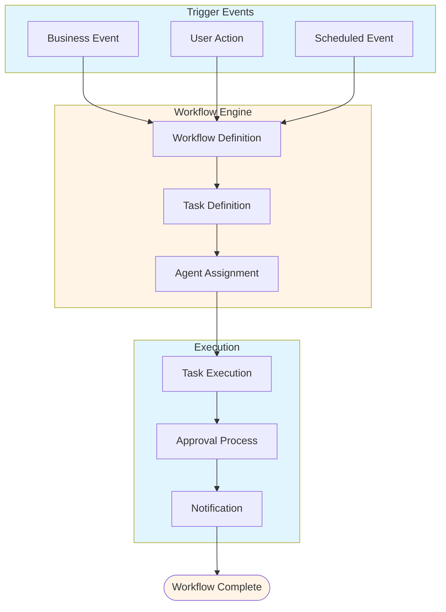
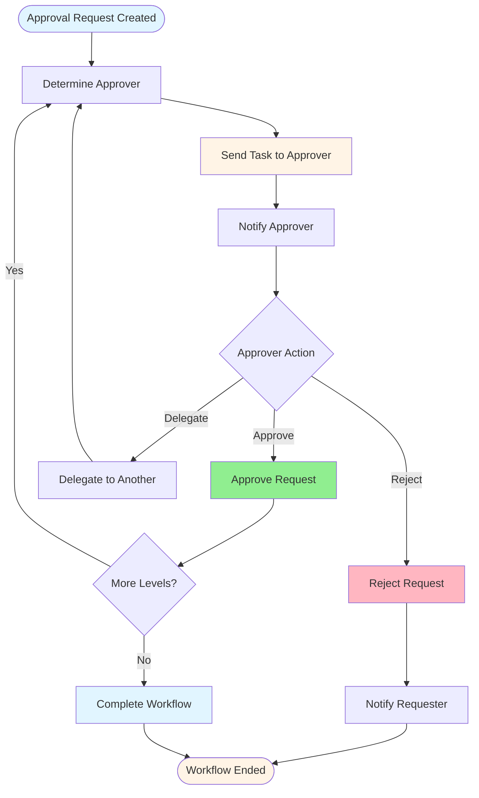

# SAP Workflow Guide - Comprehensive

## Table of Contents
1. [Introduction](#introduction)
2. [Workflow Overview](#workflow-overview)
3. [Workflow Concepts](#workflow-concepts)
4. [Workflow Builder](#workflow-builder)
5. [Task Definition](#task-definition)
6. [Agent Assignment](#agent-assignment)
7. [Workflow Development](#workflow-development)
8. [Approval Processes](#approval-processes)
9. [Workflow Monitoring](#workflow-monitoring)
10. [Best Practices](#best-practices)
11. [Summary](#summary)

---

## Introduction

SAP Workflow automates business processes and approvals.

### Key Learning Objectives
- Understand workflow concepts
- Develop workflows
- Handle approvals
- Monitor workflows

---

## Workflow Overview

**SAP Workflow** automates business processes.

### Workflow Architecture

### Key Components
1. **Tasks**: Workflow steps
2. **Agents**: Responsible persons
3. **Events**: Trigger events
4. **Containers**: Data containers

---

## Workflow Builder

### Creating Workflow

**Transaction**: **SWDD** (Workflow Builder)

**Process**:
1. Create workflow
2. Define steps
3. Assign tasks
4. Activate

---

## Task Definition

### Creating Task

**Transaction**: **PFTC** (Task Definition)

**Key Fields**:
- Task ID
- Description
- Method
- Object type

---

## Agent Assignment

### Agent Determination

**Methods**:
- **User**: Specific user
- **Position**: Organizational position
- **Role**: User role
- **Rule**: Custom rule

---

## Approval Processes

### Approval Workflow Diagram

### Approval Workflow

**Process**:
1. Create approval request
2. Route to approver
3. Approve/Reject
4. Complete workflow

---

## Best Practices

1. **Design**: Proper workflow design
2. **Agents**: Correct agent assignment
3. **Testing**: Thorough testing

---

## Summary

SAP Workflow automates business processes and approvals.

---

**Related Guides**:
- [SAP ABAP Programming Guide](./SAP_ABAP_PROGRAMMING_GUIDE.md)

